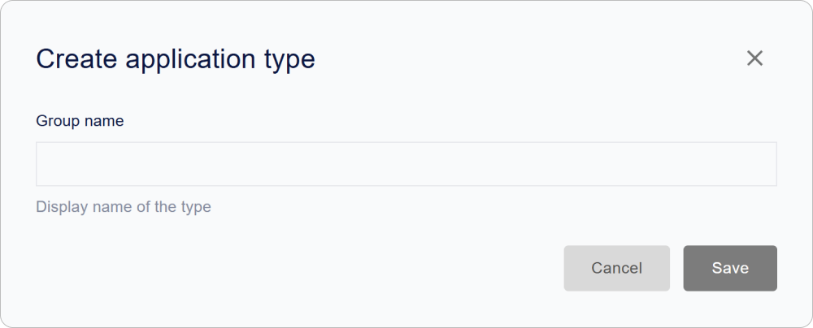
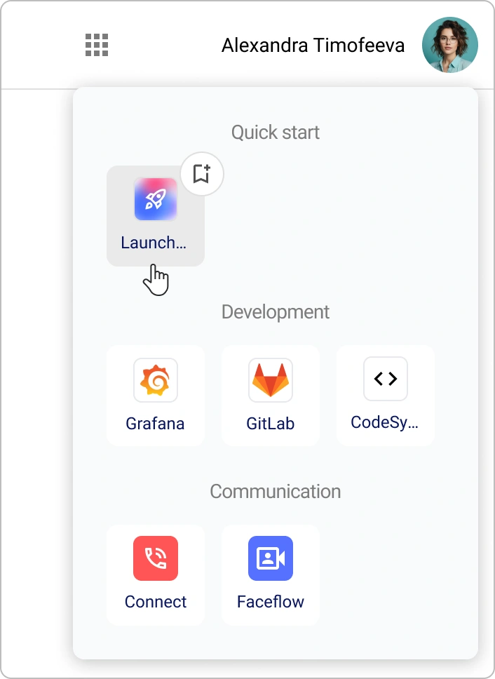

# So konfigurieren Sie Encvoy ID: Sicherheit, Oberfläche und Zugriff

In dieser Anleitung erfahren Sie, wie Sie die Oberfläche und Lokalisierung von **Encvoy ID** konfigurieren, Anwendungstypen erstellen, den Benutzerzugriff verwalten, die Zwei-Faktor-Authentifizierung aktivieren und den Dienst zur Ereignisüberwachung in Sentry integrieren.

Dieser Abschnitt richtet sich an Administratoren und Sicherheitsspezialisten, die die Einstellungen von **Encvoy ID** effektiv verwalten möchten, einschließlich OAuth 2.0 und OpenID Connect.

**Inhaltsverzeichnis:**

- [Einrichtung von Oberfläche und Lokalisierung](#interface-and-localization)
- [Sicherheit und Zugriff](#security-and-access)
- [Anwendungstypen](#application-types)
- [Experimentelle Funktionen](#experimental-features)
- [Siehe auch](#see-also)

> 💡 Die Systemeinstellungen befinden sich im Admin-Panel. Um auf das Panel zuzugreifen, ist die Servicerolle **Administrator** erforderlich. [So öffnen Sie das Admin-Panel →](./docs-02-box-system-install.md#admin-panel-access)

---

## Einrichtung von Oberfläche und Lokalisierung

> 💡 Die Anpassung von Farben, Schriftarten und dem Erscheinungsbild von Oberflächenelementen ist über die Variable `CUSTOM_STYLES` in der Datei `.env` möglich. Weitere Details finden Sie im Abschnitt [Umgebungsvariablen](./docs-03-box-system-configuration.md#interface-customization).

### Konfiguration von Systemname und Logo

Der Name und das Logo werden in der Oberfläche von **Encvoy ID** sowie im [Mini-Widget](./docs-09-common-mini-widget-settings.md) und im [Login-Widget](./docs-06-github-en-providers-settings.md#login-widget-settings) angezeigt.

So konfigurieren Sie Name und Logo:

1. Gehen Sie zum Admin-Panel → Tab **Einstellungen**.
2. Erweitern Sie den Block **Basisinformationen**.

3. Geben Sie den neuen Namen im Feld **Anwendungsname** ein.
4. Klicken Sie im Block **Anwendungslogo** auf **Hochladen** und wählen Sie die Logodatei aus.

   

   > ⚡ Unterstützte Formate: JPG, GIF, PNG, WEBP; maximale Größe 1 MB.

5. Konfigurieren Sie die Anzeige und klicken Sie auf **Anwenden**.

6. Klicken Sie auf **Speichern**.

> 💡 **Tipp:** Verwenden Sie das SVG-Format für ein Vektorlogo, um eine scharfe Anzeige auf allen Geräten und Bildschirmauflösungen zu gewährleisten.

### Lokalisierungseinstellungen

**Encvoy ID** unterstützt die Oberfläche in **sechs Sprachen**:

- Russisch (ru)
- Englisch (en)
- Französisch (fr)
- Spanisch (es)
- Deutsch (de)
- Italienisch (it)

Die gewählte Sprache beeinflusst die Textanzeige in allen Oberflächen von **Encvoy ID**, einschließlich des [Login-Widgets](./docs-06-github-en-providers-settings.md#login-widget-settings) und des [Mini-Widgets](./docs-09-common-mini-widget-settings.md).

Wenn Sie [zusätzliche Benutzerprofilfelder](./docs-05-box-userfields-settings.md#additional-profile-fields) und [E-Mail-Vorlagen](./docs-04-box-system-settings.md#email-notification-templates) verwenden, stellen Sie sicher, dass diese korrekt angezeigt werden.

#### So ändern Sie die Oberflächensprache

1. Gehen Sie zum Admin-Panel → Tab **Einstellungen**.
2. Erweitern Sie den Block **Lokalisierung** und wählen Sie die gewünschte Sprache aus der Liste aus.

3. Klicken Sie auf **Speichern**.

Die Sprachänderung erfolgt automatisch, ohne dass der Dienst neu gestartet oder die Seite aktualisiert werden muss.

> 🚨 **Warnung:** Nach dem Ändern der Sprache werden alle Oberflächentexte, einschließlich Systemmeldungen und Benachrichtigungen, in der gewählten Sprache angezeigt. Stellen Sie sicher, dass Ihre Benutzer die gewählte Sprache verstehen.

### Konfiguration von E-Mail-Benachrichtigungsvorlagen

**E-Mail-Vorlagen** sind E-Mail-Voreinstellungen, die vordefinierte Formatierungen und Designelemente enthalten. Sie werden verwendet, um automatische Benachrichtigungen zu erstellen, wie z. B. Registrierungs-E-Mails, Passwortwiederherstellung und andere Ereignisse.

#### Was ist Mustache?

**Mustache** ist eine einfache Template-Engine zum Einfügen von Daten in Textvorlagen. In **Encvoy ID** wird sie verwendet für:

- Einfügen von Benutzerdaten (`{{user.name}}`),
- Dynamische Link-Generierung (`{{confirmation_link}}`),
- Bedingte Anzeige von Blöcken.

> 🔗 [Offizielle Mustache-Dokumentation](https://mustache.github.io/)

#### Verfügbare E-Mail-Typen

| E-Mail-Typ                        | Ereignis            | Zweck                                       |
| --------------------------------- | ------------------- | ------------------------------------------- |
| Registrierung                     | `account_create`    | Willkommens-E-Mail für einen neuen Benutzer |
| Bestätigungscode                  | `confirmation_code` | E-Mail mit einem Verifizierungscode         |
| Bestätigungslink                  | `confirmation_link` | E-Mail mit einem Verifizierungslink         |
| Passwortänderung                  | `password_change`   | Benachrichtigung über Passwortänderung      |
| Passwortwiederherstellungsanfrage | `password_recover`  | E-Mail mit einem Verifizierungscode         |
| Einladung                         | `invite`            | Einladungs-E-Mail für eine Anwendung        |

#### So konfigurieren Sie eine Vorlage

1. Gehen Sie zum Admin-Panel → Tab **Einstellungen**.
2. Suchen Sie den Block **E-Mail-Vorlagen** und klicken Sie auf **Konfigurieren**.
3. Wählen Sie die gewünschte Vorlage aus und klicken Sie auf **Konfigurieren**.

4. Geben Sie im sich öffnenden Bearbeitungsformular Folgendes an:
   - **Vorlagenname**,
   - **E-Mail-Betreff**,
   - **E-Mail-Inhalt**.

   > 💡 Verwenden Sie HTML-Markup und Variablen im Format `{{variable_name}}`. Stellen Sie sicher, dass die verwendeten Variablen mit den verfügbaren [Benutzerprofilfeldern](./docs-05-box-userfields-settings.md#basic-profile-fields) übereinstimmen, um Fehler beim Versenden der E-Mail zu vermeiden.

   

5. Klicken Sie auf **Speichern**.

---

## Sicherheit und Zugriff

### Zugriffseinstellungen

#### Zwei-Faktor-Authentifizierung

Die Zwei-Faktor-Authentifizierung (2FA) fügt beim Login eine zusätzliche Schutzebene hinzu. Nach Eingabe des ersten Faktors (Login/Passwort oder eine andere Authentifizierungsmethode) muss der Benutzer seine Identität mit einem zweiten Faktor (Telefon, E-Mail, WebAuthn) bestätigen.

##### So konfigurieren Sie die Zwei-Faktor-Authentifizierung

1. Gehen Sie zum Admin-Panel → Tab **Einstellungen**.
2. Erweitern Sie den Block **Zugriffseinstellungen** und klicken Sie auf **Konfigurieren**.

3. Geben Sie die Anbieter für den ersten und zweiten Faktor an:
   - Anbieter für den **ersten Faktor** — die primäre Authentifizierungsmethode (Login/Passwort oder eine andere Authentifizierungsmethode).
   - Anbieter für den **zweiten Faktor** — die Methode zur Identitätsbestätigung (Telefon, E-Mail, WebAuthn).

   

4. Klicken Sie auf **Speichern**.

#### Ignorieren erforderlicher Profilfelder beim Anwendungs-Login

Einige Benutzerprofilfelder (z. B. Telefon, E-Mail usw.) können im persönlichen Profil als erforderlich markiert sein.

Standardmäßig prüft **Encvoy ID** bei der Autorisierung in Anwendungen das Vorhandensein aller erforderlichen Felder und kann den Login unterbrechen, bis der Benutzer die fehlenden Daten ausgefüllt hat. Die Einstellung **Pflichtfelder des Profils für Anwendungen ignorieren** ermöglicht es Ihnen, diese Prüfung zu deaktivieren.

Dies kann nützlich sein, wenn die Organisation externe Benutzerdatenquellen verwendet und kein manuelles Ausfüllen des Profils erfordert.

##### Was passiert bei Aktivierung?

- Benutzer können sich in Anwendungen autorisieren, auch wenn ihr persönliches Profil nicht vollständig ausgefüllt ist.
- Die Prüfung der erforderlichen Felder wird nicht durchgeführt.
- Benachrichtigungen über unvollständige Felder werden weiterhin in der Oberfläche des persönlichen Profils angezeigt.

##### So aktivieren Sie die Einstellung

1. Gehen Sie zum Admin-Panel → Tab **Einstellungen**.
2. Erweitern Sie den Block **Zugriffseinstellungen**.
3. Aktivieren Sie den Schalter **Pflichtfelder des Profils für Anwendungen ignorieren**.
4. Klicken Sie auf **Speichern**.

Nach Anwendung der Einstellung können Benutzer die Autorisierung ohne Prüfung der erforderlichen Profilfelder durchlaufen.

> 💡 **Empfehlung**: Aktivieren Sie diese Option nur, wenn die Vollständigkeit des Profils auf andere Weise kontrolliert wird.

#### Verbot der Identifikator-Bindung

Diese Einstellung verhindert, dass Benutzer selbstständig neue externe Identifikatoren über das Login-Widget mit ihrem Profil verknüpfen.

So verbieten Sie die Bindung:

1. Gehen Sie zum Admin-Panel → Tab **Einstellungen**.
2. Erweitern Sie den Block **Zugriffseinstellungen**.
3. Aktivieren Sie den Schalter **Verknüpfung von Identifikatoren im Widget untersagen**.
4. Klicken Sie auf **Speichern**.

#### Zugriffsbeschränkungen

Diese Einstellung ermöglicht es, den Anwendungs-Login für alle Benutzer außer dem Service-**Administrator** zu beschränken. Alle anderen Benutzer können sich nicht autorisieren.

> 🚨 **Wichtig:** Wenn die Zugriffsbeschränkung aktiviert ist, verlieren alle Benutzer außer den Systemadministratoren die Möglichkeit, sich einzuloggen. Verwenden Sie diese Einstellung für Wartungsarbeiten oder Notfallsituationen.

So beschränken Sie den Zugriff:

1. Gehen Sie zum Admin-Panel → Tab **Einstellungen**.
2. Erweitern Sie den Block **Zugriffseinstellungen**.
3. Aktivieren Sie den Schalter **Eingeschränkter Zugriff für alle Anwendungen**.
4. Klicken Sie auf **Speichern**.

#### Verbot der Registrierung

Diese Einstellung ermöglicht es, die Erstellung neuer Konten im Login-Widget zu verbieten.

So konfigurieren Sie das Registrierungsverbot:

1. Gehen Sie zum Admin-Panel → Tab **Einstellungen**.
2. Erweitern Sie den Block **Zugriffseinstellungen**.
3. Wählen Sie die gewünschte Einstellung:
   - **Registrierung untersagt** — blockiert die Erstellung neuer Konten vollständig.
   - **Registrierung erlaubt** (Standard) — Standardbetriebsmodus, Benutzer können Konten selbstständig erstellen.

4. Klicken Sie auf **Speichern**.

### Technische Parameter

Technische Einstellungen wie Client-Identifikatoren, Sicherheitsparameter, Autorisierungs-URLs, Client-Authentifizierungsmethoden, Token-Parameter und andere befinden sich im Abschnitt **Anwendungsparameter**.

Nachfolgend sind die im Admin-Panel editierbaren Parameter aufgeführt. Andere Parameter werden über die [Konfigurationsdatei](./docs-03-box-system-configuration.md) geändert.

So ändern Sie Parameter im Admin-Panel:

1. Gehen Sie zum Admin-Panel → Tab **Einstellungen**.
2. Erweitern Sie den Block **Anwendungsparameter**.
3. Konfigurieren Sie die Parameter:
   - [Zugriffsbeschränkung](#access-settings)
   - [Authentifizierungszeit](#authentication-time)
   - [Zugriffstoken](#access-token)
   - [Refresh-Token](#refresh-token)

4. Klicken Sie auf **Speichern**.

### Parameterbeschreibungen

#### Hauptidentifikatoren

| Name                                | Parameter       | Beschreibung                                                                 |
| ----------------------------------- | --------------- | ---------------------------------------------------------------------------- |
| **Kennung (client_id)**             | `client_id`     | Eindeutiger Anwendungsidentifikator                                          |
| **Geheimschlüssel (client_secret)** | `client_secret` | Vertraulicher Anwendungsschlüssel                                            |
| **Anwendungsadresse**               | -               | Basis-URL des **Encvoy ID**-Dienstes im Format `protokoll://domainname:port` |

#### Zugriffsbeschränkung

Beschränkt den Login in das persönliche Profil auf Benutzer mit Administratorrollen.

| Name                        | Beschreibung                                                                                                            |
| --------------------------- | ----------------------------------------------------------------------------------------------------------------------- |
| **Eingeschränkter Zugriff** | Wenn aktiviert, ist der Zugriff auf das persönliche Profil nur Benutzern mit **Administrator**-Servicerechten gestattet |

#### Redirect-URL

| Name               | Parameter      | Beschreibung                                                                      |
| ------------------ | -------------- | --------------------------------------------------------------------------------- |
| **Redirect-URL #** | `Redirect_uri` | URL, zu der der Benutzer nach erfolgreicher Authentifizierung weitergeleitet wird |

#### Logout-URL

| Name             | Parameter                  | Beschreibung                                                                                                                     |
| ---------------- | -------------------------- | -------------------------------------------------------------------------------------------------------------------------------- |
| **Logout-URL #** | `post_logout_redirect_uri` | URL, zu der der Dienst den Benutzer nach dem Abmelden weiterleitet. Wenn kein Wert angegeben ist, wird `Redirect_uri` verwendet. |

#### Autorisierungsanfrage-URL

| Name                                               | Parameter      | Beschreibung                                                                                                                                               |
| -------------------------------------------------- | -------------- | ---------------------------------------------------------------------------------------------------------------------------------------------------------- |
| **Authentifizierungsanfrage- oder Recovery-URL #** | `request_uris` | Liste der URLs zum Hosten von JWT-Autorisierungsanfragen (`Request Object`). Der Server ruft das JWT während der Autorisierung von der angegebenen URL ab. |

#### Antworttypen (Response Types)

| Name                              | Parameter        | Beschreibung                                                                                                                                                                                                                                                                                                                                                            |
| --------------------------------- | ---------------- | ----------------------------------------------------------------------------------------------------------------------------------------------------------------------------------------------------------------------------------------------------------------------------------------------------------------------------------------------------------------------- |
| **Antworttypen (response_types)** | `response_types` | 
 Bestimmt, welche Token und Codes vom Autorisierungsserver zurückgegeben werden:
 
 - `code` — nur Autorisierungscode  - `id_token` — nur ID-Token   - `code id_token` — Code + ID-Token   - `code token` — Code + Zugriffstoken   - `code id_token token` — Code + ID-Token + Zugriffstoken   - `none` — nur Authentifizierungsbestätigung 
 |

#### Grant-Typen

| Name                                 | Parameter     | Beschreibung                                                                                                                                                                                                                                                 |
| ------------------------------------ | ------------- | ------------------------------------------------------------------------------------------------------------------------------------------------------------------------------------------------------------------------------------------------------------ |
| **Berechtigungstypen (grant_types)** | `grant_types` | 
 Methoden zum Erhalt der Autorisierung: 
 - `authorization code` — sicherer Code über den Client-Server (empfohlen);   - `implicit` — direkter Token-Erhalt (für öffentliche Clients)   - `refresh_token` — Token-Erneuerung ohne erneuten Login |

#### Client-Authentifizierungsmethode

> 💡 Die Wahl der Methode hängt von den Sicherheitsanforderungen und den Client-Fähigkeiten ab. JWT-Methoden bieten erhöhte Sicherheit, da sie das Geheimnis nicht direkt übertragen.

| Name                         | Parameter                                                                                             | Beschreibung                                                                                                                                                                                                                                                                                                                                                                                                                                                                        |
| ---------------------------- | ----------------------------------------------------------------------------------------------------- | ----------------------------------------------------------------------------------------------------------------------------------------------------------------------------------------------------------------------------------------------------------------------------------------------------------------------------------------------------------------------------------------------------------------------------------------------------------------------------------- |
| **Client-Authentifizierung** | `token_endpoint_auth_method`, `introspection_endpoint_auth_method`, `revocation_endpoint_auth_method` | 
 Bestimmt die Client-Authentifizierungsmethode beim Zugriff auf verschiedene Endpunkte (`token`, `introspection`, `revocation`). 
 Verfügbare Methoden:   - `none` — keine Anmeldedaten;  - `client_secret_post` — Anmeldedaten im Body der Anfrage;  - `client_secret_basic` — HTTP Basic Authentication;  - `client_secret_jwt` — mit dem Client-Geheimnis signiertes JWT;  - `private_key_jwt` — mit dem privaten Schlüssel des Clients signiertes JWT.
 |

#### ID-Token-Signieralgorithmus

| Name                                                                    | Parameter                      | Beschreibung                                                                                                                                                                           |
| ----------------------------------------------------------------------- | ------------------------------ | -------------------------------------------------------------------------------------------------------------------------------------------------------------------------------------- |
| **Signaturalgorithmus für das ID-Token (id_token_signed_response_alg)** | `id_token_signed_response_alg` | 
 Gibt den Algorithmus an, der zum Signieren des ID-Tokens verwendet wird. 
 `ID token` ist ein JSON Web Token (JWT), das Claims über die Authentifizierung des Benutzers enthält |

#### Authentifizierungszeit

| Name                                                             | Parameter           | Beschreibung                                                                                                          |
| ---------------------------------------------------------------- | ------------------- | --------------------------------------------------------------------------------------------------------------------- |
| **Prüfung des Authentifizierungszeitpunkts (require_auth_time)** | `require_auth_time` | Wenn aktiviert, wird `auth_time` (der Zeitpunkt der letzten Authentifizierung des Benutzers) zum ID-Token hinzugefügt |

#### Zusätzliche Sicherheitsparameter

| Name                                                                                                              | Parameter                       | Beschreibung                                                                                                                                                                                                                                                                                                                                                                                                                                                                                             |
| ----------------------------------------------------------------------------------------------------------------- | ------------------------------- | -------------------------------------------------------------------------------------------------------------------------------------------------------------------------------------------------------------------------------------------------------------------------------------------------------------------------------------------------------------------------------------------------------------------------------------------------------------------------------------------------------- |
| Parameter zur Gewährleistung der Sicherheit der Datenübertragung zwischen dem Client und dem Autorisierungsserver | `require_signed_request_object` | 
Gibt an, ob ein signiertes `Request Object` beim Senden einer Autorisierungsanfrage erforderlich ist.
 `Request Object` ist eine Möglichkeit, Autorisierungsparameter sicher vom Client an den Autorisierungsserver zu übertragen, normalerweise in Form eines JWT (JSON Web Token).
 
Wenn `require_signed_request_object` aktiviert ist, muss der Client das `Request Object` mit einem vorab vereinbarten Signieralgorithmus signieren, der in der Client-Konfiguration angegeben ist.
 |

#### Übertragungstyp des Benutzeridentifikators

| Name                                                           | Parameter      | Beschreibung                                                                                                                                                                                                          |
| -------------------------------------------------------------- | -------------- | --------------------------------------------------------------------------------------------------------------------------------------------------------------------------------------------------------------------- |
| **Art der Benutzer-ID-Übertragung im ID-Token (subject_type)** | `subject_type` | Bestimmt, wie der `sub claim` im ID-Token gebildet wird: 
 - `public` — derselbe Identifikator für alle Clients   - `pairwise` — ein eindeutiger Identifikator für jeden Client, was den Datenschutz erhöht 
 |

#### Zugriffstoken (Access Token)

| Name                                | Parameter          | Beschreibung                               |
| ----------------------------------- | ------------------ | ------------------------------------------ |
| **Access Token (access_token_ttl)** | `access_token_ttl` | Lebensdauer des `access_token` in Sekunden |

#### Refresh-Token

| Name                                  | Parameter           | Beschreibung                                |
| ------------------------------------- | ------------------- | ------------------------------------------- |
| **Refresh Token (refresh_token_ttl)** | `refresh_token_ttl` | Lebensdauer des `refresh_token` in Sekunden |

### Sentry verbinden

**Sentry** ist eine Plattform zur Überwachung von Anwendungsfehlern und Performance.

> 📚 [Offizielle Sentry-Ressource](https://sentry.io/welcome/)

Das Verbinden von **Sentry** ermöglicht Ihnen:

- Fehler und Ausnahmen in Echtzeit zu verfolgen;
- Ereignis-Traces nach Benutzer zu erhalten;
- die Systemperformance zu analysieren.

#### So verbinden Sie Sentry

##### Schritt 1. Projekt in Sentry erstellen

1. Gehen Sie auf die Website [Sentry.io](https://sentry.io/welcome/).
2. Registrieren Sie sich oder loggen Sie sich in Ihr Konto ein.
3. Erstellen Sie ein neues Projekt.

Nach dem Erstellen des Projekts stellt **Sentry** einen **DSN (Data Source Name)** bereit — einen eindeutigen Identifikator zum Verbinden von **Encvoy ID** mit **Sentry**.

> 💡 **Tipp**: Kopieren Sie den **DSN (Data Source Name)**, damit Sie ihn beim nächsten Schritt nicht verlieren.

##### Schritt 2. Sentry verbinden

So verbinden Sie **Sentry**:

1. Gehen Sie zum Admin-Panel → Tab **Einstellungen**.
2. Suchen Sie den Block **Sentry** und klicken Sie auf **Konfigurieren**.
3. Geben Sie im sich öffnenden Verbindungsformular Folgendes an:
   - **DSN** — der in **Schritt 1** erstellte eindeutige Identifikator.
   - **Aktiv** — aktivieren, um das Senden von Fehlern und Traces an **Sentry** zu starten.
   - **Benutzer-ID** (falls erforderlich) — angeben, wenn Sie Fehler und Ereignisse nach bestimmten Benutzern verfolgen möchten.

     

4. Klicken Sie auf **Speichern**.

### Ereignisprotokoll

Im **Protokoll** können Sie sehen, wo und von welchen Geräten aus Benutzer auf das persönliche Profil oder Anwendungen zugegriffen haben.

Detaillierte Informationen sind für jedes Ereignis verfügbar.

| Parameter             | Inhalt                                |
| --------------------- | ------------------------------------- |
| **Ereignis-Header**   | Aktionskategorie                      |
| **Datum und Uhrzeit** | Genaue Zeitstempel                    |
| **Anwendung**         | Anwendungsidentifikator (`client_id`) |
| **Benutzer**          | Benutzeridentifikator (`id`)          |
| **Gerät**             | Gerätetyp und Browser                 |
| **Standort**          | IP-Adresse                            |

#### So greifen Sie auf das Protokoll zu

1. Gehen Sie zum Admin-Panel.
2. Öffnen Sie den Tab **Protokoll**.

---

## Anwendungstypen

**Anwendungstypen** sind Kategorien zur Systematisierung von Anwendungen im **[Katalog](./docs-12-common-personal-profile.md#application-catalog)**. Sie helfen, die Struktur zu organisieren und die Benutzernavigation zu vereinfachen.

**Warum Typen benötigt werden**:

- Helfen bei der Gruppierung von Anwendungen nach Kategorien
- Vereinfachen die Suche nach benötigten Anwendungen
- Helfen bei der Organisation der Katalogstruktur

### Erstellen eines Anwendungstyps

1. Gehen Sie zum Admin-Panel → Tab **Einstellungen**.
2. Suchen Sie den Block **Anwendungstypen** und klicken Sie auf **Konfigurieren**.
3. Klicken Sie im erscheinenden Fenster auf die Schaltfläche **Erstellen** .
4. Das Erstellungsformular wird geöffnet.

5. Geben Sie den Typnamen an.

   > 💡 Der Typname muss innerhalb des Systems eindeutig sein.

6. Klicken Sie auf **Speichern**.

   Der erstellte Typ erscheint in der Liste.

> 💡 Die Zuweisung des Typs erfolgt beim [Erstellen einer Anwendung](./docs-10-common-app-settings.md#creating-application).

### Bearbeiten eines Anwendungstyps

1. Gehen Sie zum Admin-Panel → Tab **Einstellungen**.
2. Suchen Sie den Block **Anwendungstypen** und klicken Sie auf **Konfigurieren**.
3. Ein Fenster mit der Liste der Typen wird geöffnet.

4. Klicken Sie auf die Schaltfläche **Konfigurieren** im Panel des Typs, den Sie bearbeiten möchten.
5. Das Bearbeitungsformular wird geöffnet.
6. Nehmen Sie die erforderlichen Änderungen vor.
7. Klicken Sie auf **Speichern**.

> 💡 Nach dem Bearbeiten eines Typs erhalten alle zugehörigen Anwendungen automatisch den aktualisierten Kategorienamen.

### Löschen eines Anwendungstyps

1. Gehen Sie zum Admin-Panel → Tab **Einstellungen**.
2. Suchen Sie den Block **Anwendungstypen** und klicken Sie auf **Konfigurieren**.
3. Ein Fenster mit der Liste der Typen wird geöffnet.
4. Klicken Sie auf die Schaltfläche **Löschen**  im Panel des Typs, den Sie löschen möchten.

Das Löschen erfolgt ohne zusätzliche Bestätigung.

> 💡 Nach dem Löschen wird der Typ aus dem Katalog entfernt, und die ihm zugewiesenen Anwendungen erhalten automatisch den Typ **Sonstiges**.

---

## Experimentelle Funktionen

**Experimentelle Funktionen** sind neue Möglichkeiten des **Encvoy ID**-Dienstes, die sich in der Test- und Verfeinerungsphase befinden.

**Hauptmerkmale:**

- Werden vom Service-Administrator reguliert
- Funktionalität kann sich ohne vorherige Ankündigung ändern
- Können undokumentierte Betriebsmerkmale enthalten
- Performance und Stabilität können von den Kernfunktionen abweichen

Der Abschnitt für experimentelle Funktionen ist verfügbar unter: `https://ID_HOST/experimental`.

> 🚧 **Status**: Experimentelle Funktionen können ohne vorherige Ankündigung entfernt, geändert oder in die Kernfunktionalität verschoben werden.

#### Verfügbare Funktionen

1. **Benutzer-Visitenkarte**
   - Digitales Analogon einer Visitenkarte mit Kontaktdaten
   - Unterstützung des vCard-Formats für den Export
   - Möglichkeit zum Teilen via Link oder QR-Code

   [Mehr über die Visitenkarte →](./docs-12-common-personal-profile.md#digital-business-card)

2. **Anwendungskatalog**
   - Zentralisierte Plattform für Anwendungen des **Encvoy ID**-Systems
   - Verfügt über ein praktisches Kategoriensystem
   - Möglichkeit, Anwendungen zu Favoriten hinzuzufügen

   [Mehr über den Katalog →](./docs-12-common-personal-profile.md#application-catalog)

   

---

## Siehe auch

- [Konfiguration von Passwortrichtlinie und Benutzerprofil](./docs-05-box-userfields-settings.md) — Anleitung zur Konfiguration von Benutzerprofilen.
- [Login-Methoden und Konfiguration des Login-Widgets](./docs-06-github-en-providers-settings.md) — Anleitung zum Verbinden und Konfigurieren externer Authentifizierungsdienste.
- [Anwendungsverwaltung](./docs-10-common-app-settings.md) — Anleitung zum Erstellen, Konfigurieren und Verwalten von OAuth 2.0- und OpenID Connect (OIDC)-Anwendungen.
