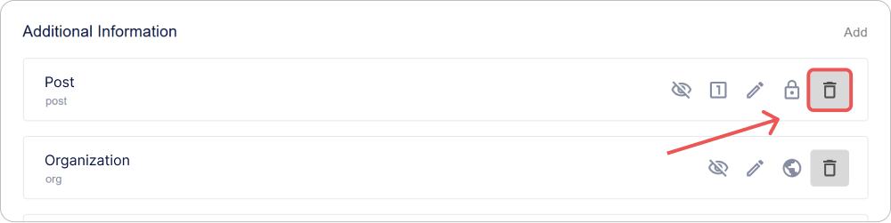

# So konfigurieren Sie das {{projectName}} Benutzerprofil

In dieser Anleitung erklären wir, wie Sie das Benutzerprofil und die Passwortrichtlinie in **{{projectName}}** konfigurieren. Sie erfahren, wie Sie Profilfelder und Feldvalidierungen verwalten sowie die Bestätigung von E-Mail-Adressen und Telefonnummern einrichten.

**Inhaltsverzeichnis:**

- [Passwortrichtlinie](#password-policy)
- [Basis-Profilfelder](#basic-profile-fields)
- [Zusätzliche Profilfelder](#additional-profile-fields)
- [Validierungsregeln für Profilfelder und Passwörter](#validation-rules)
- [Einstellungen zur E-Mail-Bestätigung](#email-confirmation-settings)
- [Einstellungen zur Telefonnummer-Bestätigung](#phone-confirmation-settings)
- [Siehe auch](#see-also)

> 📌 Die Benutzerprofil-Einstellungen befinden sich im Admin-Panel. Um auf das Panel zuzugreifen, ist die Servicerolle **Administrator** erforderlich. [So öffnen Sie das Admin-Panel →](./docs-02-box-system-install.md#admin-panel-access)

---

## Passwortrichtlinie { #password-policy }

Die **Passwortrichtlinie in {{projectName}}** ist ein Satz von Regeln, die Anforderungen an die Komplexität und Sicherheit von Benutzerpasswörtern definieren. Sie hilft dabei, Konten vor Hacking und unbefugtem Zugriff zu schützen.

Die festgelegten Regeln werden angewendet:

- beim Erstellen eines Passworts im Registrierungs-Widget,
- beim Zurücksetzen eines Passworts im Login-Widget,
- beim Ändern eines Passworts im Benutzerprofil.

### So konfigurieren Sie Regeln für die Passwortrichtlinie

1. Gehen Sie zum Admin-Panel → Tab **Einstellungen**.
2. Erweitern Sie den Block **Benutzerprofil-Einstellungen** und klicken Sie auf das Panel **Passwort**.

    

3. Klicken Sie im erscheinenden Fenster auf **Konfigurieren**.

    

4. Ein Fenster mit einer Liste der verfügbaren Validierungsregeln öffnet sich.

    > 🔗 Informationen zum Erstellen und Konfigurieren von Validierungsregeln für Profilfelder finden Sie in der Anleitung [Validierungsregeln für Profilfelder](#validation-rules).

5. Aktivieren Sie die Kontrollkästchen für die Regeln, die Sie auf das Passwort anwenden möchten.  

      

6. Schließen Sie das Fenster mit der Regelliste.
7. Klicken Sie im Formular zur Feldbearbeitung auf **Speichern**.

Änderungen werden automatisch übernommen.

Nun werden die von Ihnen ausgewählten Regeln verwendet, um die Komplexität des Benutzerpassworts zu überprüfen.

> ⚠️ **Hinweis**: Neue Regeln gelten nur für Passwörter, die neu erstellt oder geändert werden. Bestehende Passwörter bleiben unverändert.

### Sicherheitsempfehlungen

Um einen robusten Kontoschutz zu gewährleisten, wird empfohlen, die folgenden Parameter zu aktivieren:

| Empfehlung                                             | Regelbeispiel                                |
| ------------------------------------------------------ | -------------------------------------------- |
| Mindestlänge des Passworts — mindestens 8 Zeichen      | `Minimum length = 8`                         |
| Verwendung verschiedener Groß-/Kleinschreibung         | `Contains lowercase and uppercase characters` |
| Zwingendes Vorhandensein von Ziffern                   | `Contains at least one digit`                |
| Zwingendes Vorhandensein von Sonderzeichen             | `Contains special characters (!@#$% etc.)`   |

---

## Basis-Benutzerprofilfelder { #basic-profile-fields }

**Basis-Profilfelder** sind obligatorische Systemattribute, die bei der Registrierung automatisch für jeden Benutzer erstellt werden. Sie bilden die Grundstruktur des Profils und gewährleisten das korrekte Funktionieren von Authentifizierungs-, Identifizierungs- und systemübergreifenden Kommunikationsmechanismen.

### Liste der Basisfelder

> 📌 Die Liste der Basisfelder ist fest vorgegeben. Das Hinzufügen, Umbenennen oder Löschen dieser Felder ist nicht möglich.

| Feld | Identifikator |
|------|--------------|
| Identifikator | `sub` |
| Login | `login` |
| E-Mail | `email` |
| Vorname | `given_name` |
| Nachname | `family_name` |
| Telefon | `phone_number` |
| Geburtsdatum | `birthdate` |
| Nickname | `nickname` |
| Foto | `picture` |
| Vereinbarung zur Datenverarbeitung | `data_processing_agreement` |

### Einstellungsindikatoren

In der Benutzeroberfläche ist eine Schnellansicht der Feldeinstellungen für jedes Feld in Form von Symbolen verfügbar:

| Symbol | Parameter |
|--------|----------|
|  | Feld kann vom Benutzer bearbeitet werden |
|  | Feld muss ausgefüllt werden |
|  | Feldwert muss eindeutig sein |
|  | Sichtbarkeitsstufe des Feldes |
|  | Feld kann beim Anmelden als Login verwendet werden |

### So konfigurieren Sie ein Basisfeld

1. Gehen Sie zum Admin-Panel → Tab **Einstellungen**.
2. Erweitern Sie den Block **Benutzerprofil-Einstellungen**.
3. Klicken Sie auf das Panel des Feldes, das Sie konfigurieren möchten.

    " style="max-width:600px; width:100%">

4. Geben Sie im sich öffnenden Formular Folgendes an:

    - [Parameter](#basic-field-parameters),
    - [Validierungsregeln](#validation-rules).

5. Speichern Sie die Änderungen im Bearbeitungsformular.

### Parameter der Basisfelder { #basic-field-parameters }

| Name | Beschreibung |
| --- | --- |
| **Name** | Feldname. Nicht editierbar. |
| **Feldbeschreibung** | Feldname in der Benutzeroberfläche. Nicht editierbar. |
| **Als Login verwenden** | Ermöglicht die Autorisierung über dieses Feld. Verfügbar für die Felder **Login**, **E-Mail** und **Telefonnummer**. |
| **Aktivität** | Bestimmt das obligatorische Vorhandensein des Feldes im Benutzerprofil. Unveränderlicher Parameter. |
| **Editierbar** | Erlaubt dem Benutzer, den Feldwert in seinem Profil zu ändern. |
| **Erforderlich**| Erfordert das Ausfüllen des Feldes bei der Registrierung oder Anmeldung. Ohne dieses Feld ist keine Authentifizierung möglich. |
| **Eindeutig** | Prüft, ob der Feldwert über alle Profile hinweg eindeutig ist. |
| **Öffentlichkeit** | 
 Bestimmt, wer auf die Benutzerdaten zugreifen kann: 
 - **Nur für Sie sichtbar** — Daten sind privat und nur für den Benutzer zugänglich.   - **Auf Anfrage verfügbar** — Benutzerdaten sind für Drittsysteme nach deren Zustimmung verfügbar;   - **Öffentlich verfügbar** — Daten sind für Drittsysteme immer öffentlich, erfordern keine Zustimmung. Daten werden per E-Mail-Hash an das Drittsystem übertragen (ähnlich dem Dienst [Gravatar](https://gravatar.com/)). |
| **Einstellungen zur E-Mail-Bestätigung** | 
Dient zur Konfiguration der Parameter für die E-Mail-Adressbestätigung im Benutzerprofil.
 🔗 Detaillierte Beschreibung in der Anleitung [Einstellungen zur E-Mail-Bestätigung](./docs-05-box-userfields-settings.md#email-confirmation-settings). |
| **Einstellungen zur Telefonnummer-Bestätigung** | 
Dient zur Konfiguration der Parameter für die Telefonnummer-Bestätigung im Benutzerprofil.
 🔗 Detaillierte Beschreibung in der Anleitung [Einstellungen zur Telefonnummer-Bestätigung](./docs-05-box-userfields-settings.md#phone-confirmation-settings). |
| **Validierungsregeln** | 
Ein Satz von Regeln zur Überprüfung der Korrektheit eingegebener Daten.
 🔗 Detaillierte Beschreibung in der Anleitung [Konfiguration von Validierungsregeln](./docs-05-box-userfields-settings.md#validation-rules). |

---

## Zusätzliche Benutzerprofilfelder { #additional-profile-fields }

**Zusätzliche Profilfelder** sind benutzerdefinierte Attribute, die erstellt werden können, um spezifische Daten zu speichern, die nicht im Standardsatz enthalten sind.

Sie helfen dabei, das Profil an spezifische Aufgaben anzupassen:

- Speichern von internen Identifikatoren, Jobtiteln, Rollen, Abteilungen usw.
- Datenverifizierungsstatus und andere Geschäftsattribute.

### Einstellungsindikatoren

In der Benutzeroberfläche ist eine Schnellansicht der Feldeinstellungen für jedes Feld in Form von Symbolen verfügbar:

| Symbol | Parameter |
|--------|----------|
|  | Feld kann vom Benutzer bearbeitet werden |
|  | Feld muss ausgefüllt werden |
|  | Feldwert muss eindeutig sein |
|  | Sichtbarkeitsstufe des Feldes |
|  | Feldaktivität |

### Hinzufügen eines zusätzlichen Feldes  

1. Gehen Sie zum Admin-Panel → Tab **Einstellungen**.
2. Erweitern Sie den Block **Benutzerprofil-Einstellungen**.
3. Klicken Sie auf die Schaltfläche **Hinzufügen** im Abschnitt **Zusätzliche Informationen**.
4. Geben Sie im sich öffnenden Formular Folgendes an:

    - [Parameter](#additional-field-parameters),
    - [Validierungsregeln](#validation-rules).

5. Klicken Sie auf **Speichern**.

### Bearbeiten eines zusätzlichen Feldes
  
1. Gehen Sie zum Admin-Panel → Tab **Einstellungen**.
2. Erweitern Sie den Block **Benutzerprofil-Einstellungen**.
3. Klicken Sie auf das Panel mit dem zusätzlichen Feld, dessen Einstellungen geändert werden sollen.  
4. Bearbeiten Sie im sich öffnenden Formular die Parameter und Validierungsregeln.
5. Klicken Sie auf **Speichern**.

> 💡 Änderungen werden sofort wirksam und gelten für alle Profile, in denen dieses Feld verwendet wird.

### Löschen eines zusätzlichen Feldes  

1. Gehen Sie zum Admin-Panel → Tab **Einstellungen**.
2. Erweitern Sie den Block **Benutzerprofil-Einstellungen**.
3. Klicken Sie auf die Schaltfläche **Löschen**  neben dem Feld, das Sie löschen möchten.  

    

> ⚠️ **Hinweis**: Wenn ein Feld gelöscht wird, gehen alle darin gespeicherten Benutzerdaten unwiderruflich verloren.

### Parameter der zusätzlichen Felder { #additional-field-parameters }

| Name | Beschreibung |
| --- | --- |
| **Feldbeschreibung** | Feldname im System |
| **Aktivität** | Bestimmt, ob das Feld im Benutzerprofil angezeigt wird |
| **Editierbar** | Erlaubt dem Benutzer, den Feldwert selbstständig zu ändern |
| **Erforderlich** | Erfordert das Ausfüllen des Feldes bei der Registrierung oder Anmeldung. Ohne ausgefülltes Feld kann sich der Benutzer nicht anmelden. |
| **Eindeutig** | Prüft, ob der Wert über alle Profile hinweg eindeutig ist |
| **Öffentlichkeit** | 
 Konfiguriert, für wen das Feld verfügbar ist: 
 - **Nur für Sie sichtbar** — Daten sind privat und nur für den Benutzer zugänglich.   - **Auf Anfrage verfügbar** — Benutzerdaten sind für Drittsysteme nach deren Zustimmung verfügbar;   - **Öffentlich verfügbar** — Daten sind für Drittsysteme immer öffentlich, erfordern keine Zustimmung. Daten werden per E-Mail-Hash an das Drittsystem übertragen (ähnlich dem Dienst [Gravatar](https://gravatar.com/)). |
| **vCard-Attribut** | Ermöglicht das Mapping des Feldes auf ein Attribut beim Export des Profils im vCard-Format |
| **Standardwert** | Legt einen vorab ausgefüllten Wert beim Erstellen eines Profils fest |
| **Validierungsregeln** | 
Definiert die Logik zur Überprüfung des eingegebenen Wertes.
 🔗 Weitere Details in der Anleitung [Konfiguration von Validierungsregeln](./docs-05-box-userfields-settings.md#validation-rules). |

---

## Validierungsregeln für Profilfelder und Passwörter { #validation-rules }

**Feldvalidierungsregeln** sind ein Satz von Prüfungen, mit denen das System die Korrektheit der vom Benutzer eingegebenen Daten bewertet.

Sie können eigene Regeln festlegen für:

- das Kontopasswort,
- [Basis-Profilfelder](#basic-profile-fields),
- [zusätzliche Profilfelder](#additional-profile-fields).

Solche Prüfungen ermöglichen es, die Datenqualität zu verbessern, indem beispielsweise ungültige E-Mail-Adressen, Telefonnummern oder Passwörter ohne Sonderzeichen verhindert werden.

Definierte Validierungsregeln werden in der Benutzeroberfläche angezeigt. Beispielsweise erscheint im Profilbearbeitungsformular ein spezielles Symbol neben einem Basis- oder Zusatzfeld; beim Bewegen des Mauszeigers darüber öffnet sich die Liste der definierten Regeln.

### Erstellen einer Regel  

1. Gehen Sie zum Admin-Panel → Tab **Einstellungen**.
2. Erweitern Sie den Block **Benutzerprofil-Einstellungen**.
3. Klicken Sie auf das Panel mit dem Passwort, Basis- oder Zusatzfeld.  

    

4. Das Bearbeitungsformular öffnet sich.
5. Klicken Sie auf **Konfigurieren** im Abschnitt **Validierungsregeln**.

    

6. Klicken Sie im sich öffnenden Fenster mit der Liste der Validierungsregeln auf die Schaltfläche **Hinzufügen** .
7. Das Formular zum Erstellen der Regel öffnet sich.

    

8. Füllen Sie die Regelfelder aus:  

    - **Name**;  
    - **Fehlertext** — die Nachricht, die angezeigt wird, wenn die Regel ausgelöst wird;  
    - **Regulärer Ausdruck** — der Ausdruck, dem der Wert im Feld entsprechen muss;  
    - **Aktivität** — wenn aktiviert, kann diese Regel für die Feldvalidierung ausgewählt werden. Inaktive Regeln stehen nicht zur Auswahl und werden bei der Feldwertprüfung ignoriert.  

9. Klicken Sie auf **Speichern**.  

Die erstellte Regel wird der Regelliste hinzugefügt und steht für die Konfiguration der Feldvalidierung zur Verfügung.  

### Bearbeiten einer Regel  

1. Gehen Sie zum Admin-Panel → Tab **Einstellungen**.
2. Erweitern Sie den Block **Benutzerprofil-Einstellungen**.
3. Klicken Sie auf das Panel mit dem Basis- oder Zusatzfeld.  
4. Das Bearbeitungsformular öffnet sich.
5. Klicken Sie auf **Konfigurieren** im Abschnitt **Validierungsregeln**.
6. Das Fenster mit der Liste der Validierungsregeln öffnet sich.
7. Klicken Sie auf dem Regel-Panel auf die Schaltfläche **Konfigurieren**.  

    

8. Ändern Sie im sich öffnenden Bearbeitungsformular die erforderlichen Felder.
9. Klicken Sie auf **Speichern**.  

### Löschen einer Regel  

1. Gehen Sie zum Admin-Panel → Tab **Einstellungen**.
2. Erweitern Sie den Block **Benutzerprofil-Einstellungen**.
3. Klicken Sie auf das Panel mit dem Basis- oder Zusatzfeld.  
4. Das Bearbeitungsformular öffnet sich.
5. Klicken Sie auf **Konfigurieren** im Abschnitt **Validierungsregeln**.
6. Das Fenster mit der Liste der Validierungsregeln öffnet sich.
7. Klicken Sie auf dem Regel-Panel auf die Schaltfläche **Löschen** .  

    

Änderungen werden automatisch übernommen.

### So fügen Sie eine Regel zu einem Benutzerprofilfeld hinzu

Um Validierungsregeln in einem Basis- oder Zusatzfeld zu konfigurieren:

1. Gehen Sie zum Admin-Panel → Tab **Einstellungen**.
2. Erweitern Sie den Block **Benutzerprofil-Einstellungen**.
3. Klicken Sie auf das Panel mit dem Basis- oder Zusatzfeld.  
4. Das Bearbeitungsformular öffnet sich.
5. Klicken Sie auf **Konfigurieren** im Abschnitt **Validierungsregeln**.

    

6. Das Fenster mit der Liste der Validierungsregeln öffnet sich.

    

7. Aktivieren Sie das Kontrollkästchen neben den Regeln, die Sie auf das ausgewählte Feld anwenden möchten.
8. Schließen Sie das Fenster mit der Regelliste.

Änderungen werden automatisch übernommen.

---

## Einstellungen zur E-Mail-Bestätigung { #email-confirmation-settings }

Die **E-Mail-Bestätigung in {{projectName}}** ist ein Mechanismus zur Überprüfung der Gültigkeit der vom Benutzer bei der Registrierung, Autorisierung oder Änderung von Profildaten angegebenen Adresse.

Nachdem die Adresse angegeben wurde, sendet das System eine E-Mail mit einem Bestätigungscode oder einem eindeutigen Link.
Der Benutzer muss dem Link folgen oder den Code eingeben — danach gilt die Adresse als bestätigt.

Diese Verifizierung gewährleistet:

- Schutz vor Registrierung mit falschen oder fremden Adressen;
- Sicherheit beim Kontozugriff;
- die Möglichkeit, E-Mail für die Wiederherstellung des Zugriffs und Benachrichtigungen zu nutzen;
- Kontrolle über die Aktualität der Benutzerkontaktdaten.

Die Einstellungen zur E-Mail-Bestätigung werden vom Administrator festgelegt und umfassen Mailserver-Parameter (SMTP), Absenderadresse, Lebensdauer des Bestätigungscodes und andere technische Parameter.

> 💡 **Tipp**: Stellen Sie vor dem Speichern der Einstellungen sicher, dass die angegebenen SMTP-Parameter korrekt sind — bei einem Fehler kann das System keine E-Mails versenden.

### Hinzufügen einer Einstellung

1. Gehen Sie zum Admin-Panel → Tab **Einstellungen**.
2. Erweitern Sie den Block **Benutzerprofil-Einstellungen**.
3. Klicken Sie auf das Panel **E-Mail**.  
4. Das Bearbeitungsformular öffnet sich.
5. Klicken Sie im Abschnitt **Einstellungen zur E-Mail-Bestätigung** auf **Hinzufügen**.

    

6. Geben Sie im sich öffnenden Fenster die Parameter an:

    | Parameter | Beschreibung |
    |----------|----------|
    | **Haupt-E-Mail-Adresse** | Die E-Mail-Adresse, von der automatische E-Mails gesendet werden |
    | **Postausgangsserver-Adresse** | SMTP-Serveradresse |
    | **Postausgangsserver-Port** | Port für den SMTP-Server |
    | **E-Mail-Passwort** | Reguläres Passwort oder App-Passwort, das in den Kontoeinstellungen des Mail-Dienstes erstellt wurde |
    | **Für Anmeldung per Code verwenden** | E-Mail wird für die Anmeldung bei Anwendungen mittels Einmalpasswörtern verwendet |
    | **E-Mail-Bild** | Symbol, das in der Benutzeroberfläche des **{{projectName}}**-Dienstes angezeigt wird |
    | **Gültigkeitsdauer des Bestätigungscodes** | Lebensdauer für E-Mail-Adressbestätigungscodes in Sekunden |

7. Klicken Sie auf **Speichern**.

### Bearbeiten einer Einstellung

1. Gehen Sie zum Admin-Panel → Tab **Einstellungen**.
2. Erweitern Sie den Block **Benutzerprofil-Einstellungen**.
3. Klicken Sie auf das Panel **E-Mail**.
4. Das Bearbeitungsformular öffnet sich.
5. Klicken Sie im Abschnitt **Einstellungen zur E-Mail-Bestätigung** auf die Schaltfläche **Konfigurieren**.

    

6. Das Bearbeitungsformular öffnet sich.
7. Nehmen Sie die erforderlichen Änderungen vor.
8. Klicken Sie auf **Speichern**.

### Löschen einer Einstellung

1. Gehen Sie zum Admin-Panel → Tab **Einstellungen**.
2. Erweitern Sie den Block **Benutzerprofil-Einstellungen**.
3. Klicken Sie auf das Panel **E-Mail**.
4. Das Bearbeitungsformular öffnet sich.
5. Klicken Sie auf die Schaltfläche **Löschen**  im Abschnitt **Einstellungen zur E-Mail-Bestätigung**.

    

6. Bestätigen Sie die Aktion im Modal-Fenster.

    

---

## Einstellungen zur Telefonnummer-Bestätigung { #phone-confirmation-settings }

Die **Telefonnummer-Bestätigung in {{projectName}}** ist ein Mechanismus zur Überprüfung der Gültigkeit der vom Benutzer bei der Registrierung, Anmeldung oder Profiländerung angegebenen Kontaktnummer.

Nach Eingabe der Nummer sendet das System dem Benutzer einen Verifizierungscode oder leitet einen automatischen Anruf ein. Der Benutzer gibt den erhaltenen Code ein und bestätigt damit, dass die angegebene Nummer tatsächlich ihm gehört.

Diese Verifizierung erfüllt mehrere Schlüsselfunktionen:

- verhindert die Verwendung von ungültigen oder fremden Nummern;
- bietet eine zusätzliche Schutzebene für das Konto;
- ermöglicht die Verwendung der Nummer für die Anmeldung per Einmalcode;
- gewährleistet das korrekte Funktionieren sicherheitsrelevanter Benachrichtigungen.

In der aktuellen Version von **{{projectName}}** ist die Nummernbestätigung über die Integration mit dem Dienst [Call Authorization](https://kloud.one/id/) der Plattform **Kloud.One** implementiert. Damit dieser Mechanismus funktioniert, müssen Sie die Verbindung zu **Kloud.One** konfigurieren, indem Sie die Client-ID und das Secret angeben.

> 💡 **Tipp:** Stellen Sie vor dem Speichern der Einstellung sicher, dass die Anwendung korrekt in **Kloud.One** registriert ist und die bereitgestellten Daten (`client_id` und `client_secret`) gültig sind. Ohne diese wird die Nummernbestätigung nicht funktionieren.  

> 📚 [Kloud.One Dokumentation](https://docs.kloud.one)

### Hinzufügen einer Einstellung

1. Gehen Sie zum Admin-Panel → Tab **Einstellungen**.
2. Erweitern Sie den Block **Benutzerprofil-Einstellungen**.
3. Klicken Sie auf das Panel **Telefonnummer**.  
4. Das Bearbeitungsformular öffnet sich.
5. Klicken Sie im Abschnitt **Einstellungen zur Telefonnummer-Bestätigung** auf **Hinzufügen**.

    

6. Legen Sie im erscheinenden Fenster die erforderlichen Parameter fest:

    | Parameter | Name | Beschreibung |
    |----------|----------|-----------------|
    | **Basisadresse der Autorisierung (issuer)** | `issuer` | Adresse der [Call Authorization](https://kloud.one/id/) Anwendung. In der aktuellen Version — `<https://flashcall.kloud.one>` |
    | **Client-ID (client_id)** | `client_id` | Identifikator der im Dienst [Call Authorization](https://kloud.one/id/) erstellten Anwendung |
    | **Client-Geheimnis (client_secret)** | `client_secret` | Geheimer Schlüssel der im Dienst [Call Authorization](https://kloud.one/id/) erstellten Anwendung |
    | **Für Anmeldung per Code verwenden** | - | Telefonnummer wird für die Anmeldung bei Anwendungen mittels Einmalpasswörtern verwendet |
    | **Telefon-Bild** | - | Symbol, das in der Benutzeroberfläche des **{{projectName}}**-Dienstes angezeigt wird |

7. Klicken Sie auf **Speichern**.

### Bearbeiten einer Einstellung

1. Gehen Sie zum Admin-Panel → Tab **Einstellungen**.
2. Erweitern Sie den Block **Benutzerprofil-Einstellungen**.
3. Klicken Sie auf das Panel **Telefonnummer**.
4. Das Bearbeitungsformular öffnet sich.
5. Klicken Sie im Abschnitt **Einstellungen zur Telefonnummer-Bestätigung** auf **Konfigurieren**.
6. Das Bearbeitungsformular öffnet sich.
7. Nehmen Sie die erforderlichen Änderungen vor.
8. Klicken Sie auf **Speichern**.

### Löschen einer Einstellung

1. Gehen Sie zum Admin-Panel → Tab **Einstellungen**.
2. Erweitern Sie den Block **Benutzerprofil-Einstellungen**.
3. Klicken Sie auf das Panel **Telefonnummer**.
4. Das Bearbeitungsformular öffnet sich.
5. Klicken Sie auf die Schaltfläche **Löschen**  im Abschnitt **Einstellungen zur Telefonnummer-Bestätigung**.

    

6. Bestätigen Sie die Aktion im Modal-Fenster.

    

---

## Siehe auch { #see-also }

- [Login-Methoden und Konfiguration des Login-Widgets](./docs-06-github-en-providers-settings.md) — Anleitung zum Verbinden und Konfigurieren externer Authentifizierungsdienste.
- [Anwendungsverwaltung](./docs-10-common-app-settings.md) — Anleitung zum Erstellen, Konfigurieren und Verwalten von OAuth 2.0- und OpenID Connect (OIDC)-Anwendungen.
- [Benutzerverwaltung](./docs-08-box-manage-users.md) — Anleitung zur Verwaltung von Benutzerkonten.