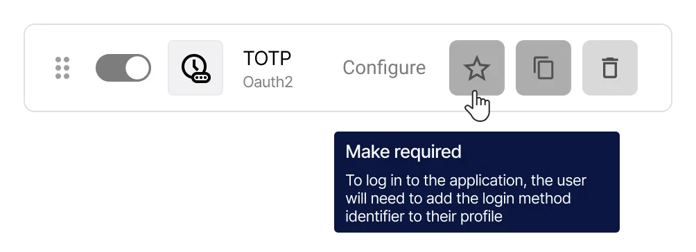

# So konfigurieren Sie Login-Methoden in Encvoy ID

In dieser Anleitung erfahren Sie, wie Sie Login-Methoden in **Encvoy ID** konfigurieren, einschließlich Standard-OAuth-Providern und erweiterten Authentifizierungsmethoden (WebAuthn, mTLS, TOTP). Wir erklären außerdem, wie Sie das Autorisierungs-Widget korrekt einrichten und gestalten, um den Login-Prozess sicher und benutzerfreundlich zu gestalten.

**Inhaltsverzeichnis:**

- [Übersicht der Login-Methoden](#login-methods-overview)
- [Verwalten von Login-Methoden](#managing-login-methods)
- [Einstellungen des Login-Widgets](#login-widget-settings)
- [Siehe auch](#see-also)

---

## Übersicht der Login-Methoden { #login-methods-overview }

Eine **Login-Methode** ist ein Authentifizierungsverfahren für Benutzer, das es ihnen ermöglicht, sich im persönlichen Konto oder in verbundenen Anwendungen zu autorisieren. Sie ist ein Schlüsselelement des Single Sign-On-Systems und bietet eine flexible und sichere Identifizierung.

### Typen von Authentifizierungsanbietern in Encvoy ID

**Encvoy ID** unterstützt die folgenden Arten von Login-Methoden:

- **Basismethoden**: Login und Passwort, E-Mail,
- **Externe Identitätsanbieter**: Soziale Netzwerke, vertrauenswürdige Unternehmenssysteme und andere Dienste,
- **Erweiterte und passwortlose Methoden:** Kryptografische Authentifizierung über **mTLS** (Client-Zertifikate) und **WebAuthn** (Biometrie, Hardware-Schlüssel) sowie Einmalpasswörter über **TOTP/HOTP**.

Kombinieren Sie Login-Methoden, um die Sicherheit zu erhöhen. Implementieren Sie eine **Zwei-Faktor-Authentifizierung**, bei der der Benutzer nach Eingabe des ersten Faktors (Login, Passwort oder eine andere Methode) seine Identität mit einem zweiten Faktor (Telefon, E-Mail oder WebAuthn) bestätigen muss. [So konfigurieren Sie die Zwei-Faktor-Authentifizierung →](./docs-04-box-system-settings.md#two-factor-authentication)

### Verwaltungsebenen und Sichtbarkeit von Login-Methoden { #management-levels-and-publicity }

Login-Methoden können in verschiedenen Dashboards von **Encvoy ID** erstellt werden:

- **Admin Dashboard** — systemweite Ebene;
- **Organization Dashboard** — Unternehmensebene;
- **Application Dashboard (ADM)** — Ebene der einzelnen Anwendung.

Für Login-Methoden, die auf der **Service-** oder **Organisationsebene** erstellt wurden, können Sie die **Sichtbarkeit** (Publicity) konfigurieren — also festlegen, wo genau sie verfügbar sein sollen.

| Typ der Login-Methode                           | Sichtbarkeitseinstellung | Verfügbarkeit                                | Verwaltung                                         |
| ----------------------------------------------- | ------------------------ | -------------------------------------------- | -------------------------------------------------- |
| **Erstellt im Admin Dashboard**                 | ✔ Ja                     | Admin-Dashboard und alle Service-Anwendungen | Nur über das **Admin Dashboard** verwaltbar        |
| **Erstellt im Organization Dashboard**          | ✔ Ja                     | Alle Anwendungen dieser Organisation         | Nur über das **Organization Dashboard** verwaltbar |
| **Erstellt in der Anwendung (Small Dashboard)** | ✘ Nein                   | Nur in dieser Anwendung                      | In den **Anwendungseinstellungen** verwaltbar      |

---

## Verwalten von Login-Methoden { #managing-login-methods }

### Erstellen einer neuen Login-Methode

Für die gängigsten Dienste stellt **Encvoy ID** fertige Vorlagen mit Einstellungen bereit. Diese vereinfachen den Verbindungsprozess, da sie bereits vorausgefüllte Parameter für den jeweiligen Provider enthalten.

**Der Konfigurationsprozess umfasst drei Schritte:**

1. **Vorbereitung:** Fordern Sie eine `Client ID` und ein `Client Secret` beim Provider-Dienst an.
2. **Konfiguration in Encvoy ID:** Erstellen Sie einen Provider des entsprechenden Typs.

   Beachten Sie die separate Anleitung zur Konfiguration des gewählten Providers:
   - **E-Mail**: [E-Mail](./instructions-common-provider-email.md)
   - **Soziale Netzwerke:** [Google](./instructions-common-provider-google.md), [GitHub](./instructions-common-provider-github.md)
   - **Universell:** [OpenID Connect](./instructions-common-provider-oidc.md) (für alle OIDC-konformen Systeme)
   - **Erweiterte Methoden:** [mTLS](./instructions-common-provider-mtls.md), [WebAuthn](./instructions-common-provider-webauthn.md), [TOTP](./instructions-common-provider-totp.md), [HOTP](./instructions-common-provider-hotp.md)

3. **Platzierung im Widget:** Fügen Sie die Login-Methode dem Login-Formular hinzu, das den Systembenutzern zur Verfügung steht.

### Bearbeiten einer bestehenden Login-Methode

Wenn Sie die Einstellungen einer bestehenden Login-Methode aktualisieren müssen (z. B. aufgrund eines Wechsels des Secret Keys oder der Domain):

1. Gehen Sie zum Admin Dashboard (Organisation oder entsprechende Anwendungseinstellungen) → Bereich **Einstellungen**.
2. Klicken Sie im Block **Anmeldemethoden** auf **Konfigurieren**.
3. Ein Fenster mit einer Liste der erstellten Login-Methoden öffnet sich.
4. Klicken Sie auf die Schaltfläche **Konfigurieren** im Panel der Login-Methode, die Sie bearbeiten möchten.

5. Das Bearbeitungsformular öffnet sich.
6. Nehmen Sie die erforderlichen Änderungen vor.
7. Klicken Sie auf **Speichern**.

### Löschen einer Login-Methode

1. Gehen Sie zum Admin Dashboard (Organisation oder entsprechende Anwendungseinstellungen) → Bereich **Einstellungen**.
2. Erweitern Sie den Block **Anmeldemethoden**.
3. Klicken Sie auf **Konfigurieren**.
4. Ein Fenster mit einer Liste der erstellten Login-Methoden öffnet sich.
5. Klicken Sie auf die Schaltfläche **Löschen**  im Panel der Login-Methode, die Sie löschen möchten.

6. Bestätigen Sie die Aktion im Modal-Fenster.

Nach dem erfolgreichen Löschen verschwindet die Login-Methode aus den Widgets aller verknüpften Anwendungen.

### Kopieren von Login-Methoden-Einstellungen

Durch das Kopieren von Einstellungen können Sie eine neue Methode auf Basis einer bereits erstellten Methode erstellen.

1. Kopieren Sie die Einstellungen der Login-Methode mit der Schaltfläche **Kopieren**  im Panel der Login-Methode.

2. Öffnen Sie anschließend das Erstellungsformular für eine neue Login-Methode mit einer Vorlage desselben Typs und klicken Sie auf **Einfügen** .

> ⚠️ **Hinweis**: Wenn die Typen nicht übereinstimmen, funktioniert der neue Provider möglicherweise nicht korrekt.

### Konfigurieren eines erforderlichen Identifikators im Benutzerprofil

**Identifikatoren** sind externe Dienste, die der Benutzer seinem Profil hinzugefügt hat oder über die er sich zuvor im System angemeldet hat.

Die Liste der zum Hinzufügen verfügbaren Identifikatoren ergibt sich aus den Login-Methoden im **Encvoy ID** Dashboard mit aktiver Sichtbarkeitseinstellung.

- Wenn eine Login-Methode als **öffentlich** konfiguriert ist, erscheint sie in der Liste der Identifikatoren, die im Benutzerprofil hinzugefügt werden können.
- Die Platzierung dieser Login-Methode im Anwendungs-Widget ist optional — sie kann im Profil auch ohne Schaltfläche auf dem Haupt-Login-Bildschirm verfügbar sein.
- Der Benutzer kann einen Identifikator auch während des Logins über das Widget hinzufügen, sofern eine solche Login-Methode verfügbar ist.

In **Encvoy ID** können Sie festlegen, dass die Verknüpfung eines externen Konto-Identifikators mit dem Benutzerprofil obligatorisch ist. In diesem Fall sieht ein Benutzer, der keinen verknüpften Identifikator hat, beim Login in die Anwendung eine Aufforderung, einen solchen seinem Profil hinzuzufügen.

#### So machen Sie einen Identifikator zum Pflichtfeld

1. Gehen Sie zum Admin Dashboard (Organisation oder entsprechende Anwendungseinstellungen) → Bereich **Einstellungen**.
2. Erweitern Sie den Block **Anmeldemethoden** und klicken Sie auf **Konfigurieren**.
3. Ein Fenster mit einer Liste der erstellten Login-Methoden öffnet sich.
4. Klicken Sie auf die Schaltfläche **Als Pflichtfeld festlegen**  im Panel der Login-Methode, die Sie zur Pflicht machen möchten.

Die Einstellung wird ohne zusätzliche Bestätigung übernommen.

> 💡 **Tipp**: Ein erneuter Klick auf die Schaltfläche **Als Pflichtfeld festlegen** macht den Identifikator im Profil wieder optional.

---

## Einstellungen des Login-Widgets { #login-widget-settings }

### Was ist das Login-Widget?

Das **Login-Widget** ist das Autorisierungsformular, das dem Benutzer angezeigt wird, wenn er versucht, sich bei einer Anwendung oder dem **Encvoy ID** System anzumelden und noch nicht authentifiziert ist.

Das Widget unterstützt:

- Klassischen Login über Benutzername und Passwort,
- Login über verschiedene Provider,
- Flexible Konfiguration von Aussehen und Struktur,
- Gruppierung von Login-Methoden.

Im Widget werden Login-Methoden unterteilt in:

- **Primäre Methoden** — werden als separate Schaltflächen unter der Schaltfläche **Anmelden** angezeigt und am häufigsten verwendet.
- **Zusätzliche Methoden** — werden im Block **Weitere Möglichkeiten** als kompakte Schaltflächen platziert, um die Benutzeroberfläche nicht zu überladen.

Beispiel für ein Widget:

> 💡 Das **Login-Widget** ist das Erste, was ein Benutzer bei der Autorisierung sieht. Daher ist es wichtig, dass es dem visuellen Stil des Unternehmens entspricht und so klar wie möglich gestaltet ist.

### Konfigurieren des Login-Widgets: Aussehen und Schaltflächen

So konfigurieren Sie das Erscheinungsbild des Widgets:

1. Gehen Sie zum Admin Dashboard (Organisation oder entsprechende Anwendungseinstellungen) → Bereich **Einstellungen**.
2. Suchen Sie den Block **Anmeldemethoden** und klicken Sie auf **Konfigurieren**.
3. Das Fenster **Widget-Erscheinungsbild anpassen** öffnet sich.
4. Im ersten Block werden die wichtigsten visuellen Elemente definiert:
   - **Widget-Titel** — Wird oben im Formular angezeigt. Um den Anwendungsnamen im Widget-Titel anzuzeigen, verwenden Sie den Wert `APP_NAME`.
   - **Widget-Cover** — Hintergrundbild des Autorisierungsformulars.
   - **Modus für die automatische Cover-Ersetzung bei Anwendungs-Widgets**:
     - **Deaktiviert** — Das Cover der Anwendung wird verwendet,
     - **Standard** — Nur für Anwendungen ohne Cover,
     - **Erzwungen** — Wird auf alle Anwendungen angewendet.

5. Konfigurieren Sie im zweiten Block die Sichtbarkeit der Elemente des Login-Formulars:
   - **Anwendungslogo im Widget anzeigen** — Wenn aktiviert, wird das Logo neben dem Anwendungsnamen angezeigt. Es wird das Bild aus dem Bereich [Basisinformationen](./docs-04-box-system-settings.md#system-name-and-logo) verwendet.
   - **Schaltfläche „Konto erstellen“ ausblenden** — Wenn aktiviert, wird die Schaltfläche zur Kontoerstellung im Widget ausgeblendet.
   - **Fußzeile ausblenden** — Wenn aktiviert, wird die Fußzeile des Widgets mit dem Text "© 2015-2025" ausgeblendet.
   - **Logos der Hauptanmeldemethoden ausblenden** — Wenn aktiviert, werden die Logos der Login-Methoden aus der Gruppe **Primär** ausgeblendet.

     

6. Konfigurieren Sie im dritten Block das Design der Schaltflächen:
   - **Hintergrundfarbe der Schaltflächen** — Farbschema für den Schaltflächenhintergrund (Hex-Code).
   - **Schriftfarbe auf Schaltflächen** — Farbschema für den Schaltflächentext (Hex-Code).

     

7. Geben Sie bei Bedarf Texte an:
   - **Zusätzliches Informationsfeld innerhalb des Formulars** — Zusätzlicher Text, der unten im Widget angezeigt wird,
   - **Zusätzliches Feld außerhalb des Widgets** — Zusätzlicher Text, der unterhalb des Widgets angezeigt wird.

     

   > Die Felder unterstützen das Einfügen von HTML5-Code mit vollständigem semantischem Markup, einschließlich eingebetteter und Inline-CSS-Styles. Die Verwendung des `script`-Tags ist untersagt. Beim Speichern der Daten wird jedes `script`-Tag (einschließlich Inhalt und Attributen) automatisch auf Datenbankebene aus dem Feld entfernt.

8. Klicken Sie auf **Speichern**, um die Änderungen zu übernehmen.

   > 💡 Sie können die Ergebnisse der Änderungen im Bereich **Vorschau** ansehen.

### Hinzufügen und Deaktivieren von Login-Methoden im Widget

So konfigurieren Sie die Anzeige einer Login-Methode im Widget:

1. Gehen Sie zum Admin Dashboard (Organisation oder entsprechende Anwendungseinstellungen) → Bereich **Einstellungen**.
2. Suchen Sie den Block **Anmeldemethoden** und klicken Sie auf **Konfigurieren**.
3. Aktivieren oder deaktivieren Sie die Schalter für die gewünschten Login-Methoden.
4. Konfigurieren Sie bei Bedarf Gruppen für die Login-Methoden.

> ⚠️ **Hinweis**:
>
> 1. Die Methode **Login/Passwort** kann nicht deaktiviert werden. Wenn alle Login-Methoden deaktiviert sind, wird die Methode **Login/Passwort** automatisch aktiviert, da das Widget mindestens eine Methode zum Anmelden enthalten muss.
> 2. Das Deaktivieren einer Login-Methode im Widget löscht die Login-Methode nicht aus dem System.

---

## Siehe auch { #see-also }

- [Anwendungsverwaltung](./docs-10-common-app-settings.md) — Anleitung zum Erstellen, Konfigurieren und Verwalten von OAuth 2.0- und OpenID Connect (OIDC)-Anwendungen.
- [Organisationsverwaltung](./docs-02-box-system-install.md) — Anleitung zur Arbeit mit einer Organisation in **Encvoy ID**.
- [Benutzerregistrierung und Login](./docs-13-common-user-authentication.md) — Anweisungen zur Kontoerstellung, zum Login mit Benutzername/Passwort und zu externen Authentifizierungsdiensten.
