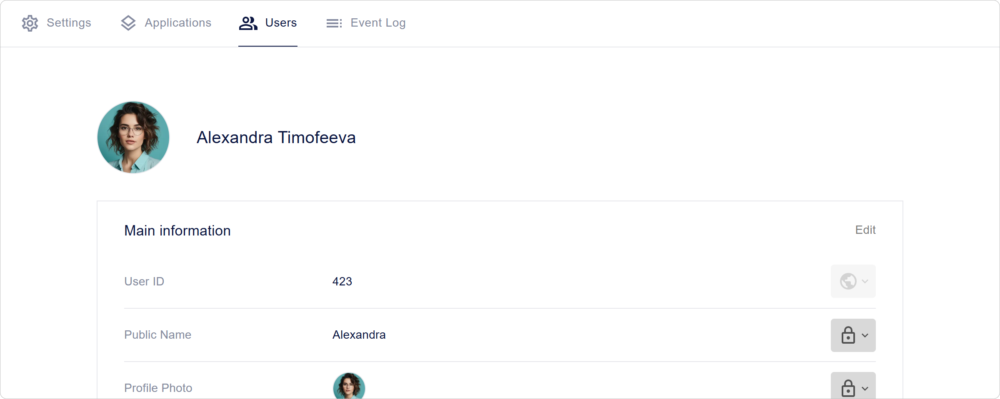
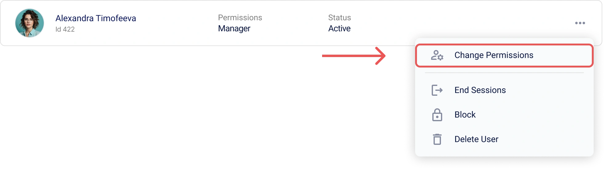

# Benutzerverwaltung in Encvoy ID

In diesem Handbuch erfahren Sie, wie Sie Benutzerprofile in **Encvoy ID** erstellen und bearbeiten, Rollen und Zugriffsrechte zuweisen, Konten sperren und löschen, aktive Sitzungen beenden, den Datenschutz verwalten und Profildaten exportieren.

**Inhaltsverzeichnis:**

- [Übersicht und grundlegende Aktionen](#overview-and-basics)
- [Verwaltung von Profildaten](#profile-data-management)
- [Zugriff und Sicherheit](#access-and-security)
- [Kontostatus](#account-status)
- [Einen Benutzer löschen](#deleting-user)
- [Siehe auch](#see-also)

---

## Übersicht und grundlegende Aktionen { #overview-and-basics }

### Über den Bereich „Benutzer“

Die Liste aller in **Encvoy ID** registrierten Benutzer befindet sich im Bereich **Benutzer**. Hier können Administratoren Konten verwalten, Profile einsehen und den Systemzugriff steuern.

> ⚠️ **Zugriffsanforderungen**: Dieser Bereich ist im Admin-Panel für Benutzer mit den Systemberechtigungen **Administrator** verfügbar.

### Einen Benutzer in Encvoy ID erstellen

> 📌 In **Encvoy ID** gibt es mehrere Möglichkeiten, Benutzer zu registrieren: Selbstregistrierung über ein Widget und manuelle Erstellung durch einen Benutzer mit **Administrator**-Rechten.

In dieser Anleitung behandeln wir die manuelle Erstellung eines Benutzers:

1. Gehen Sie zum Admin-Panel → Registerkarte **Benutzer**.
2. Klicken Sie auf die Schaltfläche **Benutzer erstellen** .
3. Das Formular zur Benutzererstellung wird geöffnet.
4. Füllen Sie die Profilfelder im Formular aus:
   - **Öffentlicher Name** — der Anzeigename des Benutzers im System;
   - **Vorname** — Vor- und Zweitname des Benutzers;
   - **Nachname** — Nachname des Benutzers;
   - **Login** — muss für den Dienst eindeutig sein; kann für die zukünftige Autorisierung verwendet werden;
   - **E-Mail** — die Adresse muss für den Dienst eindeutig sein; kann für die zukünftige Autorisierung verwendet werden;
   - **Telefonnummer** — muss für den Dienst eindeutig sein; kann für die zukünftige Autorisierung verwendet werden;
   - **Passwort** — muss der in den Diensteinstellungen festgelegten Passwortrichtlinie entsprechen.

     > 🔗 Weitere Details finden Sie im Handbuch [Konfiguration der Passwortrichtlinie](./docs-05-box-userfields-settings.md#password-policy).

   - **Geburtsdatum**;
   - **Profilbild**.

5. Klicken Sie auf **Speichern**.

   > 💡 Ein Benutzerprofil kann [zusätzliche Felder](./docs-05-box-userfields-settings.md#password-policy) enthalten.

   > 📌 Die Feldvalidierung erfolgt gemäß den Validierungsregeln. Weitere Details finden Sie im Handbuch [Feldvalidierungsregeln](./docs-05-box-userfields-settings.md#validation-rules).

### Ein Benutzerprofil anzeigen und bearbeiten

#### Ein Benutzerprofil anzeigen

Um detaillierte Informationen über ein Konto zu erhalten, öffnen Sie dessen Profil.

1. Gehen Sie zum Admin-Panel → Registerkarte **Benutzer**.
2. Klicken Sie auf das Panel des Benutzers, dessen Profil Sie anzeigen möchten.
3. Das Benutzerprofil wird mit detaillierten Informationen geöffnet: Kontaktdaten, Kennungen und Datenschutzeinstellungen.



#### Profildaten bearbeiten

Um Änderungen an einem Benutzerprofil vorzunehmen:

1. Gehen Sie zum Admin-Panel → Registerkarte **Benutzer**.
2. Öffnen Sie das Benutzerprofil.
3. Klicken Sie im Block **Basisinformationen** auf **Bearbeiten**.
4. Nehmen Sie im sich öffnenden Formular **Benutzer bearbeiten** die erforderlichen Änderungen vor.

   > 📌 Die Feldvalidierung erfolgt gemäß den Validierungsregeln. Weitere Details finden Sie im Handbuch [Feldvalidierungsregeln](./docs-05-box-userfields-settings.md#validation-rules).

5. Klicken Sie auf **Speichern**.

---

## Verwaltung von Profildaten { #profile-data-management }

### Verwaltung von Profilkennungen

Der Bereich **Kennungen** im Benutzerprofil zeigt die Login-Methoden an, die der Benutzer selbst hinzugefügt oder verwendet hat, um sich in der Anwendung oder im persönlichen **Encvoy ID**-Konto anzumelden. Der Administrator kann den Datenschutz einer Kennung konfigurieren und diese aus dem Benutzerprofil entfernen.

> 💡 **Wichtig:** Nur der Kontoinhaber kann neue Kennungen hinzufügen. Weitere Details finden Sie im Handbuch [Kennungen externer Dienste](./docs-12-common-personal-profile.md#external-service-identifiers).

Um eine Kennung zu löschen:

1. Gehen Sie zum Admin-Panel → Registerkarte **Benutzer**.
2. Öffnen Sie das Benutzerprofil.
3. Klicken Sie auf dem Panel der Login-Methode, die Sie aus dem Profil entfernen möchten, auf **Löschen**.


Die Kennung wird sofort aus dem Profil entfernt.

### Konfiguration des Datenschutzes für Profilfelder

Für jedes Profilfeld können Sie eine Datenschutzstufe festlegen, die bestimmt, wer diese Informationen sehen kann. Einstellungen sind für Basis- und Zusatzdaten des Benutzers sowie für Login-Methoden verfügbar.

#### Datenschutzstufen

| Stufe                     | Symbol                                                    | Beschreibung                                                                                                                                                    |
| ------------------------- | --------------------------------------------------------- | --------------------------------------------------------------------------------------------------------------------------------------------------------------- |
| **Nur für Sie sichtbar**  |             | Daten werden nicht an Drittsysteme übertragen und sind nur für den Benutzer zugänglich.                                                                         |
| **Auf Anfrage verfügbar** |  | Daten sind in Drittsystemen verfügbar, die mit **Encvoy ID** integriert sind. <br> Die Zustimmung des Benutzers ist für den Zugriff auf die Daten erforderlich. |
| **Öffentlich verfügbar**  |       | Daten sind immer öffentlich. Die Zustimmung des Benutzers ist für den Zugriff nicht erforderlich.                                                               |

#### So ändern Sie den Datenschutz für Profilfelder

1. Gehen Sie zum Admin-Panel → Registerkarte **Benutzer**.
2. Öffnen Sie das Benutzerprofil.
3. Klicken Sie auf das aktuelle Datenschutzsymbol neben dem Feld.
4. Wählen Sie eine neue Stufe aus dem Dropdown-Menü aus.


Die Änderung wird sofort angewendet.

### Exportieren von Profildaten

**Encvoy ID** ermöglicht es Ihnen, alle Profildaten im JSON-Format zu exportieren.

Um Profildaten herunterzuladen:

1. Gehen Sie zum Admin-Panel → Registerkarte **Benutzer**.
2. Öffnen Sie das Benutzerprofil.
3. Erweitern Sie den Block **Weitere Aktionen**.


4. Wählen Sie die Aktion **Daten herunterladen**.
5. Der Download der JSON-Datei startet automatisch.

#### Struktur der exportierten Datei

Die exportierte Datei enthält eine vollständige Liste der Benutzerdaten:

```json
{
  "user": {
    "id": 1573,
    "email": "ivanov.petr89@mail.com",
    "birthdate": "1992-11-14T15:22:11.123Z",
    "family_name": "Ivanov",
    "given_name": "Petr",
    "nickname": "Petya",
    "login": "petr_ivanov92",
    "phone_number": "+79991234567",
    "picture": "public/images/profile/3f7b21d8e4c2a6f1b2c9d3a0e5f7b1c4",
    "public_profile_claims_oauth": "id email family_name given_name picture",
    "public_profile_claims_gravatar": "family_name given_name email picture",
    "blocked": false,
    "deleted": null,
    "custom_fields": {
      "country": "Russia"
    },
    "password_updated_at": "2025-10-12T08:45:33.222Z"
  },
  "role": "ADMIN"
}
```

---

## Zugriff und Sicherheit { #access-and-security }

### Benutzersitzungen beenden

Die Funktion zum erzwungenen Beenden aller aktiven Sitzungen ist ein wichtiges Sicherheitswerkzeug. Verwenden Sie sie im Falle eines verlorenen Geräts, bei Verdacht auf Kontokompromittierung oder um Zugriffstoken sofort zu aktualisieren.

> 📌 Dieser Vorgang macht sofort alle Zugriffs- und Refresh-Token für den Benutzer ungültig und beendet alle seine aktuellen Sitzungen in allen Anwendungen. Der Benutzer muss sich erneut anmelden.

#### So beenden Sie Benutzersitzungen

**Methode 1: Aus der allgemeinen Benutzerliste**

1. Gehen Sie zum Admin-Panel → Registerkarte **Benutzer**.
2. Klicken Sie im Aktionsmenü des Benutzers auf **Sitzungen beenden**.


**Methode 2: Aus dem Benutzerprofil**

1. Gehen Sie zum Admin-Panel → Registerkarte **Benutzer**.
2. Klicken Sie im Benutzerprofil innerhalb des Blocks **Weitere Aktionen** auf **Sitzungen beenden**.


**Was nach der Bestätigung passiert:**

- **Alle aktiven Sitzungen** des Benutzers werden beendet.
- **Zugriffstoken** (`access_token`) werden ungültig.
- **Refresh-Token** (`refresh_token`) werden widerrufen.
- Der Benutzer muss sich beim nächsten Zugriff auf die Anwendung **erneut anmelden**.

> 📌 Dieser Vorgang sperrt den Benutzer nicht. Er kann sich erneut autorisieren.

### Zuweisen und Ändern von Benutzerberechtigungen

Encvoy ID verwendet ein dreistufiges Zugriffssystem, das die Benutzerrechte klar definiert:

- **Mitglied** — die Basisrolle. Ermöglicht die Verwaltung des eigenen Profils, die Konfiguration von Zugriffsberechtigungen für persönliche Daten und die Verwendung des Kontos zur Anmeldung in integrierten Anwendungen.
- **Manager** — die Administratorrolle für eine bestimmte Organisation oder Abteilung. Verwaltet Benutzer und Anwendungszugriffe innerhalb ihrer Organisationseinheit.
- **Administrator** — die Rolle mit maximalen Privilegien. Bietet vollen Zugriff auf alle Plattformfunktionen, einschließlich globaler Sicherheitseinstellungen und der Verwaltung aller Organisationen.

Nachfolgend finden Sie Anweisungen zur Zuweisung der Systemrollen **Manager** und **Administrator**.

#### Zuweisen von „Manager“-Berechtigungen

1. Gehen Sie zum Admin-Panel → Registerkarte **Benutzer**.
2. Öffnen Sie das Aktionsmenü, indem Sie auf die Schaltfläche **Mehr** für den Benutzer klicken, dessen Rechte Sie ändern möchten.
3. Wählen Sie die Aktion **Rechte ändern**.



4. Wählen Sie im sich öffnenden Fenster die Rolle **Manager** aus und klicken Sie auf **Speichern**.


Der Benutzer erhält die ausgewählte Rolle und die entsprechenden Rechte.

#### Zuweisen von „Administrator“-Systemberechtigungen

1. Gehen Sie zum Admin-Panel → Registerkarte **Benutzer**.
2. Öffnen Sie das Aktionsmenü, indem Sie auf die Schaltfläche **Mehr** für den Benutzer klicken, dessen Rechte Sie ändern möchten.
3. Wählen Sie die Aktion **Rechte ändern**.
4. Wählen Sie im sich öffnenden Fenster die Rolle **Administrator** aus und klicken Sie auf **Speichern**.

Der Benutzer erhält die ausgewählte Rolle und die entsprechenden Rechte.

> 🔍 Um **Administrator**-Berechtigungen für eine Anwendung zuzuweisen, verwenden Sie die [Anleitung](./docs-10-common-app-settings.md#assigning-app-administrator).

---

## Kontostatus { #account-status }

### Benutzer in Encvoy ID sperren

Das Sperren verhindert den Zugriff auf alle Dienste, die **Encvoy ID** für den Login verwenden.

Um einen Benutzer zu sperren:

1. Öffnen Sie das Aktionsmenü für einen aktiven Benutzer in einer der Schnittstellen:
   - Im Aktionsmenü des Benutzers innerhalb des [Anwendungsprofils](./docs-10-common-app-settings.md#viewing-application).
   - Im Aktionsmenü des Benutzers auf der Registerkarte **Benutzer**.

   

2. Wählen Sie die Aktion **In Encvoy ID sperren**.
3. Bestätigen Sie die Aktion im Modal-Fenster.


**Was nach dem Sperren passiert**:

- Der Status des Benutzers ändert sich zu **Gesperrt**.

    

- Der gesperrte Benutzer kann sich nicht mehr beim Dienst oder bei Anwendungen anmelden.

  Beim Versuch, sich anzumelden, wird das folgende Widget angezeigt:

    

### Benutzer in Encvoy ID entsperren

Um einen Benutzer zu entsperren:

1. Öffnen Sie das Aktionsmenü für einen gesperrten Benutzer in einer der Schnittstellen:
   - Im Aktionsmenü des Benutzers innerhalb des [Anwendungsprofils](./docs-10-common-app-settings.md#viewing-application).
   - Im Aktionsmenü des Benutzers auf der Registerkarte **Benutzer**.

2. Wählen Sie die Aktion **In Encvoy ID entsperren**.
3. Bestätigen Sie die Aktion im Modal-Fenster.

Nach der Bestätigung der Aktion ändert sich der Status des Benutzers zu **Aktiv**.

---

## Einen Benutzer löschen { #deleting-user }

Ein Administrator kann einen Benutzer dauerhaft löschen. Sobald die Löschung bestätigt ist, verschwinden das Konto und alle Daten unwiderruflich. Der Benutzer verliert den Zugriff auf alle Anwendungen, in denen sein **Encvoy ID**-Konto verwendet wurde.

> 💡 Ein Benutzer kann sein Konto über sein persönliches Profil selbstständig löschen. Die Löschung ist mit einem **Verzögerungsmechanismus** implementiert. Innerhalb eines bestimmten Zeitraums kann der Benutzer den Zugriff auf sein Konto wiederherstellen. Mehr dazu erfahren Sie im Handbuch [Benutzerprofil](./docs-12-common-personal-profile.md).

### So löschen Sie einen Benutzer in Encvoy ID

> 💡 **Alternative**: Erwägen Sie das **Sperren des Kontos** anstelle des Löschens, falls die Möglichkeit besteht, den Zugriff wiederherzustellen.

Um einen Benutzer zu löschen:

1. Klicken Sie in einer der Schnittstellen auf **Konto löschen**:
   - Im Aktionsmenü des Benutzers auf der Registerkarte **Benutzer**.

      

   - Im Benutzerprofil innerhalb des Blocks **Weitere Aktionen**.

      

2. Bestätigen Sie die Aktion im Modal-Fenster.

Nach der Bestätigung wird der Benutzer gelöscht.

**Was nach der Löschung passiert**:

- Anwendungen, bei denen der gelöschte Benutzer der einzige Eigentümer ist, werden unwiderruflich gelöscht.
- Alle Kontodaten werden ohne Wiederherstellungsmöglichkeit nach der endgültigen Löschung gelöscht.
- Der Benutzer verliert den Zugriff auf alle integrierten Dienste.

---

## Siehe auch { #see-also }

- [Persönliches Profil und Verwaltung von Anwendungsberechtigungen](./docs-12-common-personal-profile.md) — ein Handbuch zur Verwaltung Ihres persönlichen Profils.
- [Anwendungsverwaltung](./docs-10-common-app-settings.md) — ein Handbuch zum Erstellen, Konfigurieren und Verwalten von OAuth 2.0- und OpenID Connect (OIDC)-Anwendungen.
- [Organisationsverwaltung](./docs-02-box-system-install.md) — ein Handbuch zur Arbeit mit Organisationen in **Encvoy ID**.
