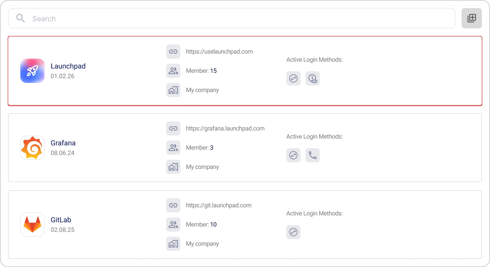
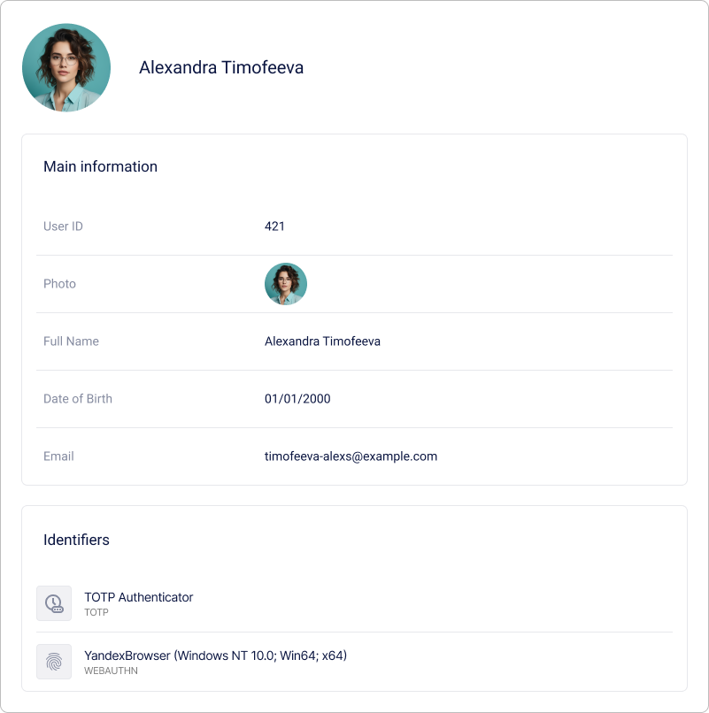

# So erstellen und konfigurieren Sie eine Anwendung in Encvoy ID

In dieser Anleitung erfahren Sie, wie Sie OAuth 2.0- und OIDC-Anwendungen in **Encvoy ID** erstellen und konfigurieren. Wir behandeln im Detail die Erstellung von Web- und nativen Anwendungen, die Konfiguration des Login-Widgets sowie die Benutzer- und Zugriffsverwaltung.

**Inhaltsverzeichnis:**

- [Erstellen einer Anwendung](#creating-application)
- [Verwalten von Anwendungen](#managing-applications)
- [Anwendungseinladungen](#application-invitations)
- [Einstellungen für das Login-Widget der Anwendung](#app-login-widget-settings)
- [Anwendungsbenutzer](#application-users)
- [Vollständige Parameterreferenz](#full-parameters-reference)
- [Siehe auch](#see-also)

> ⚠️ **Einschränkung**: Die Anwendungsverwaltung ist je nach Ihrer Rolle im Administrator-, Organisations- oder Anwendungs-Dashboard (Small Dashboard) verfügbar.

---

## Erstellen einer Anwendung { #creating-application }

### Erstellen einer OAuth-Webanwendung

> **Webanwendung** — eine Standardanwendung, die im Browser des Benutzers läuft und mit **Encvoy ID** über die Protokolle OAuth 2.0 und OpenID Connect interagiert.

Um eine Webanwendung zu erstellen:

1. Gehen Sie zum Administrator-, Organisations- oder Anwendungs-Dashboard.
2. Öffnen Sie den Tab **Anwendungen**.
3. Klicken Sie auf die Schaltfläche **Erstellen** .
4. Das Formular zur Anwendungserstellung wird geöffnet.
5. Geben Sie die erforderlichen [Anwendungsparameter](#full-parameters-reference) an:
   - **Anwendungsname**,
   - **Anwendungsadresse** im Format `protokoll://domain-name:port`,
   - **Redirect-URL #** (`redirect_uris`) — die Adresse, an die der Benutzer nach der Autorisierung weitergeleitet wird,
   - **Logout-URL #** (`post_logout_redirect_uris`) — die Adresse, an die der Benutzer nach dem Abmelden weitergeleitet wird.

6. Klicken Sie auf **Erstellen**.

> 💡 Nach der Erstellung werden zusätzliche Anwendungsfelder generiert, die in den Anwendungseinstellungen eingesehen und bearbeitet werden können:
>
> - **Kennung (client_id)** — dient zur Identifizierung der Anwendung;
> - **Geheimschlüssel (client_secret)** — dient zur Authentifizierung der Identität der Anwendung, wenn diese Zugriff auf das Konto eines Benutzers anfordert. Der geheime Schlüssel darf nur der Anwendung bekannt sein.

### Erstellen einer nativen OAuth-Anwendung

> **Native Anwendung** — eine Anwendung, die speziell für ein bestimmtes Betriebssystem entwickelt wurde.

Um eine native Anwendung zu erstellen:

1. Gehen Sie zum Administrator-, Organisations- oder Anwendungs-Dashboard.
2. Öffnen Sie den Tab **Anwendungen**.
3. Klicken Sie auf die Schaltfläche **Erstellen** .
4. Das Formular zur Anwendungserstellung wird geöffnet.
5. Geben Sie die erforderlichen [Anwendungsparameter](#full-parameters-reference) an:
   - **Anwendungsname**,
   - **Anwendungsadresse** — die lokale Adresse der Anwendung im Format `myapp://callback` (erforderlich zum Abschluss der Erstellung, wird aber in nativen Anwendungen **nicht verwendet**),
   - **Redirect-URL #** (`redirect_uris`) — die lokale Adresse, zu der der Benutzer nach der Autorisierung zurückkehrt, z. B. `myapp://callback`,
   - **Logout-URL #** (`post_logout_redirect_uris`) — die lokale Redirect-Adresse nach dem Logout (z. B. `myapp://logout`).

6. Klicken Sie auf **Erstellen**.
7. Öffnen Sie die erstellte Anwendung und klicken Sie auf **Bearbeiten** .
8. Im sich öffnenden Bearbeitungsformular:
   - Wählen Sie `native` in der Einstellung **Anwendungstyp**;
   - Wählen Sie `none` in den Einstellungen für die Authentifizierungsmethode.

     

9. Speichern Sie die Änderungen.

Konfigurieren Sie anschließend die Autorisierung auf Seiten Ihrer Anwendung:

- Verwenden Sie PKCE (Proof Key for Code Exchange), wenn Sie einen Autorisierungscode anfordern;
- Verwenden Sie die zuvor angegebene `redirect_uri`, um das Autorisierungsergebnis zu verarbeiten;
- Führen Sie den Token-Refresh über das OAuth 2.0-Protokoll durch.

---

## Verwalten von Anwendungen { #managing-applications }

### Anzeigen einer Anwendung { #viewing-application }

1. Gehen Sie zum Administrator-, Organisations- oder Anwendungs-Dashboard.
2. Öffnen Sie den Tab **Anwendungen**.
3. Klicken Sie auf das Panel der Anwendung, deren Profil Sie anzeigen möchten.

4. Das Formular für das Anwendungsprofil wird geöffnet.

### Bearbeiten einer Anwendung { #editing-application }

1. Gehen Sie zum Administrator-, Organisations- oder Anwendungs-Dashboard.
2. Öffnen Sie den Tab **Anwendungen**.
3. Klicken Sie auf das Panel der Anwendung, die Sie bearbeiten möchten.
4. Das Formular zur Anwendungsansicht wird geöffnet.
5. Klicken Sie auf die Schaltfläche **Bearbeiten** .
6. Das Formular zum Bearbeiten der Anwendung wird geöffnet.
7. Nehmen Sie die erforderlichen Änderungen an den [Anwendungsparametern](#full-parameters-reference) vor.
8. Speichern Sie die Änderungen.

### Löschen einer Anwendung

> ⚠️ **Warnung:** Das Löschen einer Anwendung ist ein irreversibler Vorgang. Alle zugehörigen Daten werden aus dem System entfernt.

Um eine Anwendung zu löschen:

1. Gehen Sie zum Administrator-, Organisations- oder Anwendungs-Dashboard.
2. Öffnen Sie den Tab **Anwendungen**.
3. Klicken Sie auf das Panel der Anwendung, die Sie bearbeiten möchten.
4. Das Formular zur Anwendungsansicht wird geöffnet.
5. Klicken Sie auf die Schaltfläche **Löschen** .
6. Bestätigen Sie die Aktion im Modal-Fenster.

Nach der Bestätigung wird die Anwendung aus **Encvoy ID** gelöscht.

---

## Anwendungseinladungen { #application-invitations }

Der Einladungsmechanismus ermöglicht es Ihnen, den Zugriff auf die Anwendung einzuschränken und ihn nur vorab ausgewählten Benutzern zu gewähren. Dies ist nützlich, wenn die Anwendung für einen **geschlossenen Benutzerkreis** bestimmt ist.

### Aktivieren der Zugriffsbeschränkung

Um die Anwendung nur für eingeladene Benutzer verfügbar zu machen:

1. Öffnen Sie das Formular zum Bearbeiten der Anwendung. [So öffnen Sie das Bearbeitungsformular →](#editing-application)
2. Aktivieren Sie die Einstellung **Zugriff für externe Benutzer untersagen**.
3. Speichern Sie die Änderungen.

**Was nach der Aktivierung passiert:**

- Anwendungsmitglieder — können sich wie gewohnt anmelden.
- Nicht eingeladene Benutzer — sehen eine Nachricht über verweigerten Zugriff.
- Neue Benutzer — können sich erst nach Erhalt einer Einladung anmelden.

### Versenden von Einladungen an Benutzer

Um eine Einladung an einen Benutzer zu senden:

1. Öffnen Sie das Formular zur Anwendungsansicht. [So öffnen Sie das Ansichtsformular →](#viewing-application).
2. Klicken Sie auf die Schaltfläche **Einladen**.

3. Geben Sie im sich öffnenden Fenster die E-Mail-Adressen der Benutzer an:
   - Geben Sie die Adresse ein und drücken Sie **Enter** oder klicken Sie auf die Schaltfläche ;
   - Um mehrere Adressen hinzuzufügen, verwenden Sie Trennzeichen: Leerzeichen, Komma `,` oder Semikolon `;`.

   

4. Klicken Sie auf **Senden**.

Eine E-Mail mit einem Link für den schnellen Zugriff auf die Anwendung wird an die angegebenen E-Mail-Adressen gesendet.

> 💡 Einladungen bleiben aktiv, bis sie storniert oder angenommen werden.

### Was Benutzer sehen

Ein Benutzer, der eine Einladung erhält, bekommt eine E-Mail mit einem Link zur Anmeldung in der Anwendung. Die Einladung wird auch im Bereich **Anfragen** des persönlichen Profils des Benutzers angezeigt. Die Einladung kann auf zwei Arten angenommen werden: durch Klicken auf den Link in der E-Mail oder durch Auswahl der Einladung im Bereich "Anfragen" des Profils.

> [So nehmen Sie eine Anwendungseinladung an →](./docs-12-common-personal-profile.md#closed-app-invitations)

Die Einladung ist durch einen Verifizierungsmechanismus geschützt: Sie ist nur für die E-Mail-Adresse gültig, an die sie gesendet wurde. Der Benutzer muss sich mit genau dieser Adresse im System anmelden, um die Einladung anzunehmen. Dies verhindert, dass der Zugriff an Dritte übertragen wird.

Falls der Benutzer noch nicht im System registriert ist, muss er sich mit derselben E-Mail registrieren, an die die Einladung gesendet wurde. Nach erfolgreicher Registrierung wird der Zugriff auf die Anwendung automatisch gewährt.

### Verwalten von Einladungen

#### Anzeigen der Liste der gesendeten Einladungen

1. Öffnen Sie das Formular zur Anwendungsansicht. [So öffnen Sie das Ansichtsformular →](#viewing-application).
2. Erweitern Sie den Bereich **Liste der gesendeten Anwendungseinladungen**.

Für jede Einladung in der Liste wird Folgendes angezeigt:

- E-Mail des Empfängers
- Sendedatum

#### Stornieren einer Einladung

Wenn Sie eine gesendete Einladung widerrufen müssen:

1. Suchen Sie die Einladung in der Liste der gesendeten Einladungen.
2. Klicken Sie auf die Schaltfläche **Löschen**  im Einladungs-Panel.
3. Bestätigen Sie die Stornierung der Einladung.

**Folgen der Stornierung:**

- Der Link in der E-Mail wird ungültig.
- Der Benutzer kann die Einladung nicht mehr annehmen.

---

## Einstellungen für das Login-Widget der Anwendung { #app-login-widget-settings }

Das **Login-Widget** ist das Autorisierungsformular, das Benutzer sehen, wenn sie versuchen, sich bei **dieser spezifischen Anwendung** anzumelden. Seine Einstellungen ermöglichen es Ihnen, das Erscheinungsbild und die Login-Methoden an die Marke und die Bedürfnisse Ihres Dienstes anzupassen.

### So finden Sie die Widget-Einstellungen

1. Öffnen Sie das Formular zum Bearbeiten der Anwendung. [So öffnen Sie das Bearbeitungsformular →](#editing-application)
2. Suchen Sie den Block **Anmeldemethoden** und klicken Sie auf **Konfigurieren**.

Was konfiguriert werden kann:

- **Titel und Cover** — Anpassung an die Marke der Anwendung,
- **Farbschema** — Schaltflächenfarben passend zu Ihrem Design,
- **Anmeldemethoden** — Auswahl der anzuzeigenden Provider,
- **Informationsblöcke** — Hinzufügen von Nutzungsregeln oder Links.

> **📚 Vollständige Anleitung zu allen Einstellungen:**  
> Eine detaillierte Übersicht aller Parameter und Anpassungsmöglichkeiten finden Sie in der [vollständigen Anleitung zur Konfiguration des Login-Widgets →](./docs-06-github-en-providers-settings.md#login-widget-settings).

---

## Anwendungsbenutzer { #application-users }

**Anwendungsbenutzer** (Mitglieder) sind Benutzer des **Encvoy ID**-Systems, die Ihrer Anwendung die Erlaubnis erteilt haben, auf ihre Daten zuzugreifen.

**Wie ein Benutzer zum Mitglied wird:**

1. Der Benutzer greift zum ersten Mal auf Ihre Anwendung zu.
2. Das System leitet ihn zum **Encvoy ID** Login-Widget weiter.
3. Der Benutzer authentifiziert sich und **erteilt die Zustimmung** zum Zugriff auf die angeforderten Daten.
4. Die Anwendung erhält ein Access-Token und der Benutzer wird zur Mitgliederliste hinzugefügt.

**Wo Mitglieder verwaltet werden:**

- **Administrator-Dashboard** — zur Verwaltung aller Dienstanwendungen.
- **Organisations-Dashboard** — für Anwendungen, die zur Organisation gehören.
- **Small Dashboard (Anwendungen)** — zur Verwaltung einer spezifischen Anwendung.

> 💡 **Wichtig:** Die Mitgliederverwaltung erfolgt auf **Anwendungsebene**. Aktionen wirken sich nicht auf das globale **Encvoy ID**-Konto des Benutzers aus, sondern nur auf seine Verbindung zur spezifischen Anwendung.

### Anzeigen von Anwendungsmitgliedern

1. Gehen Sie zum Administrator-, Organisations- oder Anwendungs-Dashboard.
2. Öffnen Sie den Tab **Anwendungen**.
3. Klicken Sie auf das Panel der gewünschten Anwendung.
4. Das Anwendungsprofil mit allgemeinen Informationen wird geöffnet.
5. Suchen Sie im Anwendungsprofil den Bereich für Mitglieder.
6. Klicken Sie auf das Panel des Benutzers, dessen Profil Sie anzeigen möchten.
7. Das Benutzerprofil wird geöffnet und enthält eine Liste der Daten, für die der Benutzer den Zugriff gewährt hat.

### Zuweisen eines Anwendungsadministrators { #assigning-app-administrator }

**Wann dies erforderlich ist:** Um Anwendungsverwaltungsrechte an vertrauenswürdige Benutzer zu delegieren. Anwendungsadministratoren können deren Einstellungen und Benutzer verwalten.

Um einen Anwendungsadministrator zuzuweisen:

1. Gehen Sie zum Administrator-, Organisations- oder Anwendungs-Dashboard.
2. Öffnen Sie den Tab **Anwendungen**.
3. Klicken Sie auf das Anwendungspanel.
4. Das Anwendungsprofil wird geöffnet.
5. Öffnen Sie das Aktionsmenü für den Benutzer, dessen Berechtigungen Sie ändern möchten.

6. Wählen Sie die Aktion **Rechte ändern**.
7. Wählen Sie im erscheinenden Fenster die Berechtigungsstufe **Administrator**.

8. Klicken Sie auf **Speichern**.

Nach dem Speichern der Änderungen werden die Berechtigungen des Benutzers in der Anwendung aktualisiert.

**✅ Was sich ändert:**

- Der Benutzer erhält Zugriff auf das **Small Dashboard** dieser Anwendung.
- Er kann die Anwendungseinstellungen und deren Benutzer verwalten.
- Er erhält keinen Zugriff auf andere Anwendungen oder Organisations-/Diensteinstellungen.

> ⚠️ **Sicherheit:** Weisen Sie Administratorrechte nur vertrauenswürdigen Benutzern zu. Ein Anwendungsadministrator kann andere Benutzer löschen und Integrationseinstellungen ändern.

### Beenden von Benutzersitzungen in der Anwendung

**Wann dies erforderlich ist:** Bei Verdacht auf Kontokompromittierung, Geräteverlust oder um eine Aktualisierung des Access-Tokens zu erzwingen.

Um die Sitzungen eines Benutzers zu beenden:

1. Gehen Sie zum Administrator-, Organisations- oder Anwendungs-Dashboard.
2. Öffnen Sie den Tab **Anwendungen**.
3. Klicken Sie auf das Anwendungspanel.
4. Das Anwendungsprofil wird geöffnet.
5. Öffnen Sie das Aktionsmenü für den Benutzer, dessen Sitzungen Sie beenden möchten.
6. Wählen Sie die Aktion **Sitzungen beenden**.
7. Bestätigen Sie die Aktion im Modal-Fenster.

Nach der Bestätigung werden alle Sitzungen und Token für den Benutzer gelöscht.

**✅ Was nach der Bestätigung passiert:**

- **Alle aktiven Sitzungen** des Benutzers in dieser Anwendung werden beendet.
- **Access-Token** (`access_token`) werden ungültig.
- **Refresh-Token** (`refresh_token`) werden widerrufen.
- Der Benutzer muss sich beim nächsten Zugriff auf die Anwendung **erneut anmelden**.

> 📌 Dieser Vorgang sperrt den Benutzer nicht. Er kann sich erneut autorisieren.

### Entfernen eines Benutzers aus der Anwendung

**Wann dies erforderlich ist:** Wenn ein Benutzer keinen Zugriff mehr auf die Anwendung benötigt, bei Beendigung eines Arbeitsverhältnisses oder auf Wunsch des Benutzers.

Um einen Benutzer aus der Anwendung zu entfernen:

1. Gehen Sie zum Administrator-, Organisations- oder Anwendungs-Dashboard.
2. Öffnen Sie den Tab **Anwendungen**.
3. Klicken Sie auf das Anwendungspanel.
4. Das Anwendungsprofil wird geöffnet.
5. Öffnen Sie das Aktionsmenü für den Benutzer, den Sie aus der Anwendung entfernen möchten.
6. Wählen Sie die Aktion **Benutzer löschen**.
7. Bestätigen Sie die Aktion im Modal-Fenster.

Nach der Bestätigung wird der Benutzer aus der Anwendung entfernt.

**✅ Was nach dem Entfernen passiert:**

- Der Benutzer **verschwindet** aus der Mitgliederliste der Anwendung.
- Alle seine **Access-Token** für diese Anwendung werden widerrufen.
- Beim nächsten Zugriff auf die Anwendung wird ihm **erneut die Zustimmungsanfrage angezeigt**.
- Das **globale Konto** des Benutzers in **Encvoy ID** bleibt unberührt.

### Sperren eines Benutzers in der Anwendung

**Wann dies erforderlich ist:** Für ein vollständiges und dauerhaftes Verbot des Zugriffs eines Benutzers auf die Anwendung ohne Wiederherstellungsmöglichkeit.

**Sperren** ist eine schwerwiegendere Maßnahme als das Entfernen. Ein gesperrter Benutzer kann keinen Zugriff auf die Anwendung mehr erhalten.

Um einen Benutzer zu sperren:

1. Öffnen Sie das Aktionsmenü für einen aktiven Benutzer im [Anwendungsprofil](./docs-10-common-app-settings.md#viewing-application).

2. Wählen Sie die Aktion **In Encvoy ID sperren**.
3. Bestätigen Sie die Aktion im Modal-Fenster.

**Was nach dem Sperren passiert**:

- Der Status des Benutzers ändert sich zu **Gesperrt**.
- Der gesperrte Benutzer kann sich nicht mehr in der Anwendung anmelden.

### Entsperren von Encvoy ID-Benutzern

Um einen Benutzer zu entsperren:

1. Öffnen Sie das Aktionsmenü für einen gesperrten Benutzer im [Anwendungsprofil](./docs-10-common-app-settings.md#viewing-application).
2. Wählen Sie die Aktion **In Encvoy ID entsperren**.
3. Bestätigen Sie die Aktion im Modal-Fenster.

Nach der Bestätigung ändert sich der Status des Benutzers zu **Aktiv**.

---

## Vollständige Parameterreferenz { #full-parameters-reference }

### Basisinformationen

Grundlegende Details für die Anzeige in der Benutzeroberfläche und im Login-Widget.

| Parameter                   | Beschreibung                                                                     | Typ                                                    | Erforderlich |
| --------------------------- | -------------------------------------------------------------------------------- | ------------------------------------------------------ | ------------ |
| **Anwendungsname**          | Wird in der Oberfläche des persönlichen Dashboards und im Login-Widget angezeigt | Text (bis zu 64 Zeichen)                               | ✓            |
| **Anwendungsbeschreibung**  | Kurzbeschreibung, die in der **Encvoy ID**-Dienstoberfläche angezeigt wird       | Text (bis zu 255 Zeichen)                              | ✗            |
| **Anwendungslogo**          | Wird in der **Encvoy ID**-Dienstoberfläche und im Login-Widget angezeigt         | Bild im Format JPG, GIF, PNG, WEBP. Max. Größe - 1 MB. | ✗            |
| **Im Mini-Widget anzeigen** | Fügt die Anwendung zum Mini-Widget für den Schnellzugriff hinzu.                 | Schalter (`Ein`/`Aus`)                                 | -            |

### Katalog

Einstellungen für die Veröffentlichung der Anwendung im [Katalog](./docs-12-common-personal-profile.md#application-catalog).

| Parameter               | Beschreibung                                                                                                                       | Typ                    | Standard |
| ----------------------- | ---------------------------------------------------------------------------------------------------------------------------------- | ---------------------- | -------- |
| **Im Katalog anzeigen** | Fügt die Anwendung zum Katalog hinzu                                                                                               | Schalter (`Ein`/`Aus`) | `Aus`    |
| **Anwendungstyp**       | Kategorie, zu der die Anwendung im **Katalog** gehört.   Die Erstellung von Typen ist dem Dienst-**Administrator** vorbehalten. | Dropdown-Liste         | `Andere` |

### Erforderliche Felder

Benutzerprofilfelder, die für das Funktionieren der Anwendung notwendig sind.

| Parameter              | Beschreibung                                                                                                                                                                                                                                                                                                                                                                                                                                                                     |
| ---------------------- | -------------------------------------------------------------------------------------------------------------------------------------------------------------------------------------------------------------------------------------------------------------------------------------------------------------------------------------------------------------------------------------------------------------------------------------------------------------------------------- |
| **Basis-Profilfelder** | Definiert die Liste der Haupt- und Zusatzfelder des Benutzerprofils, auf die die Anwendung Zugriff benötigt.   - Wenn Felder im Benutzerprofil fehlen, werden sie während der Autorisierung in der Anwendung abgefragt.   - Wenn Felder vorhanden sind, aber auf die [Privatsphäre-Stufe](./docs-12-common-personal-profile.md#privacy-levels) **Nur für Sie sichtbar** gesetzt sind, wird der Benutzer aufgefordert, diese Stufe auf **Auf Anfrage verfügbar** zu ändern. |

### Anwendungsparameter

Technische Parameter, die die Interaktion der Anwendung mit **Encvoy ID** beeinflussen.

#### Haupt-Identifikatoren

| Name                                | Parameter       | Beschreibung                                                              | Typ                                           | Erforderlich          |
| ----------------------------------- | --------------- | ------------------------------------------------------------------------- | --------------------------------------------- | --------------------- |
| **Kennung (client_id)**             | `client_id`     | Eindeutiger Anwendungsidentifikator                                       | Text                                          | Automatisch generiert |
| **Geheimschlüssel (client_secret)** | `client_secret` | Privater Schlüssel des Clients. Muss sicher aufbewahrt werden.            | Text                                          | Automatisch generiert |
| **Anwendungsadresse**               | -               | URL der Webressource, auf der der Login über **Encvoy ID** verwendet wird | Text im Format `protokoll://domain-name:port` | ✓                     |

### Zugriffseinstellungen

| Name                                        | Parameter | Beschreibung                                                                                            | Typ                    | Standard |
| ------------------------------------------- | --------- | ------------------------------------------------------------------------------------------------------- | ---------------------- | -------- |
| **Eingeschränkter Zugriff**                 | -         | Wenn aktiviert, ist der Login in die Anwendung nur für Benutzer mit **Administrator**-Rechten verfügbar | Schalter (`Ein`/`Aus`) | `Aus`    |
| **Zugriff für externe Benutzer untersagen** | -         | Wenn aktiviert, haben nur Mitglieder oder eingeladene Benutzer Zugriff auf die Anwendung                | Schalter (`Ein`/`Aus`) | `Aus`    |

#### Redirect-URL

| Name               | Parameter      | Beschreibung                                                                                                                                                                                                                                                                                                                              | Erforderlich |
| ------------------ | -------------- | ----------------------------------------------------------------------------------------------------------------------------------------------------------------------------------------------------------------------------------------------------------------------------------------------------------------------------------------- | ------------ |
| **Redirect-URL #** | `Redirect_uri` | Die URL, zu der **Encvoy ID** den Benutzer nach der Authentifizierung weiterleitet. Nachdem der Benutzer sich authentifiziert und die Zustimmung erteilt hat, leitet der Server den Benutzer zurück zur **Redirect_uri** mit einem Autorisierungscode, ID-Token oder anderen Informationen, abhängig vom angeforderten **response_type**. | ✓            |

#### Logout-URL

| Name             | Parameter                  | Beschreibung                                                                                                                                              | Erforderlich |
| ---------------- | -------------------------- | --------------------------------------------------------------------------------------------------------------------------------------------------------- | ------------ |
| **Logout-URL #** | `post_logout_redirect_uri` | Die URL, zu der der Dienst den Benutzer nach dem Abmelden weiterleitet. Wenn kein Wert angegeben ist, wird die **Redirect-URL (Redirect_uri)** verwendet. | ✗            |

#### Authentifizierungsanfrage-URL

| Name                                               | Parameter      | Beschreibung                                                                                                                                                                                                                                                                                                                                              | Erforderlich |
| -------------------------------------------------- | -------------- | --------------------------------------------------------------------------------------------------------------------------------------------------------------------------------------------------------------------------------------------------------------------------------------------------------------------------------------------------------- | ------------ |
| **Authentifizierungsanfrage- oder Recovery-URL #** | `request_uris` | Eine Liste von URLs, auf denen JWT-Autorisierungsanfragen gehostet werden. Wenn das System eine Autorisierungsanfrage an den Server sendet, kann es einfach den Parameter `request_uri` angeben, der auf eine der in dieser Liste definierten URLs verweist. Der Server ruft dann das JWT-Anfrageobjekt von dieser URL ab, um die Anfrage zu verarbeiten. | ✗            |

#### Antworttypen (Response Types)

| Name                              | Parameter        | Beschreibung                                                                                                                                                                                                                                                                                                                                                                                                                                                                                                           |
| --------------------------------- | ---------------- | ---------------------------------------------------------------------------------------------------------------------------------------------------------------------------------------------------------------------------------------------------------------------------------------------------------------------------------------------------------------------------------------------------------------------------------------------------------------------------------------------------------------------- |
| **Antworttypen (response_types)** | `response_types` | 
Definiert, welche Token an den Client zurückgegeben werden.
 
 - `code` — nur Autorisierungscode;  - `id_token` — nur ID-Token;   - `code id_token` — Code und ID-Token;   - `code token` — Autorisierungscode und Access-Token;   - `code id_token token` — vollständiger Satz;   - `none` — wird verwendet, wenn kein Autorisierungscode, Access-Token oder ID-Token über eine Weiterleitung erforderlich ist. Nützlich zur Bestätigung der Benutzerauthentifizierung ohne Datenzugriff. 
 |

#### Grant-Typen

| Name                                 | Parameter     | Beschreibung                                                                                                                                                                                                                                                                                  |
| ------------------------------------ | ------------- | --------------------------------------------------------------------------------------------------------------------------------------------------------------------------------------------------------------------------------------------------------------------------------------------- |
| **Berechtigungstypen (grant_types)** | `grant_types` | 
Methode zum Erhalt der Autorisierung für den Zugriff auf geschützte Ressourcen.
 
 - `authorization code` — Standard- und sichere Methode;   - `implicit` — veraltete Option ohne serverseitigen Austausch;   - `refresh_token` — Token-Erneuerung ohne erneutes Anmelden. 
 |

#### Authentifizierungsmethoden

| Name                                                                                               | Parameter                            | Beschreibung                                                                                                                                                                                                                                                                                                                                                                                                                                                                                                                                                                                                                                                                                                                                                                                                                                                                                                                                                                                                     |
| -------------------------------------------------------------------------------------------------- | ------------------------------------ | ---------------------------------------------------------------------------------------------------------------------------------------------------------------------------------------------------------------------------------------------------------------------------------------------------------------------------------------------------------------------------------------------------------------------------------------------------------------------------------------------------------------------------------------------------------------------------------------------------------------------------------------------------------------------------------------------------------------------------------------------------------------------------------------------------------------------------------------------------------------------------------------------------------------------------------------------------------------------------------------------------------------- |
| **Authentifizierungsmethode des Clients für den Token-Endpunkt (token_endpoint_auth_method)**      | `token_endpoint_auth_method`         | 
Methode, die der Client zur Authentifizierung beim Zugriff auf den `token endpoint` des Servers verwendet.
 
 - `none` - stellt keine Anmeldedaten bereit. Wird verwendet, wenn der Client Anmeldedaten nicht vertraulich speichern kann oder keine Authentifizierung erforderlich ist;   - `client_secret_post` - sendet Anmeldedaten im Body der Anfrage;   - `client_secret_basic` - verwendet HTTP Basic Authentication und sendet Anmeldedaten im Header der Anfrage;   - `client_secret_jwt` - signiert ein JWT mit seinem Secret und sendet es als Anmeldedaten;   - `private_key_jwt` - signiert ein JWT mit seinem privaten Schlüssel und sendet es als Anmeldedaten. 
 Die Wahl hängt von den Sicherheitsanforderungen und der Fähigkeit des Clients ab, Anmeldedaten sicher zu speichern. Zum Beispiel bieten `client_secret_jwt` und `private_key_jwt` höhere Sicherheit durch asymmetrische Verschlüsselung und vermeiden die Übertragung von Secrets über das Netzwerk. 
 |
| **Authentifizierungsmethode für den Introspektions-Endpunkt (introspection_endpoint_auth_method)** | `introspection_endpoint_auth_method` | 
Methode, die der Client beim Zugriff auf den `introspection endpoint` verwendet. Dieser Endpunkt dient dazu, den Status eines Access-Tokens zu prüfen und Informationen darüber abzurufen.
 
 - `none` - keine Anmeldedaten bereitgestellt;   - `client_secret_post` - Anmeldedaten im Body der Anfrage;   - `client_secret_basic` - HTTP Basic Authentication;   - `client_secret_jwt` - signiert ein JWT mit seinem Secret;   - `private_key_jwt` - signiert ein JWT mit seinem privaten Schlüssel. 
 Die Wahl hängt von den Sicherheitsanforderungen und den Client-Fähigkeiten ab. JWT-basierte Methoden bieten zusätzliche Sicherheit durch signierte Token. 
                                                                                                                                                                                                                                                                                                                     |
| **Authentifizierungsmethode für den Widerrufs-Endpunkt (revocation_endpoint_auth_method)**         | `introspection_endpoint_auth_method` | 
Definiert die Authentifizierungsmethode beim Zugriff auf den `revocation endpoint`. Dieser Endpunkt wird verwendet, um Access- oder Refresh-Token zu widerrufen. Diese Methode entspricht normalerweise denen für den `token endpoint` und `introspection endpoint`.
 
- `none` - keine Anmeldedaten bereitgestellt;  - `client_secret_post` - Anmeldedaten im Body der Anfrage;   `client_secret_basic` - HTTP Basic Authentication;  - `client_secret_jwt` - signiert ein JWT mit seinem Secret; - `private_key_jwt` - signiert ein JWT mit seinem privaten Schlüssel.
                                                                                                                                                                                                                                                                                                                                                                                                                 |

#### ID-Token-Signaturalgorithmus

| Name                                                                    | Parameter                      | Beschreibung                                                                                                                                                                         |
| ----------------------------------------------------------------------- | ------------------------------ | ------------------------------------------------------------------------------------------------------------------------------------------------------------------------------------ |
| **Signaturalgorithmus für das ID-Token (id_token_signed_response_alg)** | `id_token_signed_response_alg` | Gibt den Algorithmus an, der zum Signieren des ID-Tokens verwendet wird. Ein **ID-Token** ist ein JSON Web Token (JWT), das Claims über die Authentifizierung des Benutzers enthält. |

#### Authentifizierungszeitpunkt anfordern

| Name                                                             | Parameter           | Beschreibung                                                                                                                                                                                                                            |
| ---------------------------------------------------------------- | ------------------- | --------------------------------------------------------------------------------------------------------------------------------------------------------------------------------------------------------------------------------------- |
| **Prüfung des Authentifizierungszeitpunkts (require_auth_time)** | `require_auth_time` | Gibt an, ob der Autorisierungsserver den Authentifizierungszeitpunkt des Benutzers im ID-Token angeben muss. Wenn aktiviert, fügt der Server den `auth_time`-Claim ein, der angibt, wann der Benutzer sich zuletzt authentifiziert hat. |

#### Subjekttyp (Subject Type)

| Name                                                           | Parameter      | Beschreibung                                                                                                                                                                                                                                                                                                                                                                                                                                                                    |
| -------------------------------------------------------------- | -------------- | ------------------------------------------------------------------------------------------------------------------------------------------------------------------------------------------------------------------------------------------------------------------------------------------------------------------------------------------------------------------------------------------------------------------------------------------------------------------------------- |
| **Art der Benutzer-ID-Übertragung im ID-Token (subject_type)** | `subject_type` | 
Definiert, wie der Benutzeridentifikator (`sub claim`) dem Client präsentiert wird. Dies beeinflusst, wie Benutzer-IDs generiert und verwaltet werden.
 
 - `public` - die Benutzer-ID ist für alle Clients gleich. Jeder Client sieht denselben `sub claim` für den Benutzer;   - `pairwise` - die Benutzer-ID ist für jeden Client eindeutig. Dies bietet mehr Privatsphäre, da verschiedene Clients Benutzeraktivitäten nicht miteinander verknüpfen können. 
 |

#### Anwendungstyp

| Name                                 | Parameter          | Beschreibung                                                                                                                                                                                              |
| ------------------------------------ | ------------------ | --------------------------------------------------------------------------------------------------------------------------------------------------------------------------------------------------------- |
| **Anwendungstyp (application_type)** | `application_type` | 
Definiert die Plattform, für die die Anwendung bestimmt ist:
 
 - `web` - Webanwendung, die in einem Browser läuft;   - `native` - native Anwendung, die auf einem Gerät installiert ist. 
 |

#### Access-Token

| Name                                | Parameter          | Beschreibung                               |
| ----------------------------------- | ------------------ | ------------------------------------------ |
| **Access Token (access_token_ttl)** | `access_token_ttl` | Lebensdauer des `access_token` in Sekunden |

#### Refresh-Token

| Name                                  | Parameter           | Beschreibung                                |
| ------------------------------------- | ------------------- | ------------------------------------------- |
| **Refresh Token (refresh_token_ttl)** | `refresh_token_ttl` | Lebensdauer des `refresh_token` in Sekunden |

---

## Siehe auch { #see-also }

- [Verwalten von Organisationen](./docs-09-common-mini-widget-settings.md) — Anleitung zur Arbeit mit Organisationen im **Encvoy ID**-System.
- [Persönliches Profil und Verwaltung von Anwendungsberechtigungen](./docs-12-common-personal-profile.md) — Anleitung zur Verwaltung Ihres persönlichen Profils.
- [Login-Methoden und Konfiguration des Login-Widgets](./docs-06-github-en-providers-settings.md) — Anleitung zu Login-Methoden und zur Konfiguration des Login-Widgets.
