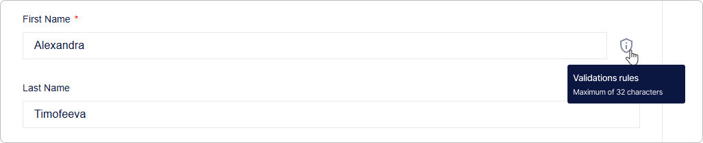
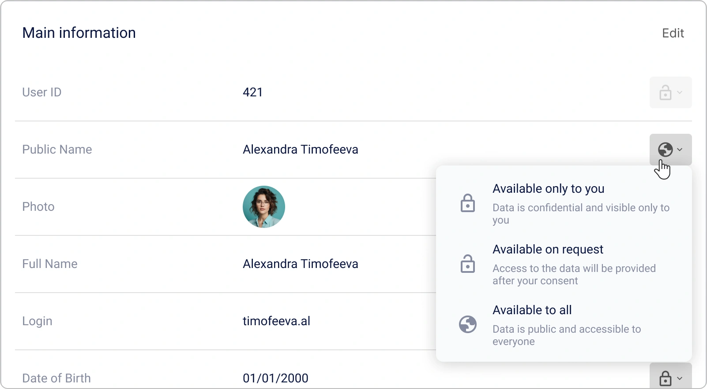
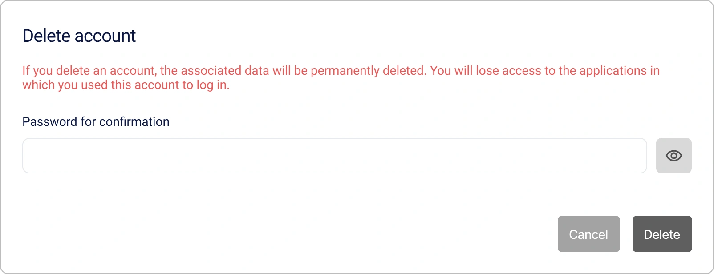
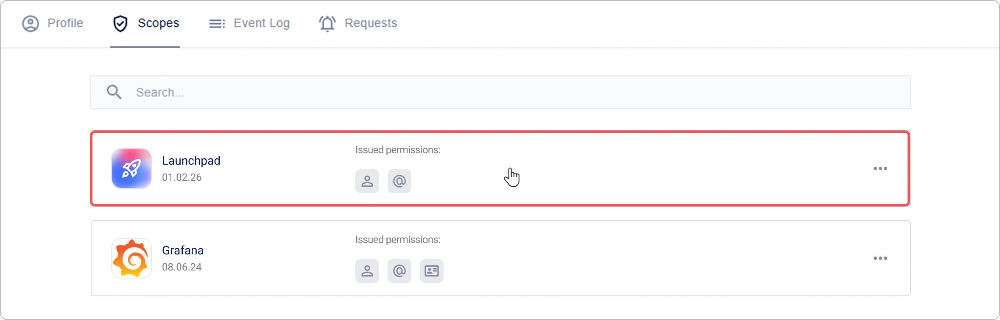
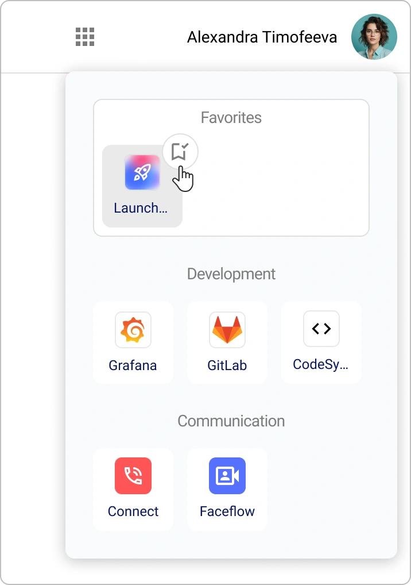

# So verwalten Sie Ihr persönliches Encvoy ID-Profil

**Das Encvoy ID-Profil** ist Ihre Zentrale für Kontodaten und Sicherheit.

In dieser Anleitung erfahren Sie, wie Sie Ihr persönliches Profil in **Encvoy ID** verwalten: Daten und Privatsphäre-Einstellungen bearbeiten, Ihr Passwort aktualisieren, den Anwendungszugriff steuern, das Aktivitätenprotokoll einsehen und Profildaten exportieren.

**Inhaltsverzeichnis:**

- [Verwaltung des persönlichen Profils](#personal-profile-management)
- [App-Berechtigungen und OAuth-Zugriff](#app-permissions-and-oauth)
- [Einladungen zu geschlossenen Apps](#closed-app-invitations)
- [Anwendungskatalog](#application-catalog)
- [Aktivitätenprotokoll und Login-Verlauf](#activity-log-and-login-history)
- [Siehe auch](#see-also)

---

## Verwaltung des persönlichen Profils { #personal-profile-management }

Ihr Profil enthält grundlegende Informationen zur Identifizierung innerhalb des Systems. Je nach Registrierungsmethode können einige Felder nicht bearbeitet werden. Wenn Sie diese bearbeiten müssen, wenden Sie sich an den Systemadministrator.

### Persönliche Informationen ändern

1. Gehen Sie zu Ihrem **Profil**.
2. Klicken Sie auf **Bearbeiten** im Block **Basisinformationen**.


3. Nehmen Sie die erforderlichen Änderungen im sich öffnenden Formular vor.

   > 💡 Für einige Felder sind Validierungsregeln festgelegt. Bitte seien Sie vorsichtig bei Änderungen.
   >
   > 

4. Klicken Sie auf **Speichern**.

> 📌 **Wichtig:** Das Profil kann auch mit leeren Pflichtfeldern gespeichert werden. Das System wird die fehlenden Daten bei Ihrer nächsten Anmeldung anfordern.

### Ein Profilfoto hinzufügen

Sie können ein Foto von Ihrem Gerät hochladen oder einen Avatar von verknüpften externen Diensten verwenden.

1. Gehen Sie zu Ihrem **Profil**.
2. Klicken Sie auf **Bearbeiten** im Block **Basisinformationen**.
3. Das Bearbeitungsformular öffnet sich.
4. Fügen Sie ein Foto mit einer der folgenden Methoden hinzu:
   - Klicken Sie auf die Schaltfläche **Hochladen** und geben Sie den Pfad zur Fotodatei an,

       

   - Klicken Sie auf die Schaltfläche **Verfügbar** und wählen Sie ein Foto aus einem externen System aus.

       

   > 📌 Wenn im Profil keine verknüpften externen System-IDs mit einem Foto vorhanden sind, wird die Schaltfläche **Verfügbar** ausgeblendet.

   > 💡 **Tipp**: Um ein Foto zu löschen, klicken Sie auf die Schaltfläche **Löschen** im Block **Profilbild**.

5. Klicken Sie im Bearbeitungsformular auf **Speichern**.

### Eine E-Mail-Adresse hinzufügen

> 💡 E-Mail erfordert eine Verifizierung — Eingabe eines Einmalcodes oder Klicken auf einen Link in der E-Mail.

1. Gehen Sie zu Ihrem **Profil**.
2. Suchen Sie den Block **Kontakte** und klicken Sie auf **Bearbeiten** im Panel **E-Mail**.


3. Das Formular zum Hinzufügen öffnet sich.


4. Geben Sie die E-Mail-Adresse ein und klicken Sie auf **Code anfordern**.

   Ein Bestätigungscode wird an die angegebene Adresse gesendet.

5. Geben Sie den Code ein und klicken Sie auf **Bestätigen**, oder folgen Sie dem Link in der E-Mail.

> 💡 **Tipp**: Um eine E-Mail zu löschen, klicken Sie auf die Schaltfläche **Löschen** im Panel **E-Mail**.

### Eine Telefonnummer hinzufügen

> 💡 Die Telefonnummer erfordert eine Verifizierung — Eingabe eines Einmalcodes aus einer SMS oder einem eingehenden Anruf.

1. Gehen Sie zu Ihrem **Profil**.
2. Suchen Sie den Block **Kontakte** und klicken Sie auf **Bearbeiten** im Panel **Telefonnummer**.


3. Das Bearbeitungsformular öffnet sich.


4. Geben Sie die Nummer ein und klicken Sie auf **Code anfordern**.

   Eine SMS oder ein Anruf erfolgt an die angegebene Nummer.

5. Geben Sie den Bestätigungscode ein und klicken Sie auf **Bestätigen**.

> 💡 **Tipp**: Um eine Telefonnummer zu löschen, klicken Sie auf die Schaltfläche **Löschen** im Panel **Telefonnummer**.

### Passwort ändern

1. Gehen Sie zu Ihrem **Profil**.
2. Klicken Sie auf **Bearbeiten** im Block **Sicherheit**.


3. Geben Sie im sich öffnenden Fenster das aktuelle Passwort und das neue Passwort an.


Nach dem Ändern des Passworts werden Sie abgemeldet. Um weiterzuarbeiten, müssen Sie sich mit dem neuen Passwort erneut anmelden.

### Privatsphäre-Einstellungen { #privacy-settings }

Sie können selbst steuern, welche Informationen für andere Benutzer oder Drittsysteme verfügbar sind. Dies geschieht über die Privatsphäre-Einstellungen der Felder.

Diese Einstellung ermöglicht es Ihnen, die Privatsphäre für jedes Feld in den Blöcken **Basisinformationen**, **Zusätzliche Informationen** und **Identifikatoren** festzulegen.

#### Privatsphäre-Stufen { #privacy-levels }

| Stufe                     | Icon                                                                                                 | Beschreibung                                                                                                                                   |
| ------------------------- | ---------------------------------------------------------------------------------------------------- | ---------------------------------------------------------------------------------------------------------------------------------------------- |
| **Nur für Sie sichtbar**  |                   | Daten werden nicht an Drittsysteme übertragen und sind nur für Sie verfügbar.                                                                  |
| **Auf Anfrage verfügbar** |  | Daten sind in Drittsystemen verfügbar, die mit Encvoy ID integriert sind. <br> Ihre Zustimmung ist erforderlich, um auf die Daten zuzugreifen. |
| **Öffentlich verfügbar**  |         | Daten sind immer öffentlich. Ihre Zustimmung ist für den Zugriff nicht erforderlich.                                                           |

#### So konfigurieren Sie die Feld-Privatsphäre

1. Gehen Sie zu Ihrem **Profil**.
2. Klicken Sie auf die Schaltfläche für Privatsphäre-Einstellungen neben dem Feld.
3. Wählen Sie die gewünschte Stufe aus.



Je nach gewähltem Wert wird der Feldwert im Profil öffentlich oder privat.

Die Einstellung wird ohne zusätzliche Bestätigung übernommen.

### Verwalten von Identifikatoren externer Dienste { #external-service-identifiers }

**Identifikatoren** sind externe Dienste, die Sie Ihrem Profil hinzugefügt haben oder über die Sie sich jemals bei Anwendungen oder dem persönlichen Konto angemeldet haben.

Die Liste der zur Hinzufügung verfügbaren Identifikatoren im Profil wird aus den öffentlichen Login-Methoden gebildet, die im **Encvoy ID**-Dashboard erstellt wurden.

> 🔍 Identifikatoren, die zur Verknüpfung verfügbar sind, werden im Administrator-Dashboard konfiguriert.

> 💡 Sie können sich bei Anwendungen mit Identifikatoren anmelden, sofern diese dem Login-Widget hinzugefügt wurden.

#### Einen neuen Identifikator hinzufügen

1. Gehen Sie zu Ihrem **Profil**.
2. Klicken Sie auf **Hinzufügen** im Block **Identifikatoren**.


3. Wählen Sie im sich öffnenden Fenster einen externen Dienst aus.


4. Schließen Sie die Authentifizierung im Dienst ab.

   Nach einer erfolgreichen Anmeldung beim Konto des externen Dienstes wird der Identifikator mit dem Profil verknüpft.

> 💡 **Tipp**: Wenn ein Identifikator eines externen Dienstes bereits mit einem anderen Benutzer verknüpft ist, müssen Sie ihn aus dem Profil dieses Benutzers entfernen und dann mit dem neuen Konto verknüpfen.

#### Einen Identifikator löschen

1. Gehen Sie zu Ihrem **Profil**.
2. Klicken Sie auf den Identifikator, den Sie löschen möchten.
3. Wählen Sie die Aktion **Löschen**.


Der Identifikator wird **sofort** aus dem Profil entfernt.

### Konfiguration des öffentlichen Profils

Das **öffentliche Profil** besteht aus öffentlichen Daten, die für andere Mitglieder des **Encvoy ID**-Systems und verbundene Anwendungen einsehbar sind. Es ermöglicht Ihnen zu steuern, welche Benutzerinformationen für andere sichtbar sind, ohne vollen Kontozugriff zu gewähren.

#### Öffentliches Profil ansehen

1. Gehen Sie zu Ihrem **Profil**.
2. Klicken Sie auf die Schaltfläche **Öffentliche Daten** im Block **Profil-Privatsphäre**.
3. Ein Fenster öffnet sich mit dem öffentlichen Profil, das Daten mit der Stufe **Öffentlich verfügbar** enthält.

#### Daten des öffentlichen Profils herunterladen

> 📌 Daten des öffentlichen Profils werden im **vCard**-Format exportiert.

1. Gehen Sie zu Ihrem **Profil**.
2. Klicken Sie auf die Schaltfläche **Öffentliche Daten** im Block **Profil-Privatsphäre**.
3. Das Fenster **Öffentliches Profil** öffnet sich mit den auf die Stufe **Öffentlich verfügbar** gesetzten Daten.
4. Klicken Sie auf die Schaltfläche **vCard exportieren** .
5. Der Dateidownload startet.

Beispiel einer **vCard**-Datei mit Daten des öffentlichen Profils:

```VCARD
BEGIN:VCARD
VERSION:3.0
FN:Timofeeva Alex
N:Timofeeva;Alex;;;
PHOTO:https://service-adress/public/images/profile/90211313d753e1d1b83ab19ecfd4af5e
EMAIL:timofeeva-alexs@gmail.com
UID:null
REV:2025-05-26T12:52:24.630Z
END:VCARD
```

#### Öffentliches Profil deaktivieren

> 💡 **Tipp**: Sie können die Übertragung von Daten des öffentlichen Profils untersagen, die die Privatsphäre-Stufe „Für jeden verfügbar“ haben.

1. Gehen Sie zu Ihrem **Profil**.
2. Aktivieren Sie den Schalter **Privates Profil** im Block **Profil-Privatsphäre**.

   

   Die Einstellung wird ohne zusätzliche Bestätigung übernommen.

Nach Aktivierung der Einstellung werden Daten mit der Privatsphäre-Stufe „Für jeden verfügbar“ nur noch auf Anfrage verfügbar.

### Digitale Visitenkarte des persönlichen Profils { #digital-business-card }

> 🔬 **Experimentelles Feature**: Die Verfügbarkeit wird vom Systemadministrator geregelt.

**Die Encvoy ID-Visitenkarte** ist ein moderner digitaler Ersatz für eine Papier-Visitenkarte, erreichbar über einen einzigartigen Link.

**Inhalt der Visitenkarte:**

- Profilfoto,
- Vor- und Nachname,
- Kontaktdaten (E-Mail, Telefon),
- Geburtsdatum.

**Funktionen:**

- Daten werden unabhängig von den [Privatsphäre-Einstellungen](#privacy-settings) angezeigt.
- Die Visitenkarte ist über einen einzigartigen Link verfügbar: `https://<ihr-service>/api/cards/<identifikator>`.
- Unterstützt den Visitenkarten-Export im **vCard**-Format zur Integration in verschiedene Anwendungen.

#### Aktivität der Visitenkarte

Für die Visitenkarte ist eine Aktivitätseinstellung verfügbar.

1. Gehen Sie zu Ihrem **Profil**.
2. Aktivieren Sie im Block **Visitenkarte** den Schalter **Aktivität**.

   

   Stellen Sie sicher, dass Ihre Visitenkarte nun erreichbar ist. Folgen Sie dazu dem Link: `https://<ihre-domain>/api/cards/<identifikator>`:

#### Konfiguration einer personalisierten Link-Adresse

Um den Visitenkarten-Link kürzer und leichter merkbar zu machen, können Sie Ihren eigenen einzigartigen Identifikator festlegen.

1. Gehen Sie zu Ihrem **Profil**.
2. Geben Sie im Block **Visitenkarte** einen neuen Identifikator an.
3. Klicken Sie auf **Speichern**.

> 💡 Der Identifikator muss im System eindeutig sein und darf nur lateinische Buchstaben, Zahlen und Bindestriche enthalten.

#### So teilen Sie eine Visitenkarte

1. Gehen Sie zu Ihrem **Profil**.
2. Im Block **Visitenkarte**:
   - Klicken Sie auf **QR-Code öffnen**  und scannen Sie den Code mit der Kamera Ihres Geräts.
   - Klicken Sie auf die Schaltfläche **Link kopieren** , um die Link-Adresse der Visitenkarte zu kopieren.

### Zusätzliche Aktionen im persönlichen Profil

#### Alle Sitzungen beenden

Die Funktion zum erzwungenen Beenden aller aktiven Sitzungen ist ein wichtiges Sicherheitswerkzeug. Verwenden Sie sie bei Geräteverlust, Verdacht auf Kontokompromittierung oder um Zugriffstoken sofort zu aktualisieren.

> 📌 Dieser Vorgang macht sofort alle Zugriffs- und Refresh-Token ungültig und beendet ALLE aktuellen Sitzungen in allen Anwendungen.

So beenden Sie alle aktiven Sitzungen:

1. Gehen Sie zu Ihrem **Profil**.
2. Erweitern Sie den Block **Weitere Aktionen** und wählen Sie **Von allen Geräten abmelden**.

Danach müssen Sie sich auf allen Geräten **erneut anmelden**.

#### Herunterladen persönlicher Profildaten

**Encvoy ID** ermöglicht es Ihnen, alle Profildaten im JSON-Format zu exportieren.

Diese Datei enthält alle Informationen zu Ihrem Profil in **Encvoy ID** sowie Details zu externen Konten, die Sie als Login-Methoden hinzugefügt haben, unabhängig davon, ob der Privatsphäre-Parameter für sie gesetzt ist.

So laden Sie Profildaten herunter:

1. Gehen Sie zu Ihrem **Profil**.
2. Erweitern Sie den Block **Weitere Aktionen** und wählen Sie die Aktion **Daten herunterladen**.
3. Der Download der JSON-Datei startet automatisch.

#### Richtlinie zur Verarbeitung personenbezogener Daten

Lesen Sie das Dokument darüber, wie **Encvoy ID** Ihre Daten verarbeitet.

So lesen Sie die Richtlinie:

1. Gehen Sie zu Ihrem **Profil**.
2. Erweitern Sie den Block **Weitere Aktionen** und wählen Sie **Richtlinie zur Verarbeitung personenbezogener Daten**.
3. Der Download der Richtliniendatei startet.

### Kontolöschung und Wiederherstellung

Die Kontolöschung in **Encvoy ID** ist ein unumkehrbarer Vorgang, nach dem es unmöglich ist, Daten wiederherzustellen. Das System verwendet einen Mechanismus zur verzögerten Löschung: Ihr Konto wird zur Löschung markiert, bleibt aber für einen bestimmten Zeitraum zur Wiederherstellung verfügbar. Dies dient dem Schutz vor versehentlichem Löschen und gibt Ihnen Zeit, Ihre Meinung zu ändern.

So löschen Sie ein Konto:

1. Gehen Sie zu Ihrem **Profil**.
2. Erweitern Sie den Block **Weitere Aktionen** und wählen Sie die Aktion **Konto löschen**.
3. Geben Sie im sich öffnenden Fenster Ihr Kontopasswort ein, um die Aktion zu bestätigen, und klicken Sie auf **Löschen**.



**Was passiert:**

- Das Konto wird zur Löschung markiert
- Sie werden automatisch abgemeldet
- Die Kontowiederherstellung ist für einen bestimmten Zeitraum möglich

Für einen bestimmten Zeitraum nach der Kontolöschung haben Sie die Möglichkeit, den Zugriff darauf wiederherzustellen. Dazu müssen Sie sich erneut im persönlichen **Encvoy ID**-Konto anmelden und dann auf **Konto wiederherstellen** klicken.

> 💡 Die Kontowiederherstellung ist nur bei der Anmeldung im persönlichen **Encvoy ID**-Konto verfügbar. Bei der Anmeldung an einer Anwendung über den **Encvoy ID**-Dienst ist die Kontowiederherstellung nicht verfügbar.

---

## App-Berechtigungen und OAuth-Zugriff { #app-permissions-and-oauth }

**Berechtigungen** sind die Rechte, die Sie externen Anwendungen gewähren, um auf bestimmte Daten in Ihrem **Encvoy ID**-Profil zuzugreifen. Sie können den Zugriff einschränken, aktive Sitzungen beenden oder Berechtigungen jederzeit vollständig widerrufen.

Alle Anwendungen, die Zugriff auf Ihre Daten haben, werden im **Profil** auf dem Tab **Berechtigungen** angezeigt.

### Zu einer App aus der Berechtigungsliste navigieren

Um schnell eine Anwendung zu öffnen, der Sie zuvor Zugriff gewährt haben:

1. Gehen Sie zu Ihrem **Profil** → Tab **Berechtigungen**.



2. Klicken Sie auf den **Anwendungsnamen** in der Liste.
3. Sie werden automatisch zur ausgewählten Anwendung weitergeleitet.

### Aktive App-Sitzungen beenden

Wenn Sie sofort alle Sitzungen in einer bestimmten Anwendung beenden möchten:

1. Gehen Sie zu Ihrem **Profil** → Tab **Berechtigungen**.
2. Öffnen Sie das Aktionsmenü für die Anwendung, in der Sie Sitzungen beenden müssen.
3. Wählen Sie die Aktion **Sitzungen beenden**.


4. Bestätigen Sie die Aktion im Modal-Fenster.

**Was wird passieren:** Alle aktiven Sitzungen in dieser Anwendung werden beendet. Beim nächsten Zugriff auf die Anwendung ist eine **erneute Autorisierung** erforderlich.

Das Beenden von Sitzungen ist nützlich, wenn Sie unbefugten Zugriff vermuten oder die Anwendung auf einem gemeinsam genutzten Gerät verwendet haben.

### App-Berechtigungen widerrufen

Um einer Anwendung den Zugriff auf Ihre Daten vollständig zu untersagen:

1. Gehen Sie zu Ihrem **Profil** → Tab **Berechtigungen**.
2. Öffnen Sie das Aktionsmenü für die Anwendung, deren Berechtigungen Sie widerrufen möchten.
3. Wählen Sie die Aktion **Berechtigung widerrufen**.
4. Bestätigen Sie die Aktion im Modal-Fenster.

**Folgen:** Die Anwendung **verliert den Zugriff** auf alle Ihre Profildaten. Bei der nächsten Anmeldung wird das System eine **neue Zustimmung** für den Zugriff anfordern.

---

## Einladungen zu geschlossenen Apps { #closed-app-invitations }

Eine **Einladung** ist ein Weg, Zugriff auf eine geschlossene Anwendung zu erhalten. Der Anwendungsadministrator sendet eine Einladung an Ihre E-Mail, woraufhin Sie sich bei der Anwendung anmelden können, die für andere Benutzer nicht verfügbar ist.

### Wie erhalte ich eine Einladung?

Eine Einladung kommt auf zwei Wegen an:

1. **Per E-Mail**: Sie erhalten eine E-Mail mit einer Einladung und einem Link für den schnellen Zugriff auf die Anwendung.
2. **In Ihrem Encvoy ID-Profil**: Eine neue Einladung erscheint im Bereich **Anfragen**.

### Wie nehme ich eine Einladung an?

Sie können eine Einladung auf jedem bequemen Weg annehmen.

#### Methode 1: Einladung aus der E-Mail annehmen

1. Öffnen Sie die Einladungs-E-Mail.
2. Klicken Sie auf den Link in der E-Mail.
3. Dann sind zwei Optionen möglich:
   - Wenn Sie bereits im System angemeldet sind — gelangen Sie sofort in die Anwendung;
   - Wenn Sie nicht angemeldet sind — melden Sie sich im System an.

> 🔐 Sie müssen sich **mit dem Konto** anmelden, das mit der in der Einladung angegebenen E-Mail verknüpft ist.

#### Methode 2: Einladung aus dem Profil annehmen

1. Gehen Sie zu Ihrem **Profil** → Tab **Anfragen**.
2. Suchen Sie die gewünschte Einladung in der Liste.
3. Klicken Sie auf die Schaltfläche **Annehmen**.


Danach wird der Zugriff auf die Anwendung aktiviert, und Sie können zu ihr navigieren.

#### Wenn Sie noch kein Konto haben

Wenn Sie eine Einladung erhalten haben, aber noch nicht im **Encvoy ID**-System registriert sind:

1. Folgen Sie dem Link aus der Einladungs-E-Mail.
2. Registrieren Sie sich im **Encvoy ID**-System.
3. Geben Sie bei der Registrierung dieselbe E-Mail-Adresse an, an die die Einladung gesendet wurde.
4. Nach Abschluss der Registrierung erhalten Sie automatisch Zugriff auf die Anwendung.

---

## Anwendungskatalog { #application-catalog }

> 🔬 **Experimentelles Feature**: Die Verfügbarkeit wird vom Systemadministrator geregelt.

### Was ist der Katalog?

**Der Katalog** ist ein zentraler Marktplatz für alle Anwendungen, die im **Encvoy ID**-Ökosystem verfügbar sind.

Der Katalog bringt alle öffentlichen Anwendungen an einem Ort zusammen und ermöglicht es Ihnen, die benötigten Apps schnell zu finden, Namen und Beschreibungen einzusehen und auf Anwendungen zuzugreifen, ohne sich komplexe Links oder Pfade merken zu müssen.

Zur besseren Übersicht sind alle Anwendungen im Katalog nach Typ unterteilt.

Anwendungen aus dem Katalog können zu den Favoriten hinzugefügt werden. Für den schnellen Zugriff werden alle Favoriten-Anwendungen in der linken Seitenleiste angezeigt.

### Wie verwende ich Apps aus dem Katalog?

1. Klicken Sie auf die Schaltfläche .
2. Ein Fenster mit einer Liste der dem Katalog hinzugefügten Anwendungen öffnet sich.


3. Wählen Sie die gewünschte Anwendung im Katalog aus.
4. Sie werden automatisch zur Anwendungsseite weitergeleitet.
5. Authentifizieren Sie sich in der Anwendung mit **Encvoy ID** und gewähren Sie der Anwendung Zugriff auf Ihre Daten.

Jetzt können Sie sich mit Ihrem **Encvoy ID**-Profil bei der Anwendung anmelden.

### Aktionen im Katalog

#### Eine App zu Favoriten hinzufügen

1. Klicken Sie auf die Schaltfläche **Anwendungskatalog** .
2. Ein Fenster mit einer Liste der dem Katalog hinzugefügten Anwendungen öffnet sich.
3. Klicken Sie auf die Schaltfläche  neben der Anwendung, die Sie zu den Favoriten hinzufügen möchten.

   Die Anwendung wird zu den Favoriten hinzugefügt und in der entsprechenden Gruppe angezeigt.

   

#### Eine App aus den Favoriten entfernen

1. Klicken Sie auf die Schaltfläche **Anwendungskatalog** .
2. Ein Fenster mit einer Liste der dem Katalog hinzugefügten Anwendungen öffnet sich.
3. Klicken Sie auf die Schaltfläche  neben der Anwendung, die Sie aus den Favoriten entfernen möchten.

Die Anwendung wird aus den Favoriten entfernt und verschwindet aus dem Seitenmenü.

---

## Aktivitätenprotokoll und Login-Verlauf { #activity-log-and-login-history }

**Das Aktivitätenprotokoll** ist ein Sicherheitswerkzeug, mit dem Sie verfolgen können, wo und von welchen Geräten aus Sie sich bei **Encvoy ID** oder Anwendungen angemeldet haben.

### Ereignisdetails

Detaillierte Informationen sind für jedes Ereignis verfügbar.

| Parameter             | Inhalt                              |
| --------------------- | ----------------------------------- |
| **Ereignis-Header**   | Aktionskategorie                    |
| **Datum und Uhrzeit** | Genaue Zeitstempel                  |
| **Anwendung**         | Anwendungsidentifikator (client_id) |
| **Benutzer**          | Benutzeridentifikator (id)          |
| **Gerät**             | Gerätetyp und Browser               |
| **Standort**          | IP-Adresse                          |

### Wie sehe ich das Aktivitätenprotokoll ein?

1. Gehen Sie zu Ihrem **Profil**.
2. Öffnen Sie den Tab **Protokoll**.

---

## Siehe auch { #see-also }

- [Benutzerregistrierung und Login](./docs-13-common-user-authentication.md) — Anleitungen zum Erstellen eines Kontos, zum Anmelden mit Benutzername/Passwort und zu externen Authentifizierungsdiensten.
