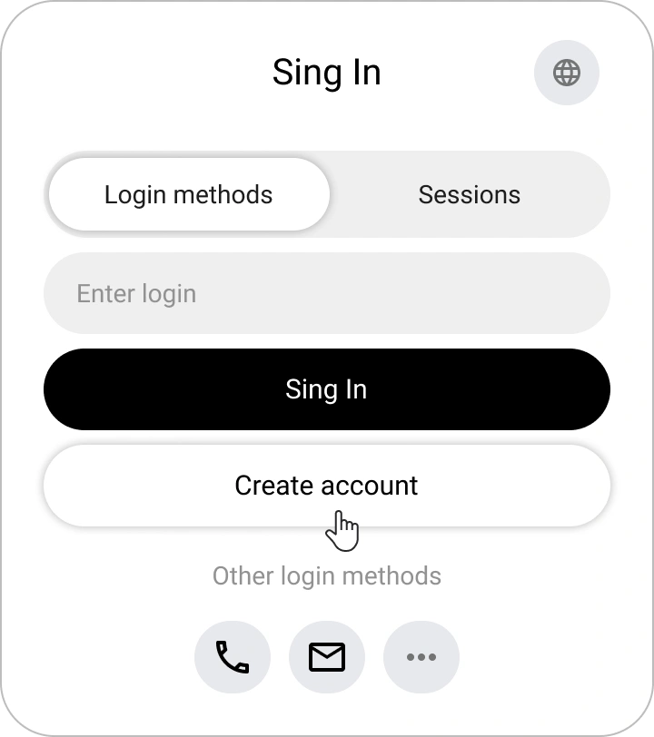

# Registrierung, Login und Passwortwiederherstellung in Encvoy ID

In dieser Anleitung erfahren Sie, wie Sie ein Konto in **Encvoy ID** erstellen, sich mit einem Benutzernamen und Passwort oder über externe Dienste anmelden und im Bedarfsfall sicher den Zugriff auf Ihr Profil wiederherstellen.

**Inhaltsverzeichnis:**

- [Registrierung, Login und Passwortwiederherstellung in Encvoy ID](#registrierung-login-und-passwortwiederherstellung-in-encvoy-id)
  - [Registrierung eines neuen Kontos { #new-account-registration }](#registrierung-eines-neuen-kontos--new-account-registration-)
    - [Wo die Registrierung verfügbar ist](#wo-die-registrierung-verfügbar-ist)
    - [So erstellen Sie ein Konto in Encvoy ID](#so-erstellen-sie-ein-konto-in-encvoy-id)
  - [Login mit Benutzername und Passwort { #login-with-password }](#login-mit-benutzername-und-passwort--login-with-password-)
  - [Login über externe Dienste { #login-via-external-services }](#login-über-externe-dienste--login-via-external-services-)
  - [Schnell-Login für authentifizierte Benutzer { #quick-login-for-authenticated-users }](#schnell-login-für-authentifizierte-benutzer--quick-login-for-authenticated-users-)
  - [Passwortwiederherstellung { #password-recovery }](#passwortwiederherstellung--password-recovery-)
    - [So stellen Sie ein Passwort in Encvoy ID wieder her](#so-stellen-sie-ein-passwort-in-encvoy-id-wieder-her)
  - [Siehe auch { #see-also }](#siehe-auch--see-also-)

---

## Registrierung eines neuen Kontos { #new-account-registration }

### Wo die Registrierung verfügbar ist

Die Funktion zur Kontoerstellung kann in zwei Fällen verfügbar sein:

1. **Auf dem Login-Formular**;

2. **Auf dem Formular zur Aktionsauswahl beim Login über eine Anmeldemethode**, wenn die angegebene Kennung mit keinem Profil in **Encvoy ID** verknüpft ist

> 💡 Das **Design des Formulars** kann je nach den Einstellungen der jeweiligen Anwendung variieren

### So erstellen Sie ein Konto in Encvoy ID

1. Klicken Sie auf dem Login- oder Aktionsauswahlformular auf **Konto erstellen**.
2. Geben Sie die erforderlichen Daten in das Registrierungsformular ein.

   Beispiel für das Fenster zur Namenseingabe:

   

3. Falls das System eine E-Mail-Adresse anfordert — geben Sie eine Adresse an, die nicht mit anderen Benutzern verknüpft ist.
4. Geben Sie den Code ein oder folgen Sie dem Link aus der E-Mail, die an die angegebene Adresse gesendet wurde.

   

   > 💡 Wenn die Bestätigung über einen Link erfolgt, kann das Fenster zur Codeeingabe geschlossen werden.

5. Gewähren Sie beim ersten Login in die Anwendung Zugriff auf die erforderlichen Daten.

Nach Abschluss dieser Schritte wird das Konto erstellt und Sie werden im System angemeldet.

> 🔗 Wenn die Registrierung über einen externen Dienst initiiert wird, wird die Kennung des externen Systems automatisch mit dem neuen Profil verknüpft. Sie kann für zukünftige Logins verwendet werden.

---

## Login mit Benutzername und Passwort { #login-with-password }

Sie können sich in der Anwendung mit Ihrem **Encvoy ID**-Konto autorisieren.

> 📌 **Hinweis**: In einigen Anwendungen kann der Passwort-Login deaktiviert sein. Verwenden Sie in diesem Fall [externe Login-Methoden](#login-via-external-services).

Um sich anzumelden:

1. Geben Sie im ersten Schritt des Login-Widgets Ihre Identifikationsdaten ein (z. B. Benutzername, E-Mail oder Telefonnummer) und klicken Sie auf **Anmelden**.

2. Geben Sie im zweiten Schritt Ihr Passwort ein und klicken Sie auf **Anmelden**.

   > 💡 Wenn Sie bei der Dateneingabe einen Fehler gemacht haben, folgen Sie den Anweisungen auf dem Bildschirm.

   

**Nach erfolgreicher Authentifizierung:**

- beim ersten Login öffnet sich ein Formular zur Bestätigung des Datenzugriffs;

  Beispiel für ein Formular zur Anforderung des Zugriffs auf Profildaten:

    

- falls die Anwendung obligatorische Profilfelder erfordert, fordert das System deren Ausfüllung an;

  Beispiel für eine Telefonnummern-Anfrage:

    

- falls Daten durch [Privatsphäre-Einstellungen](./docs-12-common-personal-profile.md#privacy-levels) verborgen sind, werden Sie aufgefordert, die Zugriffsebene zu ändern.

  Beispiel für die Änderung der Privatsphäre des Geburtsdatums:

    

---

## Login über externe Dienste { #login-via-external-services }

Externe Identifikationsdienste (oder Login-Methoden) umfassen soziale Netzwerke und externe Dienste.

Um sich über einen externen Dienst anzumelden:

1. Wählen Sie die gewünschte Login-Methode im Widget aus.

2. Schließen Sie die Autorisierung im gewählten Dienst mit den für soziale Netzwerke verfügbaren Methoden ab.
3. Beim ersten Login öffnet sich ein Formular zur Datenzugriffsanfrage. Erteilen Sie die Zustimmung zum Zugriff auf Ihre Daten.

---

## Schnell-Login für authentifizierte Benutzer { #quick-login-for-authenticated-users }

Wenn Sie sich bereits in Ihrem Browser bei **Encvoy ID** angemeldet haben, ist keine erneute Autorisierung erforderlich.

1. Beim Aufruf öffnet sich ein Fenster zur Auswahl eines gespeicherten Kontos.
2. Klicken Sie auf den Benutzernamen.

3. Nach Auswahl des Benutzers erfolgt der Login.

Zusätzlich:

- Um sich als ein anderer Benutzer anzumelden, wählen Sie **Anmeldeoptionen** und autorisieren Sie sich als anderer Benutzer.
- Um die aktuelle Sitzung zu beenden, klicken Sie auf die Schaltfläche **Abmelden**.

---

## Passwortwiederherstellung { #password-recovery }

Wenn Sie das Passwort für Ihr **Encvoy ID**-Konto vergessen haben, können Sie es einfach wiederherstellen.

### So stellen Sie ein Passwort in Encvoy ID wieder her

1. Geben Sie im ersten Schritt des Login-Widgets Ihre Identifikationsdaten ein (z. B. Benutzername, E-Mail oder Telefonnummer) und klicken Sie auf **Anmelden**.
2. Wählen Sie im nächsten Schritt **Passwort wiederherstellen**.

3. Ein Bestätigungscode wird an Ihre E-Mail-Adresse gesendet.
4. Geben Sie den Code aus der E-Mail ein.

   > ⚠️ Der Code ist nur für begrenzte Zeit gültig. Wenn er abgelaufen ist, fordern Sie einen neuen Code an.

   

5. Legen Sie ein neues Passwort fest und klicken Sie auf **Speichern**.

Nach der Aktualisierung des Passworts wird der Login automatisch durchgeführt.

> ✅ Passwort erfolgreich wiederhergestellt; Sie können nun die neue Kombination beim Login in das System verwenden.

---

## Siehe auch { #see-also }

- [Persönliches Profil und Verwaltung von Anwendungsberechtigungen](./docs-12-common-personal-profile.md) — ein Leitfaden zur Verwaltung Ihres persönlichen Profils.
