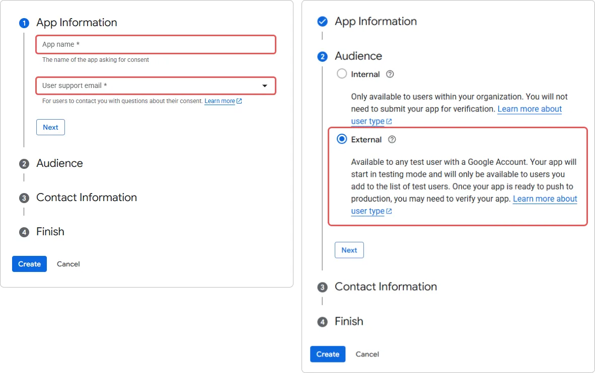

# So verbinden Sie den Google-Login in Encvoy ID

> 📋 Diese Anleitung ist Teil einer Artikelserie zur Konfiguration von Login-Methoden. Weitere Details finden Sie im Leitfaden [Login-Methoden und Widget-Konfiguration](./docs-06-github-en-providers-settings.md).

In dieser Anleitung erfahren Sie, wie Sie die Authentifizierung über ein **Google**-Konto mit dem **Encvoy ID**-System verbinden. Diese Login-Methode ermöglicht es Benutzern, sich mit ihrem **Google**-Servicekonto bei Anwendungen anzumelden.

Die Einrichtung des **Google**-Logins besteht aus drei wesentlichen Schritten, die in zwei verschiedenen Systemen durchgeführt werden:

- [Schritt 1. Konfiguration der Anwendung in Google](#step-1-configure-google-app)
- [Schritt 2. Erstellen der Login-Methode](#step-2-create-login-method)
- [Schritt 3. Zum Widget hinzufügen](#step-3-add-to-widget)
- [Beschreibung der Parameter](#parameters-description)
- [Siehe auch](#see-also)

---

## Schritt 1. Konfiguration der Anwendung in Google { #step-1-configure-google-app }

Bevor Sie die Login-Methode in **Encvoy ID** konfigurieren, müssen Sie Ihre Anwendung in der **Google** Developer Console registrieren und Zugriffsschlüssel erhalten:

1. Melden Sie sich mit Ihrem **Google**-Konto an.
2. Öffnen Sie die [Google Cloud Console](https://code.google.com/apis/console#access).
3. Erstellen Sie ein neues Projekt:
   - Klicken Sie im oberen Bereich auf **Projekt auswählen** → **Neues Projekt**.
   - Geben Sie den Projektnamen an (z. B. `Encvoy.ID Login` oder den Namen Ihrer Website).
   - Klicken Sie auf **Erstellen**.

   > 🔗 Weitere Details finden Sie in der Anleitung auf [developers.google.com](https://developers.google.com/workspace/guides/create-project?hl=en).

4. Konfigurieren Sie den **OAuth-Zustimmungsbildschirm**. Wenn Sie diese Einstellungen bereits vorgenommen haben, überspringen Sie diesen Schritt.
   - Gehen Sie zu **APIs und Dienste** → **OAuth-Zustimmungsbildschirm**.

     

   - Öffnen Sie den Bereich **Branding**.
   - Klicken Sie auf die Schaltfläche **Jetzt starten** in der Mitte des Fensters.
   - Geben Sie die **App-Informationen** an: den Anwendungsnamen und die E-Mail-Adresse, die den Benutzern auf dem Zustimmungsbildschirm angezeigt wird.
   - Wählen Sie den **Nutzer-Typ** → **Extern**.

     

   - Geben Sie eine E-Mail-Adresse für den Erhalt von Projektbenachrichtigungen an.
   - Stimmen Sie den Nutzerrichtlinien zu.

     

5. Erstellen Sie eine **OAuth-Client-ID**:
   - Gehen Sie zu **APIs und Dienste** → **Anmeldedaten**.
   - Klicken Sie auf **Anmeldedaten erstellen** → **OAuth-Client-ID**.

     

   - Wählen Sie den **Anwendungstyp** → **Webanwendung**.
   - Geben Sie den Namen und die Rückruf-URL\#1 (`Redirect_uri`) ein.
   - Klicken Sie auf **Erstellen**.

     

     > ⚠️ Nach der Erstellung erscheint ein Fenster mit den Daten: `Client-ID` und `Client-Geheimnis`. Speichern Sie diese Werte — Sie benötigen sie für die Konfiguration in **Encvoy ID**.

     

6. Überprüfen Sie die Einstellungen des **OAuth-Zustimmungsbildschirms**:

   Stellen Sie vor der Verwendung sicher, dass:
   - Der Status des Zustimmungsbildschirms auf **Veröffentlicht** (Aktiviert) steht, nicht auf **In Entwicklung**,
   - Die erforderlichen **Bereiche** (Scopes) — `email` und `profile` — hinzugefügt wurden.

---

## Schritt 2. Erstellen der Login-Methode { #step-2-create-login-method }

Erstellen wir nun mit den Schlüsseln von **Google** den entsprechenden Provider im **Encvoy ID**-System.

1. Gehen Sie zum Administrator-Panel → Tab **Einstellungen**.

   > 💡 Um eine Login-Methode für eine Organisation zu erstellen, öffnen Sie das **Organisations-Dashboard**. Wenn die Login-Methode für eine bestimmte Anwendung benötigt wird, öffnen Sie die **Einstellungen dieser Anwendung**.

2. Suchen Sie den Block **Anmeldemethoden** und klicken Sie auf **Konfigurieren**.
3. Klicken Sie im sich öffnenden Fenster auf die Schaltfläche **Erstellen** .
4. Ein Fenster mit einer Liste von Vorlagen wird geöffnet.
5. Wählen Sie die **Google**-Vorlage aus.
6. Füllen Sie das Erstellungsformular aus:

   **Basisinformationen**
   - **Name** — Der Name, den die Benutzer sehen werden.
   - **Beschreibung** (optional) — Eine kurze Beschreibung.
   - **Logo** (optional) — Sie können ein eigenes Icon hochladen, andernfalls wird das Standard-Icon verwendet.

   **Authentifizierungsparameter**
   - **Client-ID (client_id)** — Fügen Sie die kopierte **Anwendungs-ID** (`Client ID`) ein.
   - **Client-Geheimnis (client_secret)** — Fügen Sie das kopierte **Geheimnis** (`Client Secret`) ein.
   - **Rücksprung-URL (Redirect URI)** — Dieses Feld wird automatisch basierend auf Ihrer Domain ausgefüllt.

   **Zusätzliche Einstellungen**
   - **Öffentliche Anmeldemethode** — Aktivieren Sie dies, wenn diese Login-Methode für andere System- (oder Organisations-) Anwendungen sowie für das Benutzerprofil als [Identifikator für externe Dienste](./docs-12-common-personal-profile.md#external-service-identifiers) verfügbar sein soll.
   - **Öffentlichkeit** — Legen Sie die Standard-Sichtbarkeitsstufe für den Identifikator des externen Dienstes im Benutzerprofil fest.

7. Klicken Sie auf **Erstellen**.

Nach erfolgreicher Erstellung erscheint die neue Login-Methode in der allgemeinen Liste der Provider.

---

## Schritt 3. Zum Widget hinzufügen { #step-3-add-to-widget }

Damit die Schaltfläche **Mit Google anmelden** auf dem Autorisierungsformular sichtbar ist, müssen Sie diese Funktion in den Widget-Einstellungen aktivieren:

1. Suchen Sie in der allgemeinen Liste der Provider die erstellte Login-Methode.
2. Betätigen Sie den Schalter im Provider-Panel.

> **Überprüfung**: Öffnen Sie nach dem Speichern das Login-Formular in einer Testanwendung. Eine neue Schaltfläche mit dem **Google**-Logo sollte im Widget erscheinen.

---

## Beschreibung der Parameter { #parameters-description }

### Basisinformationen

| Name             | Beschreibung                                                                             | Typ                     | Einschränkungen  |
| ---------------- | ---------------------------------------------------------------------------------------- | ----------------------- | ---------------- |
| **Name**         | Der Name, der in der **Encvoy ID**-Benutzeroberfläche angezeigt wird                     | Text                    | Max. 50 Zeichen  |
| **Beschreibung** | Eine kurze Beschreibung, die in der **Encvoy ID**-Benutzeroberfläche angezeigt wird      | Text                    | Max. 255 Zeichen |
| **Logo**         | Das Bild, das in der **Encvoy ID**-Benutzeroberfläche und im Login-Widget angezeigt wird | JPG, GIF, PNG oder WEBP | Max. Größe: 1 MB |

### Authentifizierungsparameter

| Name                                                 | Parameter       | Beschreibung                                                                                                     |
| ---------------------------------------------------- | --------------- | ---------------------------------------------------------------------------------------------------------------- |
| **Client-ID (client_id)**                            | `Client_id`     | Die ID der in **Google** erstellten Anwendung                                                                    |
| **Client-Geheimnis (client_secret)**                 | `Client_secret` | Der Dienstzugriffsschlüssel der in **Google** erstellten Anwendung                                               |
| **Rücksprung-URL (Redirect URI)** (nicht editierbar) | `Redirect URI`  | Die **Encvoy ID**-Adresse, an die der Benutzer nach der Authentifizierung beim Drittanbieter weitergeleitet wird |

### Zusätzliche Einstellungen

| Name                           | Beschreibung                                                                                                                                                                                                                                                            |
| ------------------------------ | ----------------------------------------------------------------------------------------------------------------------------------------------------------------------------------------------------------------------------------------------------------------------- |
| **Öffentliche Anmeldemethode** | Bei Aktivierung:   - Die Login-Methode wird für andere Service-Anwendungen verfügbar.   - Die Login-Methode kann als [Identifikator für externe Dienste](./docs-12-common-personal-profile.md#external-service-identifiers) im Benutzerprofil hinzugefügt werden. |
| **Öffentlichkeit**             | Legt die Standard-Sichtbarkeitsstufe für den Identifikator des externen Dienstes im Benutzerprofil fest                                                                                                                                                                 |

---

## Siehe auch { #see-also }

- [Login-Methoden und Konfiguration des Login-Widgets](./docs-06-github-en-providers-settings.md) — ein Leitfaden zu Login-Methoden und zur Konfiguration des Login-Widgets.
- [Organisationsverwaltung](./docs-09-common-mini-widget-settings.md) — ein Leitfaden zur Arbeit mit Organisationen im **Encvoy ID**-System.
- [Persönliches Profil und Verwaltung von Anwendungsberechtigungen](./docs-12-common-personal-profile.md) — ein Leitfaden zur Verwaltung des persönlichen Profils.
