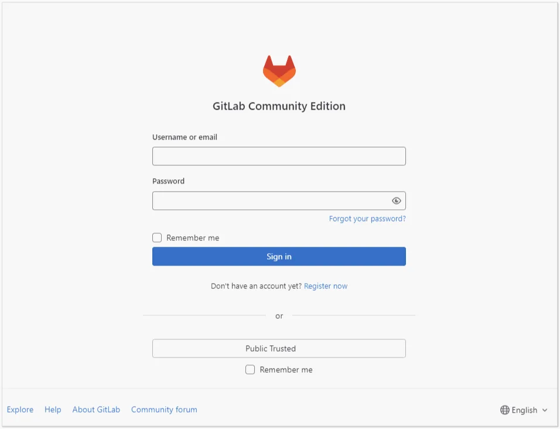

# So konfigurieren Sie die GitLab-Integration mit Encvoy ID

In dieser Anleitung erfahren Sie, wie Sie Single Sign-On (SSO) in **GitLab** über das **Encvoy ID**-System einrichten.

> 📌 [GitLab](https://about.gitlab.com/) ist eine webbasierte Plattform zur Verwaltung von Projekten und Software-Code-Repositories, basierend auf dem beliebten Versionskontrollsystem **Git**.

Die Einrichtung der Anmeldung über **Encvoy ID** besteht aus mehreren Schlüsselphasen, die in zwei verschiedenen Systemen durchgeführt werden.

- [Schritt 1. Anwendung erstellen](#step-1-create-application)
- [Schritt 2. GitLab-System konfigurieren](#step-2-configure-gitlab)
- [Schritt 3. Integration überprüfen](#step-3-verify-integration)

---

<a name="step-1-create-application"></a>

## Schritt 1. Anwendung erstellen

1. Melden Sie sich im **Encvoy ID**-System an.
2. Erstellen Sie eine Anwendung mit den folgenden Einstellungen:
   - **Anwendungsadresse** - die Adresse Ihrer **GitLab**-Installation;
   - **Redirect-URL \#1 (`Redirect_uri`)** - `<GitLab-Installationsadresse>/users/auth/oauth2_generic/callback`.

   > 🔍 Weitere Details zum Erstellen von Anwendungen finden Sie in den [Anweisungen](./docs-10-common-app-settings.md#creating-application).

3. Öffnen Sie die [Anwendungseinstellungen](./docs-10-common-app-settings.md#editing-application) und kopieren Sie die Werte der folgenden Felder:
   - **Identifikator** (`Client_id`),
   - **Geheimschlüssel** (`client_secret`).

---

<a name="step-2-configure-gitlab"></a>

## Schritt 2. GitLab-System konfigurieren

Die Konfiguration der Benutzerautorisierung für den **GitLab**-Dienst über **Encvoy ID** erfolgt in der Konfigurationsdatei **GitLab gitlab.rb**, die sich im Konfigurationsordner des Dienstes (/config) befindet.

1. Öffnen Sie die Konfigurationsdatei **gitlab.rb** im Bearbeitungsmodus und navigieren Sie zum Block **OmniAuth Settings**.
2. Legen Sie die folgenden Werte für die Parameter fest:

   ```bash
       gitlab_rails['omniauth_enabled'] = true
       gitlab_rails['omniauth_allow_single_sign_on'] = ['oauth2_generic', '<Encvoy IDSystemName>']
       gitlab_rails['omniauth_block_auto_created_users'] = false

       Der Wert für gitlab_rails['omniauth_providers'] sollte wie folgt aussehen:

       gitlab_rails['omniauth_providers'] = [
       {
       'name' => 'oauth2_generic',
       'app_id' => '<Client_id der in Encvoy ID erstellten Anwendung>',
       'app_secret' => '<Client_secret der in Encvoy ID erstellten Anwendung>',
       'args' => {
       client_options: {
       'site' => 'https://<Encvoy ID Systemadresse>/',
       'authorize_url' => '/api/oidc/auth',
       'user_info_url' => '/api/oidc/me',
       'token_url' => '/api/oidc/token'
       },
       user_response_structure: {
       root_path: [],
       id_path: ['sub'],
       attributes: { email:'email',  name:'nickname' },
       },
       scope: 'openid profile email',
       'name' => '<Encvoy IDSystemName>’
       }
       }
       ]
   ```

   

3. Starten Sie den **GitLab**-Dienst neu, um die neuen Einstellungen zu übernehmen.
4. Melden Sie sich bei Bedarf als Administrator in der **GitLab**-Benutzeroberfläche an. Navigieren Sie zum Pfad **Admin (Admin Area) — Settings-General**.

   Aktivieren Sie auf der sich öffnenden Seite im Block **Sign-in restrictions** das Kontrollkästchen neben <Encvoy IDSystemName> im Unterblock **Enabled OAuth authentication sources**.

   

---

<a name="step-3-verify-integration"></a>

## Schritt 3. Integration überprüfen

1. Öffnen Sie die **GitLab**-Anmeldeseite.
2. Stellen Sie sicher, dass die Schaltfläche **Anmeldung über Encvoy ID** erschienen ist.
3. Klicken Sie auf die Schaltfläche und melden Sie sich mit Ihrem Unternehmenskonto an:
   - Das System leitet Sie zur **Encvoy ID**-Authentifizierungsseite weiter.
   - Geben Sie Ihre Unternehmens-Anmeldedaten ein.

    

4. Nach erfolgreicher Authentifizierung sollten Sie zurück zu **GitLab** geleitet und automatisch in Ihr Konto eingeloggt werden.
