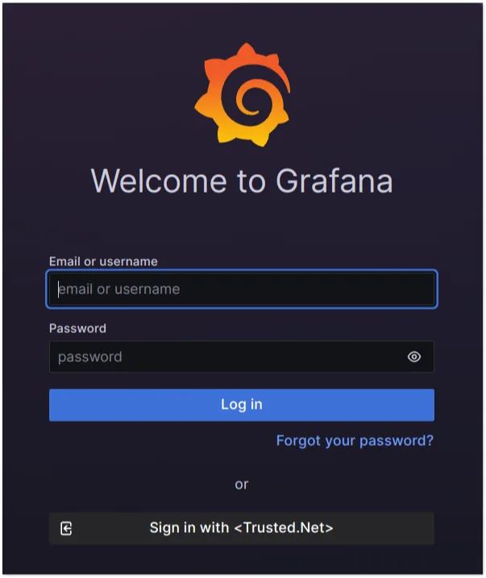

# So konfigurieren Sie die Grafana-Integration mit Encvoy ID

In dieser Anleitung erfahren Sie, wie Sie Single Sign-On (SSO) in **Grafana** unter Verwendung des **Encvoy ID**-Systems einrichten.

> 📌 [Grafana](https://www.grafana.com/) ist ein Open-Source-Datenvisualisierungssystem, das auf Daten von IT-Monitoringsystemen spezialisiert ist.

Die Einrichtung des Logins über **Encvoy ID** besteht aus mehreren wichtigen Schritten, die in zwei verschiedenen Systemen durchgeführt werden.

- [Schritt 1. Anwendung erstellen](#step-1-create-application)
- [Schritt 2. Grafana-System konfigurieren](#step-2-configure-grafana)
- [Schritt 3. Verbindung überprüfen](#step-3-verify-connection)

---

## Schritt 1. Anwendung erstellen { #step-1-create-application }

1. Melden Sie sich im **Encvoy ID**-System an.
2. Erstellen Sie eine Anwendung mit den folgenden Einstellungen:
   - **Anwendungsadresse** - die Adresse Ihrer **Grafana**-Installation;
   - **Redirect-URL \#1 (Redirect_uri)** - `<Grafana-Installationsadresse>/login/generic_oauth`.

   > 🔍 Weitere Details zum Erstellen von Anwendungen finden Sie in den [Anweisungen](./docs-10-common-app-settings.md#creating-application).

3. Öffnen Sie die [Anwendungseinstellungen](./docs-10-common-app-settings.md#editing-application) und kopieren Sie die Werte der folgenden Felder:
   - **Identifikator** (`Client_id`),
   - **Geheimschlüssel** (`client_secret`).

---

## Schritt 2. Grafana-System konfigurieren { #step-2-configure-grafana }

Die Autorisierungseinrichtung über **Encvoy ID** erfolgt in der Konfigurationsdatei **grafana.ini**, die sich unter Linux normalerweise unter `/etc/grafana/grafana.ini` befindet.

1. Öffnen Sie die Datei **grafana.ini** im Bearbeitungsmodus.
2. Suchen oder fügen Sie den Block `[auth.generic_oauth]` hinzu und setzen Sie die folgenden Parameter:

   ```ini
      [auth.generic_oauth]
      enabled = true
      name = <Encvoy IDSystemName>
      allow_sign_up = true
      client_id = <Client_id der in Encvoy ID erstellten Anwendung>
      client_secret = <Client_secret der in Encvoy ID erstellten Anwendung>
      scopes = openid profile email
      empty_scopes = false
      email_attribute_name = email:email
      email_attribute_path = data.email
      login_attribute_path = data.login
      name_attribute_path = data.givenName
      auth_url = https://<Encvoy ID-Systemadresse>/api/oidc/auth
      token_url = https://<Encvoy ID-Systemadresse>/api/oidc/token
      api_url = https://<Encvoy ID-Systemadresse>/api/oidc/me
   ```

   

3. Starten Sie den **Grafana**-Dienst neu, um die neuen Einstellungen zu übernehmen.

   ```bash
   sudo systemctl restart grafana-server
   ```

---

## Schritt 3. Verbindung überprüfen { #step-3-verify-connection }

1. Öffnen Sie die **Grafana**-Login-Seite.
2. Stellen Sie sicher, dass die Schaltfläche **Sign in with Encvoy ID** erschienen ist.
3. Klicken Sie auf die Schaltfläche und melden Sie sich mit Ihren Unternehmenszugangsdaten an:
   - Sie werden zur **Encvoy ID**-Authentifizierungsseite weitergeleitet;
   - Nach erfolgreichem Login werden Sie als autorisierter Benutzer zu **Grafana** zurückgeleitet.

   
