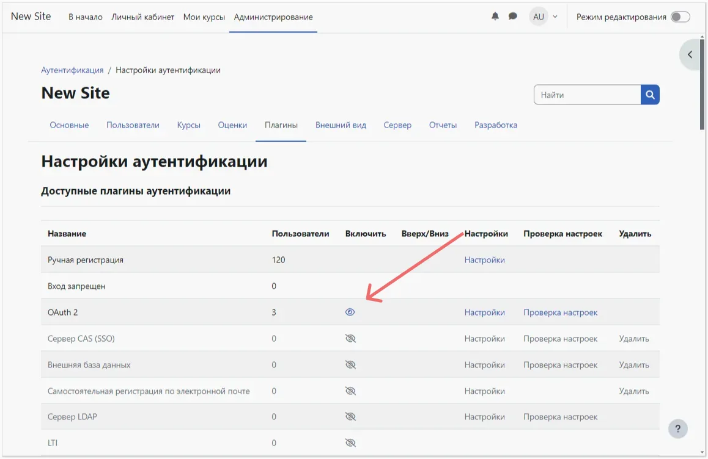
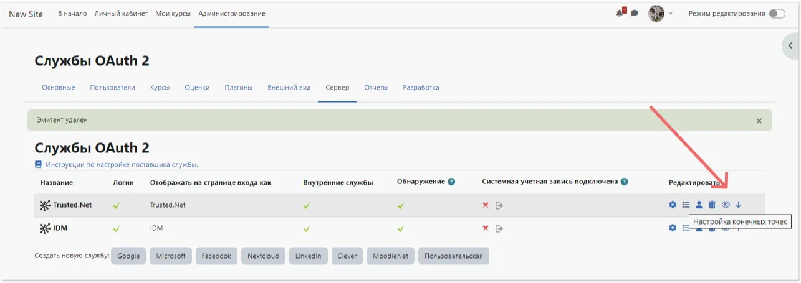
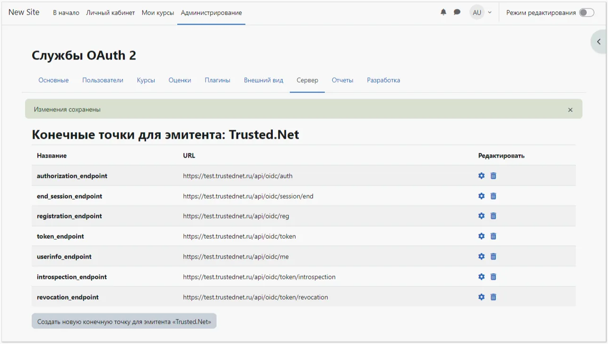
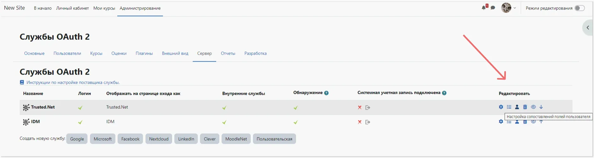

# So konfigurieren Sie die Moodle-Integration mit Encvoy ID

In dieser Anleitung erfahren Sie, wie Sie Single Sign-On (SSO) in **Moodle** mithilfe des **Encvoy ID**-Systems einrichten.

> 📌 [Moodle](https://moodle.org/) ist ein Lernmanagementsystem für elektronische Bildungskurse (E-Learning).

Die Einrichtung des Logins über **Encvoy ID** besteht aus mehreren Schlüsselphasen, die in zwei verschiedenen Systemen durchgeführt werden:

- [Schritt 1. Anwendung erstellen](#step-1-create-application)
- [Schritt 2. Moodle-System konfigurieren](#step-2-configure-moodle)
- [Schritt 3. Verbindung überprüfen](#step-3-verify-connection)

---

## Schritt 1. Anwendung erstellen { #step-1-create-application }

1. Melden Sie sich im **Encvoy ID**-System an.
2. Erstellen Sie eine Anwendung mit den folgenden Einstellungen:
   - **Anwendungsadresse** - die Adresse Ihrer **Moodle**-Installation;
   - **Redirect-URL \#1 (Redirect_uri)** - `<Moodle-Installationsadresse>/admin/oauth2callback.php`.

   Weitere Details zum Erstellen von Anwendungen finden Sie in den [Anweisungen](./docs-10-common-app-settings.md#creating-application).

3. Öffnen Sie die [Anwendungseinstellungen](./docs-10-common-app-settings.md#editing-application) und kopieren Sie die Werte der folgenden Felder:
   - **Identifikator** (`Client_id`),
   - **Geheimschlüssel** (`client_secret`).

---

## Schritt 2. Moodle-System konfigurieren { #step-2-configure-moodle }

> Für die Konfiguration der Benutzerauthentifizierung sind Administratorrechte in **Moodle** erforderlich.

### OAuth2-Plugin aktivieren

1. Melden Sie sich mit Administratorrechten bei **Moodle** an.
2. Gehen Sie zu **Website-Administration - Plugins - Authentifizierung** und aktivieren Sie das **OAuth 2**-Plugin, indem Sie es in der Spalte **Aktivieren** einschalten.

### Einen benutzerdefinierten Provider erstellen

1. Gehen Sie zu **Website-Administration** → **Server** → **OAuth 2-Services**.
2. Klicken Sie auf die Schaltfläche **Benutzerdefiniert**.

3. Das Formular zur Erstellung des Providers wird geöffnet.
4. Füllen Sie die Felder aus:
   - **Name** — ein beliebiger Anzeigename für den Dienst;
   - **Client-ID** — die `Client_id` der **Encvoy ID**-Anwendung;
   - **Client-Geheimnis** — das `Client_secret` der **Encvoy ID**-Anwendung;
   - **Service-Basis-URL** — `<Encvoy ID-Adresse>/api/oidc`;
   - **Auf Login-Seite anzeigen** — **Login-Seite und interne Services**;
   - **In Login-Anfrage enthaltene Scopes** — `openid profile email offline_access`;
   - **In Login-Anfrage für Offline-Zugriff enthaltene Scopes** — `offline_access`.

   

5. Änderungen speichern.

### Endpunkte konfigurieren

1. Klicken Sie in der Spalte **Bearbeiten** auf **Endpunkte konfigurieren**.

2. Wenn alle Daten korrekt eingegeben wurden, werden die Einstellungen automatisch ausgefüllt.

   

   > Falls erforderlich, können Sie die Endpunkt-URLs manuell ausfüllen. Die Liste der verfügbaren URLs finden Sie unter: `https://<Encvoy ID-Service-Adresse>/api/oidc/.well-known/openid-configuration`

### Benutzerfeld-Mapping konfigurieren

1. Klicken Sie in der Spalte **Bearbeiten** auf **Benutzerfeld-Mapping konfigurieren**.

2. Wenn alle Daten korrekt eingegeben wurden, werden die Einstellungen automatisch ausgefüllt.

   

   > Falls erforderlich, können die Mappings manuell konfiguriert werden.

### E-Mail-Versand in Moodle konfigurieren

Wenn das LMS den Versand von E-Mails an Benutzer erfordert, müssen Sie die E-Mail-Einstellungen konfigurieren (falls noch nicht geschehen):

1. Gehen Sie zu **Website-Administration → Server → E-Mail → Konfiguration des ausgehenden Mailversands**.
2. Füllen Sie die Felder aus:
   - **SMTP-Hosts** — der vollständige Name des SMTP-Servers, einschließlich des durch einen Doppelpunkt getrennten Ports;
   - **SMTP-Sicherheit** — wählen Sie einen Wert aus der Liste;
   - **SMTP-Authentifizierungstyp** — wählen Sie den erforderlichen Wert. Wenn der Authentifizierungstyp **LOGIN** ausgewählt ist, füllen Sie die Felder **SMTP-Benutzername** und **SMTP-Passwort** aus. Es wird empfohlen, das Feld **No-Reply-Adresse** auszufüllen, um potenzielle Probleme beim E-Mail-Versand zu vermeiden.

   

> 💡 Die Verknüpfung eines Moodle-LMS-Benutzers mit einem Encvoy ID-Benutzer basiert auf der E-Mail-Adresse. Das Fehlen einer E-Mail im Encvoy ID-Profil macht die Authentifizierung in Moodle unmöglich. Das Löschen einer zuvor mit Moodle verknüpften E-Mail-Adresse in Encvoy ID und das Hinzufügen einer neuen E-Mail-Adresse führt zur Erstellung eines neuen Benutzers in Moodle.

---

## Schritt 3. Verbindung überprüfen { #step-3-verify-connection }

1. Kehren Sie zur Liste der **OAuth 2-Services** zurück und stellen Sie sicher, dass der erstellte Provider aktiv ist.

2. Öffnen Sie die **Moodle**-Login-Seite.
3. Stellen Sie sicher, dass die Schaltfläche **Anmelden mit Encvoy ID** erschienen ist.
4. Klicken Sie auf die Schaltfläche und melden Sie sich mit Ihren Unternehmenszugangsdaten an:
   - Sie werden zur **Encvoy ID**-Authentifizierungsseite weitergeleitet;
   - Nach einem erfolgreichen Login werden Sie als autorisierter Benutzer zurück zu **Moodle** geleitet.

   
