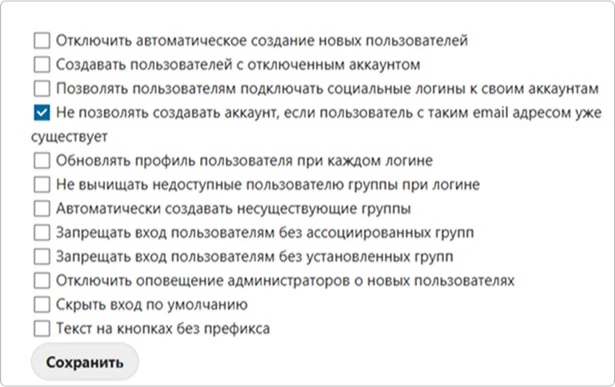

# So konfigurieren Sie die Nextcloud-Integration mit Encvoy ID

In dieser Anleitung erfahren Sie, wie Sie Single Sign-On (SSO) in **Nextcloud** mithilfe des **Encvoy ID**-Systems einrichten.

> 📌 [Nextcloud](https://nextcloud.com/) ist ein Ökosystem von Diensten für geschäftliche Kommunikation und Zusammenarbeit, das Anrufe, Videokonferenzen, Chats und Aufgabenmanagement kombiniert.

Die Einrichtung des Logins mit **Encvoy ID** besteht aus zwei zentralen Phasen, die in zwei verschiedenen Systemen durchgeführt werden.

- [Schritt 1. Anwendung erstellen](#step-1-create-application)
- [Schritt 2. Nextcloud konfigurieren](#step-2-configure-nextcloud)
- [Schritt 3. Verbindung überprüfen](#step-3-verify-connection)

---

## Schritt 1. Anwendung erstellen { #step-1-create-application }

1. Melden Sie sich bei **Encvoy ID** an.
2. Erstellen Sie eine neue Anwendung und geben Sie Folgendes an:
   - **Anwendungsadresse** - die Adresse Ihrer **Nextcloud**-Installation. Zum Beispiel: `https://<nextcloud-installations-adresse>`.
   - **Redirect-URL \#1** (`Redirect_uri`) - die Adresse im Format `https://<nextcloud-installations-adresse>/api/oauth/return`.

     > 🔍 Weitere Details zum Erstellen von Anwendungen finden Sie in den [Anweisungen](./docs-10-common-app-settings.md#creating-application).

3. Öffnen Sie die [Anwendungseinstellungen](./docs-10-common-app-settings.md#editing-application) und kopieren Sie die Werte der folgenden Felder:
   - **Identifikator** (`Client_id`),
   - **Geheimschlüssel** (`client_secret`).

---

## Schritt 2. Nextcloud konfigurieren { #step-2-configure-nextcloud }

1. Melden Sie sich mit Administratorrechten bei **Nextcloud** an.
2. Installieren Sie die Anwendung **Social Login**. Diese App ermöglicht es Benutzern, sich über Konten von Drittanbietern im **Nextcloud**-System anzumelden. Weitere Informationen zur App finden Sie unter [apps.nextcloud.com](https://apps.nextcloud.com/apps/sociallogin).
   - Gehen Sie zum Bereich **Apps** → **Social & communication**.

     

   - Klicken Sie bei der App **Social Login** auf **Herunterladen und aktivieren**.

     

     Nach der Installation der App erscheint der Unterabschnitt **Social login** im Bereich **Verwaltungseinstellungen**.

3. Gehen Sie zu **Verwaltungseinstellungen** → Unterabschnitt **Social login**.
4. Klicken Sie auf die Schaltfläche  neben dem Feld **Custom OpenID Connect**.
5. Füllen Sie die Verbindungsparameter aus:
   - **Internal name** - geben Sie den internen Namen des Authentifizierungsdienstes an, wie er in den **Nextcloud**-Einstellungen erscheinen soll.
   - **Title** - geben Sie einen benutzerfreundlichen Namen für den Authentifizierungsdienst an. Dieser Name wird auf der Schaltfläche der Login-Seite und in den **Nextcloud**-Einstellungen angezeigt.
   - **Authorize url** - geben Sie die Autorisierungs-URL an. Zum Beispiel: `https://<Encvoy ID-installations-adresse>/api/oidc/auth`.
   - **URL token** - geben Sie die URL zum Abrufen des Zugriffstokens an. Zum Beispiel: `https://<Encvoy ID-installations-adresse>/api/oidc/token`.
   - **Client id** - geben Sie den in **Schritt 1** erstellten Wert an.
   - **Client Secret** - geben Sie den in **Schritt 1** erstellten Wert an.
   - **Scope** - geben Sie die erforderlichen Berechtigungen für den Datenabruf an. Der obligatorische Scope ist `openid` und der Standard-Scope ist `profile`. Wenn Sie mehrere Berechtigungen angeben, trennen Sie diese durch ein Leerzeichen. Zum Beispiel: `profile email openid`.

   

6. Konfigurieren Sie bei Bedarf zusätzliche Einstellungen:

Nach Abschluss aller Schritte wird die Login-Schaltfläche für **Encvoy ID** im **Nextcloud**-Autorisierungs-Widget angezeigt.

---

## Schritt 3. Verbindung überprüfen { #step-3-verify-connection }

1. Öffnen Sie die **Nextcloud**-Login-Seite.
2. Stellen Sie sicher, dass die Schaltfläche **Login mit Encvoy ID** erschienen ist.
3. Klicken Sie auf die Schaltfläche und melden Sie sich mit Ihren Unternehmens-Zugangsdaten an:
   - Sie werden zur **Encvoy ID**-Authentifizierungsseite weitergeleitet;
   - Nach erfolgreichem Login werden Sie als autorisierter Benutzer zu **Nextcloud** zurückgeleitet.

   
