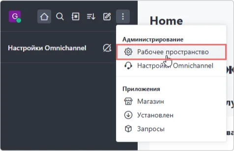
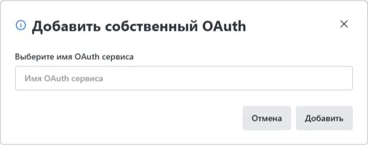

# So konfigurieren Sie die Rocket.Chat-Integration mit Encvoy ID

In dieser Anleitung erfahren Sie, wie Sie Single Sign-On (SSO) in **Rocket.Chat** über das **Encvoy ID**-System einrichten.

> 📌 [Rocket.Chat](https://www.rocket.chat/) ist eine Open-Source-Messaging-Plattform, die für Teamarbeit und Kommunikation entwickelt wurde. Sie bietet ähnliche Funktionen wie Dienste wie **Slack** oder **Microsoft Teams**, jedoch mit der Option zur Selbstbereitstellung auf dem eigenen Server.

Die Einrichtung des Logins über **Encvoy ID** besteht aus mehreren wichtigen Phasen, die in zwei verschiedenen Systemen durchgeführt werden:

- [Schritt 1. Verbindung in Rocket.Chat erstellen](#step-1-create-rocketchat-connection)
- [Schritt 2. Anwendung erstellen](#step-2-create-application)
- [Schritt 3. Verbindung in Rocket.Chat konfigurieren](#step-3-configure-rocketchat)
- [Schritt 4. Verbindung überprüfen](#step-4-verify-connection)

---

## Schritt 1. Verbindung in Rocket.Chat erstellen { #step-1-create-rocketchat-connection }

1. Melden Sie sich bei **Rocket.Chat** mit Administratorrechten an.
2. Öffnen Sie das Menü und wählen Sie **Workspace**.

3. Der Bereich **Administration** wird geöffnet.
4. Gehen Sie zum Unterabschnitt **Settings** und klicken Sie im Block **OAuth** auf **Open**.

5. Klicken Sie auf die Schaltfläche **Add custom OAuth**.

6. Geben Sie im erscheinenden Fenster einen eindeutigen Namen für den zu verbindenden **OAuth service** an und klicken Sie auf **Add**.

7. Die erstellte Verbindung erscheint in der allgemeinen Liste der Verbindungen. Falls nicht, aktualisieren Sie die Browserseite.
8. Erweitern Sie die Verbindungseinstellungen und kopieren Sie die **Callback URL**.

---

## Schritt 2. Anwendung erstellen { #step-2-create-application }

1. Melden Sie sich bei **Encvoy ID** an.
2. Erstellen Sie eine neue Anwendung und geben Sie Folgendes an:
   - **Application Address** - die Adresse Ihrer **Rocket.Chat**-Installation;
   - **Callback URL \#1 (Redirect_uri)** - fügen Sie den Wert ein, den Sie aus der in **Rocket.Chat** erstellten Verbindung kopiert haben.

     > 🔍 Weitere Details zum Erstellen von Anwendungen finden Sie in der [Anleitung](./docs-10-common-app-settings.md#creating-application).

3. Öffnen Sie die [Anwendungseinstellungen](./docs-10-common-app-settings.md#editing-application) und kopieren Sie die Werte der folgenden Felder:
   - **Identifier** (`Client_id`),
   - **Secret Key** (`client_secret`).

---

## Schritt 3. Verbindung in Rocket.Chat konfigurieren { #step-3-configure-rocketchat }

1. Kehren Sie zu **Rocket.Chat** zurück.
2. Öffnen Sie die Einstellungen für die in Schritt 1 erstellte Verbindung.
3. Betätigen Sie den Schalter **Enable**, um die Verbindung zu aktivieren, oder aktivieren Sie sie später nach der Konfiguration aller Parameter.

4. Geben Sie die Verbindungsparameter an:
   - **URL** — Die URL des Encvoy ID-Dienstes. Zum Beispiel: `https://<Encvoy ID Installationsadresse>`
   - **Token Path** — Dies ist der Teil der Token Endpoint URL, der den Pfad zum Abrufen von Tokens angibt. Zum Beispiel: **/api/oidc/token**.
   - **Identity Path** — Der Endpunkt mit Benutzerinformationen. Zum Beispiel: **/api/oidc/me**.
   - **Authorize Path** — Der Pfad vom Autorisierungsendpunkt. Zum Beispiel: **/api/oidc/auth**.
   - **Scope** — Die erforderlichen Berechtigungen zum Abrufen von Daten. Erforderlicher Scope ist **openid** und Standard-Scope ist **profile**. Wenn Sie mehrere Berechtigungen angeben, trennen Sie diese durch ein Leerzeichen. Zum Beispiel: **profile email openid**.
   - **Id** — Der Identifier (`Client_id`). Kopieren Sie den in Schritt 2 erstellten Wert.
   - **Secret** — Der Secret Key (`Client_secret`). Kopieren Sie den in Schritt 2 erstellten Wert.

5. Geben Sie die restlichen Einstellungen an. Detaillierte Beschreibungen der Einstellungen finden Sie im Dokumentationsportal [docs.rocket.chat](https://docs.rocket.chat/docs/oauth).
6. Speichern Sie die Verbindungseinstellungen.

Nach Abschluss aller Schritte erscheint eine Login-Schaltfläche für **Encvoy ID** im **Rocket.Chat**-Autorisierungs-Widget.

---

## Schritt 4. Verbindung überprüfen { #step-4-verify-connection }

1. Öffnen Sie die **Rocket.Chat**-Login-Seite.
2. Stellen Sie sicher, dass die Schaltfläche **Login with Encvoy ID** erschienen ist.
3. Klicken Sie auf die Schaltfläche und melden Sie sich mit Ihren Unternehmens-Zugangsdaten an:
   - Sie werden zur **Encvoy ID**-Authentifizierungsseite weitergeleitet;
   - Nach einem erfolgreichen Login werden Sie als autorisierter Benutzer zu **Rocket.Chat** zurückgeleitet.

   
