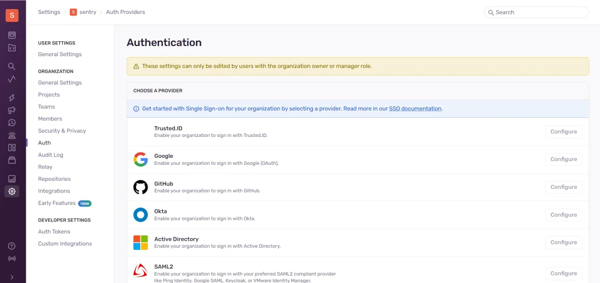

# So konfigurieren Sie die Sentry-Integration mit {{projectName}}

In dieser Anleitung erfahren Sie, wie Sie Single Sign-On (SSO) für **Sentry** über das **{{projectName}}**-System einrichten.

**Sentry** ist eine Plattform zur Überwachung und Verfolgung von Anwendungsfehlern. Sie hilft Entwicklern, Fehler in Echtzeit zu identifizieren, zu analysieren und zu beheben, was die Softwarequalität verbessert.  

Die Basisversion des Produkts unterstützt keine **OpenID Connect**-Authentifizierung. Um diese Funktion zu implementieren, können Sie eine zusätzliche Lösung verwenden — [sentry-auth-oidc](https://github.com/siemens/sentry-auth-oidc). Dies ist ein spezialisierter Provider, der die **OpenID Connect**-Integration mit **Sentry** ermöglicht und es Ihnen erlaubt, Single Sign-On (SSO) im System zu konfigurieren.

Die Einrichtung des Logins über **{{projectName}}** besteht aus mehreren Schritten, die in zwei verschiedenen Systemen durchgeführt werden:

- [Schritt 1. Anwendung erstellen](#step-1-create-application)
- [Schritt 2. sentry-auth-oidc installieren](#step-2-install-sentry-auth-oidc)
- [Schritt 3. Verbindung überprüfen](#step-3-verify-connection)

---

## Schritt 1. Anwendung erstellen { #step-1-create-application }

1. Melden Sie sich bei **{{projectName}}** an oder registrieren Sie sich.  
2. Erstellen Sie eine Anwendung mit den folgenden Einstellungen:  

    | Feld                                                   | Wert                                           |
    | ------------------------------------------------------- | ---------------------------------------------- |
    | Anwendungs-URL                                         | Adresse Ihrer **Sentry**-Installation          |
    | Redirect-URL \#1 (Redirect_uri)                         | `<Installationsadresse>/auth/sso`              |

    > 🔍 Weitere Details zum Erstellen von Anwendungen finden Sie in der [Anleitung](./docs-10-common-app-settings.md#creating-application).

3. Öffnen Sie die [Anwendungseinstellungen](./docs-10-common-app-settings.md#editing-application) und kopieren Sie die Werte der folgenden Felder:

    - **Client ID** (`Client_id`),
    - **Client Secret** (`client_secret`).  

---

## Schritt 2. sentry-auth-oidc installieren { #step-2-install-sentry-auth-oidc }

1. Um den Provider zu installieren, führen Sie den Konsolenbefehl aus:

    ```python
    $ pip install sentry-auth-oidc
    ```

    oder erstellen Sie ein Shell-Skript mit folgendem Inhalt:

    ```sh
    #!/bin/bash
    set -euo pipefail
    apt-get update
    pip install sentry-auth-oidc
    ```

    und führen Sie es aus dem Verzeichnis `<Pfad zu Sentry>/sentry/` aus.

2. Nach der Installation des Providers bearbeiten Sie die **Sentry**-Konfigurationsdatei `sentry.conf.py`. Fügen Sie in der Konfigurationsdatei einen Block von Variablen mit den Parametern **OIDC_CLIENT_ID** und **OIDC_CLIENT_SECRET** hinzu, die Sie aus der **{{projectName}}**-Anwendung kopiert haben.

    ```sh
    #################
    # OIDC #
    #################

    #SENTRY_MANAGED_USER_FIELDS = ('email', 'first_name', 'last_name', 'password', )

    OIDC_CLIENT_ID = "Client-ID aus der {{projectName}}-Anwendung"
    OIDC_CLIENT_SECRET = "Client-Secret aus der {{projectName}}-Anwendung"
    OIDC_SCOPE = "openid email profile"
    OIDC_DOMAIN = "https://<{{projectName}}-Adresse>/api/oidc"
    OIDC_ISSUER = "Modulname für die Erteilung von Berechtigungen"
    ```

    Führen Sie danach das Skript `install.sh` aus, das sich im Stammverzeichnis des **Sentry**-Projekts befindet, warten Sie auf den Abschluss des Skripts und starten Sie das Projekt.

3. Gehen Sie zum **Sentry**-Admin-Panel unter `https://<Pfad zu Sentry>/settings/sentry/` und wählen Sie den Bereich **Auth** aus. Wählen Sie dann die **{{projectName}}**-Anwendung aus.

    

Konfigurieren Sie alle erforderlichen Einstellungen und speichern Sie die Änderungen. Danach wird die Autorisierung über **{{projectName}}** aktiviert und der Login über Benutzername/Passwort deaktiviert.

---

## Schritt 3. Verbindung überprüfen { #step-3-verify-connection }

1. Öffnen Sie die **Sentry**-Login-Seite.
2. Stellen Sie sicher, dass die Schaltfläche **Login via {{projectName}}** erschienen ist.
3. Klicken Sie auf die Schaltfläche und melden Sie sich mit Ihren Unternehmensdaten an:

    - Sie werden zur **{{projectName}}**-Authentifizierungsseite weitergeleitet;
    - Nach einem erfolgreichen Login werden Sie als autorisierter Benutzer zurück zu **Sentry** geleitet.

