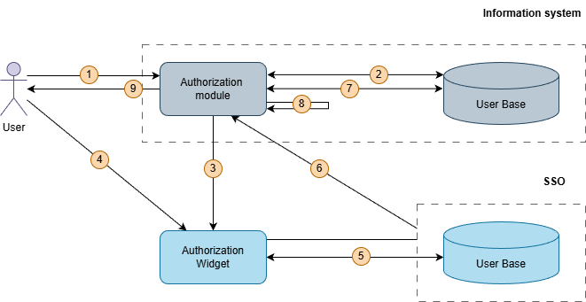
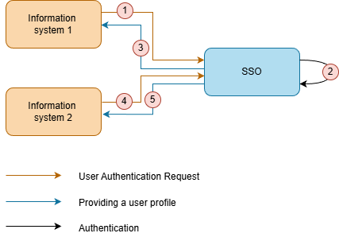

# Overview of Encvoy ID — Single Sign-On (SSO) System

**Encvoy ID** is a Single Sign-On (SSO) system for centralized user authentication and access management for corporate applications.

The system provides secure centralized authentication with support for SSO, OAuth 2.0, OpenID Connect, and two-factor authentication.

---

## Use Cases for Encvoy ID

**Encvoy ID** is a system designed to organize centralized user login to corporate information resources using a single account.

**Encvoy ID** is aimed at companies that require:

- **Single sign-on window** for internal and external services
- **Centralized access management** for different categories of users (employees, contractors, clients)
- **Enhanced security** with multi-factor authentication support
- **Strict control and auditing** of user actions
- **Secure integration** of multiple applications with different authentication systems

---

## Key Features of Encvoy ID

### 1. Authentication and Login

The system provides centralized authentication and support for multiple protocols and authentication methods.

#### Supported Protocols

- **OpenID Connect (OIDC)** — user authentication and identity data transmission
- **OAuth 2.0** — authorization and resource access management

#### Authentication Methods

- **Basic methods**: login and password, email
- **External identity providers**: social networks, trusted corporate systems, and other services
- **Enhanced and passwordless methods:** cryptographic authentication via **mTLS** (client certificates) and **WebAuthn** (biometrics, hardware keys), as well as **TOTP/HOTP** one-time passwords.

#### Two-Factor Authentication (2FA / MFA)

**Encvoy ID** supports multi-factor authentication (MFA), where access is granted only after successful verification of the user's identity by several independent factors (knowledge, possession, biometrics).

### 2. Application and User Management

- **Application creation and configuration:** web applications, native mobile applications
- **Widget customization:** branding the external authentication widget to match the company's style
- **User management:** registration, editing, blocking, password changes

### 3. Security and Audit

- **Access rights differentiation**
- **Detailed logging** of all events and actions

### 4. Mini-widget

A lightweight JavaScript component that provides quick access to authentication functions and user information. It is easily embedded into any websites and interfaces, providing transitions to the profile, organization dashboard, and applications.

### Access Levels

The system provides a flexible role-based access model:

| Role                          | Permissions                                                              | Target Audience                        |
| ----------------------------- | ------------------------------------------------------------------------ | -------------------------------------- |
| **Service Administrator**     | Full access to all applications, users, and global settings              | System administrators, superusers      |
| **Manager**                   | Management of applications and login methods for their organization/unit | Department heads, project managers     |
| **Application Administrator** | Management of specific applications and their users                      | Developers, application administrators |
| **Member**                    | Management of their own profile and personal data access permissions     | Regular users, employees               |

### Encvoy ID System Modules

#### 1. Profile

The "Profile" module provides management of user personal data and access settings. It includes functions for editing personal information, privacy settings, managing application permissions, and viewing the activity log. The module also provides access to the public application catalog.

#### 2. Admin Dashboard

The "Admin Dashboard" module is designed for centralized management of the **Encvoy ID** system. It includes functions for configuring global system parameters, authentication methods, and the login page appearance. In this module, you can manage applications and user accounts, as well as monitor their activity through a unified event log.

#### 3. Organization Dashboard

The "Organization Dashboard" module provides management of applications, authentication methods, and access policies within an organization. It includes organization parameter settings, login method configuration, organization application management, and user activity monitoring.

#### 4. Application Dashboard (ADM)

The "Application Dashboard" module is intended for the administration of individual applications. It contains functions for managing assigned applications and monitoring the activity of users who have access to these applications.

---

## Concept and Operating Principles of Encvoy ID

### General Interaction Scheme

**Interaction Sequence:**

1. **Access Request** — the user accesses the information system (IS).
2. **Check in IS DB** — the system checks for the user's existence.
3. **Redirect to Widget** — the user is directed to **Encvoy ID**.
4. **Authentication** — the user undergoes the login procedure.
5. **Check in Encvoy ID DB** — validation of credentials.
6. **Profile Provision** — return of user data.
7. **Mapping in IS** — searching for the user based on data from **Encvoy ID**.
8. **Rights Check** — authorization in the target system.
9. **Access Granted** — successful login to the system.

> 📌 **Integration Requirements:** To connect an information system to **Encvoy ID**, a user database and an authorization module supporting OpenID Connect or OAuth 2.0 are required.

### OpenID Connect Authorization Scheme

**Key OIDC Stages:**

1. User accesses the IS.
2. IS (client) generates `code_verifier` and `code_challenge`.
3. IS redirects the user to `/authorize` in **Encvoy ID**.
4. User is redirected to the **Encvoy ID** authorization widget.
5. User enters login/password and provides consent for data transfer.
6. User verification is performed in the **Encvoy ID** DB.
7. User is redirected back to the IS (client) with an `Authorization code`.
8. IS sends a request to `/token` in **Encvoy ID**.
9. Verification of `code_challenge` and `code_verifier` in **Encvoy ID**.
10. Provision of `id token` containing the **Encvoy ID** user profile and `access token` (optionally `refresh token`) to the IS.
11. IS user authentication.
12. User gains access to the IS.

### OAuth 2.0 Authorization Scheme

**OAuth 2.0 Flow Features:**

1. User accesses the IS.
2. IS redirects the user to `/authorize` in **Encvoy ID**.
3. User is redirected to the **Encvoy ID** authorization widget.
4. User enters login/password and provides consent for data transfer.
5. User verification is performed in the **Encvoy ID** DB.
6. **Encvoy ID** redirects the user back to the IS with an `Authorization code` to the `Redirect_URI`.
7. IS sends a request for a `token` using the `Authorization code`.
8. **Encvoy ID** validates the request.
9. **Encvoy ID** returns `id token` and `access token` (optionally `refresh token`).
10. IS requests the user profile.
11. **Encvoy ID** provides the user profile.
12. IS validates responses and establishes a local user session.
13. User gains access to the IS.

### Single Sign-On (SSO) Scheme

**Typical Scenario:**

1. Access request to IS1.
2. User authentication in **Encvoy ID**.
3. Provision of **Encvoy ID** user profile to IS1.
4. Access request to IS2.
5. Provision of **Encvoy ID** user profile to IS2 without repeating the user authentication procedure.

> 🚀 **Ready to start?** Proceed to the [system installation guide](./docs-02-box-system-install.md).

---

## See Also

- [Encvoy ID System Installation](./docs-02-box-system-install.md) — a guide to installing the system.
- [Encvoy ID Environment Variables](./docs-03-box-system-configuration.md) — a guide to preparing the configuration before launch.
- [System Configuration](./docs-04-box-system-settings.md) — a guide to configuring the interface and user access to the system.
