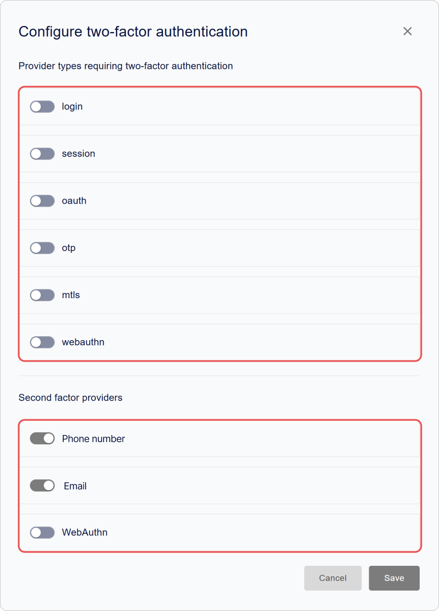
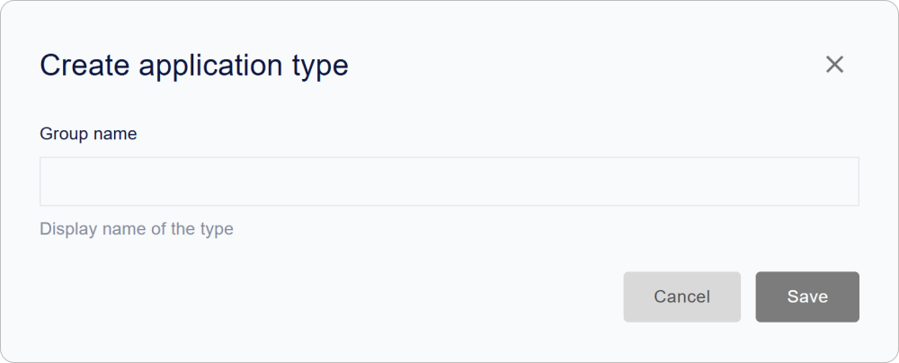

# How to Configure Encvoy ID: Security, Interface, and Access

In this guide, you will learn how to configure the **Encvoy ID** interface and localization, create application types, manage user access, enable two-factor authentication, and integrate the service with Sentry for event monitoring.

This section is intended for administrators and security specialists who want to effectively manage **Encvoy ID** settings, including OAuth 2.0 and OpenID Connect.

**Table of Contents:**

- [Interface and Localization Setup](#interface-and-localization)
- [Security and Access](#security-and-access)
- [Application Types](#application-types)
- [Experimental Features](#experimental-features)
- [See Also](#see-also)

> 💡 System settings are located in the admin panel. To access the panel, the service role **Administrator** is required. [How to open the admin panel →](./docs-02-box-system-install.md#admin-panel-access)

---

## Interface and Localization Setup { #interface-and-localization }

> 💡 Customizing colors, fonts, and the appearance of interface elements is available via the `CUSTOM_STYLES` variable in the `.env` file. More details in the [Environment Variables](./docs-03-box-system-configuration.md#interface-customization) section.

### Configuring System Name and Logo { #system-name-and-logo }

The name and logo are displayed in the **Encvoy ID** interface, as well as in the [mini-widget](./docs-09-common-mini-widget-settings.md) and the [login widget](./docs-06-github-en-providers-settings.md#login-widget-settings).

To configure the name and logo:

1. Go to the admin panel → **Settings** tab.
2. Expand the **Main Information** block.

3. Enter the new name in the **Application Name** field.
4. In the **Application Logo** block, click **Upload** and select the logo file.

   

   > ⚡ Supported formats: JPG, GIF, PNG, WEBP; maximum size 1 MB.

5. Configure the display and click **Apply**.

6. Click **Save**.

> 💡 **Tip:** Use SVG format for a vector logo to ensure a sharp display on all devices and screen resolutions.

### Localization Setup

**Encvoy ID** supports the interface in **six languages**:

- Russian (ru)
- English (en)
- French (fr)
- Spanish (es)
- German (de)
- Italian (it)

The selected language affects the text display across all **Encvoy ID** interfaces, including the [login widget](./docs-06-github-en-providers-settings.md#login-widget-settings) and the [mini-widget](./docs-09-common-mini-widget-settings.md).

If you use [additional user profile fields](./docs-05-box-userfields-settings.md#additional-profile-fields) and [email templates](./docs-04-box-system-settings.md#email-notification-templates) — ensure they are displayed correctly.

#### How to Change the Interface Language

1. Go to the admin panel → **Settings** tab.
2. Expand the **Localization** block and select the required language from the list.

3. Click **Save**.

The language change will occur automatically, without restarting the service or refreshing the page.

> 🚨 **Warning:** After changing the language, all interface texts, including system messages and notifications, will be displayed in the selected language. Ensure your users understand the chosen language.

### Configuring Email Notification Templates { #email-notification-templates }

**Email templates** are email presets that contain predefined formatting and design elements. They are used to create automatic notifications, such as registration emails, password recovery, and other events.

#### What is Mustache?

**Mustache** is a simple template engine for inserting data into text templates. In **Encvoy ID**, it is used for:

- Inserting user data (`{{user.name}}`),
- Dynamic link generation (`{{confirmation_link}}`),
- Conditional block display.

> 🔗 [Official Mustache Documentation](https://mustache.github.io/)

#### Available Email Types

| Email Type                | Event               | Purpose                        |
| ------------------------- | ------------------- | ------------------------------ |
| Registration              | `account_create`    | Welcome email for a new user   |
| Confirmation Code         | `confirmation_code` | Email with a verification code |
| Confirmation Link         | `confirmation_link` | Email with a verification link |
| Password Change           | `password_change`   | Password change notification   |
| Password Recovery Request | `password_recover`  | Email with a verification code |
| Invitation                | `invite`            | Application invitation email   |

#### How to Configure a Template

1. Go to the admin panel → **Settings** tab.
2. Find the **Email Templates** block and click **Configure**.
3. Select the required template and click **Configure**.

4. In the editing form, specify:
   - **Template name**,
   - **Email subject**,
   - **Email content**.

   > 💡 Use HTML markup and variables in the `{{variable_name}}` format. Ensure that the variables used match the available [user profile fields](./docs-05-box-userfields-settings.md#basic-profile-fields) to avoid errors when sending the email.

   

5. Click **Save**.

---

## Security and Access { #security-and-access }

### Access Settings { #access-settings }

#### Two-Factor Authentication { #two-factor-authentication }

Two-factor authentication (2FA) adds an extra layer of protection during login. After entering the first factor (login/password or another authentication method), the user must confirm their identity with a second factor (phone, email, WebAuthn).

##### How to Configure Two-Factor Authentication

1. Go to the admin panel → **Settings** tab.
2. Expand the **Access Settings** block and click **Configure**.

3. Specify the first and second factor providers:
   - **First factor** provider — the primary authentication method (login/password or another authentication method).
   - **Second factor** provider — the identity confirmation method (phone, email, WebAuthn).

   

4. Click **Save**.

#### Ignoring Required Profile Fields During Application Login

Some user profile fields (e.g., phone, email, etc.) may be marked as required in the personal profile.

By default, when authorizing in applications, **Encvoy ID** checks for the presence of all required fields and may suspend login until the user fills in the missing data. The **Ignore required profile fields for applications** setting allows you to disable this check.

This can be useful if the organization uses external user data sources and does not require manual profile completion.

##### What Happens When Enabled

- Users will be able to authorize in applications even if their personal profile is not fully completed.
- The required fields check will not be performed.
- Notifications about incomplete fields will still be displayed in the personal profile interface.

##### How to Enable the Setting

1. Go to the admin panel → **Settings** tab.
2. Expand the **Access Settings** block.
3. Toggle the **Ignore required profile fields for applications** switch.
4. Click **Save**.

After applying the setting, users will be able to pass authorization without checking required profile fields.

> 💡 **Recommendation**: Enable this option only if profile completeness is controlled by other means.

#### Prohibit Identifier Binding

This setting prevents users from independently binding new external identifiers to their profile via the login widget.

To prohibit binding:

1. Go to the admin panel → **Settings** tab.
2. Expand the **Access Settings** block.
3. Activate the **Prohibit identifier binding on the widget form** toggle.
4. Click **Save**.

#### Access Restrictions

This setting allows restricting application login for all users except service **Administrator**. All other users will not be able to authorize.

> 🚨 **Important:** When access restriction is enabled, all users except service administrators will lose the ability to log in. Use this setting for maintenance or emergency situations.

To restrict access:

1. Go to the admin panel → **Settings** tab.
2. Expand the **Access Settings** block.
3. Activate the **Restricted access for all applications** toggle.
4. Click **Save**.

#### Prohibit Registration

This setting allows prohibiting the creation of new accounts in the login widget.

To configure registration prohibition:

1. Go to the admin panel → **Settings** tab.
2. Expand the **Access Settings** block.
3. Select the required setting:
   - **Registration prohibited** — completely blocks the creation of new accounts.
   - **Registration allowed** (default) — standard operation mode, users can create accounts independently.

4. Click **Save**.

### Technical Parameters

Technical settings such as client identifiers, security parameters, authorization URLs, client authentication methods, token parameters, and others are located in the **Application Parameters** section.

Below are the settings available for editing in the admin panel. Other parameters are changed via the [configuration file](./docs-03-box-system-configuration.md).

To change parameters in the admin panel:

1. Go to the admin panel → **Settings** tab.
2. Expand the **Application Parameters** block.
3. Configure the parameters:
   - [Access Restriction](#access-restrictions)
   - [Authentication Time](#authentication-time)
   - [Access Token](#access-token)
   - [Refresh Token](#refresh-token)

4. Click **Save**.

### Parameter Descriptions

#### Main Identifiers

| Name                           | Parameter       | Description                                                                       |
| ------------------------------ | --------------- | --------------------------------------------------------------------------------- |
| **Identifier (client_id)**     | `client_id`     | Unique application identifier                                                     |
| **Secret Key (client_secret)** | `client_secret` | Confidential application key                                                      |
| **Application Address**        | -               | Base URL of the **Encvoy ID** service in the format `protocol://domain_name:port` |

#### Access Restriction

Restricts login to the personal profile only to users with administrative roles.

| Name                  | Description                                                                                            |
| --------------------- | ------------------------------------------------------------------------------------------------------ |
| **Restricted Access** | If enabled, access to the personal profile will be allowed only to users with **Administrator** rights |

#### Redirect URL

| Name               | Parameter      | Description                                                              |
| ------------------ | -------------- | ------------------------------------------------------------------------ |
| **Redirect URI #** | `Redirect_uri` | URL to which the user will be redirected after successful authentication |

#### Logout URL

| Name                           | Parameter                  | Description                                                                                             |
| ------------------------------ | -------------------------- | ------------------------------------------------------------------------------------------------------- |
| **Post-Logout Redirect URI #** | `post_logout_redirect_uri` | URL to which the service will redirect the user after logout. If not specified, `Redirect_uri` is used. |

#### Authentication Request URL

| Name                                         | Parameter      | Description                                                                                                                                       |
| -------------------------------------------- | -------------- | ------------------------------------------------------------------------------------------------------------------------------------------------- |
| **Authentication Request or Recovery URL #** | `request_uris` | List of URLs for hosting JWT authorization requests (`Request Object`). The server retrieves the JWT from the specified URL during authorization. |

#### Response Types

| Name                                | Parameter        | Description                                                                                                                                                                                                                                                                                                                                                        |
| ----------------------------------- | ---------------- | ------------------------------------------------------------------------------------------------------------------------------------------------------------------------------------------------------------------------------------------------------------------------------------------------------------------------------------------------------------------ |
| **Response Types (response_types)** | `response_types` | 
 Determines which tokens and codes are returned by the authorization server:
 
 - `code` — authorization code only  - `id_token` — ID token only   - `code id_token` — code + ID token   - `code token` — code + access token   - `code id_token token` — code + ID token + access token   - `none` — authentication confirmation only 
 |

#### Grant Types

| Name                          | Parameter     | Description                                                                                                                                                                                                                                       |
| ----------------------------- | ------------- | ------------------------------------------------------------------------------------------------------------------------------------------------------------------------------------------------------------------------------------------------- |
| **Grant Types (grant_types)** | `grant_types` | 
 Methods for obtaining authorization: 
 - `authorization code` — secure code via the client server (recommended);   - `implicit` — direct token acquisition (for public clients)   - `refresh_token` — token renewal without re-login |

#### Client Authentication Method

> 💡 The choice of method depends on security requirements and client capabilities. JWT methods provide enhanced security as they do not transmit the secret directly.

| Name                      | Parameter                                                                                             | Description                                                                                                                                                                                                                                                                                                                                                                                                                                      |
| ------------------------- | ----------------------------------------------------------------------------------------------------- | ------------------------------------------------------------------------------------------------------------------------------------------------------------------------------------------------------------------------------------------------------------------------------------------------------------------------------------------------------------------------------------------------------------------------------------------------ |
| **Client Authentication** | `token_endpoint_auth_method`, `introspection_endpoint_auth_method`, `revocation_endpoint_auth_method` | 
 Determines the client authentication method when accessing various endpoints (`token`, `introspection`, `revocation`). 
 Available methods:   - `none` — no credentials;  - `client_secret_post` — credentials in the request body;  - `client_secret_basic` — HTTP Basic Authentication;  - `client_secret_jwt` — JWT signed with the client secret;  - `private_key_jwt` — JWT signed with the client's private key.
 |

#### ID Token Signing Algorithm

| Name                                                              | Parameter                      | Description                                                                                                                                        |
| ----------------------------------------------------------------- | ------------------------------ | -------------------------------------------------------------------------------------------------------------------------------------------------- |
| **Signing Algorithm for ID Token (id_token_signed_response_alg)** | `id_token_signed_response_alg` | 
 Specifies the algorithm used to sign the ID token. 
 `ID token` is a JSON Web Token (JWT) containing claims about the user's authentication |

#### Authentication Time { #authentication-time }

| Name                                                | Parameter           | Description                                                                                   |
| --------------------------------------------------- | ------------------- | --------------------------------------------------------------------------------------------- |
| **Require Authentication Time (require_auth_time)** | `require_auth_time` | If enabled, `auth_time` (the time of the user's last authentication) is added to the ID token |

#### Additional Security Parameters

| Name                                                                                              | Parameter                       | Description                                                                                                                                                                                                                                                                                                                                                                                                                                                 |
| ------------------------------------------------------------------------------------------------- | ------------------------------- | ----------------------------------------------------------------------------------------------------------------------------------------------------------------------------------------------------------------------------------------------------------------------------------------------------------------------------------------------------------------------------------------------------------------------------------------------------------- |
| Parameter for ensuring data transmission security between the client and the authorization server | `require_signed_request_object` | 
Specifies whether a signed `Request Object` is required when sending an authorization request.
 `Request Object` is a way to securely transmit authorization parameters from the client to the authorization server, usually in the form of a JWT (JSON Web Token).
 
When `require_signed_request_object` is enabled, the client must sign the `Request Object` using a pre-agreed signing algorithm specified in the client configuration.
 |

#### User Identifier Transfer Type

| Name                                                       | Parameter      | Description                                                                                                                                                                                    |
| ---------------------------------------------------------- | -------------- | ---------------------------------------------------------------------------------------------------------------------------------------------------------------------------------------------- |
| **User ID Transmission Method in ID Token (subject_type)** | `subject_type` | Determines how the `sub claim` is formed in the ID token: 
 - `public` — the same identifier for all clients   - `pairwise` — a unique identifier for each client, enhancing privacy 
 |

#### Access Token { #access-token }

| Name                                | Parameter          | Description                        |
| ----------------------------------- | ------------------ | ---------------------------------- |
| **Access Token (access_token_ttl)** | `access_token_ttl` | `access_token` lifetime in seconds |

#### Refresh Token { #refresh-token }

| Name                                  | Parameter           | Description                         |
| ------------------------------------- | ------------------- | ----------------------------------- |
| **Refresh Token (refresh_token_ttl)** | `refresh_token_ttl` | `refresh_token` lifetime in seconds |

### Connecting Sentry

**Sentry** is a platform for monitoring application errors and performance.

> 📚 [Official Sentry Resource](https://sentry.io/welcome/)

Connecting **Sentry** allows you to:

- track errors and exceptions in real-time;
- obtain event traces by user;
- analyze system performance.

#### How to Connect Sentry

##### Step 1. Creating a Project in Sentry

1. Go to [Sentry.io](https://sentry.io/welcome/).
2. Register or log in to your account.
3. Create a new project.

After creating the project, **Sentry** will provide a **DSN (Data Source Name)** — a unique identifier for connecting **Encvoy ID** to **Sentry**.

> 💡 **Tip**: Copy the **DSN (Data Source Name)** so you don't lose it when moving to the next step.

##### Step 2. Connecting Sentry

To connect **Sentry**:

1. Go to the admin panel → **Settings** tab.
2. Find the **Sentry** block and click **Configure**.
3. In the connection form, specify:
   - **DSN** — the unique identifier created in **Step 1**.
   - **Active** — enable to start sending errors and traces to **Sentry**.
   - **User ID** (if necessary) — specify if you need to track errors and events by specific users.

     

4. Click **Save**.

### Event Log

In the **Log**, you can see where and from which devices users accessed the personal profile or applications.

Detailed information is available for each event.

| Parameter         | Content                              |
| ----------------- | ------------------------------------ |
| **Event Header**  | Action category                      |
| **Date and Time** | Exact timestamps                     |
| **Application**   | Application identifier (`client_id`) |
| **User**          | User identifier (`id`)               |
| **Device**        | Device type and browser              |
| **Location**      | IP address                           |

#### How to Access the Log

1. Go to the admin panel.
2. Open the **Event Log** tab.

---

## Application Types { #application-types }

**Application types** are categories for systematizing applications in the **[catalog](./docs-12-common-personal-profile.md#application-catalog)**. They help organize the structure and simplify user navigation.

**Why types are needed**:

- Help group applications by category
- Simplify searching for required applications
- Help organize the catalog structure

### Creating an Application Type { #creating-app-type }

1. Go to the admin panel → **Settings** tab.
2. Find the **Application Types** block and click **Configure**.
3. In the window that appears, click the **Create** button .
4. The creation form will open.

5. Specify the type name.

   > 💡 The type name must be unique within the system.

6. Click **Save**.

   The created type will appear in the list.

> 💡 Type assignment is performed when [creating an application](./docs-10-common-app-settings.md#creating-application).

### Editing an Application Type

1. Go to the admin panel → **Settings** tab.
2. Find the **Application Types** block and click **Configure**.
3. A window with the list of types will open.

4. Click the **Configure** button on the panel of the type you want to edit.
5. The editing form will open.
6. Make the necessary changes.
7. Click **Save**.

> 💡 After editing a type, all associated applications automatically receive the updated category name.

### Deleting an Application Type

1. Go to the admin panel → **Settings** tab.
2. Find the **Application Types** block and click **Configure**.
3. A window with the list of types will open.
4. Click the **Delete** button  on the panel of the type you want to delete.

Deletion occurs without additional confirmation.

> 💡 After deletion, the type will be removed from the catalog, and applications assigned to it will automatically receive the **Other** type.

---

## Experimental Features { #experimental-features }

**Experimental features** are new capabilities of the **Encvoy ID** service that are in the testing and refinement stage.

**Main characteristics:**

- Regulated by the service administrator
- Functionality may change without prior notice
- May contain undocumented operational features
- Performance and stability may differ from core features

The experimental features section is available at: `https://ID_HOST/experimental`.

> 🚧 **Status**: Experimental features may be removed, changed, or moved to core functionality without prior notice.

#### Available Features

1. **User Business Card**
   - Digital analog of a business card with contact details
   - vCard format support for export
   - Ability to share via link or QR code

   [More about the business card →](./docs-12-common-personal-profile.md#digital-business-card)

2. **Application Catalog**
   - Centralized platform for **Encvoy ID** system applications
   - Features a convenient category system
   - Ability to add applications to favorites

   [More about the catalog →](./docs-12-common-personal-profile.md#application-catalog)

   

---

## See Also { #see-also }

- [Configuring Password Policy and User Profile](./docs-05-box-userfields-settings.md) — guide for configuring user profiles.
- [Login Methods and Login Widget Configuration](./docs-06-github-en-providers-settings.md) — guide for connecting and configuring external authentication services.
- [Application Management](./docs-10-common-app-settings.md) — guide for creating, configuring, and managing OAuth 2.0 and OpenID Connect (OIDC) applications.
