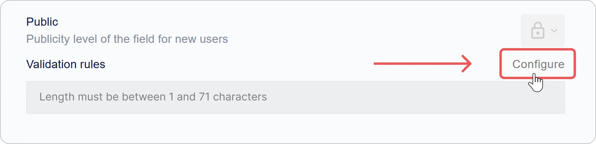
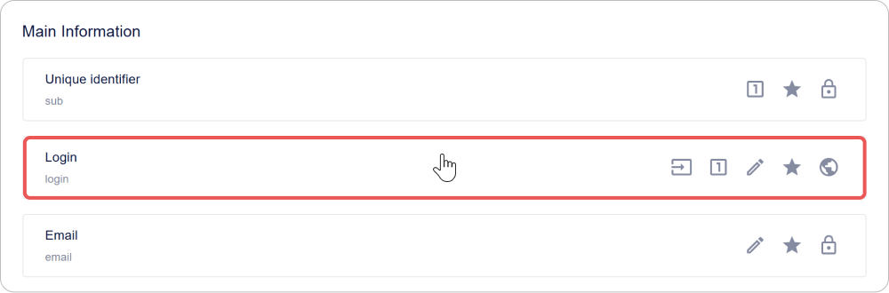
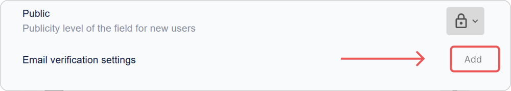
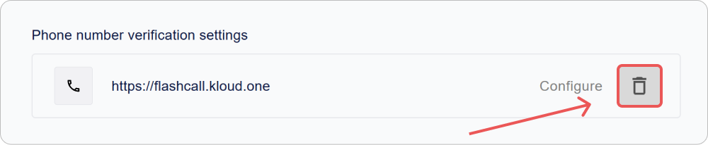

# How to Configure the Encvoy ID User Profile

In this guide, we will explain how to configure the user profile and password policy in **Encvoy ID**. You will learn how to manage profile fields, field validation, and set up email address and phone number confirmation.

**Table of Contents:**

- [Password Policy](#password-policy)
- [Basic Profile Fields](#basic-profile-fields)
- [Additional Profile Fields](#additional-profile-fields)
- [Profile Field and Password Validation Rules](#validation-rules)
- [Email Confirmation Settings](#email-confirmation-settings)
- [Phone Number Confirmation Settings](#phone-confirmation-settings)
- [See Also](#see-also)

> 📌 User profile settings are located in the admin panel. To access the panel, the **Administrator** service role is required. [How to open the admin panel →](./docs-02-box-system-install.md#admin-panel-access)

---

## Password Policy { #password-policy }

**Password policy in Encvoy ID** is a set of rules defining requirements for the complexity and security of user passwords. It helps protect accounts from hacking and unauthorized access.

The established rules are applied:

- when creating a password in the registration widget,
- when resetting a password in the login widget,
- when changing a password in the user profile.

### How to Configure Password Policy Rules

1. Go to the admin panel → **Settings** tab.
2. Expand the **User Profile Settings** block and click on the **Password** panel.

3. In the window that appears, click **Configure**.

4. A window with a list of available validation rules will open.

   > 🔗 For information on creating and configuring profile field validation rules, read the [User Profile Field Validation Rules](#validation-rules) instructions.

5. Check the boxes for the rules you want to apply to the password.

6. Close the rules list window.
7. Click **Save** in the field editing form.

Changes are applied automatically.

Now, the rules you selected will be used to verify the user's password complexity.

> ⚠️ **Note**: New rules apply only to passwords being created or changed. Existing passwords remain unchanged.

### Security Recommendations

To ensure robust account protection, it is recommended to enable the following parameters:

| Recommendation                                  | Rule Example                                  |
| ----------------------------------------------- | --------------------------------------------- |
| Minimum password length — at least 8 characters | `Minimum length = 8`                          |
| Use of different cases                          | `Contains lowercase and uppercase characters` |
| Mandatory presence of digits                    | `Contains at least one digit`                 |
| Mandatory presence of special characters        | `Contains special characters (!@#$% etc.)`    |

---

## Basic User Profile Fields { #basic-profile-fields }

**Basic profile fields** are mandatory system attributes created automatically for every user upon registration. They form the base structure of the profile and ensure the correct operation of authentication, identification, and cross-system communication mechanisms.

### List of Basic Fields

> 📌 The list of basic fields is fixed. Adding, renaming, or deleting these fields is not available.

| Field                     | Identifier                  |
| ------------------------- | --------------------------- |
| Identifier                | `sub`                       |
| Login                     | `login`                     |
| Email                     | `email`                     |
| First Name                | `given_name`                |
| Last Name                 | `family_name`               |
| Phone                     | `phone_number`              |
| Date of Birth             | `birthdate`                 |
| Nickname                  | `nickname`                  |
| Photo                     | `picture`                   |
| Data Processing Agreement | `data_processing_agreement` |

### Setting Indicators

In the interface, a quick view of field settings is available for each field in the form of identifiers:

| Icon                                                          | Parameter                                   |
| ------------------------------------------------------------- | ------------------------------------------- |
|  | Field is available for the user to edit     |
|    | Field is mandatory to fill                  |
|      | Field value must be unique                  |
|      | Field publicity level                       |
|       | Field can be used as a login during sign-in |

### How to Configure a Basic Field

1. Go to the admin panel → **Settings** tab.
2. Expand the **User Profile Settings** block.
3. Click on the panel of the field you need to configure.

" style="max-width:600px; width:100%">

4. In the form that opens, specify:
   - [parameters](#basic-field-parameters),
   - [validation rules](#validation-rules).

5. Save the changes in the editing form.

### Basic Field Parameters { #basic-field-parameters }

| Name                                   | Description                                                                                                                                                                                                                                                                                                                                                                                                                                                                                |
| -------------------------------------- | ------------------------------------------------------------------------------------------------------------------------------------------------------------------------------------------------------------------------------------------------------------------------------------------------------------------------------------------------------------------------------------------------------------------------------------------------------------------------------------------ |
| **Name**                               | Field name. Not editable.                                                                                                                                                                                                                                                                                                                                                                                                                                                                  |
| **Field description**                  | Field name in the interface. Not editable.                                                                                                                                                                                                                                                                                                                                                                                                                                                 |
| **Use as login**                       | Allows authorization using this field. Available for configuration in **Login**, **Email**, and **Phone Number** fields.                                                                                                                                                                                                                                                                                                                                                                   |
| **Active**                             | Determines the mandatory presence of the field in the user profile. Immutable parameter.                                                                                                                                                                                                                                                                                                                                                                                                   |
| **Editable**                           | Allows the user to change the field value in their profile.                                                                                                                                                                                                                                                                                                                                                                                                                                |
| **Required**                           | Requires the field to be filled during registration or login. Authentication is impossible without it.                                                                                                                                                                                                                                                                                                                                                                                     |
| **Unique**                             | Checks that the field value is not repeated across all profiles.                                                                                                                                                                                                                                                                                                                                                                                                                           |
| **Public**                             | 
 Determines who can access the user data: 
 - **Available only to you** — data is private and accessible only to the user.   - **Available on request** — user data is available to third-party systems after their consent;   - **Available to everyone** — data is always public for third-party systems, does not require consent for access. Data will be transmitted to the third-party system via email hash (similar to the [Gravatar](https://gravatar.com/) service). |
| **Email verification settings**        | 
Intended for configuring parameters for email address confirmation in the user profile.
 🔗 Detailed description of settings in the [Email Confirmation Settings](./docs-05-box-userfields-settings.md#email-confirmation-settings) instructions.                                                                                                                                                                                                                                    |
| **Phone number verification settings** | 
Intended for configuring parameters for phone number confirmation in the user profile.
 🔗 Detailed description of settings in the [Phone Number Confirmation Settings](./docs-05-box-userfields-settings.md#phone-confirmation-settings) instructions.                                                                                                                                                                                                                              |
| **Validation rules**                   | 
A set of rules for checking the correctness of entered data.
 🔗 Detailed description in the [Validation Rules Configuration](./docs-05-box-userfields-settings.md#validation-rules) instructions.                                                                                                                                                                                                                                                                                   |

---

## Additional User Profile Fields { #additional-profile-fields }

**Additional profile fields** are custom attributes that can be created to store any specific data not included in the standard set.

They help adapt the profile to specific tasks:

- store internal identifiers, job titles, roles, departments, etc.
- data verification statuses and other business attributes.

### Setting Indicators

In the interface, a quick view of field settings is available for each field in the form of identifiers:

| Icon                                                           | Parameter                               |
| -------------------------------------------------------------- | --------------------------------------- |
|   | Field is available for the user to edit |
|     | Field is mandatory to fill              |
|       | Field value must be unique              |
|       | Field publicity level                   |
|  | Field activity                          |

### Adding an Additional Field

1. Go to the admin panel → **Settings** tab.
2. Expand the **User Profile Settings** block.
3. Click the **Add** button in the **Additional Information** section.
4. In the form that opens, specify:
   - [parameters](#additional-field-parameters),
   - [validation rules](#validation-rules).

5. Click **Save**.

### Editing an Additional Field

1. Go to the admin panel → **Settings** tab.
2. Expand the **User Profile Settings** block.
3. Click on the panel with the additional field whose settings need to be changed.
4. In the form that opens, edit the parameters and validation rules.
5. Click **Save**.

> 💡 Changes take effect immediately and apply to all profiles where this field is used.

### Deleting an Additional Field

1. Go to the admin panel → **Settings** tab.
2. Expand the **User Profile Settings** block.
3. Click the **Delete** button  next to the field you want to delete.

> ⚠️ **Note**: When a field is deleted, all user data stored in it will be permanently lost.

### Additional Field Parameters { #additional-field-parameters }

| Name                  | Description                                                                                                                                                                                                                                                                                                                                                                                                                                                                                      |
| --------------------- | ------------------------------------------------------------------------------------------------------------------------------------------------------------------------------------------------------------------------------------------------------------------------------------------------------------------------------------------------------------------------------------------------------------------------------------------------------------------------------------------------ |
| **Field description** | Field name in the system                                                                                                                                                                                                                                                                                                                                                                                                                                                                         |
| **Active**            | Determines if the field is displayed in the user profile                                                                                                                                                                                                                                                                                                                                                                                                                                         |
| **Editable**          | Allows the user to change the field value independently                                                                                                                                                                                                                                                                                                                                                                                                                                          |
| **Required**          | Requires the field to be filled during registration or login. Without a filled field, the user will not be able to log in.                                                                                                                                                                                                                                                                                                                                                                       |
| **Unique**            | Checks that the value is not repeated across all profiles                                                                                                                                                                                                                                                                                                                                                                                                                                        |
| **Public**            | 
 Configures who the field will be available to: 
 - **Available only to you** — data is private and accessible only to the user.   - **Available on request** — user data is available to third-party systems after their consent;   - **Available to everyone** — data is always public for third-party systems, does not require consent for access. Data will be transmitted to the third-party system via email hash (similar to the [Gravatar](https://gravatar.com/) service). |
| **vCard attribute**   | Allows mapping the field to an attribute when exporting the profile to vCard format                                                                                                                                                                                                                                                                                                                                                                                                              |
| **Default value**     | Sets a pre-filled value when creating a profile                                                                                                                                                                                                                                                                                                                                                                                                                                                  |
| **Validation rules**  | 
Define the logic for checking the entered value.
 🔗 More details in the [Validation Rules Configuration](./docs-05-box-userfields-settings.md#validation-rules) instructions.                                                                                                                                                                                                                                                                                                             |

---

## Profile Field and Password Validation Rules { #validation-rules }

**Field validation rules** are a set of checks by which the system evaluates the correctness of data entered by the user.

You can set your own rules for:

- account password,
- [basic profile fields](#basic-profile-fields),
- [additional profile fields](#additional-profile-fields).

Such checks allow for improved data quality, for example, preventing incorrect email addresses, phone numbers, or passwords without special characters.

Defined validation rules are displayed in the interface. For example, in the profile editing form, a special icon appears near a basic or additional field; hovering over it opens the list of defined rules.

### Creating a Rule

1. Go to the admin panel → **Settings** tab.
2. Expand the **User Profile Settings** block.
3. Click on the panel with the password, basic, or additional field.

4. The editing form will open.
5. Click **Configure** in the **Validation rules** section.

6. In the validation rules list window that opens, click the **Add** button .
7. The rule creation form will open.

8. Fill in the rule fields:
   - **Name**;
   - **Error text** — the message that will be displayed when the rule is triggered;
   - **Regular expression** — the expression that the value in the field must match;
   - **Active** — when enabled, this rule can be selected for field validation. Inactive rules are unavailable for selection and are ignored during field value checks.

9. Click **Save**.

The created rule will be added to the rules list and become available for field validation configuration.

### Editing a Rule

1. Go to the admin panel → **Settings** tab.
2. Expand the **User Profile Settings** block.
3. Click on the panel with the basic or additional field.
4. The editing form will open.
5. Click **Configure** in the **Validation rules** section.
6. The validation rules list window will open.
7. On the rule panel, click the **Configure** button.

8. In the editing form that opens, change the necessary fields.
9. Click **Save**.

### Deleting a Rule

1. Go to the admin panel → **Settings** tab.
2. Expand the **User Profile Settings** block.
3. Click on the panel with the basic or additional field.
4. The editing form will open.
5. Click **Configure** in the **Validation rules** section.
6. The validation rules list window will open.
7. On the rule panel, click the **Delete** button .

Changes are applied automatically.

### How to Add a Rule to a User Profile Field

To configure validation rules in a basic or additional field:

1. Go to the admin panel → **Settings** tab.
2. Expand the **User Profile Settings** block.
3. Click on the panel with the basic or additional field.
4. The editing form will open.
5. Click **Configure** in the **Validation rules** section.

6. The validation rules list window will open.

7. Check the box next to the rules you want to apply to the selected field.
8. Close the rules list window.

Changes are applied automatically.

---

## Email Confirmation Settings { #email-confirmation-settings }

**Email confirmation in Encvoy ID** is a mechanism for verifying the validity of the address provided by the user during registration, authorization, or profile data modification.

After the address is provided, the system sends an email with a confirmation code or a unique link.
The user must follow the link or enter the code — after this, the address is considered confirmed.

This verification ensures:

- protection against registration with incorrect or someone else's addresses;
- account access security;
- the ability to use email for access recovery and notifications;
- control over the relevance of user contact data.

Email confirmation settings are defined by the administrator and include mail server parameters (SMTP), sender address, confirmation code time-to-live, and other technical parameters.

> 💡 **Tip**: Before saving settings, ensure that the specified SMTP parameters are correct — if there is an error, the system will not be able to send emails.

### Adding a Setting

1. Go to the admin panel → **Settings** tab.
2. Expand the **User Profile Settings** block.
3. Click on the **Email** panel.
4. The editing form will open.
5. In the **Email verification settings** section, click **Add**.

6. In the window that opens, specify the parameters:

   | Parameter                        | Description                                                                   |
   | -------------------------------- | ----------------------------------------------------------------------------- |
   | **Primary email address**        | The email address from which automatic emails will be sent                    |
   | **Outgoing mail server address** | SMTP server address                                                           |
   | **Outgoing mail server port**    | Port for the SMTP server                                                      |
   | **Email password**               | Regular password or app password created in the mail service account settings |
   | **Use for code-based login**     | Email will be used for logging into applications using one-time passwords     |
   | **Email image**                  | Icon that will be displayed in the **Encvoy ID** service interface            |
   | **Verification code TTL**        | Time-to-live for email address confirmation codes in seconds                  |

7. Click **Save**.

### Editing a Setting

1. Go to the admin panel → **Settings** tab.
2. Expand the **User Profile Settings** block.
3. Click on the **Email** panel.
4. The editing form will open.
5. In the **Email verification settings** section, click the **Configure** button.

6. The editing form will open.
7. Make the necessary changes.
8. Click **Save**.

### Deleting a Setting

1. Go to the admin panel → **Settings** tab.
2. Expand the **User Profile Settings** block.
3. Click on the **Email** panel.
4. The editing form will open.
5. Click the **Delete** button  in the **Email verification settings** section.

6. Confirm the action in the modal window.

---

## Phone Number Confirmation Settings { #phone-confirmation-settings }

**Phone number confirmation in Encvoy ID** is a mechanism for verifying the validity of the contact number provided by the user during registration, login, or profile modification.

After entering the number, the system sends the user a verification code or initiates an automatic call. The user enters the received code, confirming that the specified number indeed belongs to them.

This verification performs several key functions:

- prevents the use of invalid or someone else's numbers;
- provides an additional layer of account protection;
- allows using the number for login via one-time code;
- ensures correct operation of security-related notifications.

In the current version of **Encvoy ID**, number confirmation is implemented through integration with the [Call Authorization](https://kloud.one/id/) service of the **Kloud.One** platform. For this mechanism to work, you need to configure the connection to **Kloud.One** by specifying the client ID and secret.

> 💡 **Tip:** Before saving the setting, ensure that the application is correctly registered in **Kloud.One** and the provided data (`client_id` and `client_secret`) are valid. Without this, number confirmation will not work.  

> 📚 [Kloud.One Documentation](https://docs.kloud.one)

### Adding a Setting

1. Go to the admin panel → **Settings** tab.
2. Expand the **User Profile Settings** block.
3. Click on the **Phone Number** panel.
4. The editing form will open.
5. In the **Phone number verification settings** section, click **Add**.

6. In the window that appears, set the necessary parameters:

   | Parameter                               | Name            | Description                                                                                                                      |
   | --------------------------------------- | --------------- | -------------------------------------------------------------------------------------------------------------------------------- |
   | **Base authorization address (issuer)** | `issuer`        | Address of the [Call Authorization](https://kloud.one/id/) application. In the current version — `<https://flashcall.kloud.one>` |
   | **Client ID (client_id)**               | `client_id`     | Identifier of the application created in the [Call Authorization](https://kloud.one/id/) service                                 |
   | **Client secret (client_secret)**       | `client_secret` | Secret key of the application created in the [Call Authorization](https://kloud.one/id/) service                                 |
   | **Use for code-based login**            | -               | Phone number will be used for logging into applications using one-time passwords                                                 |
   | **Phone image**                         | -               | Icon that will be displayed in the **Encvoy ID** service interface                                                               |

7. Click **Save**.

### Editing a Setting

1. Go to the admin panel → **Settings** tab.
2. Expand the **User Profile Settings** block.
3. Click on the **Phone Number** panel.
4. The editing form will open.
5. In the **Phone number verification settings** section, click **Configure**.
6. The editing form will open.
7. Make the necessary changes.
8. Click **Save**.

### Deleting a Setting

1. Go to the admin panel → **Settings** tab.
2. Expand the **User Profile Settings** block.
3. Click on the **Phone Number** panel.
4. The editing form will open.
5. Click the **Delete** button  in the **Phone number verification settings** section.

6. Confirm the action in the modal window.

---

## See Also { #see-also }

- [Login Methods and Login Widget Configuration](./docs-06-github-en-providers-settings.md) — guide on connecting and configuring external authentication services.
- [Application Management](./docs-10-common-app-settings.md) — guide on creating, configuring, and managing OAuth 2.0 and OpenID Connect (OIDC) applications.
- [User Management](./docs-08-box-manage-users.md) — guide on managing user accounts.
