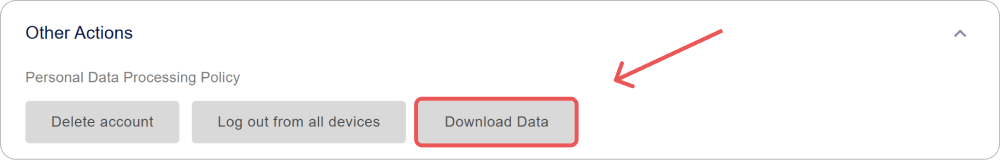
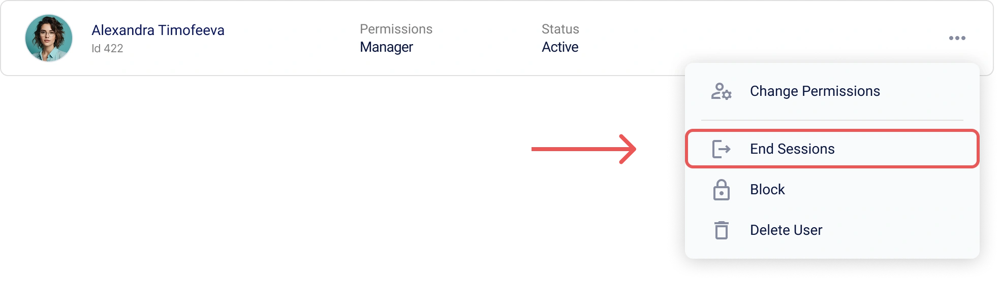
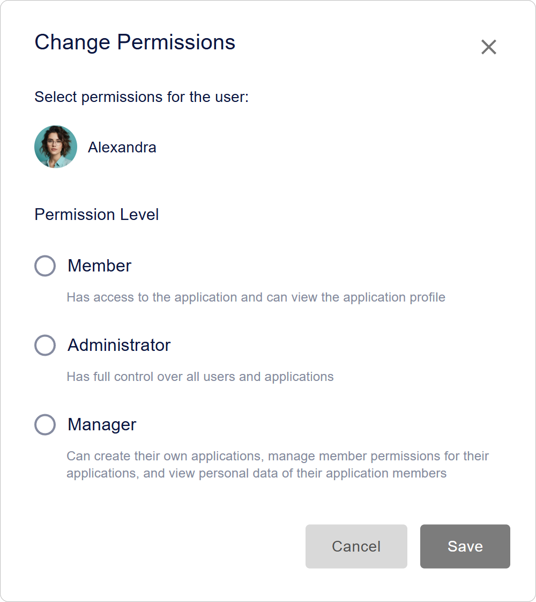
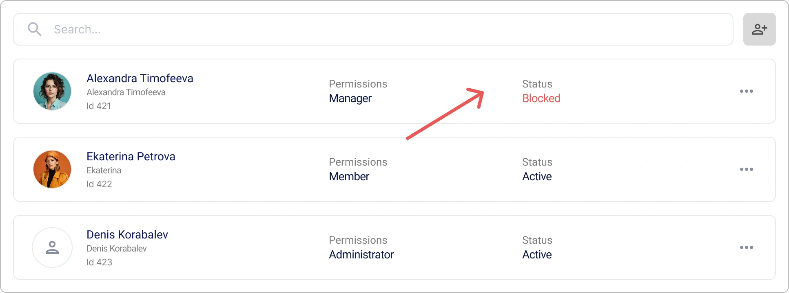
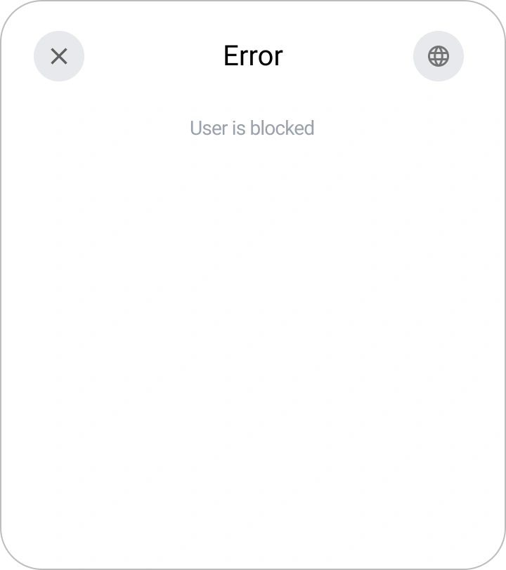

# User Management in Encvoy ID

In this guide, you will learn how to create and edit user profiles in **Encvoy ID**, assign roles and access rights, block and delete accounts, terminate active sessions, manage privacy, and export profile data.

**Table of Contents:**

- [Overview and Basic Actions](#overview-and-basics)
- [Profile Data Management](#profile-data-management)
- [Access and Security](#access-and-security)
- [Account Status](#account-status)
- [Deleting a User](#deleting-user)
- [See Also](#see-also)

---

## Overview and Basic Actions { #overview-and-basics }

### About the "Users" Section

The list of all users registered in **Encvoy ID** is located in the **Users** section. Here, administrators can manage accounts, view profiles, and control system access.

> ⚠️ **Access Requirements**: This section is available in the admin panel for users with **Administrator** system permissions.

### Creating a User in Encvoy ID

> 📌 In **Encvoy ID**, there are several ways to register users: self-registration via a widget and manual creation by a user with **Administrator** rights.

In this instruction, we will cover how to manually create a user:

1. Go to the admin panel → **Users** tab.
2. Click the **Create User** button .
3. The user creation form will open.
4. Fill in the profile fields on the form:
   - **Public Name** — the user's display name in the system;
   - **First Name** — the user's first and middle names;
   - **Last Name** — the user's last name;
   - **Login** — must be unique for the service; can be used for future authorization;
   - **Email** — the address must be unique for the service; can be used for future authorization;
   - **Phone Number** — must be unique for the service; can be used for future authorization;
   - **Password** — must comply with the password policy specified in the service settings.

     > 🔗 For more details, see the [Password Policy Configuration](./docs-05-box-userfields-settings.md#password-policy) guide.

   - **Date of Birth**;
   - **Profile Photo**.

5. Click **Save**.

   > 💡 A user profile may contain [additional fields](./docs-05-box-userfields-settings.md#password-policy).

   > 📌 Field validation is performed according to validation rules. For more details, see the [Field Validation Rules](./docs-05-box-userfields-settings.md#validation-rules) guide.

### Viewing and Editing a User Profile

#### Viewing a User Profile

To get detailed information about an account, open its profile.

1. Go to the admin panel → **Users** tab.
2. Click on the panel of the user whose profile you want to view.
3. The user profile will open with detailed information: contact details, identifiers, and privacy settings.


#### Editing Profile Data

To make changes to a user profile:

1. Go to the admin panel → **Users** tab.
2. Open the user profile.
3. Click **Edit** in the **Main Information** block.
4. In the **Edit User** form that opens, make the necessary changes.

   > 📌 Field validation is performed according to validation rules. For more details, see the [Field Validation Rules](./docs-05-box-userfields-settings.md#validation-rules) guide.

5. Click **Save**.

---

## Profile Data Management { #profile-data-management }

### Managing Profile Identifiers

The **Identifiers** section of the user profile displays the login methods that the user added themselves or used to log into the application or the **Encvoy ID** personal account. The administrator can configure the privacy of an identifier and remove it from the user profile.

> 💡 **Important:** Only the account owner can add new identifiers. For more details, see the [External Service Identifiers](./docs-12-common-personal-profile.md#external-service-identifiers) guide.

To delete an identifier:

1. Go to the admin panel → **Users** tab.
2. Open the user profile.
3. Click **Delete** on the panel of the login method you want to remove from the profile.


The identifier will be immediately removed from the profile.

### Configuring Profile Field Privacy

For each profile field, you can set a privacy level that determines who can see this information. Settings are available for basic and additional user data, as well as for login methods.

#### Privacy Levels

| Level                     | Icon                                                | Description                                                                                                               |
| ------------------------- | --------------------------------------------------- | ------------------------------------------------------------------------------------------------------------------------- |
| **Available only to you** |         | Data is not transferred to third-party systems and is accessible only to the user.                                        |
| **Available on request**  |  | Data is available in third-party systems integrated with **Encvoy ID**. <br> User consent is required to access the data. |
| **Available to everyone** |        | Data is always public. User consent is not required to access it.                                                         |

#### How to Change Profile Field Privacy

1. Go to the admin panel → **Users** tab.
2. Open the user profile.
3. Click on the current privacy icon next to the field.
4. Select a new level from the dropdown menu.


The change is applied instantly.

### Exporting Profile Data

**Encvoy ID** allows you to export all profile data in JSON format.

To download profile data:

1. Go to the admin panel → **Users** tab.
2. Open the user profile.
3. Expand the **Other Actions** block.



4. Select the **Download Data** action.
5. The JSON file download will start automatically.

#### Exported File Structure

The exported file contains a complete list of user data:

```json
{
  "user": {
    "id": 1573,
    "email": "ivanov.petr89@mail.com",
    "birthdate": "1992-11-14T15:22:11.123Z",
    "family_name": "Иванов",
    "given_name": "Петр",
    "nickname": "Петя",
    "login": "petr_ivanov92",
    "phone_number": "+79991234567",
    "picture": "public/images/profile/3f7b21d8e4c2a6f1b2c9d3a0e5f7b1c4",
    "public_profile_claims_oauth": "id email family_name given_name picture",
    "public_profile_claims_gravatar": "family_name given_name email picture",
    "blocked": false,
    "deleted": null,
    "custom_fields": {
      "country": "Russia"
    },
    "password_updated_at": "2025-10-12T08:45:33.222Z"
  },
  "role": "ADMIN"
}
```

---

## Access and Security { #access-and-security }

### Terminating User Sessions

The function to forcibly terminate all active sessions is an important security tool. Use it in case of a lost device, suspicion of account compromise, or to immediately refresh access tokens.

> 📌 This operation immediately invalidates all access and refresh tokens for the user, ending all their current sessions across all applications. The user will be required to log in again.

#### How to Terminate User Sessions

**Method 1: From the General User List**

1. Go to the admin panel → **Users** tab.
2. Click **End Sessions** in the user action menu.



**Method 2: From the User Profile**

1. Go to the admin panel → **Users** tab.
2. Click **End Sessions** in the user profile within the **Other Actions** block.


**What Happens After Confirmation:**

- **All active sessions** of the user are terminated.
- **Access tokens** (`access_token`) become invalid.
- **Refresh tokens** (`refresh_token`) are revoked.
- The user will be required to **log in again** the next time they access the application.

> 📌 This operation does not block the user. They will be able to authorize again.

### Assigning and Changing User Permissions

Encvoy ID uses a three-level access system that clearly defines user rights:

- **Member** — the basic role. Allows managing one's own profile, configuring personal data access permissions, and using the account to log into integrated applications.
- **Manager** — the administrator role for a specific organization or department. Manages users and application access within their organizational unit.
- **Administrator** — the role with maximum privileges. Provides full access to all platform functions, including global security settings and management of all organizations.

Below are instructions for assigning **Manager** and system **Administrator** roles.

#### Assigning "Manager" Permissions

1. Go to the admin panel → **Users** tab.
2. Open the action menu by clicking the **More** button for the user whose rights you want to change.
3. Select the **Change Permissions** action.


4. In the window that opens, select the **Manager** role and click **Save**.



The user will receive the selected role and its corresponding rights.

#### Assigning System "Administrator" Permissions

1. Go to the admin panel → **Users** tab.
2. Open the action menu by clicking the **More** button for the user whose rights you want to change.
3. Select the **Change Permissions** action.
4. In the window that opens, select the **Administrator** role and click **Save**.

The user will receive the selected role and its corresponding rights.

> 🔍 To assign **Administrator** permissions for an application, use the [instruction](./docs-10-common-app-settings.md#assigning-app-administrator).

---

## Account Status { #account-status }

### Blocking Encvoy ID Users

Blocking prevents access to all services that use **Encvoy ID** for login.

To block a user:

1. Open the action menu for an active user in one of the interfaces:
   - In the user action menu within the [application profile](./docs-10-common-app-settings.md#viewing-application).
   - In the user action menu on the **Users** tab.

   

2. Select the **Block in Encvoy ID** action.
3. Confirm the action in the modal window.


**What Happens After Blocking**:

- The user's status will change to **Blocked**.

    

- The blocked user will not be able to log into the service or applications.

  When attempting to log in, the following widget will be displayed:

    

### Unblocking Encvoy ID Users

To unblock a user:

1. Open the action menu for a blocked user in one of the interfaces:
   - In the user action menu within the [application profile](./docs-10-common-app-settings.md#viewing-application).
   - In the user action menu on the **Users** tab.

2. Select the **Unblock in Encvoy ID** action.
3. Confirm the action in the modal window.

After confirming the action, the user's status will change to **Active**.

---

## Deleting a User { #deleting-user }

An administrator can permanently delete a user. Once deletion is confirmed, the account and all data will disappear irrevocably. The user will lose access to all applications where their **Encvoy ID** account was used.

> 💡 A user can independently delete their account through their personal profile. Deletion is implemented with a **delay mechanism**. Within a certain period, the user can restore access to their account. You can learn more about this in the [User Profile](./docs-12-common-personal-profile.md) guide.

### How to Delete a Encvoy ID User

> 💡 **Alternative**: Consider **blocking the account** instead of deleting it if there is a possibility of restoring access.

To delete a user:

1. Click **Delete account** in one of the interfaces:
   - In the user action menu on the **Users** tab.

      

   - In the user profile within the **Other Actions** block.

      

2. Confirm the action in the modal window.

After confirmation, the user will be deleted.

**What Happens After Deletion**:

- Applications where the deleted user is the sole owner will be irrevocably deleted.
- All account data is erased without the possibility of recovery after final deletion.
- The user loses access to all integrated services.

---

## See Also { #see-also }

- [Personal Profile and Application Permission Management](./docs-12-common-personal-profile.md) — a guide to managing your personal profile.
- [Application Management](./docs-10-common-app-settings.md) — a guide to creating, configuring, and managing OAuth 2.0 and OpenID Connect (OIDC) applications.
- [Organization Management](./docs-02-box-system-install.md) — a guide to working with organizations in **Encvoy ID**.
