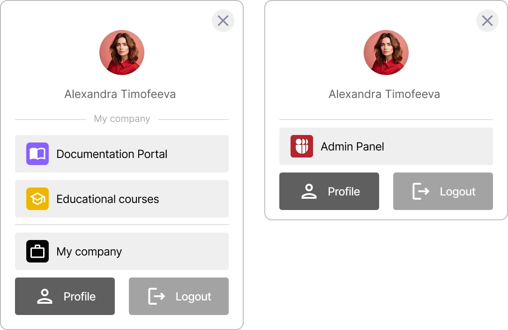

# How to Configure and Connect the Encvoy ID Mini-widget

In this guide, you will learn how to connect and configure the **Encvoy ID** mini-widget on your web resource. You will learn how to set up authentication parameters, user profile display, login buttons, and menus, as well as customize the widget's appearance to harmonize with your project's design.

**Table of Contents:**

- [What is a mini-widget?](#what-is-mini-widget)
- [Widget Configuration](#widget-configuration)
- [Profile Display Settings](#profile-display-settings)
- [Login Button Settings](#login-button-settings)
- [Menu Button Parameters](#menu-button-parameters)
- [Mini-Widget Styling](#mini-widget-styling)
- [Individual Menu Button Styling](#individual-menu-button-styling)
- [See Also](#see-also)

---

## What is a mini-widget? { #what-is-mini-widget }

A **mini-widget** is a menu containing user data and essential functions. It provides access to the profile, admin panel, organizations or small office, and system logout. You can also place an application here for quick access. The widget opens when clicking the user's avatar in the top right corner of the screen.

The mini-widget is a lightweight JavaScript component for user authentication in the **Encvoy ID** service. It operates based on OIDC/OAuth2 and PKCE standards and can be embedded into any websites or interfaces — from simple HTML to SPAs on React or Vue.

> 💡 To add an application to the mini-widget, enable the **Display in Mini-Widget** toggle in the [application settings](./docs-10-common-app-settings.md).

Widget examples:



---

## Widget Configuration { #widget-configuration }

### Required Parameters

For basic widget operation, three key parameters must be specified:

| Parameter     | Type     | Description                              | Example                         |
| ------------- | -------- | ---------------------------------------- | ------------------------------- |
| `appId`       | `string` | Unique application identifier in Trusted | `"MTnOOTdx85FgNbOFy2nUsH"`      |
| `backendUrl`  | `string` | Your backend API URL                     | `"http://localhost:3001"`       |
| `redirectUrl` | `string` | URL for redirection after authorization  | `"http://localhost:3000/login"` |

### Optional Parameters

Optional parameters are available for advanced configuration:

| Parameter             | Type                  | Description                         | Default Value                 |
| --------------------- | --------------------- | ----------------------------------- | ----------------------------- |
| `issuer`              | `string`              | Trusted SSO server URL              | `"https://id.kloud.one"`      |
| `withOutHomePage`     | `boolean`             | Automatic redirect to authorization | `false`                       |
| `getTokenEndPoint`    | `string`              | Endpoint for obtaining a token      | `"/api/oidc/token"`           |
| `getUserInfoEndPoint` | `string`              | Endpoint for obtaining user data    | `"/api/oidc/me"`              |
| `scopes`              | `string[]`            | OAuth2 permissions                  | `["openid", "lk", "profile"]` |
| `profile`             | `IProfileConfig`      | User profile settings               | See section below             |
| `loginButton`         | `ICustomMenuButton`   | Login button settings               | See section below             |
| `menuButtons`         | `ICustomMenuButton[]` | Array of additional buttons         | See section below             |
| `customStyles`        | `ICustomStyles`       | Global widget styles                | See section below             |

### Basic Connection Example

```typescript
import { TrustedWidget, TrustedWidgetConfig } from "trusted-widget";

const newConfig: TrustedWidgetConfig = {
  appId: "MTnOOTdx85FgNbOFy2nUsH",
  backendUrl: "http://localhost:3001",
  redirectUrl: "http://localhost:3000/login",
  issuer: "https://id.kloud.one",
  withOutHomePage: false,
  getTokenEndPoint: "/api/oidc/token",
  getUserInfoEndPoint: "/api/oidc/me",
};

// Component usage
<TrustedWidget config={newConfig} />;
```

---

## Profile Display Settings { #profile-display-settings }

### Profile Configuration Parameters

The **User Profile** is a component that contains the avatar and the username.

| Parameter    | Type               | Description                             | Default Value     |
| ------------ | ------------------ | --------------------------------------- | ----------------- |
| `isHideText` | `boolean`          | Hide the username display               | `false`           |
| `wrapper`    | `IComponentStyles` | Profile container styles (colors only)  | See style section |
| `button`     | `IComponentStyles` | User avatar button styles (colors only) | See style section |

> ⚠️ **Important:** For profile settings (`profile.wrapper` and `profile.button`), only colors (`color.text`, `color.background`, `color.hover`) can be changed and the username can be hidden (`isHideText`). Other styling parameters (such as `borderRadius`, `padding`, `position`) are not applied to the profile.

### Profile Setup Example

```typescript
// Example: Avatar only without text
const config: TrustedWidgetConfig = {
  appId: "MTnOOTdx85FgNbOFy2nUsH",
  backendUrl: "http://localhost:3001",
  redirectUrl: "http://localhost:3000/login",
  profile: {
    isHideText: true, // Hide name, show avatar only
  },
};
```

---

## Login Button Settings { #login-button-settings }

The login button is displayed for unauthorized users. You can customize its text, icon, and styles.

### Login Button Parameters

| Parameter      | Type                           | Description                      | Default Value     |
| -------------- | ------------------------------ | -------------------------------- | ----------------- |
| `text`         | `string`                       | Login button text                | `"Login"`         |
| `type`         | `string`                       | Button type                      | `"login"`         |
| `icon`         | `string \| React.ReactElement` | Image link or React element      | `null`            |
| `customStyles` | `IComponentStyles`             | Individual styles for the button | See style section |

### Configuration Example

```typescript
// Example: Button with custom icon
const config: TrustedWidgetConfig = {
  appId: "MTnOOTdx85FgNbOFy2nUsH",
  backendUrl: "http://localhost:3001",
  redirectUrl: "http://localhost:3000/login",
  loginButton: {
    text: "Login via Trusted",
    type: "login",
    icon: "https://id.kloud.one/favicon.ico", // Custom icon
  },
};
```

```typescript
// Example: Simple text button without icon
const config: TrustedWidgetConfig = {
  appId: "MTnOOTdx85FgNbOFy2nUsH",
  backendUrl: "http://localhost:3001",
  redirectUrl: "http://localhost:3000/login",
  loginButton: {
    text: "Login",
    type: "login",
    customStyles: {
      isHideIcon: true, // Hide icon
    },
  },
};
```

---

## Menu Button Parameters { #menu-button-parameters }

### Required Parameters

| Parameter | Type     | Description                    | Example              |
| --------- | -------- | ------------------------------ | -------------------- |
| `text`    | `string` | Displayed button name          | `"TestService"`      |
| `link`    | `string` | URL of the page to navigate to | `"https://test.com"` |

### Optional Parameters

| Parameter      | Type                           | Description                      | Default Value     |
| -------------- | ------------------------------ | -------------------------------- | ----------------- |
| `icon`         | `string \| React.ReactElement` | Image link or React element      | `null`            |
| `customStyles` | `IComponentStyles`             | Individual styles for the button | See style section |

### Configuration Example

```typescript
import { TrustedWidget, TrustedWidgetConfig } from "trusted-widget";

const newConfig: TrustedWidgetConfig = {
  appId: "MTnOOTdx85FgNbOFy2nUsH",
  backendUrl: "http://localhost:3001",
  redirectUrl: "http://localhost:3000/login",
  menuButtons: [
    {
      text: "TestService",
      link: "https://test.com",
      icon: "https://image.png", // | <Icon />
    },
  ],
};
```

---

## Mini-widget Styling { #mini-widget-styling }

The widget supports detailed appearance customization via the `customStyles` object. You can control colors, border radii, padding, and alignment for all elements.

### Style Object Structure

```typescript
customStyles: {
  global: {
    borderRadius: "8px",        // Global border radius
    color: { /* colors */ }      // Global colors
  },
  components: {
    primaryButton: { /* styles */ },   // Primary buttons
    secondaryButton: { /* styles */ }, // Secondary buttons
    accountButton: { /* styles */ }    // Account menu buttons
  }
}
```

### Custom Style Parameters

#### Global Styles

| Parameter             | Type               | Description                    | Example   |
| --------------------- | ------------------ | ------------------------------ | --------- |
| `global.borderRadius` | `string`           | Corner radius for all elements | `"12px"`  |
| `global.color`        | `IComponentStyles` | Global colors                  | See below |

#### Component Styles

| Parameter                    | Type               | Description               | Purpose                   |
| ---------------------------- | ------------------ | ------------------------- | ------------------------- |
| `components.primaryButton`   | `IComponentStyles` | Primary button style      | "Login", "Profile" button |
| `components.secondaryButton` | `IComponentStyles` | Secondary button style    | "Logout" button           |
| `components.accountButton`   | `IComponentStyles` | Account menu button style | Buttons in dropdown menu  |

#### IComponentStyles Component Style Parameters

| Parameter          | Type                 | Description                  | Example      |
| ------------------ | -------------------- | ---------------------------- | ------------ |
| `color.text`       | `string`             | Text and icon color (HEX)    | `"#ffffff"`  |
| `color.background` | `string`             | Background color (HEX)       | `"#1976d2"`  |
| `color.hover`      | `string`             | Hover background color (HEX) | `"#1565c0"`  |
| `borderRadius`     | `string`             | Element corner radius        | `"8px"`      |
| `padding`          | `string`             | Internal padding             | `"8px 16px"` |
| `position`         | `"left" \| "center"` | Content alignment in button  | `"center"`   |
| `isHideIcon`       | `boolean`            | Hide icon in button          | `false`      |

#### Style Inheritance

The widget features a smart style inheritance system for the `secondaryButton`:

- **If styles are set only for `primaryButton`**, they are automatically applied to `secondaryButton`, but with increased transparency (via reduced opacity).
- **If separate styles are set for `secondaryButton`**, transparency is not applied — only the explicitly specified parameters are used.

### Style Configuration Example

#### Global Style Setup Example

```typescript
const config: TrustedWidgetConfig = {
  appId: "MTnOOTdx85FgNbOFy2nUsH",
  backendUrl: "http://localhost:3001",
  redirectUrl: "http://localhost:3000/login",
  // Default values for global styles
  customStyles: {
    global: {
      color: {
        text: "#666666",
        background: "#ffffff",
      },
      borderRadius: "8px",
    },
    components: {
      accountButton: {
        color: {
          text: "#fff",
          background: "#efefef",
          hover: undefined, // if not set, filter: brightness(90%) is applied
        },
        position: "left",
        isHideIcon: false,
      },
      primaryButton: {
        color: {
          text: "#ffffff",
          background: "#b5262f",
          hover: undefined, // if not set, filter: brightness(90%) is applied
        },
        position: "left",
        isHideIcon: false,
      },
      // secondaryButton not set — primaryButton style with transparency (opacity:0.5) will be used
    },
  },
};
```

#### Full Style Configuration Example

```typescript
const config: TrustedWidgetConfig = {
  appId: "MTnOOTdx85FgNbOFy2nUsH",
  backendUrl: "http://localhost:3001",
  redirectUrl: "http://localhost:3000/login",
  // Profile settings
  profile: {
    isHideText: false,
    wrapper: {
      color: {
        text: "#333333",
        background: "#f8f9fa",
      },
    },
    button: {
      color: {
        text: "#333333",
        background: "transparent",
        hover: "rgba(0, 0, 0, 0.08)",
      },
    },
  },
};
```

#### Full Configuration with Login Button Example

```typescript
const config: TrustedWidgetConfig = {
  appId: "MTnOOTdx85FgNbOFy2nUsH",
  backendUrl: "http://localhost:3001",
  redirectUrl: "http://localhost:3000/login",
  // Login button with icon
  loginButton: {
    text: "Login",
    type: "login",
    icon: "https://id.kloud.one/favicon.ico",
    customStyles: {
      color: {
        text: "#ffffff",
        background: "#4CAF50",
        hover: "#45a049",
      },
      borderRadius: "8px",
      padding: "10px 20px",
    },
  },
};
```

#### Full Configuration with Global Styles and Menu Example

```typescript
const config: TrustedWidgetConfig = {
  appId: "MTnOOTdx85FgNbOFy2nUsH",
  backendUrl: "http://localhost:3001",
  redirectUrl: "http://localhost:3000/login",
  // Global styles
  customStyles: {
    global: {
      borderRadius: "8px",
    },
    components: {
      primaryButton: {
        color: {
          text: "#ffffff",
          background: "#4CAF50",
          hover: "#45a049",
        },
        position: "center",
        isHideIcon: false,
      },
      secondaryButton: {
        color: {
          text: "#4CAF50",
          background: "transparent",
          hover: "#f1f8e9",
        },
        position: "center",
        isHideIcon: false,
      },
      accountButton: {
        color: {
          text: "#333333",
          background: "#ffffff",
          hover: "#f5f5f5",
        },
        position: "left",
        isHideIcon: false,
      },
    },
  },
};
```

---

## Individual Menu Button Styling { #individual-menu-button-styling }

For each button in `menuButtons`, you can set individual styles via the `customStyles` property of type `IComponentStyles`.

### Example with Individual Button Styles

```typescript
const config: TrustedWidgetConfig = {
  appId: "MTnOOTdx85FgNbOFy2nUsH",
  backendUrl: "http://localhost:3001",
  redirectUrl: "http://localhost:3000/login",
  menuButtons: [
    {
      text: "Personal Account",
      link: "https://my-account.com",
      icon: "https://icons.com/profile.png",
      customStyles: {
        color: {
          text: "#ffffff",
          background: "#4CAF50", // Green background
          hover: "#45a049", // Dark green on hover
        },
        borderRadius: "8px",
        padding: "8px 16px",
        position: "center",
      },
    },
    {
      text: "Settings",
      link: "https://settings.com",
      icon: "https://icons.com/settings.png",
      customStyles: {
        color: {
          text: "#333333",
          background: "#f5f5f5", // Light gray background
          hover: "#e0e0e0", // Gray on hover
        },
        borderRadius: "6px",
        padding: "6px 12px",
        position: "left",
      },
    },
    {
      text: "Support",
      link: "https://support.com",
      customStyles: {
        color: {
          text: "#ffffff",
          background: "#FF5722", // Orange background
          hover: "#E64A19", // Dark orange on hover
        },
        borderRadius: "4px",
        padding: "10px 20px",
        position: "center",
        isHideIcon: true, // Hide icon for this button
      },
    },
  ],
};
```

### Style Application Priority

1. **Individual button styles** (`customStyles` in the button object) — highest priority
2. **accountButton styles** (`customStyles.components.accountButton`) — if individual styles are not set
3. **Default styles** — if previous ones are not set

```typescript
const config: TrustedWidgetConfig = {
  appId: "MTnOOTdx85FgNbOFy2nUsH",
  backendUrl: "http://localhost:3001",
  redirectUrl: "http://localhost:3000/login",
  // If a button has NO customStyles, accountButton styles are applied to menuButtons
  customStyles: {
    components: {
      // default accountButton styles
      accountButton: {
        color: {
          text: "#666666",
          background: "#efefef",
          hover: undefined, // if not set, filter: brightness(90%) is applied
        },
        position: "left",
      },
    },
  },
};
```

### Mini-Widget Styling Principles

| Principle                    | What it means                                                                                         | How to apply it                                                                                                                                                                                                    |
| :--------------------------- | :---------------------------------------------------------------------------------------------------- | :----------------------------------------------------------------------------------------------------------------------------------------------------------------------------------------------------------------- |
| **Centralized Management**   | All appearance settings are defined via three key configuration objects.                              | Configure the general look in `customStyles`, profile in `profile`, and login button in `loginButton`.                                                                                                             |
| **Flexible Profile Setup**   | The appearance of the block with the name and avatar of the authorized user is configured separately. | Use `profile.wrapper` for the background and `profile.button` for the avatar button. Note that only color settings work here.                                                                                      |
| **Login Button Setup**       | Styles for the button seen by unauthorized users are configured independently.                        | Define text, icon, and styles in the `loginButton` object and its `customStyles` property.                                                                                                                         |
| **Color Structure**          | The color scheme for any element is described uniformly.                                              | Always use a nested `color` object with `text`, `background`, and `hover` fields (e.g., `color: {text: "#fff", background: "#1976d2"}`).                                                                           |
| **Display Management**       | Text labels or icons can be easily hidden.                                                            | Use the `isHideText` (hide text) and `isHideIcon` (hide icon) flags in component styles.                                                                                                                           |
| **Flexible Alignment**       | Content inside buttons can be aligned to the left or center.                                          | Set the `position: "left"` or `position: "center"` property in the styles of the desired button.                                                                                                                   |
| **Smart Inheritance**        | The system fills configuration gaps using logical default values.                                     | - For `secondaryButton`: if styles are not set, it inherits `primaryButton` with added transparency.<br>- For `hover`: if color is not specified, `filter: brightness(90%)` is applied to the background on hover. |
| **Fallback System**          | Buttons in the dropdown menu use general styles if individual ones are not set.                       | If a button in `menuButtons` lacks its own `customStyles`, styles from `accountButton` are automatically applied.                                                                                                  |
| **Global Border Radius**     | A single corner radius value can be set for all widget elements.                                      | Specify `customStyles.global.borderRadius` (e.g., `"8px"`), and it will affect buttons and modal windows.                                                                                                          |
| **Individual Customization** | Any button in the menu can be styled completely uniquely.                                             | Add a `customStyles` object for a specific element in the `menuButtons` array.                                                                                                                                     |

---

## See Also { #see-also }

- [Application Management](./docs-10-common-app-settings.md) — guide for creating, configuring, and managing OAuth 2.0 and OpenID Connect (OIDC) applications.
- [Organization Management](./docs-11-common-org-settings.md) — guide for working with organizations in **Encvoy ID**.
- [Personal Profile and App Permission Management](./docs-12-common-personal-profile.md) — guide for managing your personal profile.
