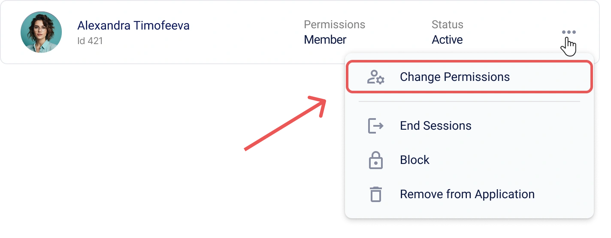

# How to Create and Configure an Application in Encvoy ID

In this guide, you will learn how to create and configure OAuth 2.0 and OIDC applications in **Encvoy ID**. We will cover in detail the creation of web and native applications, login widget configuration, and user and access management.

**Table of Contents:**

- [Creating an Application](#creating-application)
- [Managing Applications](#managing-applications)
- [Application Invitations](#application-invitations)
- [Application Login Widget Settings](#app-login-widget-settings)
- [Application Users](#application-users)
- [Full Parameters Reference](#full-parameters-reference)
- [See Also](#see-also)

> ⚠️ **Restriction**: Application management is available in the administrator, organization, or application (small) dashboard depending on your role.

---

## Creating an Application { #creating-application }

### Creating an OAuth Web Application

> **Web Application** — a standard application that runs in the user's browser and interacts with **Encvoy ID** using OAuth 2.0 and OpenID Connect protocols.

To create a web application:

1. Go to the administrator, organization, or application (small) dashboard.
2. Open the **Applications** tab.
3. Click the **Create** button .
4. The application creation form will open.
5. Specify the required [application parameters](#full-parameters-reference):
   - **Application Name**,
   - **Application Address** in the format `protocol://domain_name:port`,
   - **Redirect URI #** (`redirect_uris`) — the address the user is redirected to after authorization,
   - **Post-Logout Redirect URI #** (`post_logout_redirect_uris`) — the address the user is redirected to after logging out.

6. Click **Create**.

> 💡 Upon creation, additional application fields are generated, which can be viewed and edited in the application settings:
>
> - **Identifier (client_id)** — used to identify the application;
> - **Secret Key (client_secret)** — used to authenticate the application's identity when the application requests access to a user's account. The secret key must be known only to the application.

### Creating a Native OAuth Application

> **Native Application** — an application developed specifically for a particular operating system.

To create a native application:

1. Go to the administrator, organization, or application (small) dashboard.
2. Open the **Applications** tab.
3. Click the **Create** button .
4. The application creation form will open.
5. Specify the required [application parameters](#full-parameters-reference):
   - **Application Name**,
   - **Application Address** — the local address of the application in the format `myapp://callback` (required to complete creation, but **not used** in native applications),
   - **Redirect URI #** (`redirect_uris`) — the local address the user will be returned to after authorization, e.g., `myapp://callback`,
   - **Post-Logout Redirect URI #** (`post_logout_redirect_uris`) — the local redirect address after logout (e.g., `myapp://logout`).

6. Click **Create**.
7. Open the created application and click **Edit** .
8. In the edit form that opens:
   - Select `native` in the **Application Type** setting;
   - Select `none` in the authentication method settings.

     

9. Save the changes.

Next, configure authorization on your application's side:

- Use PKCE (Proof Key for Code Exchange) when requesting an authorization code;
- Use the previously specified `redirect_uri` to handle the authorization result;
- Perform token refresh using the OAuth 2.0 protocol.

---

## Managing Applications { #managing-applications }

### Viewing an Application { #viewing-application }

1. Go to the administrator, organization, or application (small) dashboard.
2. Open the **Applications** tab.
3. Click on the panel of the application whose profile you want to view.

4. The application profile form will open.

### Editing an Application { #editing-application }

1. Go to the administrator, organization, or application (small) dashboard.
2. Open the **Applications** tab.
3. Click on the panel of the application you want to edit.
4. The application view form will open.
5. Click the **Edit** button .
6. The application edit form will open.
7. Make the necessary changes to the [application parameters](#full-parameters-reference).
8. Save the changes.

### Deleting an Application

> ⚠️ **Warning:** Deleting an application is an irreversible operation. All associated data will be removed from the system.

To delete an application:

1. Go to the administrator, organization, or application (small) dashboard.
2. Open the **Applications** tab.
3. Click on the panel of the application you want to edit.
4. The application view form will open.
5. Click the **Delete** button .
6. Confirm the action in the modal window.

After confirmation, the application will be deleted from **Encvoy ID**.

---

## Application Invitations { #application-invitations }

The invitation mechanism allows you to restrict access to the application and grant it only to pre-selected users. This is useful if the application is intended for a **closed circle of users**.

### Enabling Access Restriction

To make the application available only to invited users:

1. Open the application edit form. [How to open the edit form →](#editing-application)
2. Enable the **Prohibit access for external users** setting.
3. Save the changes.

**What happens after enabling:**

- Application members — can log in as usual.
- Uninvited users — see an access denied message.
- New users — can only log in after receiving an invitation.

### Sending Invitations to Users

To send an invitation to a user:

1. Open the application view form. [How to open the view form →](#viewing-application).
2. Click the **Invite** button.

3. In the window that opens, specify the users' email addresses:
   - Enter the address and press **Enter**, or click the  button;
   - To add multiple addresses, use separators: space, comma `,`, or semicolon `;`.

   

4. Click **Send**.

An email with a link for quick access to the application is sent to the specified email addresses.

> 💡 Invitations will remain active until canceled or accepted.

### What Users See

A user who receives an invitation gets an email containing a link to log in to the application. The invitation is also displayed in the **Requests** section of the user's personal profile. The invitation can be accepted in two ways: by clicking the link in the email or by selecting the invitation in the "Requests" section of the profile.

> [How to accept an application invitation →](./docs-12-common-personal-profile.md#closed-app-invitations)

The invitation is protected by a verification mechanism: it is valid only for the email address to which it was sent. The user must log in to the system using that specific address to accept the invitation. This prevents access from being transferred to other parties.

If the user is not yet registered in the system, they must register using the same email to which the invitation was sent. After successful registration, access to the application is granted automatically.

### Managing Invitations

#### Viewing the List of Sent Invitations

1. Open the application view form. [How to open the view form →](#viewing-application).
2. Expand the **List of sent application invitations** section.

For each invitation in the list, the following is displayed:

- Recipient's email
- Date sent

#### Canceling an Invitation

If you need to revoke a sent invitation:

1. Find the invitation in the sent list.
2. Click the **Delete** button  on the invitation panel.
3. Confirm the invitation cancellation.

**Consequences of cancellation:**

- The link in the email becomes invalid.
- The user will not be able to accept the invitation.

---

## Application Login Widget Settings { #app-login-widget-settings }

The **Login Widget** is the authorization form that users see when attempting to log in to **this specific application**. Its settings allow you to adapt the appearance and login methods to your service's brand and needs.

### How to Find Widget Settings

1. Open the application edit form. [How to open the edit form →](#editing-application)
2. Find the **Login Methods** block and click **Configure**.

What can be configured:

- **Title and Cover** — adapt to the application's brand,
- **Color Scheme** — button colors matching your design,
- **Login Methods** — choose which providers to show,
- **Information Blocks** — add usage rules or links.

> **📚 Full Guide to All Settings:**  
> For a detailed look at all parameters and customization options, go to the [full login widget configuration guide →](./docs-06-github-en-providers-settings.md#login-widget-settings).

---

## Application Users { #application-users }

**Application Users** (members) are **Encvoy ID** system users who have granted your application permission to access their data.

**How a user becomes a member:**

1. The user accesses your application for the first time.
2. The system redirects them to the **Encvoy ID** login widget.
3. The user authenticates and **gives consent** to access the requested data.
4. The application receives an access token, and the user is added to the members list.

**Where to manage members:**

- **Administrator Dashboard** — to manage all service applications.
- **Organization Dashboard** — for applications belonging to the organization.
- **Small Dashboard (Applications)** — to manage a specific application.

> 💡 **Important:** Member management occurs at the **application** level. Actions do not affect the user's global **Encvoy ID** account, only their connection to the specific application.

### Viewing Application Members

1. Go to the administrator, organization, or application (small) dashboard.
2. Open the **Applications** tab.
3. Click on the panel of the desired application.
4. The application profile with general information will open.
5. In the application profile, find the members section.
6. Click on the panel of the user whose profile you want to view.
7. The user profile will open, containing a list of data the user has granted access to.

### Assigning an Application Administrator { #assigning-app-administrator }

**When this is needed:** To delegate application management rights to trusted users. Application administrators can manage its settings and users.

To assign an application administrator:

1. Go to the administrator, organization, or application (small) dashboard.
2. Open the **Applications** tab.
3. Click on the application panel.
4. The application profile will open.
5. Call the action menu for the user whose permissions you want to change.

6. Select the **Change Permissions** action.
7. In the window that appears, select the **Administrator** permission level.

8. Click **Save**.

After saving the changes, the user's permissions in the application will be updated.

**✅ What will change:**

- The user will gain access to the **Small Dashboard** of this application.
- They will be able to manage application settings and its users.
- They will not gain access to other applications or organization/service settings.

> ⚠️ **Security:** Assign administrator rights only to trusted users. An application administrator can delete other users and change integration settings.

### Terminating User Sessions in the Application

**When this is needed:** In case of suspected account compromise, device loss, or to force an access token refresh.

To terminate a user's sessions:

1. Go to the administrator, organization, or application (small) dashboard.
2. Open the **Applications** tab.
3. Click on the application panel.
4. The application profile will open.
5. Call the action menu for the user whose sessions you want to terminate.
6. Select the **End Sessions** action.
7. Confirm the action in the modal window.

After confirmation, all sessions and tokens for the user will be deleted.

**✅ What happens after confirmation:**

- **All active sessions** of the user in this application are terminated.
- **Access tokens** (`access_token`) become invalid.
- **Refresh tokens** (`refresh_token`) are revoked.
- The user will be required to **log in again** the next time they access the application.

> 📌 This operation does not block the user. They will be able to authorize again.

### Removing a User from the Application

**When this is needed:** When a user no longer needs access to the application, upon employee termination, or at the user's request.

To remove a user from the application:

1. Go to the administrator, organization, or application (small) dashboard.
2. Open the **Applications** tab.
3. Click on the application panel.
4. The application profile will open.
5. Call the action menu for the user you want to remove from the application.
6. Select the **Delete User** action.
7. Confirm the action in the modal window.

After confirmation, the user will be removed from the application.

**✅ What happens after removal:**

- The user **disappears** from the application's members list.
- All their **access tokens** for this application are revoked.
- The next time they access the application, they will **be shown the consent request again**.
- The user's **global account** in **Encvoy ID** remains untouched.

### Blocking a User in the Application

**When this is needed:** For a complete and permanent ban on a user's access to the application without the possibility of recovery.

**Blocking** is a more serious action than removal. A blocked user will not be able to gain access to the application.

To block a user:

1. Open the action menu for an active user in the [application profile](./docs-10-common-app-settings.md#viewing-application).

2. Select the **Block in Encvoy ID** action.
3. Confirm the action in the modal window.

**What happens after blocking**:

- The user's status will change to **Blocked**.
- The blocked user will not be able to log in to the application.

### Unblocking Encvoy ID Users

To unblock a user:

1. Open the action menu for a blocked user in the [application profile](./docs-10-common-app-settings.md#viewing-application).
2. Select the **Unblock in Encvoy ID** action.
3. Confirm the action in the modal window.

After confirmation, the user's status will change to **Active**.

---

## Full Parameters Reference { #full-parameters-reference }

### Basic Information

Basic details for display in the interface and on the login widget.

| Parameter                   | Description                                                        | Type                                                  | Required |
| --------------------------- | ------------------------------------------------------------------ | ----------------------------------------------------- | -------- |
| **Application Name**        | Displayed in the personal dashboard interface and login widget     | Text (up to 64 characters)                            | ✓        |
| **Application Description** | Short description displayed in the **Encvoy ID** service interface | Text (up to 255 characters)                           | ✗        |
| **Application Logo**        | Displayed in the **Encvoy ID** service interface and login widget  | Image in JPG, GIF, PNG, WEBP format. Max size - 1 MB. | ✗        |
| **Display in Mini-Widget**  | Adds the application to the mini-widget for quick access.          | Toggle (`On`/`Off`)                                   | -        |

### Catalog

Settings for publishing the application in the [Catalog](./docs-12-common-personal-profile.md#application-catalog).

| Parameter              | Description                                                                                                               | Type                | Default |
| ---------------------- | ------------------------------------------------------------------------------------------------------------------------- | ------------------- | ------- |
| **Display in Catalog** | Adds the application to the Catalog                                                                                       | Toggle (`On`/`Off`) | `Off`   |
| **Application Type**   | Category the application belongs to in the **Catalog**.   Type creation is available to the service **Administrator**. | Dropdown list       | `Other` |

### Required Fields

User profile fields necessary for the application to function.

| Parameter               | Description                                                                                                                                                                                                                                                                                                                                                                                                                                  |
| ----------------------- | -------------------------------------------------------------------------------------------------------------------------------------------------------------------------------------------------------------------------------------------------------------------------------------------------------------------------------------------------------------------------------------------------------------------------------------------- |
| **Main Profile Fields** | Defines the list of main and additional user profile fields that the application requires access to.   - If fields are missing from the user profile, they will be requested during authorization in the application.   - If fields are present but set to [privacy level](./docs-12-common-personal-profile.md#privacy-levels) **Available only to you**, the user will be prompted to change this level to **Available on request**. |

### Application Parameters

Technical parameters affecting the application's interaction with **Encvoy ID**.

#### Main Identifiers

| Name                           | Parameter       | Description                                                        | Type                                         | Required                |
| ------------------------------ | --------------- | ------------------------------------------------------------------ | -------------------------------------------- | ----------------------- |
| **Identifier (client_id)**     | `client_id`     | Unique application identifier                                      | Text                                         | Generated automatically |
| **Secret Key (client_secret)** | `client_secret` | Client private key. Must be kept secure.                           | Text                                         | Generated automatically |
| **Application Address**        | -               | URL of the web resource where login via **Encvoy ID** will be used | Text in `protocol://domain-name:port` format | ✓                       |

### Access Settings

| Name                                   | Parameter | Description                                                                                        | Type                | Default |
| -------------------------------------- | --------- | -------------------------------------------------------------------------------------------------- | ------------------- | ------- |
| **Restricted Access**                  | -         | If enabled, login to the application will only be available to users with **Administrator** rights | Toggle (`On`/`Off`) | `Off`   |
| **Prohibit access for external users** | -         | If enabled, only members or invited users will have access to the application                      | Toggle (`On`/`Off`) | `Off`   |

#### Redirect URL

| Name               | Parameter      | Description                                                                                                                                                                                                                                                                                     | Required |
| ------------------ | -------------- | ----------------------------------------------------------------------------------------------------------------------------------------------------------------------------------------------------------------------------------------------------------------------------------------------- | -------- |
| **Redirect URI #** | `Redirect_uri` | The URL to which **Encvoy ID** will redirect the user after authentication. After the user authenticates and gives consent, the server redirects the user back to the **Redirect_uri** with an authorization code, ID token, or other information depending on the requested **response_type**. | ✓        |

#### Logout URL

| Name                           | Parameter                  | Description                                                                                                                                   | Required |
| ------------------------------ | -------------------------- | --------------------------------------------------------------------------------------------------------------------------------------------- | -------- |
| **Post-Logout Redirect URI #** | `post_logout_redirect_uri` | The URL to which the service will redirect the user after logging out. If no value is specified, the **Redirect URL (Redirect_uri)** is used. | ✗        |

#### Authentication Request URL

| Name                                         | Parameter      | Description                                                                                                                                                                                                                                                                                                               | Required |
| -------------------------------------------- | -------------- | ------------------------------------------------------------------------------------------------------------------------------------------------------------------------------------------------------------------------------------------------------------------------------------------------------------------------- | -------- |
| **Authentication Request or Recovery URL #** | `request_uris` | A list of URLs where JWT authorization requests are hosted. When the system sends an authorization request to the server, it can simply specify the `request_uri` parameter, which refers to one of the URLs defined in this list. The server then retrieves the JWT request object from this URL to process the request. | ✗        |

#### Response Types

| Name                                | Parameter        | Description                                                                                                                                                                                                                                                                                                                                                                                                                                                             |
| ----------------------------------- | ---------------- | ----------------------------------------------------------------------------------------------------------------------------------------------------------------------------------------------------------------------------------------------------------------------------------------------------------------------------------------------------------------------------------------------------------------------------------------------------------------------- |
| **Response Types (response_types)** | `response_types` | 
Defines which tokens are returned to the client.
 
 - `code` — authorization code only;  - `id_token` — ID token only;   - `code id_token` — code and ID token;   - `code token` — authorization code and access token;   - `code id_token token` — full set;   - `none` — used when no authorization code, access token, or ID token is required via redirection. Useful for confirming user authentication without requiring data access. 
 |

#### Grant Types

| Name                          | Parameter     | Description                                                                                                                                                                                                                                                      |
| ----------------------------- | ------------- | ---------------------------------------------------------------------------------------------------------------------------------------------------------------------------------------------------------------------------------------------------------------- |
| **Grant Types (grant_types)** | `grant_types` | 
Method of obtaining authorization to access protected resources.
 
 - `authorization code` — standard and secure method;   - `implicit` — legacy option without server-side exchange;   - `refresh_token` — token refresh without re-logging. 
 |

#### Authentication Methods

| Name                                                                                      | Parameter                            | Description                                                                                                                                                                                                                                                                                                                                                                                                                                                                                                                                                                                                                                                                                                                                                                                                                                                                            |
| ----------------------------------------------------------------------------------------- | ------------------------------------ | -------------------------------------------------------------------------------------------------------------------------------------------------------------------------------------------------------------------------------------------------------------------------------------------------------------------------------------------------------------------------------------------------------------------------------------------------------------------------------------------------------------------------------------------------------------------------------------------------------------------------------------------------------------------------------------------------------------------------------------------------------------------------------------------------------------------------------------------------------------------------------------- |
| **Client Authentication Method for Token Endpoint (token_endpoint_auth_method)**          | `token_endpoint_auth_method`         | 
Method the client uses to authenticate when accessing the server's `token endpoint`.
 
 - `none` - does not provide credentials. Used when the client cannot store credentials confidentially or authentication is not required;   - `client_secret_post` - sends credentials in the request body;   - `client_secret_basic` - uses HTTP Basic Authentication, sending credentials in the request header;   - `client_secret_jwt` - signs a JWT using its secret and sends it as credentials;   - `private_key_jwt` - signs a JWT using its private key and sends it as credentials. 
 The choice depends on security requirements and the client's ability to store credentials securely. For example, `client_secret_jwt` and `private_key_jwt` provide higher security by using asymmetric encryption and avoiding secret transmission over the network. 
 |
| **Authentication Method for Introspection Endpoint (introspection_endpoint_auth_method)** | `introspection_endpoint_auth_method` | 
Method the client uses when accessing the `introspection endpoint`. This endpoint is used to check the status of an access token and retrieve information about it.
 
 - `none` - no credentials provided;   - `client_secret_post` - credentials in the request body;   - `client_secret_basic` - HTTP Basic Authentication;   - `client_secret_jwt` - signs a JWT with its secret;   - `private_key_jwt` - signs a JWT with its private key. 
 Choice depends on security requirements and client capabilities. JWT-based methods provide extra security via signed tokens. 
                                                                                                                                                                                                                                                                               |
| **Authentication Method for Revocation Endpoint (revocation_endpoint_auth_method)**       | `introspection_endpoint_auth_method` | 
Defines the authentication method used when accessing the `revocation endpoint`. This endpoint is used to revoke access or refresh tokens. This method usually matches those used for the `token endpoint` and `introspection endpoint`.
 
- `none` - no credentials provided;  - `client_secret_post` - credentials in the request body;   `client_secret_basic` - HTTP Basic Authentication;  - `client_secret_jwt` - signs a JWT with its secret; - `private_key_jwt` - signs a JWT with its private key.
                                                                                                                                                                                                                                                                                                                                                   |

#### ID Token Signature Algorithm

| Name                                                              | Parameter                      | Description                                                                                                                                     |
| ----------------------------------------------------------------- | ------------------------------ | ----------------------------------------------------------------------------------------------------------------------------------------------- |
| **Signing Algorithm for ID Token (id_token_signed_response_alg)** | `id_token_signed_response_alg` | Specifies the algorithm used to sign the ID token. An **ID token** is a JSON Web Token (JWT) containing claims about the user's authentication. |

#### Require Authentication Time

| Name                                                | Parameter           | Description                                                                                                                                                                                                   |
| --------------------------------------------------- | ------------------- | ------------------------------------------------------------------------------------------------------------------------------------------------------------------------------------------------------------- |
| **Require Authentication Time (require_auth_time)** | `require_auth_time` | Specifies whether the authorization server must provide the user's authentication time in the ID token. If enabled, the server includes the `auth_time` claim, representing when the user last authenticated. |

#### User ID Transmission Method

| Name                                                       | Parameter      | Description                                                                                                                                                                                                                                                                                                                                                                                                 |
| ---------------------------------------------------------- | -------------- | ----------------------------------------------------------------------------------------------------------------------------------------------------------------------------------------------------------------------------------------------------------------------------------------------------------------------------------------------------------------------------------------------------------- |
| **User ID Transmission Method in ID Token (subject_type)** | `subject_type` | 
Defines how the user identifier (`sub claim`) is presented to the client. This affects how user IDs are generated and managed.
 
 - `public` - the user ID is the same for all clients. Every client sees the same `sub claim` for the user;   - `pairwise` - the user ID is unique for each client. This provides greater privacy as different clients cannot link user activity together. 
 |

#### Application Type

| Name                                    | Parameter          | Description                                                                                                                                                                       |
| --------------------------------------- | ------------------ | --------------------------------------------------------------------------------------------------------------------------------------------------------------------------------- |
| **Application Type (application_type)** | `application_type` | 
Defines the platform the application is intended for:
 
 - `web` - web application running in a browser;   - `native` - native application installed on a device. 
 |

#### Access Token

| Name                                | Parameter          | Description                        |
| ----------------------------------- | ------------------ | ---------------------------------- |
| **Access Token (access_token_ttl)** | `access_token_ttl` | `access_token` lifetime in seconds |

#### Refresh Token

| Name                                  | Parameter           | Description                         |
| ------------------------------------- | ------------------- | ----------------------------------- |
| **Refresh Token (refresh_token_ttl)** | `refresh_token_ttl` | `refresh_token` lifetime in seconds |

---

## See Also { #see-also }

- [Managing Organizations](./docs-09-common-mini-widget-settings.md) — guide to working with **Encvoy ID** system organizations.
- [Personal Profile and Application Permission Management](./docs-12-common-personal-profile.md) — guide to managing your personal profile.
- [Login Methods and Login Widget Configuration](./docs-06-github-en-providers-settings.md) — guide to login methods and login widget configuration.
