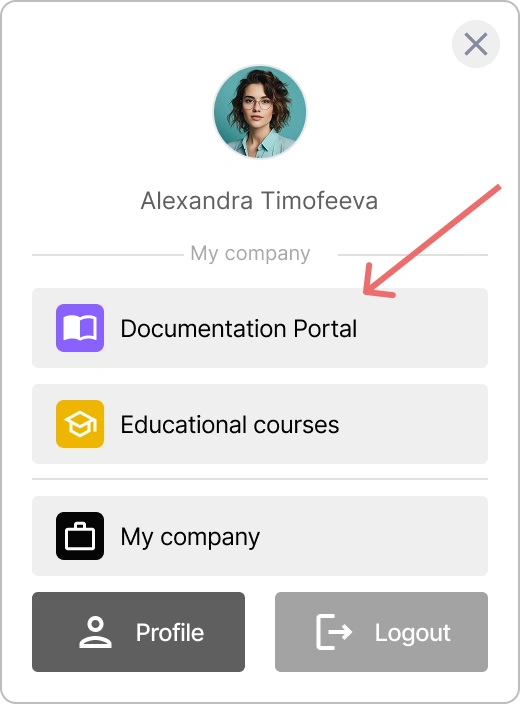

# Managing an Organization in Encvoy ID

In **Encvoy ID**, organizations serve as the primary structural unit for managing application access, dividing employees by departments, and maintaining user activity audits. In this guide, we will cover how to create organizations and configure login methods.

**Table of Contents:**

- [Organization Basics](#organization-basics)
- [Accessing the Organization Dashboard](#organization-panel-access)
- [Configuring Organization Name and Logo](#organization-name-and-logo)
- [Organization Login Methods](#organization-login-methods)
- [See Also](#see-also)

---

## Organization Basics { #organization-basics }

An organization in **Encvoy ID** is a structural unit that allows you to:

- **Segregate access** to applications between departments or projects,
- **Configure corporate login methods**,
- **Maintain centralized auditing** of user activity,
- **Manage applications** within a single company,
- **Configure branding** (logo, name) for login widgets.

> 💡 **Use Case:** Organizations are ideal for companies that need to manage multiple applications and user groups from a single point of control.

---

## Accessing the Organization Dashboard { #organization-panel-access }

The organization dashboard is designed for managing organization settings, applications, and users.

The following sections are available in the organization dashboard:

- **Settings** — organization parameters, login methods, and login widget customization.
- **Applications** — management of organization applications.
- **Event Log** — history of organization user activity.

### How to Access the Encvoy ID Organization Dashboard

> ⚠️ To access the organization dashboard, you must have **Manager** permissions. Contact your service administrator to obtain them.

To open the organization dashboard:

1. Log in to your **Encvoy ID** personal account.
2. Click on your name in the upper right corner of the window.
3. In the mini-widget window that opens, click on the name of your organization.

You will be redirected to the **Organization Dashboard**.

> 💡 Add frequently used applications to the mini-widget using the **Display in Mini-Widget** setting for quick access.  
> 

## Configuring Organization Name and Logo { #organization-name-and-logo }

The name and logo are displayed in the **Encvoy ID** system interface as well as in the mini-widget.

To configure the name and logo:

1. Go to the organization dashboard → **Settings** tab.
2. Expand the **Main Information** block.
3. Enter the new name in the **Application Name** field.
4. In the **Application Logo** section, click **Upload** and select the logo file.

   > ⚡ Supported formats: JPG, GIF, PNG, WEBP; maximum size 1 MB.

5. Adjust the logo display area.

6. Click **Save**.

---

## Organization Login Methods { #organization-login-methods }

A **login method** is a user authentication method that allows them to log in to applications.

An organization can use both public login methods and login methods created specifically for that organization.

**You can:**

- Use **public login methods** configured by the **Encvoy ID** administrator
- Add **your own login methods** exclusively for your organization
- Configure **publicity** — determine where your login methods will be available
- Make identifiers **mandatory** for users

> ⚠️ **Restrictions:** Only **Encvoy ID** administrators can edit public login methods.

> 🔍 Detailed instructions for creating, editing, and deleting login methods are provided in the main guide: [Configuring Login Methods](./docs-06-github-en-providers-settings.md#managing-login-methods).

---

## See Also { #see-also }

- [Login Methods and Login Widget Configuration](./docs-06-github-en-providers-settings.md) — a guide to login methods and login widget setup.
- [Application Management](./docs-10-common-app-settings.md) — a guide to creating, configuring, and managing OAuth 2.0 and OpenID Connect (OIDC) applications.
- [Personal Profile and Application Permission Management](./docs-12-common-personal-profile.md) — a guide to managing your personal profile.
