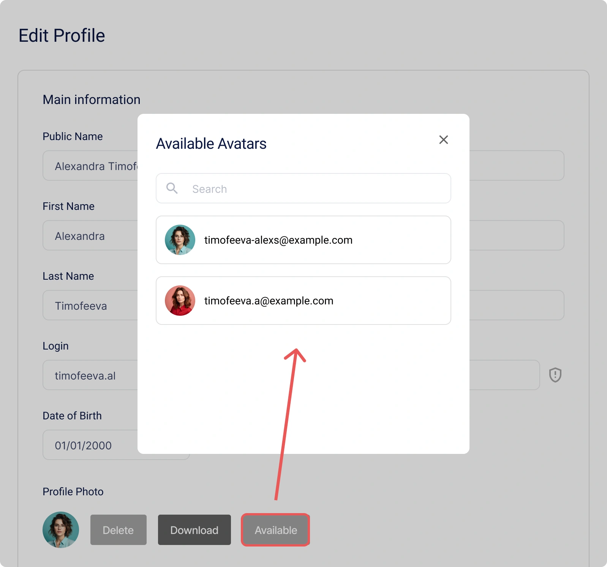
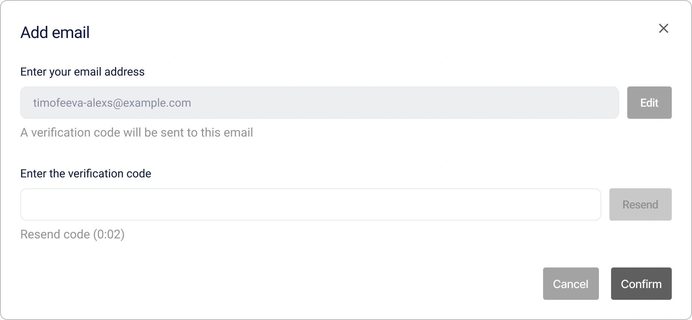
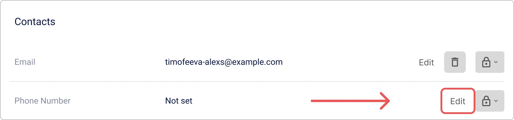
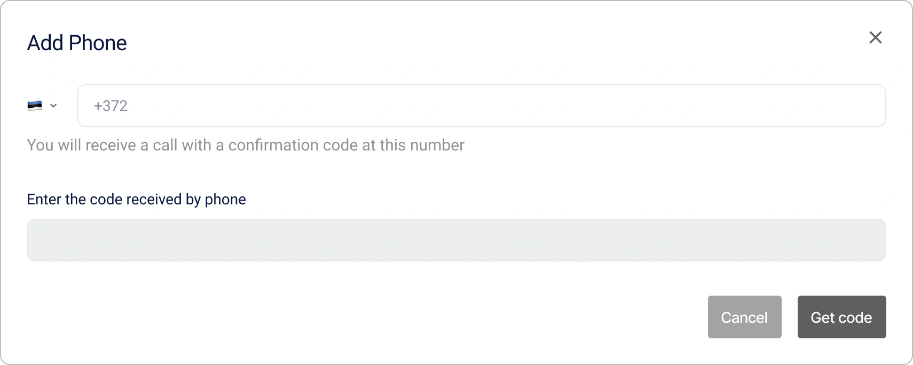

# How to Manage Your Encvoy ID Personal Profile

**The Encvoy ID Profile** is your control center for account data and security.

In this guide, you will learn how to manage your personal profile in **Encvoy ID**: edit data and privacy settings, update your password, control application access, view the activity log, and export profile data.

**Table of Contents:**

- [Personal Profile Management](#personal-profile-management)
- [App Permissions and OAuth Access](#app-permissions-and-oauth)
- [Closed App Invitations](#closed-app-invitations)
- [Application Catalog](#application-catalog)
- [Activity Log and Login History](#activity-log-and-login-history)
- [See Also](#see-also)

---

## Personal Profile Management { #personal-profile-management }

Your profile contains basic information for identification within the system. Depending on the registration method, some fields may be unavailable for editing. If you need to edit them, contact the service administrator.

### Changing Personal Information

1. Go to your **Profile**.
2. Click **Edit** in the **Main Information** block.


3. Make the necessary changes in the form that opens.

   > 💡 Validation rules are set for some fields. Please be careful when making changes.
   >
   > 

4. Click **Save**.

> 📌 **Important:** The profile can be saved even with empty mandatory fields. The system will request the missing data during your next login.

### Adding a Profile Photo

You can upload a photo from your device or use an avatar from linked external services.

1. Go to your **Profile**.
2. Click **Edit** in the **Main Information** block.
3. The edit form will open.
4. Add a photo using one of the following methods:
   - Click the **Upload** button and specify the path to the photo file,

       

   - Click the **Available** button and select a photo from an external system.

       

   > 📌 If there are no linked external system identifiers with photos in the profile, the **Available** button will be hidden.

   > 💡 **Tip**: To delete a photo, click the **Delete** button in the **Profile Photo** block.

5. Click **Save** in the edit form.

### Adding an Email Address

> 💡 Email requires verification — entering a one-time code or clicking a link in the email.

1. Go to your **Profile**.
2. Find the **Contacts** block and click **Edit** on the **Email** panel.


3. The addition form will open.



4. Enter the email and click **Get code**.

   A confirmation code will be sent to the specified address.

5. Enter the code and click **Confirm**, or follow the link in the email.

> 💡 **Tip**: To delete an email, click the **Delete** button on the **Email** panel.

### Adding a Phone Number

> 💡 Phone number requires verification — entering a one-time code from an SMS or an incoming call.

1. Go to your **Profile**.
2. Find the **Contacts** block and click **Edit** on the **Phone Number** panel.



3. The edit form will open.



4. Enter the number and click **Get code**.

   An SMS or call will be sent to the specified number.

5. Enter the confirmation code and click **Confirm**.

> 💡 **Tip**: To delete a phone number, click the **Delete** button on the **Phone Number** panel.

### Changing Password

1. Go to your **Profile**.
2. Click **Edit** in the **Security** block.


3. In the window that opens, specify the current password and the new password.


After changing the password, you will be logged out. To continue working, you must log in again using the new password.

### Privacy Settings { #privacy-settings }

You can independently control what information will be available to other users or third-party systems. This is done through field privacy settings.

This setting allows you to define privacy for each field in the **Main Information**, **Additional Information**, and **Identifiers** blocks.

#### Privacy Levels { #privacy-levels }

| Level                     | Icon                                                                                     | Description                                                                                                           |
| ------------------------- | ---------------------------------------------------------------------------------------- | --------------------------------------------------------------------------------------------------------------------- |
| **Available only to you** |           | Data is not transmitted to third-party systems and is available only to you.                                          |
| **Available on request**  |  | Data is available in third-party systems integrated with Encvoy ID. <br> Your consent is required to access the data. |
| **Available to everyone** |           | Data is always public. Your consent is not required to access it.                                                     |

#### How to Configure Field Privacy

1. Go to your **Profile**.
2. Click the privacy setting button next to the field.
3. Select the required level.


Depending on the selected value, the field value in the profile becomes public or private.

The setting is applied without additional confirmation.

### Managing External Service Identifiers { #external-service-identifiers }

**Identifiers** are external services that you have added to your profile or through which you have ever logged into applications or the personal account.

The list of identifiers available for addition in the profile is formed from the public login methods created in the **Encvoy ID** dashboard.

> 🔍 Identifiers available for linking are configured in the administrator dashboard.

> 💡 You can log into applications using identifiers, provided they are added to the login widget.

#### Adding a New Identifier

1. Go to your **Profile**.
2. Click **Add** in the **Identifiers** block.


3. In the window that opens, select an external service.


4. Complete authentication in the service.

   After a successful login to the external service account, the identifier will be linked to the profile.

> 💡 **Tip**: If an external service identifier is already linked to another user, you must remove it from that user's profile and then link it to the new account.

#### Deleting an Identifier

1. Go to your **Profile**.
2. Click on the identifier you want to delete.
3. Select the **Delete** action.


The identifier will be **immediately removed** from the profile.

### Public Profile Configuration

**Public Profile** consists of public data available for viewing by other members of the **Encvoy ID** system and connected applications. It allows you to control what user information is visible to others without granting full account access.

#### Viewing Public Profile

1. Go to your **Profile**.
2. Click the **Public Data** button in the **Profile Privacy** block.
3. A window will open with the public profile containing data with the **Available to everyone** level.

#### Downloading Public Profile Data

> 📌 Public profile data is exported in **vCard** format.

1. Go to your **Profile**.
2. Click the **Public Data** button in the **Profile Privacy** block.
3. The **Public Profile** window will open with data set to the **Available to everyone** level.
4. Click the **Export vCard** button .
5. The file download will start.

Example of a **vCard** file with public profile data:

```VCARD
BEGIN:VCARD
VERSION:3.0
FN:Timofeeva Alex
N:Timofeeva;Alex;;;
PHOTO:https://service-adress/public/images/profile/90211313d753e1d1b83ab19ecfd4af5e
EMAIL:timofeeva-alexs@gmail.com
UID:null
REV:2025-05-26T12:52:24.630Z
END:VCARD
```

#### Disabling Public Profile

> 💡 **Tip**: You can prohibit the transmission of public profile data that has the "Available to everyone" privacy level.

1. Go to your **Profile**.
2. Activate the **Private Profile** toggle in the **Profile Privacy** block.

   

   The setting is applied without additional confirmation.

After activating the setting, data with the "Available to everyone" privacy level becomes available only upon request.

### Personal Profile Digital Business Card { #digital-business-card }

> 🔬 **Experimental feature**: Availability is regulated by the system administrator.

**The Encvoy ID Business Card** is a modern digital replacement for a paper business card, accessible via a unique link.

**Business Card Content:**

- Profile photo,
- First and last name,
- Contact details (email, phone),
- Date of birth.

**Features:**

- Data is displayed regardless of [privacy settings](#privacy-settings).
- The business card is available via a unique link: `https://<your-service>/api/cards/<identifier>`.
- Supports business card export in **vCard** format for integration into various applications.

#### Business Card Activity

An activity setting is available for the business card.

1. Go to your **Profile**.
2. In the **Business Card** block, activate the **Activity** toggle.

   

   Ensure that your business card is now accessible. To do this, follow the link: `https://<your-domain>/api/cards/<identifier>`:

#### Configuring a Personalized Link Address

To make the business card link shorter and easier to remember, you can set your own unique identifier.

1. Go to your **Profile**.
2. In the **Business Card** block, specify a new identifier.
3. Click **Save**.

> 💡 The identifier must be unique in the system and contain only Latin letters, numbers, and hyphens.

#### How to Share a Business Card

1. Go to your **Profile**.
2. In the **Business Card** block:
   - Click **Open QR code**  and scan the code with your device's camera.
   - Click the **Copy link** button  to copy the business card link address.

### Additional Personal Profile Actions

#### Terminating All Sessions

The function to force terminate all active sessions is an important security tool. Use it in case of device loss, suspicion of account compromise, or to immediately update access tokens.

> 📌 This operation immediately invalidates all access and refresh tokens, ending ALL current sessions in all applications.

To terminate all active sessions:

1. Go to your **Profile**.
2. Expand the **Other Actions** block and select **Log out from all devices**.

After this, you will need to **log in again** on all devices.

#### Downloading Personal Profile Data

**Encvoy ID** allows you to export all profile data in JSON format.

This file contains all information related to your profile in **Encvoy ID**, as well as details of external accounts you have added as login methods, regardless of whether the privacy parameter is set for them.

To download profile data:

1. Go to your **Profile**.
2. Expand the **Other Actions** block and select **Download Data**.
3. The JSON file download will start automatically.

#### Personal Data Processing Policy

Read the document on how **Encvoy ID** processes your data.

To read the policy:

1. Go to your **Profile**.
2. Expand the **Other Actions** block and select **Personal Data Processing Policy**.
3. The policy file download will start.

### Account Deletion and Recovery

Account deletion in **Encvoy ID** is an irreversible operation, after which it will be impossible to recover data. The system uses a delayed deletion mechanism: your account is marked for deletion but remains available for recovery for a certain period. This is done to protect against accidental deletion and gives you time to change your mind.

To delete an account:

1. Go to your **Profile**.
2. Expand the **Other Actions** block and select the **Delete account** action.
3. In the window that opens, enter your account password to confirm the action and click **Delete**.


**What happens:**

- The account is marked for deletion
- You are automatically logged out
- Account recovery is available for a certain period

For a certain period after account deletion, you have the opportunity to restore access to it. To do this, you need to log in again to the **Encvoy ID** personal account, then click **Restore Account**.

> 💡 Account recovery is only available when logging into the **Encvoy ID** personal account. When logging into an application via the **Encvoy ID** service, account recovery is not available.

---

## App Permissions and OAuth Access { #app-permissions-and-oauth }

**Permissions** are the rights you grant to external applications to access specific data in your **Encvoy ID** profile. You can restrict access, terminate active sessions, or completely revoke permissions at any time.

All applications that have access to your data are displayed in the **Profile** on the **Scopes** tab.

### Navigating to an App from the Permissions List

To quickly open an application you previously granted access to:

1. Go to your **Profile** → **Scopes** tab.


2. Click on the **application name** in the list.
3. You will be automatically redirected to the selected application.

### Terminating Active App Sessions

If you want to immediately end all sessions in a specific application:

1. Go to your **Profile** → **Scopes** tab.
2. Open the action menu for the application where you need to terminate sessions.
3. Select the **End Sessions** action.


4. Confirm the action in the modal window.

**What will happen:** All active sessions in this application will be terminated. The next time you access the application, **re-authorization** will be required.

Terminating sessions is useful if you suspect unauthorized access or used the application on a shared device.

### Revoking App Permissions

To completely prohibit an application from accessing your data:

1. Go to your **Profile** → **Scopes** tab.
2. Open the action menu for the application whose permissions you need to revoke.
3. Select the **Revoke Permission** action.
4. Confirm the action in the modal window.

**Consequences:** The application will **lose access** to all your profile data. The next time you log in, the system will request **new consent** for access.

---

## Closed App Invitations { #closed-app-invitations }

An **invitation** is a way to gain access to a closed application. The application administrator sends an invitation to your email, after which you can log into the application that is unavailable to other users.

### How to Receive an Invitation?

An invitation arrives in two ways:

1. **By email**: You will receive an email with an invitation and a link for quick access to the application.
2. **In your Encvoy ID profile**: a new invitation appears in the **Requests** section.

### How to Accept an Invitation?

You can accept an invitation in any convenient way.

#### Method 1: Accept Invitation from Email

1. Open the invitation email.
2. Click the link in the email.
3. Then two options are possible:
   - if you are already logged into the system — you will immediately enter the application;
   - if you are not logged in — log into the system.

> 🔐 You must log in **under the account** linked to the email specified in the invitation.

#### Method 2: Accept Invitation from Profile

1. Go to your **Profile** → **Requests** tab.
2. Find the required invitation in the list.
3. Click the **Accept** button.


After this, access to the application will be activated, and you can navigate to it.

#### If You Don't Have an Account Yet

If you received an invitation but are not yet registered in the **Encvoy ID** system:

1. Follow the link from the invitation email.
2. Register in the **Encvoy ID** system.
3. During registration, specify the same email address to which the invitation was sent.
4. After completing registration, you will automatically receive access to the application.

---

## Application Catalog { #application-catalog }

> 🔬 **Experimental feature**: Availability is regulated by the system administrator.

### What is the Catalog?

**The Catalog** is a centralized marketplace for all applications available in the **Encvoy ID** ecosystem.

The catalog brings all public applications together in one place, allowing you to quickly find the apps you need, view names and descriptions, and access applications without having to remember complex links or paths.

For convenience, all applications in the catalog are divided by type.

Applications from the catalog can be added to favorites. For quick access, all favorite applications are displayed in the left sidebar.

### How to Use Apps from the Catalog?

1. Click the  button.
2. A window will open with a list of applications added to the catalog.


3. Select the desired application in the catalog.
4. You will be automatically redirected to the application page.
5. Authenticate in the application using **Encvoy ID** and grant the application access to your data.

Now you can log into the application with your **Encvoy ID** profile.

### Actions in the Catalog

#### Adding an App to Favorites

1. Click the **Application catalog** button .
2. A window will open with a list of applications added to the catalog.
3. Click the  button located next to the application you want to add to favorites.

   The application will be added to favorites and displayed in the corresponding group.

   

#### Removing an App from Favorites

1. Click the **Application catalog** button .
2. A window will open with a list of applications added to the catalog.
3. Click the  button located next to the application you want to remove from favorites.

The application will be removed from favorites and will disappear from the side menu.

---

## Activity Log and Login History { #activity-log-and-login-history }

**The Activity Log** is a security tool that allows you to track where and from which devices you logged into **Encvoy ID** or applications.

### Event Details

Detailed information is available for each event.

| Parameter         | Contains                           |
| ----------------- | ---------------------------------- |
| **Event Header**  | Action category                    |
| **Date and Time** | Exact timestamps                   |
| **Application**   | Application identifier (client_id) |
| **User**          | User identifier (id)               |
| **Device**        | Device type and browser            |
| **Location**      | IP address                         |

### How to View the Activity Log?

1. Go to your **Profile**.
2. Open the **Event Log** tab.

---

## See Also { #see-also }

- [User Registration and Login](./docs-13-common-user-authentication.md) — instructions for creating an account, logging in with username/password, and external authentication services.
