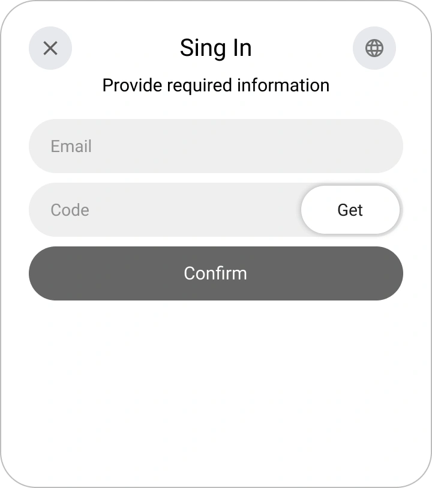
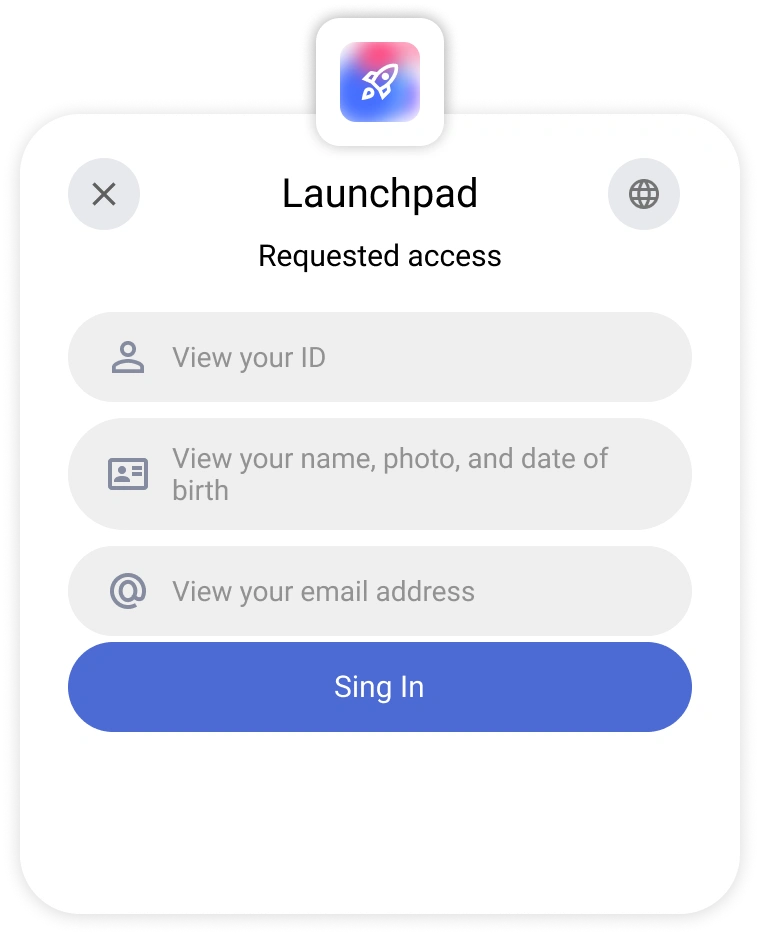
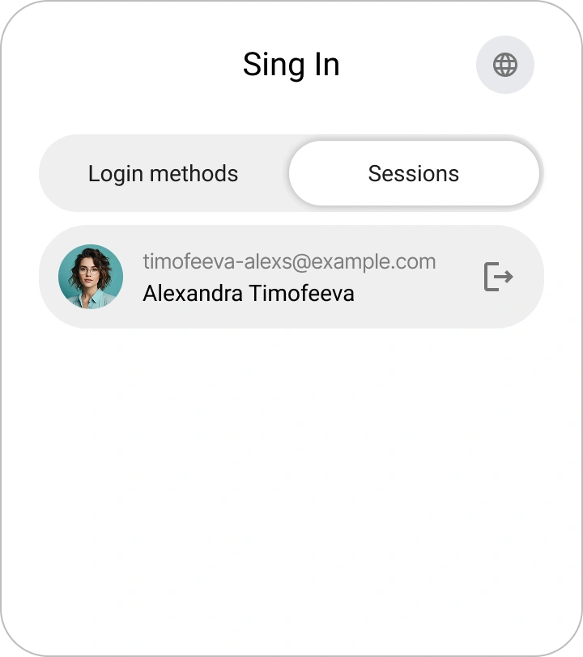

# Registration, Login, and Password Recovery in Encvoy ID

In this guide, you will learn how to create an account in **Encvoy ID**, log in using a username and password or via external services, and securely recover access to your profile if necessary.

**Table of Contents:**

- [New Account Registration](#new-account-registration)
- [Login with Username and Password](#login-with-password)
- [Login via External Services](#login-via-external-services)
- [Quick Login for Authenticated Users](#quick-login-for-authenticated-users)
- [Password Recovery](#password-recovery)
- [See Also](#see-also)

---

## New Account Registration { #new-account-registration }

### Where Registration is Available

The account creation function may be available in two cases:

1. **On the login form**;

2. **On the action selection form when logging in via a login method**, if the specified identifier is not linked to any profile in **Encvoy ID**

> 💡 **Form design** may vary depending on the settings of the specific application

### How to Create an Account in Encvoy ID

1. Click **Create account** on the login or action selection form.
2. Enter the required data in the registration form.

   Example of the name entry window:

   

3. If the system requests an e-mail — provide an address that is not linked to other users.
4. Enter the code or follow the link from the email sent to the specified address.

   

   > 💡 If confirmation is performed via a link, the code entry window can be closed.

5. Upon the first login to the application, grant access to the necessary data.

After completing these steps, the account will be created, and you will be logged into the system.

> 🔗 If registration is initiated via an external service, the external system identifier will automatically be linked to the new profile. It can be used for subsequent logins.

---

## Login with Username and Password { #login-with-password }

You can authorize in the application using your **Encvoy ID** account.

> 📌 **Note**: In some applications, password login may be disabled. In this case, use [external login methods](#login-via-external-services).

To log in:

1. At the first step of the login widget, enter your identification data (e.g., username, e-mail, or phone number) and click **Log in**.

2. Enter your password at the second step and click **Log in**.

   > 💡 If you made a mistake while entering data, follow the on-screen prompts.

   

**After successful authentication:**

- upon the first login, a data access confirmation form will open;

  Example of a form requesting access to profile data:

    

- if the application requires mandatory profile fields, the system will request them to be filled in;

  Example of a phone number request:

    

- if data is hidden by [privacy settings](./docs-12-common-personal-profile.md#privacy-levels), you will be prompted to change the access level.

  Example of changing birth date privacy:

    

---

## Login via External Services { #login-via-external-services }

External identification services (or login methods) include social networks and external services.

To log in via an external service:

1. Select the desired login method in the widget.

2. Complete authorization in the selected service using available methods for social networks.
3. Upon the first login, a data access request form will open. Provide consent to access your data.

---

## Quick Login for Authenticated Users { #quick-login-for-authenticated-users }

If you have already logged into **Encvoy ID** in your browser, re-authorization will not be required.

1. Upon entry, a window for selecting a saved account will open.
2. Click on the username.

3. After selecting the user, the login will occur.

Additionally:

- To log in as a different user, select **Sign-in methods** and authorize as another user.
- To end the current session, click the **Log out** button.

---

## Password Recovery { #password-recovery }

If you have forgotten the password for your **Encvoy ID** account, you can easily recover it.

### How to Recover a Password in Encvoy ID

1. At the first step of the login widget, enter your identification data (e.g., username, e-mail, or phone number) and click **Log in**.
2. At the next step, select **Recover password**.

3. A confirmation code will be sent to your email.
4. Enter the code from the email.

   > ⚠️ The code is valid for a limited time. If it has expired, request a new code.

   

5. Set a new password and click **Save**.

After updating the password, login will be performed automatically.

> ✅ Password successfully recovered; you can now use the new combination when logging into the system.

---

## See Also { #see-also }

- [Personal Profile and Application Permission Management](./docs-12-common-personal-profile.md) — a guide to managing your personal profile.
