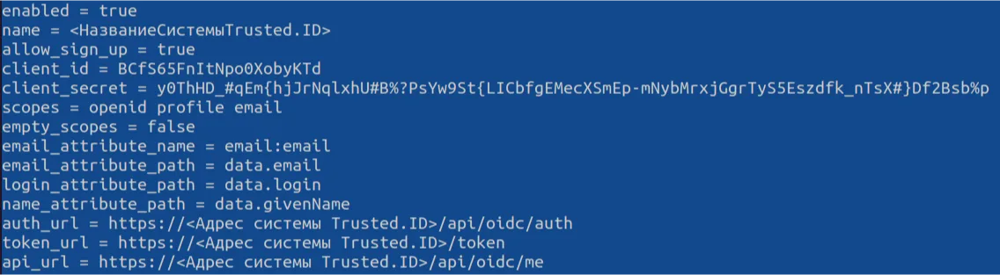

# How to Configure Grafana Integration with Encvoy ID

In this guide, you will learn how to set up Single Sign-On (SSO) in **Grafana** using the **Encvoy ID** system.

> 📌 [Grafana](https://www.grafana.com/) is an open-source data visualization system focused on IT monitoring system data.

Setting up login via **Encvoy ID** consists of several key steps performed in two different systems.

- [Step 1. Create Application](#step-1-create-application)
- [Step 2. Configure Grafana System](#step-2-configure-grafana)
- [Step 3. Verify Connection](#step-3-verify-connection)

---

## Step 1. Create Application { #step-1-create-application }

1. Log in to the **Encvoy ID** system.
2. Create an application with the following settings:
   - **Application Address** - the address of your **Grafana** installation;
   - **Redirect URL \#1 (Redirect_uri)** - `<Grafana installation address>/login/generic_oauth`.

   > 🔍 For more details on creating applications, read the [instructions](./docs-10-common-app-settings.md#creating-application).

3. Open the [application settings](./docs-10-common-app-settings.md#editing-application) and copy the values of the following fields:
   - **Identifier** (`Client_id`),
   - **Secret Key** (`client_secret`).

---

## Step 2. Configure Grafana System { #step-2-configure-grafana }

Authorization setup via **Encvoy ID** is performed in the **grafana.ini** configuration file, which on Linux is typically located at: `/etc/grafana/grafana.ini`.

1. Open the **grafana.ini** file in edit mode.
2. Find or add the `[auth.generic_oauth]` block and set the following parameters:

   ```ini
      [auth.generic_oauth]
      enabled = true
      name = <Encvoy IDSystemName>
      allow_sign_up = true
      client_id = <Client_id of the application created in Encvoy ID>
      client_secret = <Client_secret of the application created in Encvoy ID>
      scopes = openid profile email
      empty_scopes = false
      email_attribute_name = email:email
      email_attribute_path = data.email
      login_attribute_path = data.login
      name_attribute_path = data.givenName
      auth_url = https://<Encvoy ID system address>/api/oidc/auth
      token_url = https://<Encvoy ID system address>/api/oidc/token
      api_url = https://<Encvoy ID system address>/api/oidc/me
   ```

   

3. Restart the **Grafana** service to apply the new settings.

   ```bash
   sudo systemctl restart grafana-server
   ```

---

## Step 3. Verify Connection { #step-3-verify-connection }

1. Open the **Grafana** login page.
2. Ensure that the **Sign in with Encvoy ID** button has appeared.
3. Click the button and log in using your corporate credentials:
   - You will be redirected to the **Encvoy ID** authentication page;
   - After a successful login, you will be returned to **Grafana** as an authorized user.

   
