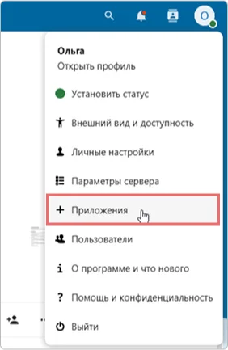
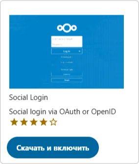

# How to configure Nextcloud integration with Encvoy ID

In this guide, you will learn how to set up Single Sign-On (SSO) in **Nextcloud** using the **Encvoy ID** system.

> 📌 [Nextcloud](https://nextcloud.com/) is an ecosystem of services for business communications and collaboration, combining calls, video conferencing, chats, and task management.

Setting up login with **Encvoy ID** consists of two key stages performed in two different systems.

- [Step 1. Create Application](#step-1-create-application)
- [Step 2. Configure Nextcloud](#step-2-configure-nextcloud)
- [Step 3. Verify Connection](#step-3-verify-connection)

---

## Step 1. Create Application { #step-1-create-application }

1. Log in to **Encvoy ID**.
2. Create a new application and specify:
   - **Application Address** - the address of your **Nextcloud** installation. For example: `https://<nextcloud-installation-address>`.
   - **Redirect URL \#1** (`Redirect_uri`) - the address in the format `https://<nextcloud-installation-address>/api/oauth/return`.

     > 🔍 For more details on creating applications, read the [instructions](./docs-10-common-app-settings.md#creating-application).

3. Open the [application settings](./docs-10-common-app-settings.md#editing-application) and copy the values of the following fields:
   - **Identifier** (`Client_id`),
   - **Secret key** (`client_secret`).

---

## Step 2. Configure Nextcloud { #step-2-configure-nextcloud }

1. Log in to **Nextcloud** with administrator privileges.
2. Install the **Social Login** application. This app allows users to log into the **Nextcloud** system using accounts from third-party services. Read more about the app at [apps.nextcloud.com](https://apps.nextcloud.com/apps/sociallogin).
   - Go to the **Apps** section → **Social & communication**.

     

   - Click **Download and enable** for the **Social Login** app.

     

     After installing the app, a **Social login** subsection will appear in the **Administration settings** section.

3. Go to **Administration settings** → **Social login** subsection.
4. Click the  button next to the **Custom OpenID Connect** field.
5. Fill in the connection parameters:
   - **Internal name** - specify the internal name of the authentication service as it will appear in **Nextcloud** settings.
   - **Title** - specify the name of the authentication service that will be clear to users. This title will be displayed on the login page button and in **Nextcloud** settings.
   - **Authorize url** - specify the authorization URL. For example, `https://<Encvoy ID-installation-address>/api/oidc/auth`.
   - **URL token** - specify the URL for obtaining the access token. For example, `https://<Encvoy ID-installation-address>/api/oidc/token`.
   - **Client id** - specify the value created in **Step 1**.
   - **Client Secret** - specify the value created in **Step 1**.
   - **Scope** - specify the necessary permissions to retrieve data. The required scope is `openid` and the standard scope is `profile`. When specifying multiple permissions, separate them with a space. For example: `profile email openid`.

   

6. If necessary, configure additional settings:

After completing all steps, a login button for **Encvoy ID** will be displayed in the **Nextcloud** authorization widget.

---

## Step 3. Verify Connection { #step-3-verify-connection }

1. Open the **Nextcloud** login page.
2. Ensure that the **Login with Encvoy ID** button has appeared.
3. Click the button and log in using your corporate credentials:
   - You will be redirected to the **Encvoy ID** authentication page;
   - After a successful login, you will be returned to **Nextcloud** as an authorized user.

   
