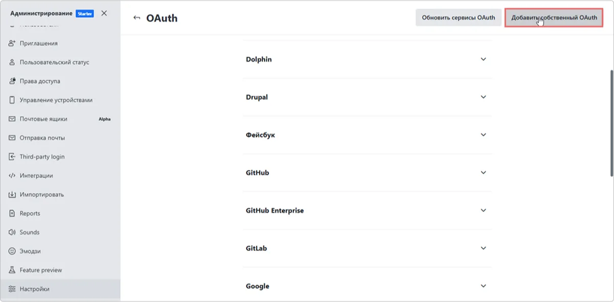
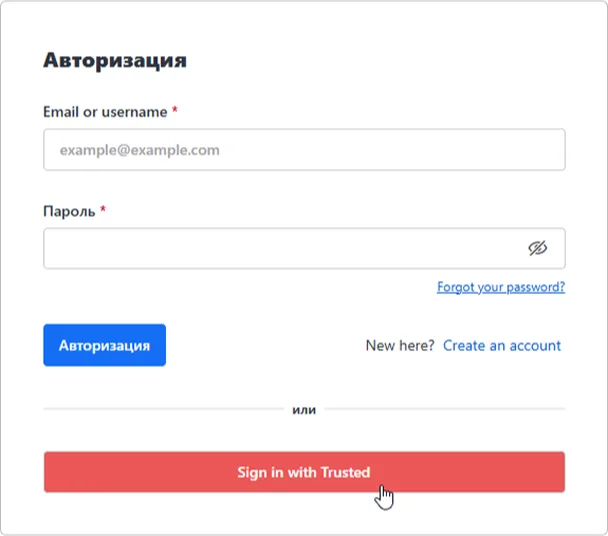

# How to Configure Rocket.Chat Integration with Encvoy ID

In this guide, you will learn how to set up Single Sign-On (SSO) in **Rocket.Chat** via the **Encvoy ID** system.

> 📌 [Rocket.Chat](https://www.rocket.chat/) is an open-source messaging platform designed for teamwork and communication. It provides functionality similar to services like **Slack** or **Microsoft Teams**, but with the option for self-deployment on your own server.

Setting up login via **Encvoy ID** consists of several key stages performed in two different systems:

- [Step 1. Create a connection in Rocket.Chat](#step-1-create-rocketchat-connection)
- [Step 2. Create an application](#step-2-create-application)
- [Step 3. Configure the connection in Rocket.Chat](#step-3-configure-rocketchat)
- [Step 4. Verify the connection](#step-4-verify-connection)

---

## Step 1. Create a connection in Rocket.Chat { #step-1-create-rocketchat-connection }

1. Log in to **Rocket.Chat** with administrator rights.
2. Open the menu and select **Workspace**.

3. The **Administration** section will open.
4. Go to the **Settings** subsection and click **Open** in the **OAuth** block.

5. Click the **Add custom OAuth** button.

6. In the window that appears, specify a unique name for the **OAuth service** being connected and click **Add**.

7. The created connection will appear in the general list of connections. If it does not, refresh the browser page.
8. Expand the connection settings and copy the **Callback URL**.

---

## Step 2. Create an application { #step-2-create-application }

1. Log in to **Encvoy ID**.
2. Create a new application and specify:
   - **Application Address** - the address of your **Rocket.Chat** installation;
   - **Callback URL \#1 (Redirect_uri)** - paste the value copied from the connection created in **Rocket.Chat**.

     > 🔍 For more details on creating applications, read the [instructions](./docs-10-common-app-settings.md#creating-application).

3. Open the [application settings](./docs-10-common-app-settings.md#editing-application) and copy the values of the following fields:
   - **Identifier** (`Client_id`),
   - **Secret Key** (`client_secret`).

---

## Step 3. Configure the connection in Rocket.Chat { #step-3-configure-rocketchat }

1. Return to **Rocket.Chat**.
2. Open the settings for the connection created in Step 1.
3. Toggle the **Enable** switch to activate the connection, or activate it later after configuring all parameters.

4. Specify the connection parameters:
   - **URL** — The URL of the Encvoy ID service. For example: `https://<Encvoy ID installation address>`
   - **Token Path** — This is the part of the Token Endpoint URL that specifies the path for obtaining tokens. For example: **/api/oidc/token**.
   - **Identity Path** — The endpoint with user information. For example: **/api/oidc/me**.
   - **Authorize Path** — The path from the authorization endpoint. For example: **/api/oidc/auth**.
   - **Scope** — The necessary permissions to retrieve data. Required scope is **openid** and standard scope is **profile**. When specifying multiple permissions, separate them with a space. For example: **profile email openid**.
   - **Id** — The Identifier (`Client_id`). Copy the value created in Step 2.
   - **Secret** — The Secret Key (`Client_secret`). Copy the value created in Step 2.

5. Specify the remaining settings. Detailed descriptions of the settings can be found on the documentation portal [docs.rocket.chat](https://docs.rocket.chat/docs/oauth).
6. Save the connection settings.

After completing all steps, a login button for **Encvoy ID** will appear in the **Rocket.Chat** authorization widget.

---

## Step 4. Verify the connection { #step-4-verify-connection }

1. Open the **Rocket.Chat** login page.
2. Ensure that the **Login with Encvoy ID** button has appeared.
3. Click the button and log in using your corporate credentials:
   - You will be redirected to the **Encvoy ID** authentication page;
   - After a successful login, you will be returned to **Rocket.Chat** as an authorized user.

   
