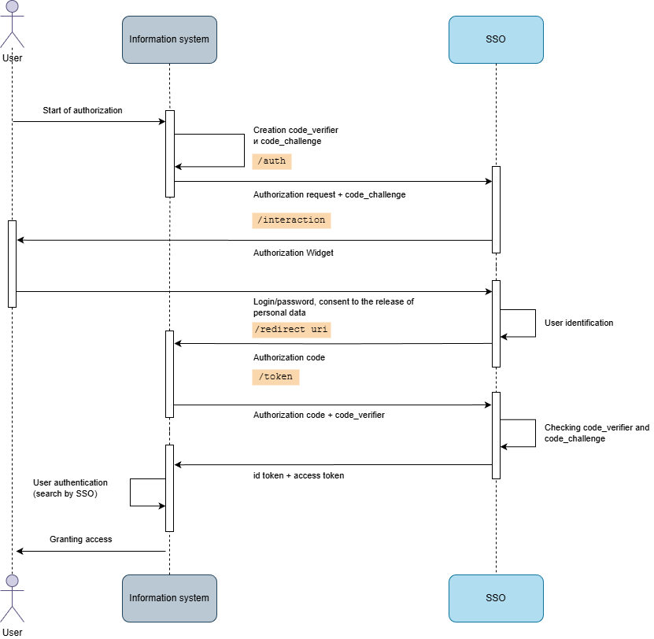

# Descripción General de Encvoy ID — Sistema de Inicio de Sesión Único (SSO)

**Encvoy ID** es un sistema de Inicio de Sesión Único (SSO) para la autenticación centralizada de usuarios y la gestión de acceso a aplicaciones corporativas.

El sistema proporciona una autenticación centralizada segura con soporte para SSO, OAuth 2.0, OpenID Connect y autenticación de dos factores.

---

## Casos de Uso de Encvoy ID

**Encvoy ID** es un sistema diseñado para organizar el inicio de sesión centralizado de usuarios en recursos de información corporativos utilizando una única cuenta.

**Encvoy ID** está dirigido a empresas que requieren:

- **Ventana de inicio de sesión único** para servicios internos y externos
- **Gestión de acceso centralizada** para diferentes categorías de usuarios (empleados, contratistas, clientes)
- **Seguridad mejorada** con soporte para autenticación multifactor
- **Control estricto y auditoría** de las acciones de los usuarios
- **Integración segura** de múltiples aplicaciones con diferentes sistemas de autenticación

---

## Características Clave de Encvoy ID

### 1. Autenticación e Inicio de Sesión

El sistema proporciona autenticación centralizada y admite múltiples protocolos y métodos de autenticación.

#### Protocolos Soportados

- **OpenID Connect (OIDC)** — autenticación de usuarios y transmisión de datos de identidad
- **OAuth 2.0** — autorización y gestión de acceso a recursos

#### Métodos de Autenticación

- **Métodos básicos**: nombre de usuario y contraseña, correo electrónico
- **Proveedores de Identidad Externos**: redes sociales, sistemas corporativos de confianza y otros servicios
- **Métodos mejorados y sin contraseña:** autenticación criptográfica mediante **mTLS** (certificados de cliente) y **WebAuthn** (biometría, llaves de hardware), así como contraseñas de un solo uso **TOTP/HOTP**.

#### Autenticación de Dos Factores (2FA / MFA)

**Encvoy ID** admite la autenticación multifactor (MFA), donde el acceso se concede solo después de la verificación exitosa de la identidad del usuario mediante varios factores independientes (conocimiento, posesión, biometría).

### 2. Gestión de Aplicaciones y Usuarios

- **Creación y configuración de aplicaciones:** aplicaciones web, aplicaciones móviles nativas
- **Personalización del widget:** personalización de la marca del widget de autenticación externa para que coincida con el estilo de la empresa
- **Gestión de usuarios:** registro, edición, bloqueo, cambios de contraseña

### 3. Seguridad y Auditoría

- **Diferenciación de derechos de acceso**
- **Registro detallado (logging)** de todos los eventos y acciones

### 4. Mini-widget

Un componente ligero de JavaScript que proporciona acceso rápido a las funciones de autenticación y a la información del usuario. Se integra fácilmente en cualquier sitio web e interfaz, proporcionando transiciones al perfil, al panel de la organización y a las aplicaciones.

### Niveles de Acceso

El sistema proporciona un modelo de acceso flexible basado en roles:

| Rol                          | Permisos                                                                          | Destinado a                                      |
| ---------------------------- | --------------------------------------------------------------------------------- | ------------------------------------------------ |
| **Servicio Administrador**   | Acceso total a todas las aplicaciones, usuarios y configuraciones globales        | Administradores del sistema, superusuarios       |
| **Gestor**                   | Gestión de aplicaciones y métodos de inicio de sesión para su organización/unidad | Jefes de departamento, gerentes de proyecto      |
| **Aplicación Administrador** | Gestión de aplicaciones específicas y sus usuarios                                | Desarrolladores, administradores de aplicaciones |
| **Miembro**                  | Gestión de su propio perfil y permisos de acceso a datos personales               | Usuarios regulares, empleados                    |

### Módulos del Sistema Encvoy ID

#### 1. Perfil (Profile)

El módulo "Perfil" permite la gestión de los datos personales del usuario y la configuración de acceso. Incluye funciones para editar información personal, ajustes de privacidad, gestión de permisos de aplicaciones y visualización del registro de actividad. El módulo también proporciona acceso al catálogo público de aplicaciones.

#### 2. Panel de Administración (Admin Dashboard)

El módulo "Panel de Administración" está diseñado para la gestión centralizada del sistema **Encvoy ID**. Incluye funciones para configurar parámetros globales del sistema, métodos de autenticación y la apariencia de la página de inicio de sesión. En este módulo, puede gestionar aplicaciones y cuentas de usuario, así como supervisar su actividad a través de un registro de eventos unificado.

#### 3. Panel de Organización (Organization Dashboard)

El módulo "Panel de Organización" permite la gestión de aplicaciones, métodos de autenticación y políticas de acceso dentro de una organización. Incluye la configuración de parámetros de la organización, configuración de métodos de inicio de sesión, gestión de aplicaciones de la organización y supervisión de la actividad de los usuarios.

#### 4. Panel de Aplicación (ADM)

El módulo "Panel de Aplicación" está destinado a la administración de aplicaciones individuales. Contiene funciones para gestionar las aplicaciones asignadas y supervisar la actividad de los usuarios que tienen acceso a dichas aplicaciones.

---

## Concepto y Principios de Funcionamiento de Encvoy ID

### Esquema General de Interacción

**Secuencia de Interacción:**

1. **Solicitud de Acceso** — el usuario accede al sistema de información (SI).
2. **Verificación en la BD del SI** — el sistema comprueba la existencia del usuario.
3. **Redirección al Widget** — el usuario es dirigido a **Encvoy ID**.
4. **Autenticación** — el usuario realiza el procedimiento de inicio de sesión.
5. **Verificación en la BD de Encvoy ID** — validación de credenciales.
6. **Provisión de Perfil** — devolución de los datos del usuario.
7. **Mapeo en el SI** — búsqueda del usuario basada en los datos de **Encvoy ID**.
8. **Verificación de Derechos** — autorización en el sistema de destino.
9. **Acceso Concedido** — inicio de sesión exitoso en el sistema.

> 📌 **Requisitos de Integración:** Para conectar un sistema de información a **Encvoy ID**, se requiere una base de datos de usuarios y un módulo de autorización que admita OpenID Connect o OAuth 2.0.

### Esquema de Autorización OpenID Connect

**Etapas Clave de OIDC:**

1. El usuario accede al SI.
2. El SI (cliente) genera `code_verifier` y `code_challenge`.
3. El SI redirige al usuario a `/authorize` en **Encvoy ID**.
4. El usuario es redirigido al widget de autorización de **Encvoy ID**.
5. El usuario ingresa login/contraseña y otorga el consentimiento para la transferencia de datos.
6. Se realiza la verificación del usuario en la BD de **Encvoy ID**.
7. El usuario es redirigido de vuelta al SI (cliente) con un `Authorization code`.
8. El SI envía una solicitud a `/token` en **Encvoy ID**.
9. Verificación de `code_challenge` y `code_verifier` en **Encvoy ID**.
10. Provisión del `id token` que contiene el perfil de usuario de **Encvoy ID** y el `access token` (opcionalmente `refresh token`) al SI.
11. Autenticación del usuario en el SI.
12. El usuario obtiene acceso al SI.

### Esquema de Autorización OAuth 2.0

**Características del Flujo OAuth 2.0:**

1. El usuario accede al SI.
2. El SI redirige al usuario a `/authorize` en **Encvoy ID**.
3. El usuario es redirigido al widget de autorización de **Encvoy ID**.
4. El usuario ingresa login/contraseña y otorga el consentimiento para la transferencia de datos.
5. Se realiza la verificación del usuario en la BD de **Encvoy ID**.
6. **Encvoy ID** redirige al usuario de vuelta al SI con un `Authorization code` al `Redirect_URI`.
7. El SI envía una solicitud de `token` utilizando el `Authorization code`.
8. **Encvoy ID** valida la solicitud.
9. **Encvoy ID** devuelve el `id token` y el `access token` (opcionalmente `refresh token`).
10. El SI solicita el perfil de usuario.
11. **Encvoy ID** proporciona el perfil de usuario.
12. El SI valida las respuestas y establece una sesión de usuario local.
13. El usuario obtiene acceso al SI.

### Esquema de Inicio de Sesión Único (SSO)

**Escenario Típico:**

1. Solicitud de acceso al SI1.
2. Autenticación del usuario en **Encvoy ID**.
3. Provisión del perfil de usuario de **Encvoy ID** al SI1.
4. Solicitud de acceso al SI2.
5. Provisión del perfil de usuario de **Encvoy ID** al SI2 sin repetir el procedimiento de autenticación de usuario.

> 🚀 **¿Listo para comenzar?** Proceda a la [guía de instalación del sistema](./docs-02-box-system-install.md).

---

## Ver También

- [Instalación del Sistema Encvoy ID](./docs-02-box-system-install.md) — una guía para instalar el sistema.
- [Variables de Entorno de Encvoy ID](./docs-03-box-system-configuration.md) — una guía para preparar la configuración antes del lanzamiento.
- [Configuración del Sistema](./docs-04-box-system-settings.md) — una guía para configurar la interfaz y el acceso de los usuarios al sistema.
