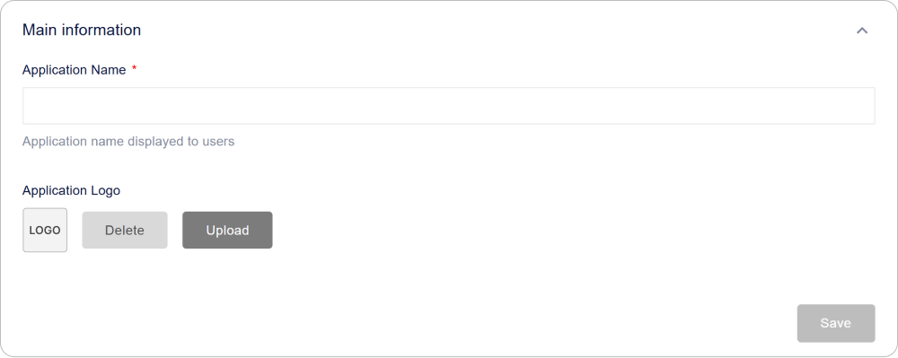
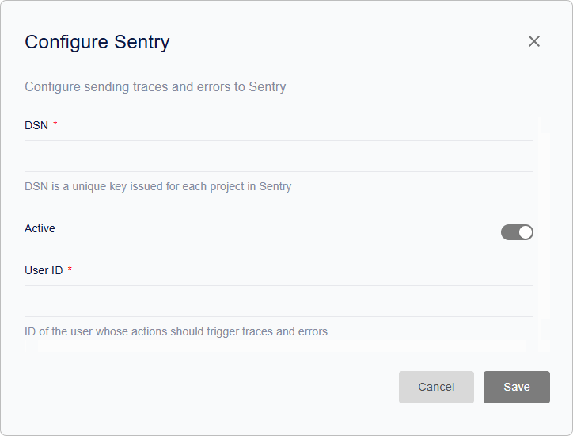

# Cómo configurar Encvoy ID: Seguridad, Interfaz y Acceso

En esta guía, aprenderá a configurar la interfaz y localización de **Encvoy ID**, crear tipos de aplicaciones, gestionar el acceso de usuarios, habilitar la autenticación de dos factores e integrar el servicio con Sentry para el monitoreo de eventos.

Esta sección está dirigida a administradores y especialistas en seguridad que desean gestionar eficazmente los ajustes de **Encvoy ID**, incluyendo OAuth 2.0 y OpenID Connect.

**Tabla de contenidos:**

- [Configuración de Interfaz y Localización](#interface-and-localization)
- [Seguridad y Acceso](#security-and-access)
- [Tipos de Aplicaciones](#application-types)
- [Funciones Experimentales](#experimental-features)
- [Ver también](#see-also)

> 💡 Los ajustes del sistema se encuentran en el panel de administración. Para acceder al panel, se requiere el rol de servicio **Administrador**. [Cómo abrir el panel de administración →](./docs-02-box-system-install.md#admin-panel-access)

---

## Configuración de Interfaz y Localización { #interface-and-localization }

> 💡 La personalización de colores, fuentes y la apariencia de los elementos de la interfaz está disponible a través de la variable `CUSTOM_STYLES` en el archivo `.env`. Más detalles en la sección de [Variables de Entorno](./docs-03-box-system-configuration.md#interface-customization).

### Configuración del Nombre del Sistema y Logotipo { #system-name-and-logo }

El nombre y el logotipo se muestran en la interfaz de **Encvoy ID**, así como en el [mini-widget](./docs-09-common-mini-widget-settings.md) y el [widget de inicio de sesión](./docs-06-github-en-providers-settings.md#login-widget-settings).

Para configurar el nombre y el logotipo:

1. Vaya al panel de administración → pestaña **Configuración**.
2. Despliegue el bloque **Información principal**.

3. Ingrese el nuevo nombre en el campo **Nombre de la aplicación**.
4. En el bloque **Logotipo de la aplicación**, haga clic en **Cargar** y seleccione el archivo del logotipo.

   

   > ⚡ Formatos compatibles: JPG, GIF, PNG, WEBP; tamaño máximo 1 MB.

5. Configure la visualización y haga clic en **Aplicar**.

6. Haga clic en **Guardar**.

> 💡 **Consejo:** Utilice el formato SVG para un logotipo vectorial para asegurar una visualización nítida en todos los dispositivos y resoluciones de pantalla.

### Configuración de Localización

**Encvoy ID** admite la interfaz en **seis idiomas**:

- Ruso (ru)
- Inglés (en)
- Francés (fr)
- Español (es)
- Alemán (de)
- Italiano (it)

El idioma seleccionado afecta la visualización del texto en todas las interfaces de **Encvoy ID**, incluyendo el [widget de inicio de sesión](./docs-06-github-en-providers-settings.md#login-widget-settings) y el [mini-widget](./docs-09-common-mini-widget-settings.md).

Si utiliza [campos adicionales del perfil de usuario](./docs-05-box-userfields-settings.md#additional-profile-fields) y [plantillas de correo electrónico](./docs-04-box-system-settings.md#email-notification-templates), asegúrese de que se muestren correctamente.

#### Cómo cambiar el idioma de la interfaz

1. Vaya al panel de administración → pestaña **Configuración**.
2. Despliegue el bloque **Localización** y seleccione el idioma requerido de la lista.

3. Haga clic en **Guardar**.

El cambio de idioma se producirá automáticamente, sin necesidad de reiniciar el servicio o refrescar la página.

> 🚨 **Advertencia:** Después de cambiar el idioma, todos los textos de la interfaz, incluidos los mensajes del sistema y las notificaciones, se mostrarán en el idioma seleccionado. Asegúrese de que sus usuarios comprendan el idioma elegido.

### Configuración de Plantillas de Notificación por Correo Electrónico { #email-notification-templates }

Las **plantillas de correo electrónico** son preajustes de correo que contienen elementos de diseño y formato predefinidos. Se utilizan para crear notificaciones automáticas, como correos de registro, recuperación de contraseña y otros eventos.

#### ¿Qué es Mustache?

**Mustache** es un motor de plantillas sencillo para insertar datos en plantillas de texto. En **Encvoy ID**, se utiliza para:

- Insertar datos de usuario (`{{user.name}}`),
- Generación dinámica de enlaces (`{{confirmation_link}}`),
- Visualización condicional de bloques.

> 🔗 [Documentación oficial de Mustache](https://mustache.github.io/)

#### Tipos de correo electrónico disponibles

| Tipo de correo                          | Evento              | Propósito                                  |
| --------------------------------------- | ------------------- | ------------------------------------------ |
| Registro                                | `account_create`    | Correo de bienvenida para un nuevo usuario |
| Código de confirmación                  | `confirmation_code` | Correo con un código de verificación       |
| Enlace de confirmación                  | `confirmation_link` | Correo con un enlace de verificación       |
| Cambio de contraseña                    | `password_change`   | Notificación de cambio de contraseña       |
| Solicitud de recuperación de contraseña | `password_recover`  | Correo con un código de verificación       |
| Invitación                              | `invite`            | Correo de invitación a la aplicación       |

#### Cómo configurar una plantilla

1. Vaya al panel de administración → pestaña **Configuración**.
2. Busque el bloque **Plantillas de correo** y haga clic en **Configurar**.
3. Seleccione la plantilla requerida y haga clic en **Configurar**.

4. En el formulario de edición que se abre, especifique:
   - **Nombre de la plantilla**,
   - **Asunto del correo**,
   - **Contenido del correo**.

   > 💡 Utilice marcado HTML y variables en el formato `{{variable_name}}`. Asegúrese de que las variables utilizadas coincidan con los [campos de perfil de usuario](./docs-05-box-userfields-settings.md#basic-profile-fields) disponibles para evitar errores al enviar el correo.

   

5. Haga clic en **Guardar**.

---

## Seguridad y Acceso { #security-and-access }

### Ajustes de Acceso { #access-settings }

#### Autenticación de Dos Factores { #two-factor-authentication }

La autenticación de dos factores (2FA) añade una capa extra de protección durante el inicio de sesión. Después de ingresar el primer factor (usuario/contraseña u otro método de autenticación), el usuario debe confirmar su identidad con un segundo factor (teléfono, correo electrónico, WebAuthn).

##### Cómo configurar la autenticación de dos factores

1. Vaya al panel de administración → pestaña **Configuración**.
2. Despliegue el bloque **Configuración de acceso** y haga clic en **Configurar**.

3. Especifique los proveedores del primer y segundo factor:
   - Proveedor del **primer factor** — el método de autenticación principal (usuario/contraseña u otro método de autenticación).
   - Proveedor del **segundo factor** — el método de confirmación de identidad (teléfono, correo electrónico, WebAuthn).

   

4. Haga clic en **Guardar**.

#### Ignorar campos de perfil obligatorios durante el inicio de sesión en aplicaciones

Algunos campos del perfil de usuario (por ejemplo, teléfono, correo electrónico, etc.) pueden estar marcados como obligatorios en el perfil personal.

Por defecto, al autorizar en aplicaciones, **Encvoy ID** verifica la presencia de todos los campos obligatorios y puede suspender el inicio de sesión hasta que el usuario complete los datos faltantes. El ajuste **Ignorar campos obligatorios del perfil del área personal para aplicaciones** permite desactivar esta verificación.

Esto puede ser útil si la organización utiliza fuentes de datos de usuario externas y no requiere la compleción manual del perfil.

##### Qué sucede cuando se habilita

- Los usuarios podrán autorizarse en las aplicaciones incluso si su perfil personal no está completamente completado.
- No se realizará la verificación de campos obligatorios.
- Las notificaciones sobre campos incompletos se seguirán mostrando en la interfaz del perfil personal.

##### Cómo habilitar el ajuste

1. Vaya al panel de administración → pestaña **Configuración**.
2. Despliegue el bloque **Configuración de acceso**.
3. Active el interruptor **Ignorar campos obligatorios del perfil del área personal para aplicaciones**.
4. Haga clic en **Guardar**.

Después de aplicar el ajuste, los usuarios podrán pasar la autorización sin verificar los campos obligatorios del perfil.

> 💡 **Recomendación**: Habilite esta opción solo si la integridad del perfil se controla por otros medios.

#### Prohibir la vinculación de identificadores

Este ajuste evita que los usuarios vinculen de forma independiente nuevos identificadores externos a su perfil a través del widget de inicio de sesión.

Para prohibir la vinculación:

1. Vaya al panel de administración → pestaña **Configuración**.
2. Despliegue el bloque **Configuración de acceso**.
3. Active el interruptor **Prohibir la vinculación de identificadores en el formulario del widget**.
4. Haga clic en **Guardar**.

#### Restricciones de Acceso

Este ajuste permite restringir el inicio de sesión en aplicaciones para todos los usuarios excepto para el servicio **Administrador**. Todos los demás usuarios no podrán autorizarse.

> 🚨 **Importante:** Cuando se habilita la restricción de acceso, todos los usuarios excepto los administradores del servicio perderán la capacidad de iniciar sesión. Utilice este ajuste para mantenimiento o situaciones de emergencia.

Para restringir el acceso:

1. Vaya al panel de administración → pestaña **Configuración**.
2. Despliegue el bloque **Configuración de acceso**.
3. Active el interruptor **Acceso restringido para todas las aplicaciones**.
4. Haga clic en **Guardar**.

#### Prohibir el Registro

Este ajuste permite prohibir la creación de nuevas cuentas en el widget de inicio de sesión.

Para configurar la prohibición de registro:

1. Vaya al panel de administración → pestaña **Configuración**.
2. Despliegue el bloque **Configuración de acceso**.
3. Seleccione el ajuste requerido:
   - **Registro prohibido** — bloquea completamente la creación de nuevas cuentas.
   - **Registro permitido** (por defecto) — modo de operación estándar, los usuarios pueden crear cuentas de forma independiente.

4. Haga clic en **Guardar**.

### Parámetros Técnicos

Los ajustes técnicos como identificadores de cliente, parámetros de seguridad, URLs de autorización, métodos de autenticación de cliente, parámetros de token y otros se encuentran en la sección **Parámetros de la Aplicación**.

A continuación se muestran los ajustes disponibles para edición en el panel de administración. Otros parámetros se cambian a través del [archivo de configuración](./docs-03-box-system-configuration.md).

Para cambiar los parámetros en el panel de administración:

1. Vaya al panel de administración → pestaña **Configuración**.
2. Despliegue el bloque **Parámetros de la aplicación**.
3. Configure los parámetros:
   - [Restricción de Acceso](#access-settings)
   - [Tiempo de Autenticación](#authentication-time)
   - [Token de Acceso](#access-token)
   - [Token de Refresco](#refresh-token)

4. Haga clic en **Guardar**.

### Descripciones de Parámetros

#### Identificadores Principales

| Nombre                            | Parámetro       | Descripción                                                                        |
| --------------------------------- | --------------- | ---------------------------------------------------------------------------------- |
| **Identificador (client_id)**     | `client_id`     | Identificador único de la aplicación                                               |
| **Clave secreta (client_secret)** | `client_secret` | Clave confidencial de la aplicación                                                |
| **Dirección de la aplicación**    | -               | URL base del servicio **Encvoy ID** en formato `protocolo://nombre_dominio:puerto` |

#### Restricción de Acceso

Restringe el inicio de sesión al perfil personal solo a usuarios con roles administrativos.

| Nombre                 | Descripción                                                                                                              |
| ---------------------- | ------------------------------------------------------------------------------------------------------------------------ |
| **Acceso restringido** | Si está habilitado, el acceso al perfil personal se permitirá solo a usuarios con derechos de servicio **Administrador** |

#### URL de Redirección

| Nombre                          | Parámetro      | Descripción                                                                |
| ------------------------------- | -------------- | -------------------------------------------------------------------------- |
| **URL de redireccionamiento #** | `Redirect_uri` | URL a la que se redirigirá al usuario después de una autenticación exitosa |

#### URL de Cierre de Sesión

| Nombre                        | Parámetro                  | Descripción                                                                                                                              |
| ----------------------------- | -------------------------- | ---------------------------------------------------------------------------------------------------------------------------------------- |
| **URL de cierre de sesión #** | `post_logout_redirect_uri` | URL a la que el servicio redirigirá al usuario después de cerrar la sesión. Si no se especifica ningún valor, se utiliza `Redirect_uri`. |

#### URL de Solicitud de Autenticación

| Nombre                                                                    | Parámetro      | Descripción                                                                                                                                               |
| ------------------------------------------------------------------------- | -------------- | --------------------------------------------------------------------------------------------------------------------------------------------------------- |
| **URL de solicitud de autenticación o recuperación tras autenticación #** | `request_uris` | Lista de URLs para alojar solicitudes de autorización JWT (`Request Object`). El servidor recupera el JWT de la URL especificada durante la autorización. |

#### Tipos de Respuesta

| Nombre                                  | Parámetro        | Descripción                                                                                                                                                                                                                                                                                                                                                                            |
| --------------------------------------- | ---------------- | -------------------------------------------------------------------------------------------------------------------------------------------------------------------------------------------------------------------------------------------------------------------------------------------------------------------------------------------------------------------------------------- |
| **Tipos de respuesta (response_types)** | `response_types` | 
 Determina qué tokens y códigos devuelve el servidor de autorización:
 
 - `code` — solo código de autorización  - `id_token` — solo token de ID   - `code id_token` — código + token de ID   - `code token` — código + token de acceso   - `code id_token token` — código + token de ID + token de acceso   - `none` — solo confirmación de autenticación 
 |

#### Tipos de Concesión (Grant Types)

| Nombre                               | Parámetro     | Descripción                                                                                                                                                                                                                                                                               |
| ------------------------------------ | ------------- | ----------------------------------------------------------------------------------------------------------------------------------------------------------------------------------------------------------------------------------------------------------------------------------------- |
| **Tipos de concesión (grant_types)** | `grant_types` | 
 Métodos para obtener la autorización: 
 - `authorization code` — código seguro a través del servidor del cliente (recomendado);   - `implicit` — adquisición directa de token (para clientes públicos)   - `refresh_token` — renovación de token sin volver a iniciar sesión |

#### Método de Autenticación del Cliente

> 💡 La elección del método depende de los requisitos de seguridad y las capacidades del cliente. Los métodos JWT proporcionan una seguridad mejorada ya que no transmiten el secreto directamente.

| Nombre                        | Parámetro                                                                                             | Descripción                                                                                                                                                                                                                                                                                                                                                                                                                                                               |
| ----------------------------- | ----------------------------------------------------------------------------------------------------- | ------------------------------------------------------------------------------------------------------------------------------------------------------------------------------------------------------------------------------------------------------------------------------------------------------------------------------------------------------------------------------------------------------------------------------------------------------------------------- |
| **Autenticación del Cliente** | `token_endpoint_auth_method`, `introspection_endpoint_auth_method`, `revocation_endpoint_auth_method` | 
 Determina el método de autenticación del cliente al acceder a varios endpoints (`token`, `introspection`, `revocation`). 
 Métodos disponibles:   - `none` — sin credenciales;  - `client_secret_post` — credenciales en el cuerpo de la solicitud;  - `client_secret_basic` — Autenticación Básica HTTP;  - `client_secret_jwt` — JWT firmado con el secreto del cliente;  - `private_key_jwt` — JWT firmado con la clave privada del cliente.
 |

#### Algoritmo de Firma del Token de ID

| Nombre                                                                                       | Parámetro                      | Descripción                                                                                                                                                               |
| -------------------------------------------------------------------------------------------- | ------------------------------ | ------------------------------------------------------------------------------------------------------------------------------------------------------------------------- |
| **Algoritmo de firma utilizado al crear el ID Token firmado (id_token_signed_response_alg)** | `id_token_signed_response_alg` | 
 Especifica el algoritmo utilizado para firmar el token de ID. 
 `ID token` es un JSON Web Token (JWT) que contiene afirmaciones sobre la autenticación del usuario |

#### Tiempo de Autenticación { #authentication-time }

| Nombre                                                                           | Parámetro           | Descripción                                                                                              |
| -------------------------------------------------------------------------------- | ------------------- | -------------------------------------------------------------------------------------------------------- |
| **Verificación de la presencia del tiempo de autenticación (require_auth_time)** | `require_auth_time` | Si está habilitado, se añade `auth_time` (la hora de la última autenticación del usuario) al token de ID |

#### Parámetros de Seguridad Adicionales

| Nombre                                                                                                           | Parámetro                       | Descripción                                                                                                                                                                                                                                                                                                                                                                                                                                                                                                   |
| ---------------------------------------------------------------------------------------------------------------- | ------------------------------- | ------------------------------------------------------------------------------------------------------------------------------------------------------------------------------------------------------------------------------------------------------------------------------------------------------------------------------------------------------------------------------------------------------------------------------------------------------------------------------------------------------------- |
| Parámetro para garantizar la seguridad de la transmisión de datos entre el cliente y el servidor de autorización | `require_signed_request_object` | 
Especifica si se requiere un `Request Object` firmado al enviar una solicitud de autorización.
 `Request Object` es una forma de transmitir de forma segura los parámetros de autorización del cliente al servidor de autorización, generalmente en forma de un JWT (JSON Web Token).
 
Cuando `require_signed_request_object` está habilitado, el cliente debe firmar el `Request Object` utilizando un algoritmo de firma previamente acordado especificado en la configuración del cliente.
 |

#### Tipo de Transmisión del Identificador de Usuario

| Nombre                                                                                   | Parámetro      | Descripción                                                                                                                                                                                                          |
| ---------------------------------------------------------------------------------------- | -------------- | -------------------------------------------------------------------------------------------------------------------------------------------------------------------------------------------------------------------- |
| **Método de transmisión del ID de usuario en el token de identificación (subject_type)** | `subject_type` | Determina cómo se forma la `sub claim` en el token de ID: 
 - `public` — el mismo identificador para todos los clientes   - `pairwise` — un identificador único para cada cliente, mejorando la privacidad 
 |

#### Token de Acceso { #access-token }

| Nombre                                 | Parámetro          | Descripción                                  |
| -------------------------------------- | ------------------ | -------------------------------------------- |
| **Token de acceso (access_token_ttl)** | `access_token_ttl` | Tiempo de vida de `access_token` en segundos |

#### Token de Refresco { #refresh-token }

| Nombre                                         | Parámetro           | Descripción                                   |
| ---------------------------------------------- | ------------------- | --------------------------------------------- |
| **Token de actualización (refresh_token_ttl)** | `refresh_token_ttl` | Tiempo de vida de `refresh_token` en segundos |

### Conexión de Sentry

**Sentry** es una plataforma para el monitoreo de errores y el rendimiento de las aplicaciones.

> 📚 [Recurso oficial de Sentry](https://sentry.io/welcome/)

Conectar **Sentry** le permite:

- rastrear errores y excepciones en tiempo real;
- obtener trazas de eventos por usuario;
- analizar el rendimiento del sistema.

#### Cómo conectar Sentry

##### Paso 1. Creación de un proyecto en Sentry

1. Vaya al sitio web [Sentry.io](https://sentry.io/welcome/).
2. Regístrese o inicie sesión en su cuenta.
3. Cree un nuevo proyecto.

Después de crear el proyecto, **Sentry** proporcionará un **DSN (Data Source Name)** — un identificador único para conectar **Encvoy ID** a **Sentry**.

> 💡 **Consejo**: Copie el **DSN (Data Source Name)** para no perderlo al pasar al siguiente paso.

##### Paso 2. Conexión de Sentry

Para conectar **Sentry**:

1. Vaya al panel de administración → pestaña **Configuración**.
2. Busque el bloque **Sentry** y haga clic en **Configurar**.
3. En el formulario de conexión que se abre, especifique:
   - **DSN** — el identificador único creado en el **Paso 1**.
   - **Activo** — habilite para comenzar a enviar errores y trazas a **Sentry**.
   - **ID de usuario** (si es necesario) — especifique si necesita rastrear errores y eventos por usuarios específicos.

     

4. Haga clic en **Guardar**.

### Registro de Eventos

En el **Registro**, puede ver dónde y desde qué dispositivos los usuarios accedieron al perfil personal o a las aplicaciones.

Hay información detallada disponible para cada evento.

| Parámetro                 | Contiene                                     |
| ------------------------- | -------------------------------------------- |
| **Encabezado del evento** | Categoría de acción                          |
| **Fecha y Hora**          | Marcas de tiempo exactas                     |
| **Aplicación**            | Identificador de la aplicación (`client_id`) |
| **Usuario**               | Identificador del usuario (`id`)             |
| **Dispositivo**           | Tipo de dispositivo y navegador              |
| **Ubicación**             | Dirección IP                                 |

#### Cómo acceder al Registro

1. Vaya al panel de administración.
2. Abra la pestaña **Registro**.

---

## Tipos de Aplicaciones { #application-types }

Los **tipos de aplicaciones** son categorías para sistematizar las aplicaciones en el **[catálogo](./docs-12-common-personal-profile.md#application-catalog)**. Ayudan a organizar la estructura y simplificar la navegación del usuario.

**Por qué son necesarios los tipos**:

- Ayudan a agrupar aplicaciones por categoría
- Simplifican la búsqueda de las aplicaciones requeridas
- Ayudan a organizar la estructura del catálogo

### Creación de un Tipo de Aplicación { #creating-app-type }

1. Vaya al panel de administración → pestaña **Configuración**.
2. Busque el bloque **Tipos de aplicaciones** y haga clic en **Configurar**.
3. En la ventana que aparece, haga clic en el botón **Crear** .
4. Se abrirá el formulario de creación.

5. Especifique el nombre del tipo.

   > 💡 El nombre del tipo debe ser único dentro del sistema.

6. Haga clic en **Guardar**.

   El tipo creado aparecerá en la lista.

> 💡 La asignación de tipo se realiza al [crear una aplicación](./docs-10-common-app-settings.md#creating-application).

### Edición de un Tipo de Aplicación

1. Vaya al panel de administración → pestaña **Configuración**.
2. Busque el bloque **Tipos de aplicaciones** y haga clic en **Configurar**.
3. Se abrirá una ventana con la lista de tipos.

4. Haga clic en el botón **Configurar** en el panel del tipo que desea editar.
5. Se abrirá el formulario de edición.
6. Realice los cambios necesarios.
7. Haga clic en **Guardar**.

> 💡 Después de editar un tipo, todas las aplicaciones asociadas reciben automáticamente el nombre de categoría actualizado.

### Eliminación de un Tipo de Aplicación

1. Vaya al panel de administración → pestaña **Configuración**.
2. Busque el bloque **Tipos de aplicaciones** y haga clic en **Configurar**.
3. Se abrirá una ventana con la lista de tipos.
4. Haga clic en el botón **Eliminar**  en el panel del tipo que desea eliminar.

La eliminación ocurre sin confirmación adicional.

> 💡 Después de la eliminación, el tipo se quitará del catálogo y las aplicaciones asignadas a él recibirán automáticamente el tipo **Otros**.

---

## Funciones Experimentales { #experimental-features }

Las **funciones experimentales** son nuevas capacidades del servicio **Encvoy ID** que se encuentran en etapa de prueba y refinamiento.

**Características principales:**

- Reguladas por el administrador del servicio
- La funcionalidad puede cambiar sin previo aviso
- Pueden contener características operativas no documentadas
- El rendimiento y la estabilidad pueden diferir de las funciones principales

La sección de funciones experimentales está disponible en: `https://ID_HOST/experimental`.

> 🚧 **Estado**: Las funciones experimentales pueden ser eliminadas, cambiadas o movidas a la funcionalidad principal sin previo aviso.

#### Funciones Disponibles

1. **Tarjeta de Presentación del Usuario**
   - Análogo digital de una tarjeta de presentación con detalles de contacto
   - Soporte de formato vCard para exportación
   - Capacidad de compartir a través de enlace o código QR

   [Más sobre la tarjeta de presentación →](./docs-12-common-personal-profile.md#digital-business-card)

2. **Catálogo de Aplicaciones**
   - Plataforma centralizada para las aplicaciones del sistema **Encvoy ID**
   - Cuenta con un sistema de categorías conveniente
   - Capacidad de añadir aplicaciones a favoritos

   [Más sobre el catálogo →](./docs-12-common-personal-profile.md#application-catalog)

   

---

## Ver también { #see-also }

- [Configuración de la Política de Contraseñas y Perfil de Usuario](./docs-05-box-userfields-settings.md) — guía para configurar perfiles de usuario.
- [Métodos de Inicio de Sesión y Configuración del Widget de Inicio de Sesión](./docs-06-github-en-providers-settings.md) — guía para conectar y configurar servicios de autenticación externos.
- [Gestión de Aplicaciones](./docs-10-common-app-settings.md) — guía para crear, configurar y gestionar aplicaciones OAuth 2.0 y OpenID Connect (OIDC).
