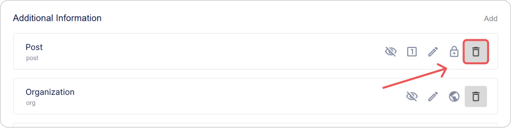
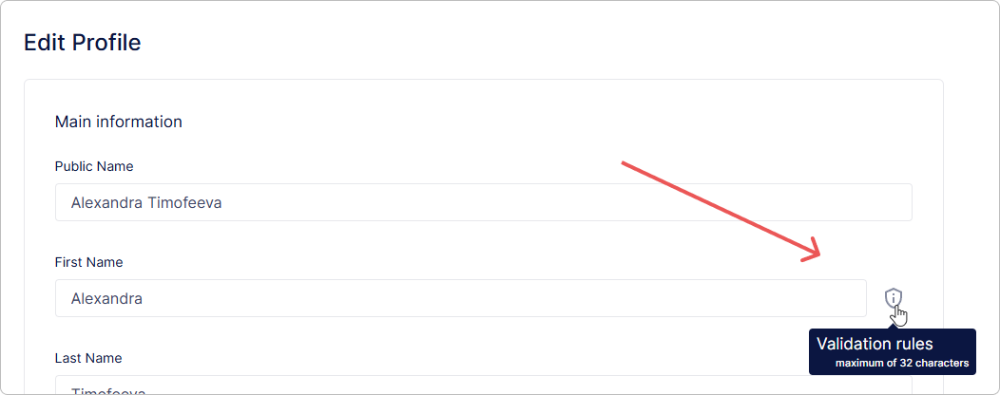
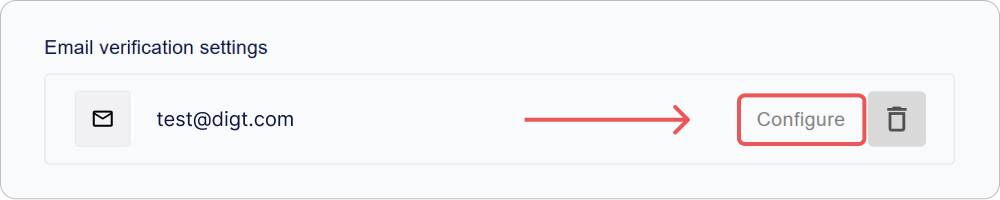
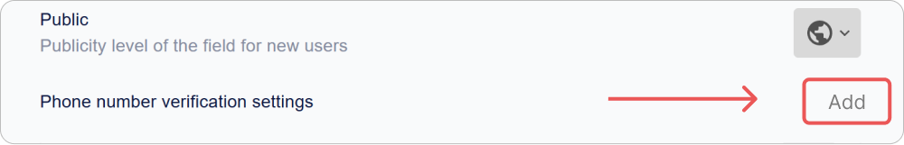

# Cómo configurar el perfil de usuario de Encvoy ID

En esta guía, explicaremos cómo configurar el perfil de usuario y la política de contraseñas en **Encvoy ID**. Aprenderá a gestionar los campos del perfil, la validación de campos y a configurar la confirmación de la dirección de correo electrónico y el número de teléfono.

**Tabla de contenidos:**

- [Política de contraseñas](#password-policy)
- [Campos básicos del perfil](#basic-profile-fields)
- [Campos adicionales del perfil](#additional-profile-fields)
- [Reglas de validación de campos de perfil y contraseñas](#validation-rules)
- [Ajustes de confirmación de correo electrónico](#email-confirmation-settings)
- [Ajustes de confirmación de número de teléfono](#phone-confirmation-settings)
- [Ver también](#see-also)

> 📌 Los ajustes del perfil de usuario se encuentran en el panel de administración. Para acceder al panel, se requiere el rol de servicio **Administrador**. [Cómo abrir el panel de administración →](./docs-02-box-system-install.md#admin-panel-access)

---

## Política de contraseñas { #password-policy }

La **política de contraseñas en Encvoy ID** es un conjunto de reglas que definen los requisitos de complejidad y seguridad para las contraseñas de los usuarios. Ayuda a proteger las cuentas contra el hackeo y el acceso no autorizado.

Las reglas establecidas se aplican:

- al crear una contraseña en el widget de registro,
- al restablecer una contraseña en el widget de inicio de sesión,
- al cambiar una contraseña en el perfil de usuario.

### Cómo configurar las reglas de la política de contraseñas

1. Vaya al panel de administración → pestaña **Configuración**.
2. Despliegue el bloque **Configuración del perfil de usuario** y haga clic en el panel **Contraseña**.

3. En la ventana que aparece, haga clic en **Configurar**.

4. Se abrirá una ventana con una lista de reglas de validación disponibles.

   > 🔗 Para obtener información sobre la creación y configuración de reglas de validación de campos de perfil, lea las instrucciones de [Reglas de validación de campos de perfil de usuario](#validation-rules).

5. Marque las casillas de las reglas que desea aplicar a la contraseña.

6. Cierre la ventana de la lista de reglas.
7. Haga clic en **Guardar** en el formulario de edición de campos.

Los cambios se aplican automáticamente.

Ahora, las reglas que seleccionó se utilizarán para verificar la complejidad de la contraseña del usuario.

> ⚠️ **Nota**: Las nuevas reglas se aplican solo a las contraseñas que se están creando o cambiando. Las contraseñas existentes permanecen sin cambios.

### Recomendaciones de seguridad

Para garantizar una protección sólida de la cuenta, se recomienda habilitar los siguientes parámetros:

| Recomendación                                            | Ejemplo de regla                               |
| -------------------------------------------------------- | ---------------------------------------------- |
| Longitud mínima de la contraseña — al menos 8 caracteres | `Longitud mínima = 8`                          |
| Uso de diferentes mayúsculas y minúsculas                | `Contiene caracteres en minúscula y mayúscula` |
| Presencia obligatoria de dígitos                         | `Contiene al menos un dígito`                  |
| Presencia obligatoria de caracteres especiales           | `Contiene caracteres especiales (!@#$% etc.)`  |

---

## Campos básicos del perfil de usuario { #basic-profile-fields }

Los **campos básicos del perfil** son atributos del sistema obligatorios creados automáticamente para cada usuario al registrarse. Forman la estructura base del perfil y garantizan el correcto funcionamiento de los mecanismos de autenticación, identificación y comunicación entre sistemas.

### Lista de campos básicos

> 📌 La lista de campos básicos es fija. No está disponible la opción de añadir, renombrar o eliminar estos campos.

| Campo                             | Identificador               |
| --------------------------------- | --------------------------- |
| Identificador                     | `sub`                       |
| Login                             | `login`                     |
| Correo electrónico                | `email`                     |
| Nombre                            | `given_name`                |
| Apellido                          | `family_name`               |
| Teléfono                          | `phone_number`              |
| Fecha de nacimiento               | `birthdate`                 |
| Apodo                             | `nickname`                  |
| Foto                              | `picture`                   |
| Acuerdo de procesamiento de datos | `data_processing_agreement` |

### Indicadores de configuración

En la interfaz, está disponible una vista rápida de la configuración de los campos para cada campo en forma de identificadores:

| Icono                                                             | Parámetro                                                     |
| ----------------------------------------------------------------- | ------------------------------------------------------------- |
|      | El campo está disponible para que el usuario lo edite         |
|  | El campo es obligatorio de completar                          |
|            | El valor del campo debe ser único                             |
|        | Nivel de publicidad del campo                                 |
|     | El campo se puede usar como login durante el inicio de sesión |

### Cómo configurar un campo básico

1. Vaya al panel de administración → pestaña **Configuración**.
2. Despliegue el bloque **Configuración del perfil de usuario**.
3. Haga clic en el panel del campo que necesita configurar.

" style="max-width:600px; width:100%">

4. En el formulario que se abre, especifique:
   - [parámetros](#basic-field-parameters),
   - [reglas de validación](#validation-rules).

5. Guarde los cambios en el formulario de edición.

### Parámetros de campos básicos { #basic-field-parameters }

| Nombre                                                  | Descripción                                                                                                                                                                                                                                                                                                                                                                                                                                                                                                                                                                            |
| ------------------------------------------------------- | -------------------------------------------------------------------------------------------------------------------------------------------------------------------------------------------------------------------------------------------------------------------------------------------------------------------------------------------------------------------------------------------------------------------------------------------------------------------------------------------------------------------------------------------------------------------------------------- |
| **Nombre**                                              | Nombre del campo. No editable.                                                                                                                                                                                                                                                                                                                                                                                                                                                                                                                                                         |
| **Descripción del campo**                               | Nombre del campo en la interfaz. No editable.                                                                                                                                                                                                                                                                                                                                                                                                                                                                                                                                          |
| **Usar como nombre de usuario**                         | Permite la autorización utilizando este campo. Disponible para configuración en los campos **Nombre de usuario**, **Correo electrónico** y **Número de teléfono**.                                                                                                                                                                                                                                                                                                                                                                                                                     |
| **Activo**                                              | Determina la presencia obligatoria del campo en el perfil de usuario. Parámetro inmutable.                                                                                                                                                                                                                                                                                                                                                                                                                                                                                             |
| **Editable**                                            | Permite al usuario cambiar el valor del campo en su perfil.                                                                                                                                                                                                                                                                                                                                                                                                                                                                                                                            |
| **Obligatorio**                                         | Requiere que el campo se complete durante el registro o el inicio de sesión. La autenticación es imposible sin él.                                                                                                                                                                                                                                                                                                                                                                                                                                                                     |
| **Único**                                               | Comprueba que el valor del campo no se repita en todos los perfiles.                                                                                                                                                                                                                                                                                                                                                                                                                                                                                                                   |
| **Público**                                             | 
 Determina quién puede acceder a los datos del usuario: 
 - **Disponible solo para usted** — los datos son privados y accesibles solo para el usuario.   - **Disponible bajo petición** — los datos del usuario están disponibles para sistemas de terceros tras su consentimiento;   - **Disponible para todos** — los datos son siempre públicos para sistemas de terceros, no requieren consentimiento para el acceso. Los datos se transmitirán al sistema de terceros mediante un hash de correo electrónico (similar al servicio [Gravatar](https://gravatar.com/)). |
| **Configuración de verificación de correo electrónico** | 
Destinado a configurar los parámetros para la confirmación de la dirección de correo electrónico en el perfil de usuario.
 🔗 Descripción detallada de los ajustes en las instrucciones de [Ajustes de confirmación de correo electrónico](./docs-05-box-userfields-settings.md#email-confirmation-settings).                                                                                                                                                                                                                                                                    |
| **Configuración de verificación de número de teléfono** | 
Destinado a configurar los parámetros para la confirmación del número de teléfono en el perfil de usuario.
 🔗 Descripción detallada de los ajustes en las instrucciones de [Ajustes de confirmación de número de teléfono](./docs-05-box-userfields-settings.md#phone-confirmation-settings).                                                                                                                                                                                                                                                                                   |
| **Reglas de validación**                                | 
Un conjunto de reglas para comprobar la corrección de los datos introducidos.
 🔗 Descripción detallada en las instrucciones de [Configuración de reglas de validación](./docs-05-box-userfields-settings.md#validation-rules).                                                                                                                                                                                                                                                                                                                                                  |

---

## Campos adicionales del perfil de usuario { #additional-profile-fields }

Los **campos adicionales del perfil** son atributos personalizados que se pueden crear para almacenar cualquier dato específico no incluido en el conjunto estándar.

Ayudan a adaptar el perfil a tareas específicas:

- almacenar identificadores internos, cargos, roles, departamentos, etc.
- estados de verificación de datos y otros atributos de negocio.

### Indicadores de configuración

En la interfaz, está disponible una vista rápida de la configuración de los campos para cada campo en forma de identificadores:

| Icono                                                             | Parámetro                                             |
| ----------------------------------------------------------------- | ----------------------------------------------------- |
|      | El campo está disponible para que el usuario lo edite |
|  | El campo es obligatorio de completar                  |
|            | El valor del campo debe ser único                     |
|        | Nivel de publicidad del campo                         |
|     | Actividad del campo                                   |

### Añadir un campo adicional

1. Vaya al panel de administración → pestaña **Configuración**.
2. Despliegue el bloque **Configuración del perfil de usuario**.
3. Haga clic en el botón **Agregar** en la sección **Información adicional**.
4. En el formulario que se abre, especifique:
   - [parámetros](#additional-field-parameters),
   - [reglas de validación](#validation-rules).

5. Haga clic en **Guardar**.

### Editar un campo adicional

1. Vaya al panel de administración → pestaña **Configuración**.
2. Despliegue el bloque **Configuración del perfil de usuario**.
3. Haga clic en el panel con el campo adicional cuyos ajustes desea cambiar.
4. En el formulario que se abre, edite los parámetros y las reglas de validación.
5. Haga clic en **Guardar**.

> 💡 Los cambios surten efecto inmediatamente y se aplican a todos los perfiles donde se utiliza este campo.

### Eliminar un campo adicional

1. Vaya al panel de administración → pestaña **Configuración**.
2. Despliegue el bloque **Configuración del perfil de usuario**.
3. Haga clic en el botón **Eliminar**  junto al campo que desea eliminar.

> ⚠️ **Nota**: Cuando se elimina un campo, todos los datos de usuario almacenados en él se perderán permanentemente.

### Parámetros de campos adicionales { #additional-field-parameters }

| Nombre                    | Descripción                                                                                                                                                                                                                                                                                                                                                                                                                                                                                                                                                                      |
| ------------------------- | -------------------------------------------------------------------------------------------------------------------------------------------------------------------------------------------------------------------------------------------------------------------------------------------------------------------------------------------------------------------------------------------------------------------------------------------------------------------------------------------------------------------------------------------------------------------------------- |
| **Descripción del campo** | Nombre del campo en el sistema                                                                                                                                                                                                                                                                                                                                                                                                                                                                                                                                                   |
| **Activo**                | Determina si el campo se muestra en el perfil de usuario                                                                                                                                                                                                                                                                                                                                                                                                                                                                                                                         |
| **Editable**              | Permite al usuario cambiar el valor del campo de forma independiente                                                                                                                                                                                                                                                                                                                                                                                                                                                                                                             |
| **Obligatorio**           | Requiere que el campo se complete durante el registro o el inicio de sesión. Sin un campo completado, el usuario no podrá iniciar sesión.                                                                                                                                                                                                                                                                                                                                                                                                                                        |
| **Único**                 | Comprueba que el valor no se repita en todos los perfiles                                                                                                                                                                                                                                                                                                                                                                                                                                                                                                                        |
| **Público**               | 
 Configura para quién estará disponible el campo: 
 - **Disponible solo para usted** — los datos son privados y accesibles solo para el usuario.   - **Disponible bajo petición** — los datos del usuario están disponibles para sistemas de terceros tras su consentimiento;   - **Disponible para todos** — los datos son siempre públicos para sistemas de terceros, no requieren consentimiento para el acceso. Los datos se transmitirán al sistema de terceros mediante un hash de correo electrónico (similar al servicio [Gravatar](https://gravatar.com/)). |
| **Atributo vCard**        | Permite mapear el campo a un atributo al exportar el perfil al formato vCard                                                                                                                                                                                                                                                                                                                                                                                                                                                                                                     |
| **Valor por defecto**     | Establece un valor pre-completado al crear un perfil                                                                                                                                                                                                                                                                                                                                                                                                                                                                                                                             |
| **Reglas de validación**  | 
Definen la lógica para comprobar el valor introducido.
 🔗 Más detalles en las instrucciones de [Configuración de reglas de validación](./docs-05-box-userfields-settings.md#validation-rules).                                                                                                                                                                                                                                                                                                                                                                            |

---

## Reglas de validación de campos de perfil y contraseñas { #validation-rules }

Las **reglas de validación de campos** son un conjunto de comprobaciones mediante las cuales el sistema evalúa la corrección de los datos introducidos por el usuario.

Puede establecer sus propias reglas para:

- la contraseña de la cuenta,
- [campos básicos del perfil](#basic-profile-fields),
- [campos adicionales del perfil](#additional-profile-fields).

Dichas comprobaciones permiten mejorar la calidad de los datos, por ejemplo, evitando direcciones de correo electrónico incorrectas, números de teléfono o contraseñas sin caracteres especiales.

Las reglas de validación definidas se muestran en la interfaz. Por ejemplo, en el formulario de edición del perfil, aparece un icono especial cerca de un campo básico o adicional; al pasar el cursor sobre él, se abre la lista de reglas definidas.

### Crear una regla

1. Vaya al panel de administración → pestaña **Configuración**.
2. Despliegue el bloque **Configuración del perfil de usuario**.
3. Haga clic en el panel con la contraseña, el campo básico o el adicional.

4. Se abrirá el formulario de edición.
5. Haga clic en **Configurar** en la sección **Reglas de validación**.

6. En la ventana de la lista de reglas de validación que se abre, haga clic en el botón **Agregar** .
7. Se abrirá el formulario de creación de reglas.

8. Complete los campos de la regla:
   - **Nombre**;
   - **Texto de error** — el mensaje que se mostrará cuando se active la regla;
   - **Expresión regular** — la expresión que el valor del campo debe cumplir;
   - **Activo** — cuando está habilitada, esta regla se puede seleccionar para la validación de campos. Las reglas inactivas no están disponibles para su selección y se ignoran durante las comprobaciones de valor de campo.

9. Haga clic en **Guardar**.

La regla creada se añadirá a la lista de reglas y estará disponible para la configuración de validación de campos.

### Editar una regla

1. Vaya al panel de administración → pestaña **Configuración**.
2. Despliegue el bloque **Configuración del perfil de usuario**.
3. Haga clic en el panel con el campo básico o adicional.
4. Se abrirá el formulario de edición.
5. Haga clic en **Configurar** en la sección **Reglas de validación**.
6. Se abrirá la ventana de la lista de reglas de validación.
7. En el panel de la regla, haga clic en el botón **Configurar**.

8. En el formulario de edición que se abre, cambie los campos necesarios.
9. Haga clic en **Guardar**.

### Eliminar una regla

1. Vaya al panel de administración → pestaña **Configuración**.
2. Despliegue el bloque **Configuración del perfil de usuario**.
3. Haga clic en el panel con el campo básico o adicional.
4. Se abrirá el formulario de edición.
5. Haga clic en **Configurar** en la sección **Reglas de validación**.
6. Se abrirá la ventana de la lista de reglas de validación.
7. En el panel de la regla, haga clic en el botón **Eliminar** .

Los cambios se aplican automáticamente.

### Cómo añadir una regla a un campo de perfil de usuario

Para configurar reglas de validación en un campo básico o adicional:

1. Vaya al panel de administración → pestaña **Configuración**.
2. Despliegue el bloque **Configuración del perfil de usuario**.
3. Haga clic en el panel con el campo básico o adicional.
4. Se abrirá el formulario de edición.
5. Haga clic en **Configurar** en la sección **Reglas de validación**.

6. Se abrirá la ventana de la lista de reglas de validación.

7. Marque la casilla junto a las reglas que desea aplicar al campo seleccionado.
8. Cierre la ventana de la lista de reglas.

Los cambios se aplican automáticamente.

---

## Ajustes de confirmación de correo electrónico { #email-confirmation-settings }

La **confirmación de correo electrónico en Encvoy ID** es un mecanismo para verificar la validez de la dirección proporcionada por el usuario durante el registro, la autorización o la modificación de los datos del perfil.

Una vez proporcionada la dirección, el sistema envía un correo electrónico con un código de confirmación o un enlace único.
El usuario debe seguir el enlace o introducir el código; tras esto, la dirección se considera confirmada.

Esta verificación garantiza:

- protección contra el registro con direcciones incorrectas o ajenas;
- seguridad en el acceso a la cuenta;
- la capacidad de usar el correo electrónico para la recuperación de acceso y notificaciones;
- control sobre la relevancia de los datos de contacto del usuario.

Los ajustes de confirmación de correo electrónico son definidos por el administrador e incluyen parámetros del servidor de correo (SMTP), dirección del remitente, tiempo de vida del código de confirmación y otros parámetros técnicos.

> 💡 **Consejo**: Antes de guardar los ajustes, asegúrese de que los parámetros SMTP especificados sean correctos; si hay un error, el sistema no podrá enviar correos electrónicos.

### Añadir un ajuste

1. Vaya al panel de administración → pestaña **Configuración**.
2. Despliegue el bloque **Configuración del perfil de usuario**.
3. Haga clic en el panel **Correo electrónico**.
4. Se abrirá el formulario de edición.
5. En la sección **Configuración de verificación de correo electrónico**, haga clic en **Agregar**.

6. En la ventana que se abre, especifique los parámetros:

   | Parámetro                                     | Descripción                                                                                                |
   | --------------------------------------------- | ---------------------------------------------------------------------------------------------------------- |
   | **Dirección de correo principal**             | La dirección de correo electrónico desde la cual se enviarán los correos automáticos                       |
   | **Dirección del servidor de correo saliente** | Dirección del servidor SMTP                                                                                |
   | **Puerto del servidor de correo saliente**    | Puerto para el servidor SMTP                                                                               |
   | **Contraseña del correo**                     | Contraseña normal o contraseña de aplicación creada en los ajustes de la cuenta del servicio de correo     |
   | **Usar para inicio de sesión por código**     | El correo electrónico se utilizará para iniciar sesión en aplicaciones mediante contraseñas de un solo uso |
   | **Imagen del correo**                         | Icono que se mostrará en la interfaz del servicio **Encvoy ID**                                            |
   | **Tiempo de vida del código de verificación** | Tiempo de vida de los códigos de confirmación de dirección de correo electrónico en segundos               |

7. Haga clic en **Guardar**.

### Editar un ajuste

1. Vaya al panel de administración → pestaña **Configuración**.
2. Despliegue el bloque **Configuración del perfil de usuario**.
3. Haga clic en el panel **Correo electrónico**.
4. Se abrirá el formulario de edición.
5. En la sección **Configuración de verificación de correo electrónico**, haga clic en el botón **Configurar**.

6. Se abrirá el formulario de edición.
7. Realice los cambios necesarios.
8. Haga clic en **Guardar**.

### Eliminar un ajuste

1. Vaya al panel de administración → pestaña **Configuración**.
2. Despliegue el bloque **Configuración del perfil de usuario**.
3. Haga clic en el panel **Correo electrónico**.
4. Se abrirá el formulario de edición.
5. Haga clic en el botón **Eliminar**  en la sección **Configuración de verificación de correo electrónico**.

6. Confirme la acción en la ventana modal.

---

## Ajustes de confirmación de número de teléfono { #phone-confirmation-settings }

La **confirmación de número de teléfono en Encvoy ID** es un mecanismo para verificar la validez del número de contacto proporcionado por el usuario durante el registro, el inicio de sesión o la modificación del perfil.

Tras introducir el número, el sistema envía al usuario un código de verificación o inicia una llamada automática. El usuario introduce el código recibido, confirmando que el número especificado realmente le pertenece.

Esta verificación cumple varias funciones clave:

- evita el uso de números inválidos o ajenos;
- proporciona una capa adicional de protección de la cuenta;
- permite usar el número para iniciar sesión mediante código de un solo uso;
- garantiza el correcto funcionamiento de las notificaciones relacionadas con la seguridad.

En la versión actual de **Encvoy ID**, la confirmación de número se implementa mediante la integración con el servicio [Call Authorization](https://kloud.one/id/) de la plataforma **Kloud.One**. Para que este mecanismo funcione, debe configurar la conexión a **Kloud.One** especificando el ID de cliente y el secreto.

> 💡 **Consejo:** Antes de guardar el ajuste, asegúrese de que la aplicación esté correctamente registrada en **Kloud.One** y que los datos proporcionados (`client_id` y `client_secret`) sean válidos. Sin esto, la confirmación del número no funcionará.  

> 📚 [Documentación de Kloud.One](https://docs.kloud.one)

### Añadir un ajuste

1. Vaya al panel de administración → pestaña **Configuración**.
2. Despliegue el bloque **Configuración del perfil de usuario**.
3. Haga clic en el panel **Número de teléfono**.
4. Se abrirá el formulario de edición.
5. En la sección **Configuración de verificación de número de teléfono**, haga clic en **Agregar**.

6. En la ventana que aparece, establezca los parámetros necesarios:

   | Parámetro                                   | Nombre          | Descripción                                                                                                                    |
   | ------------------------------------------- | --------------- | ------------------------------------------------------------------------------------------------------------------------------ |
   | **Dirección base de autorización (issuer)** | `issuer`        | Dirección de la aplicación [Call Authorization](https://kloud.one/id/). En la versión actual — `<https://flashcall.kloud.one>` |
   | **Identificador del recurso (client_id)**   | `client_id`     | Identificador de la aplicación creada en el servicio [Call Authorization](https://kloud.one/id/)                               |
   | **Clave secreta (client_secret)**           | `client_secret` | Clave secreta de la aplicación creada en el servicio [Call Authorization](https://kloud.one/id/)                               |
   | **Usar para inicio de sesión por código**   | -               | El número de teléfono se utilizará para iniciar sesión en aplicaciones mediante contraseñas de un solo uso                     |
   | **Imagen del teléfono**                     | -               | Icono que se mostrará en la interfaz del servicio **Encvoy ID**                                                                |

7. Haga clic en **Guardar**.

### Editar un ajuste

1. Vaya al panel de administración → pestaña **Configuración**.
2. Despliegue el bloque **Configuración del perfil de usuario**.
3. Haga clic en el panel **Número de teléfono**.
4. Se abrirá el formulario de edición.
5. En la sección **Configuración de verificación de número de teléfono**, haga clic en **Configurar**.
6. Se abrirá el formulario de edición.
7. Realice los cambios necesarios.
8. Haga clic en **Guardar**.

### Eliminar un ajuste

1. Vaya al panel de administración → pestaña **Configuración**.
2. Despliegue el bloque **Configuración del perfil de usuario**.
3. Haga clic en el panel **Número de teléfono**.
4. Se abrirá el formulario de edición.
5. Haga clic en el botón **Eliminar**  en la sección **Configuración de verificación de número de teléfono**.

6. Confirme la acción en la ventana modal.

---

## Ver también { #see-also }

- [Métodos de inicio de sesión y configuración del widget de inicio de sesión](./docs-06-github-en-providers-settings.md) — guía sobre la conexión y configuración de servicios de autenticación externos.
- [Gestión de aplicaciones](./docs-10-common-app-settings.md) — guía sobre la creación, configuración y gestión de aplicaciones OAuth 2.0 y OpenID Connect (OIDC).
- [Gestión de usuarios](./docs-08-box-manage-users.md) — guía sobre la gestión de cuentas de usuario.
