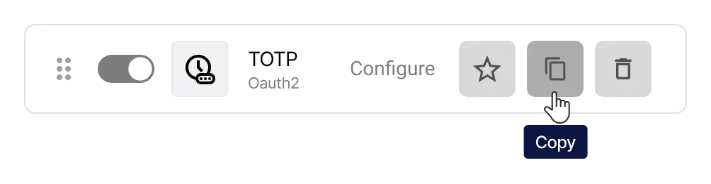
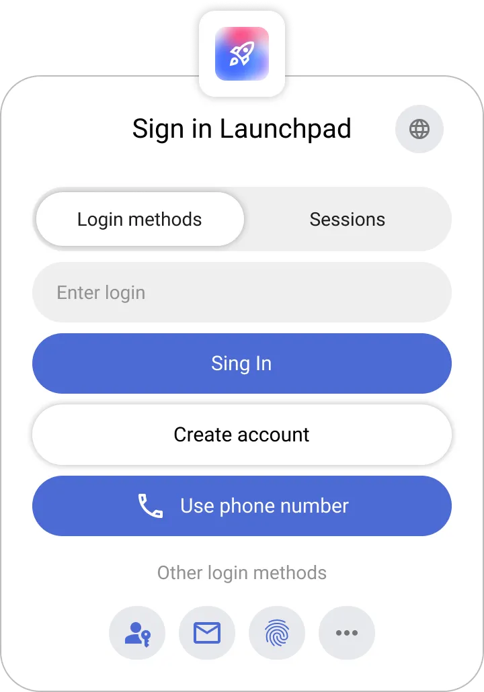
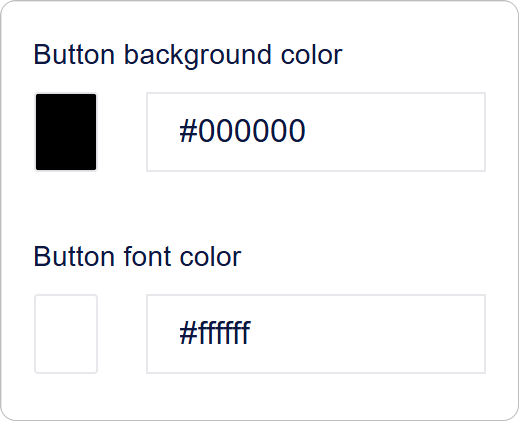
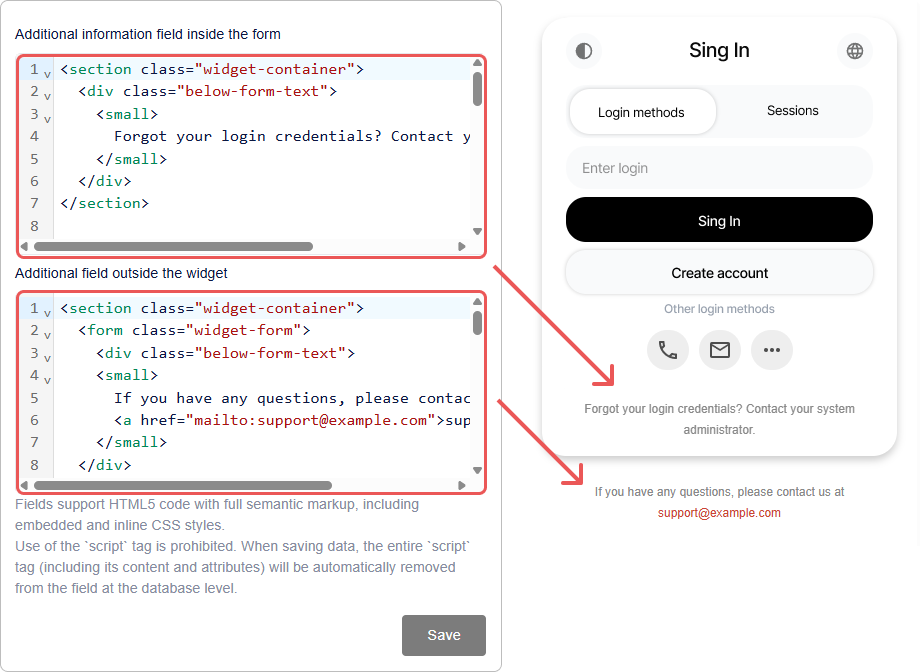

# Cómo configurar los métodos de inicio de sesión en Encvoy ID

En esta guía, aprenderá a configurar los métodos de inicio de sesión en **Encvoy ID**, incluidos los proveedores OAuth estándar y los métodos de autenticación mejorados (WebAuthn, mTLS, TOTP). También explicaremos cómo configurar y dar estilo correctamente al widget de autorización para que el proceso de inicio de sesión sea seguro y fácil de usar.

**Tabla de contenidos:**

- [Descripción general de los métodos de inicio de sesión](#login-methods-overview)
- [Gestión de métodos de inicio de sesión](#managing-login-methods)
- [Configuración del widget de inicio de sesión](#login-widget-settings)
- [Ver también](#see-also)

---

## Descripción general de los métodos de inicio de sesión { #login-methods-overview }

Un **método de inicio de sesión** es un método de autenticación para los usuarios que les permite autorizarse en la cuenta personal o en las aplicaciones conectadas. Es un elemento clave del sistema de Inicio de Sesión Único (SSO), que proporciona una identificación flexible y segura.

### Tipos de proveedores de autenticación en Encvoy ID

**Encvoy ID** admite los siguientes tipos de métodos de inicio de sesión:

- **Métodos básicos**: nombre de usuario y contraseña, correo electrónico,
- **Proveedores de identidad externos**: redes sociales, sistemas corporativos de confianza y otros servicios,
- **Métodos mejorados y sin contraseña:** autenticación criptográfica a través de **mTLS** (certificados de cliente) y **WebAuthn** (biometría, llaves de hardware), así como contraseñas de un solo uso **TOTP/HOTP**.

Combine los métodos de inicio de sesión para aumentar la seguridad. Implemente la **autenticación de dos factores**, donde después de ingresar el primer factor (nombre de usuario, contraseña u otro método), el usuario debe confirmar su identidad utilizando un segundo factor (teléfono, correo electrónico o WebAuthn). [Cómo configurar la autenticación de dos factores →](./docs-04-box-system-settings.md#two-factor-authentication)

### Niveles de gestión y publicidad de los métodos de inicio de sesión { #management-levels-and-publicity }

Los métodos de inicio de sesión se pueden crear en diferentes tipos de paneles de **Encvoy ID**:

- **Admin Dashboard** — nivel de todo el servicio;
- **Organization Dashboard** — nivel de empresa;
- **Application Dashboard (ADM)** — nivel de aplicación individual.

Para los métodos de inicio de sesión creados a nivel de **servicio** u **organización**, puede configurar la **publicidad** (publicity), determinando exactamente dónde estarán disponibles.

| Tipo de método de inicio de sesión         | Ajuste de publicidad | Dónde está disponible                                         | Gestión                                             |
| ------------------------------------------ | -------------------- | ------------------------------------------------------------- | --------------------------------------------------- |
| **Creado en Admin Dashboard**              | ✔ Sí                 | Panel de administración y todas las aplicaciones del servicio | Gestionado solo desde el **Admin Dashboard**        |
| **Creado en Organization Dashboard**       | ✔ Sí                 | Todas las aplicaciones de esta organización                   | Gestionado solo desde el **Organization Dashboard** |
| **Creado en Aplicación (Small Dashboard)** | ✘ No                 | Solo en esta aplicación                                       | Gestionado en **Configuración de la aplicación**    |

---

## Gestión de métodos de inicio de sesión { #managing-login-methods }

### Creación de un nuevo método de inicio de sesión

Para los servicios más populares, **Encvoy ID** proporciona plantillas listas para usar con configuraciones. Estas simplifican el proceso de conexión, ya que contienen parámetros pre-completados específicos para cada proveedor.

**El proceso de configuración consta de tres pasos:**

1. **Preparación:** obtenga un `Client ID` y un `Client Secret` del servicio del proveedor.
2. **Configuración en Encvoy ID:** cree un proveedor del tipo correspondiente.

   Consulte la instrucción específica para configurar el proveedor seleccionado:
   - **Email**: [Email](./instructions-common-provider-email.md)
   - **Redes sociales:** [Google](./instructions-common-provider-google.md), [GitHub](./instructions-common-provider-github.md)
   - **Universal:** [OpenID Connect](./instructions-common-provider-oidc.md) (para cualquier sistema compatible con OIDC)
   - **Métodos mejorados:** [mTLS](./instructions-common-provider-mtls.md), [WebAuthn](./instructions-common-provider-webauthn.md), [TOTP](./instructions-common-provider-totp.md), [HOTP](./instructions-common-provider-hotp.md)

3. **Colocación en el widget:** añada el método de inicio de sesión al formulario de inicio de sesión disponible para los usuarios del sistema.

### Edición de un método de inicio de sesión existente

Si necesita actualizar la configuración de un método de inicio de sesión existente (por ejemplo, debido a un cambio de clave secreta o de dominio):

1. Vaya al Admin Dashboard (Configuración de la Organización o de la Aplicación correspondiente) → sección **Configuración**.
2. Haga clic en **Configurar** en el bloque **Métodos de inicio de sesión**.
3. Se abrirá una ventana con una lista de los métodos de inicio de sesión creados.
4. Haga clic en el botón **Configurar** en el panel del método de inicio de sesión que desea editar.

5. Se abrirá el formulario de edición.
6. Realice los cambios necesarios.
7. Haga clic en **Guardar**.

### Eliminación de un método de inicio de sesión

1. Vaya al Admin Dashboard (Configuración de la Organización o de la Aplicación correspondiente) → sección **Configuración**.
2. Despliegue el bloque **Métodos de inicio de sesión**.
3. Haga clic en **Configurar**.
4. Se abrirá una ventana con una lista de los métodos de inicio de sesión creados.
5. Haga clic en el botón **Eliminar**  ubicado en el panel del método de inicio de sesión que desea eliminar.

6. Confirme la acción en la ventana modal.

Tras la eliminación exitosa, el método de inicio de sesión desaparecerá de los widgets de todas las aplicaciones vinculadas.

### Copia de la configuración del método de inicio de sesión

Copiar la configuración le permite crear un nuevo método basado en uno creado previamente.

1. Copie la configuración del método de inicio de sesión utilizando el botón **Copiar**  ubicado en el panel del método de inicio de sesión.

2. A continuación, abra el formulario de creación para un nuevo método de inicio de sesión utilizando una plantilla del mismo tipo y haga clic en **Pegar** .

> ⚠️ **Nota**: Si los tipos no coinciden, es posible que el nuevo proveedor no funcione correctamente.

### Configuración de un identificador obligatorio en el perfil de usuario

**Identificadores** son servicios externos que el usuario ha añadido a su perfil o a través de los cuales ha iniciado sesión previamente en el sistema.

La lista de identificadores disponibles para añadir se forma a partir de los métodos de inicio de sesión en el panel de **Encvoy ID** con un ajuste de publicidad activo.

- Si un método de inicio de sesión está configurado como **público**, aparecerá en la lista de identificadores disponibles para añadir en el perfil de usuario.
- Colocar este método de inicio de sesión en el widget de la aplicación es opcional; puede estar disponible en el perfil incluso sin un botón en la pantalla principal de inicio de sesión.
- El usuario también puede añadir un identificador durante el inicio de sesión a través del widget si dicho método de inicio de sesión está disponible.

En **Encvoy ID**, puede configurar el requisito de vinculación obligatoria de un identificador de cuenta externa al perfil de usuario. En este caso, al iniciar sesión en la aplicación, un usuario que no tenga un identificador vinculado verá una solicitud para añadir uno a su perfil.

#### Cómo hacer que un identificador sea obligatorio

1. Vaya al Admin Dashboard (Configuración de la Organización o de la Aplicación correspondiente) → sección **Configuración**.
2. Despliegue el bloque **Métodos de inicio de sesión** y haga clic en **Configurar**.
3. Se abrirá una ventana con una lista de los métodos de inicio de sesión creados.
4. Haga clic en el botón **Hacer obligatorio**  en el panel del método de inicio de sesión que desea hacer obligatorio.

El ajuste se aplica sin confirmación adicional.

> 💡 **Consejo**: Al hacer clic de nuevo en el botón **Hacer obligatorio**, el identificador volverá a ser opcional en el perfil.

---

## Configuración del widget de inicio de sesión { #login-widget-settings }

### ¿Qué es el widget de inicio de sesión?

El **Widget de inicio de sesión** es el formulario de autorización que se muestra al usuario cuando intenta iniciar sesión en una aplicación o en el sistema **Encvoy ID** si aún no está autenticado.

El widget admite:

- inicio de sesión clásico mediante nombre de usuario y contraseña,
- inicio de sesión a través de varios proveedores,
- configuración flexible de apariencia y estructura,
- agrupación de métodos de inicio de sesión.

En el widget, los métodos de inicio de sesión se dividen en:

- **Métodos principales** — se muestran como botones separados debajo del botón **Iniciar sesión** y son los que se utilizan con más frecuencia.
- **Métodos adicionales** — se colocan en el bloque **Otros métodos** como botones compactos para evitar saturar la interfaz.

Ejemplo de widget:

> 💡 El **Widget de inicio de sesión** es lo primero que ve un usuario durante la autorización, por lo que es importante que coincida con el estilo visual de la empresa y sea lo más claro posible.

### Configuración del widget de inicio de sesión: Apariencia y botones

Para configurar la apariencia del widget:

1. Vaya al Admin Dashboard (Configuración de la Organización o de la Aplicación correspondiente) → sección **Configuración**.
2. Busque el bloque **Métodos de inicio de sesión** y haga clic en **Configurar**.
3. Se abrirá la ventana **Configurar apariencia del widget**.
4. En el primer bloque, se definen los elementos visuales clave:
   - **Título del widget** — Se muestra en la parte superior del formulario. Para mostrar el nombre de la aplicación en el título del widget, use el valor `APP_NAME`.
   - **Portada del widget** — Imagen de fondo del formulario de autorización.
   - **Modo de autosustitución de portada en los widgets de la aplicación**:
     - **Desactivado** — Se utiliza la portada de la aplicación,
     - **Por defecto** — Solo para aplicaciones sin portada,
     - **Forzado** — Se aplica a todas las aplicaciones.

5. En el segundo bloque, configure la visibilidad de los elementos del formulario de inicio de sesión:
   - **Mostrar el logotipo de la aplicación en el widget** — Cuando está habilitado, muestra el logotipo junto al nombre de la aplicación. Se utiliza la imagen de la sección [Información básica](./docs-04-box-system-settings.md#system-name-and-logo).
   - **Ocultar botón de crear cuenta** — Cuando está habilitado, oculta el botón de creación de cuenta del widget.
   - **Ocultar pie de página** — Cuando está habilitado, oculta el pie de página del widget con el texto "© 2015-2025".
   - **Ocultar logotipos de los principales métodos de inicio de sesión** — Cuando está habilitado, oculta los logotipos de los métodos de inicio de sesión del grupo **Principal**.

     

6. En el tercer bloque, configure el diseño de los botones:
   - **Color de fondo de los botones** — Esquema de color para el fondo del botón (código hex).
   - **Color de fuente en los botones** — Esquema de color para el texto del botón (código hex).

     

7. Si es necesario, especifique el texto:
   - **Campo de información adicional dentro del formulario** — Texto adicional que se mostrará en la parte inferior del widget,
   - **Campo adicional fuera del widget** — Texto adicional que se mostrará debajo del widget.

     

   > Los campos admiten la inserción de código HTML5 con marcado semántico completo, incluidos estilos CSS incrustados y en línea. El uso de la etiqueta `script` está prohibido. Al guardar los datos, cualquier etiqueta `script` (incluido su contenido y atributos) se eliminará automáticamente del campo a nivel de base de datos.

8. Haga clic en **Guardar** para aplicar los cambios.

   > 💡 Puede ver los resultados de los cambios en la sección **Vista previa**.

### Adición y desactivación de métodos de inicio de sesión en el widget

Para configurar la visualización de un método de inicio de sesión en el widget:

1. Vaya al Admin Dashboard (Configuración de la Organización o de la Aplicación correspondiente) → sección **Configuración**.
2. Busque el bloque **Métodos de inicio de sesión** y haga clic en **Configurar**.
3. Active o desactive los interruptores de los métodos de inicio de sesión deseados.
4. Si es necesario, configure los grupos de métodos de inicio de sesión.

> ⚠️ **Nota**:
>
> 1. Es imposible desactivar el método **Nombre de usuario/Contraseña**. Si todos los métodos de inicio de sesión están desactivados, el método **Nombre de usuario/Contraseña** se activa automáticamente, ya que el widget debe tener al menos un método para iniciar sesión.
> 2. Desactivar un método de inicio de sesión del widget no elimina el método de inicio de sesión del sistema.

---

## Ver también { #see-also }

- [Gestión de aplicaciones](./docs-10-common-app-settings.md) — guía para crear, configurar y gestionar aplicaciones OAuth 2.0 y OpenID Connect (OIDC).
- [Gestión de la organización](./docs-02-box-system-install.md) — guía para trabajar con una organización en **Encvoy ID**.
- [Registro e inicio de sesión de usuario](./docs-13-common-user-authentication.md) — instrucciones para crear una cuenta, iniciar sesión con nombre de usuario/contraseña y servicios de autenticación externos.
