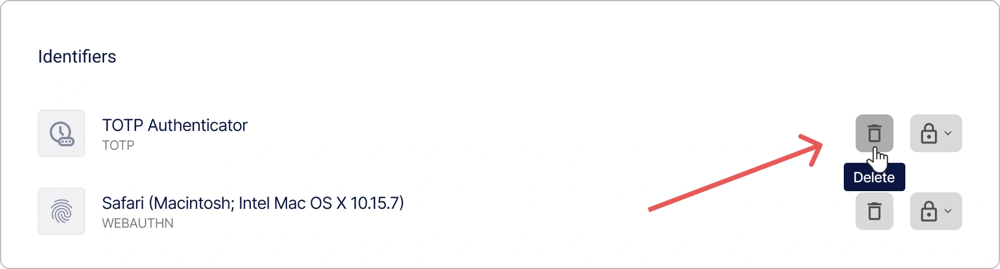
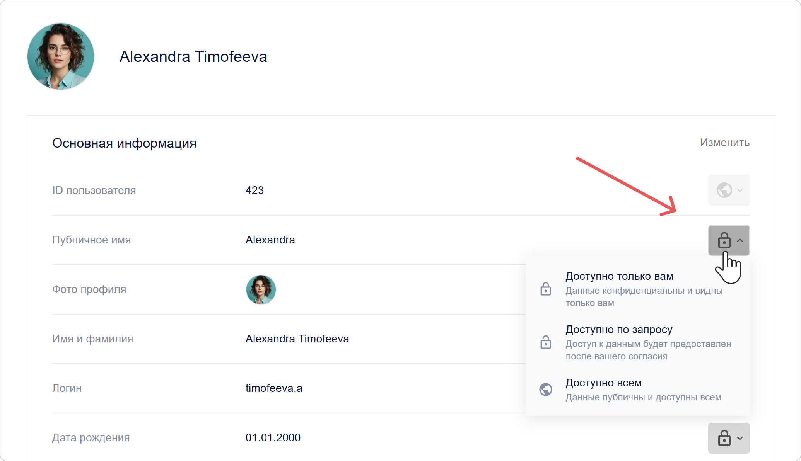
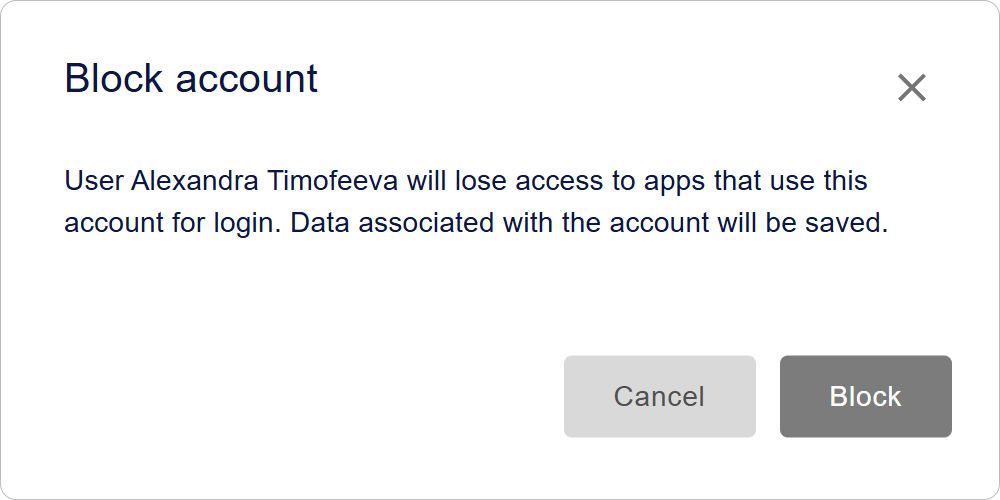
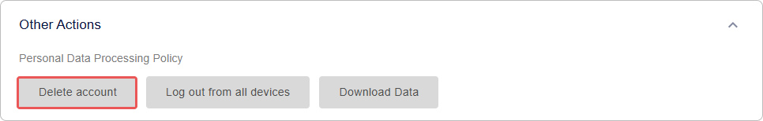

# Gestión de usuarios en Encvoy ID

En esta guía, aprenderá a crear y editar perfiles de usuario en **Encvoy ID**, asignar roles y derechos de acceso, bloquear y eliminar cuentas, finalizar sesiones activas, gestionar la privacidad y exportar datos de perfil.

**Tabla de contenidos:**

- [Resumen y acciones básicas](#overview-and-basics)
- [Gestión de datos del perfil](#profile-data-management)
- [Acceso y seguridad](#access-and-security)
- [Estado de la cuenta](#account-status)
- [Eliminar un usuario](#deleting-user)
- [Ver también](#see-also)

---

## Resumen y acciones básicas { #overview-and-basics }

### Acerca de la sección "Usuarios"

La lista de todos los usuarios registrados en **Encvoy ID** se encuentra en la sección **Usuarios**. Aquí, los administradores pueden gestionar cuentas, ver perfiles y controlar el acceso al sistema.

> ⚠️ **Requisitos de acceso**: Esta sección está disponible en el panel de administración para usuarios con permisos de sistema de **Administrador**.

### Crear un usuario en Encvoy ID

> 📌 En **Encvoy ID**, existen varias formas de registrar usuarios: autoregistro a través de un widget y creación manual por parte de un usuario con derechos de **Administrador**.

En esta instrucción, cubriremos cómo crear un usuario manualmente:

1. Vaya al panel de administración → pestaña **Usuarios**.
2. Haga clic en el botón **Crear usuario** .
3. Se abrirá el formulario de creación de usuario.
4. Complete los campos del perfil en el formulario:
   - **Nombre público** — el nombre visible del usuario en el sistema;
   - **Nombre** — nombre y segundo nombre del usuario;
   - **Apellidos** — apellido del usuario;
   - **Nombre de usuario** — debe ser único para el servicio; puede usarse para futuras autorizaciones;
   - **Correo electrónico** — la dirección debe ser única para el servicio; puede usarse para futuras autorizaciones;
   - **Número de teléfono** — debe ser único para el servicio; puede usarse para futuras autorizaciones;
   - **Contraseña** — debe cumplir con la política de contraseñas especificada en la configuración del servicio.

     > 🔗 Para más detalles, consulte la guía de [Configuración de la política de contraseñas](./docs-05-box-userfields-settings.md#password-policy).

   - **Fecha de nacimiento**;
   - **Foto de perfil**.

5. Haga clic en **Guardar**.

   > 💡 Un perfil de usuario puede contener [campos adicionales](./docs-05-box-userfields-settings.md#password-policy).

   > 📌 La validación de campos se realiza de acuerdo con las reglas de validación. Para más detalles, consulte la guía de [Reglas de validación de campos](./docs-05-box-userfields-settings.md#validation-rules).

### Ver y editar un perfil de usuario

#### Ver un perfil de usuario

Para obtener información detallada sobre una cuenta, abra su perfil.

1. Vaya al panel de administración → pestaña **Usuarios**.
2. Haga clic en el panel del usuario cuyo perfil desea ver.
3. Se abrirá el perfil del usuario con información detallada: datos de contacto, identificadores y configuración de privacidad.


#### Editar datos del perfil

Para realizar cambios en un perfil de usuario:

1. Vaya al panel de administración → pestaña **Usuarios**.
2. Abra el perfil del usuario.
3. Haga clic en **Editar** en el bloque **Información principal**.
4. En el formulario **Editar usuario** que se abre, realice los cambios necesarios.

   > 📌 La validación de campos se realiza de acuerdo con las reglas de validación. Para más detalles, consulte la guía de [Reglas de validación de campos](./docs-05-box-userfields-settings.md#validation-rules).

5. Haga clic en **Guardar**.

---

## Gestión de datos del perfil { #profile-data-management }

### Gestión de identificadores de perfil

La sección **Identificadores** del perfil de usuario muestra los métodos de inicio de sesión que el usuario agregó por sí mismo o utilizó para acceder a la aplicación o a la cuenta personal de **Encvoy ID**. El administrador puede configurar la privacidad de un identificador y eliminarlo del perfil de usuario.

> 💡 **Importante:** Solo el propietario de la cuenta puede agregar nuevos identificadores. Para más detalles, consulte la guía de [Identificadores de servicios externos](./docs-12-common-personal-profile.md#external-service-identifiers).

Para eliminar un identificador:

1. Vaya al panel de administración → pestaña **Usuarios**.
2. Abra el perfil del usuario.
3. Haga clic en **Eliminar** en el panel del método de inicio de sesión que desea eliminar del perfil.



El identificador se eliminará inmediatamente del perfil.

### Configuración de la privacidad de los campos del perfil

Para cada campo del perfil, puede establecer un nivel de privacidad que determine quién puede ver esta información. Los ajustes están disponibles para datos básicos y adicionales del usuario, así como para los métodos de inicio de sesión.

#### Niveles de privacidad

| Nivel                          | Icono                                                  | Descripción                                                                                                                                                |
| ------------------------------ | ------------------------------------------------------ | ---------------------------------------------------------------------------------------------------------------------------------------------------------- |
| **Disponible solo para usted** |            | Los datos no se transfieren a sistemas de terceros y solo son accesibles para el usuario.                                                                  |
| **Disponible bajo petición**   |  | Los datos están disponibles en sistemas de terceros integrados con **Encvoy ID**. <br> Se requiere el consentimiento del usuario para acceder a los datos. |
| **Disponible para todos**      |          | Los datos son siempre públicos. No se requiere el consentimiento del usuario para acceder a ellos.                                                         |

#### Cómo cambiar la privacidad de un campo del perfil

1. Vaya al panel de administración → pestaña **Usuarios**.
2. Abra el perfil del usuario.
3. Haga clic en el icono de privacidad actual junto al campo.
4. Seleccione un nuevo nivel en el menú desplegable.



El cambio se aplica instantáneamente.

### Exportar datos de perfil

**Encvoy ID** le permite exportar todos los datos del perfil en formato JSON.

Para descargar los datos del perfil:

1. Vaya al panel de administración → pestaña **Usuarios**.
2. Abra el perfil del usuario.
3. Despliegue el bloque **Otras acciones**.


4. Seleccione la acción **Descargar datos**.
5. La descarga del archivo JSON comenzará automáticamente.

#### Estructura del archivo exportado

El archivo exportado contiene una lista completa de los datos del usuario:

```json
{
  "user": {
    "id": 1573,
    "email": "ivanov.petr89@mail.com",
    "birthdate": "1992-11-14T15:22:11.123Z",
    "family_name": "Ivanov",
    "given_name": "Petr",
    "nickname": "Petya",
    "login": "petr_ivanov92",
    "phone_number": "+79991234567",
    "picture": "public/images/profile/3f7b21d8e4c2a6f1b2c9d3a0e5f7b1c4",
    "public_profile_claims_oauth": "id email family_name given_name picture",
    "public_profile_claims_gravatar": "family_name given_name email picture",
    "blocked": false,
    "deleted": null,
    "custom_fields": {
      "country": "Russia"
    },
    "password_updated_at": "2025-10-12T08:45:33.222Z"
  },
  "role": "ADMIN"
}
```

---

## Acceso y seguridad { #access-and-security }

### Finalizar sesiones de usuario

La función para finalizar forzosamente todas las sesiones activas es una herramienta de seguridad importante. Úsela en caso de pérdida de un dispositivo, sospecha de compromiso de la cuenta o para refrescar inmediatamente los tokens de acceso.

> 📌 Esta operación invalida inmediatamente todos los tokens de acceso y de actualización (refresh tokens) del usuario, finalizando todas sus sesiones actuales en todas las aplicaciones. El usuario deberá iniciar sesión nuevamente.

#### Cómo finalizar las sesiones de usuario

**Método 1: Desde la lista general de usuarios**

1. Vaya al panel de administración → pestaña **Usuarios**.
2. Haga clic en **Finalizar sesiones** en el menú de acciones del usuario.


**Método 2: Desde el perfil de usuario**

1. Vaya al panel de administración → pestaña **Usuarios**.
2. Haga clic en **Finalizar sesiones** en el perfil del usuario dentro del bloque **Otras acciones**.


**Qué sucede después de la confirmación:**

- **Todas las sesiones activas** del usuario finalizan.
- Los **tokens de acceso** (`access_token`) dejan de ser válidos.
- Los **tokens de actualización** (`refresh_token`) son revocados.
- El usuario deberá **iniciar sesión de nuevo** la próxima vez que acceda a la aplicación.

> 📌 Esta operación no bloquea al usuario. Podrá volver a autorizarse.

### Asignar y cambiar permisos de usuario

Encvoy ID utiliza un sistema de acceso de tres niveles que define claramente los derechos de los usuarios:

- **Miembro** — el rol básico. Permite gestionar el propio perfil, configurar permisos de acceso a datos personales y usar la cuenta para iniciar sesión en aplicaciones integradas.
- **Gestor** — el rol de administrador para una organización o departamento específico. Gestiona usuarios y el acceso a aplicaciones dentro de su unidad organizativa.
- **Administrador** — el rol con máximos privilegios. Proporciona acceso total a todas las funciones de la plataforma, incluyendo configuraciones de seguridad globales y gestión de todas las organizaciones.

A continuación se presentan las instrucciones para asignar los roles de sistema **Gestor** y **Administrador**.

#### Asignar permisos de "Gestor"

1. Vaya al panel de administración → pestaña **Usuarios**.
2. Abra el menú de acciones haciendo clic en el botón **Más** del usuario cuyos derechos desea cambiar.
3. Seleccione la acción **Cambiar permisos**.


4. En la ventana que se abre, seleccione el rol **Gestor** y haga clic en **Guardar**.


El usuario recibirá el rol seleccionado y sus derechos correspondientes.

#### Asignar permisos de sistema de "Administrador"

1. Vaya al panel de administración → pestaña **Usuarios**.
2. Abra el menú de acciones haciendo clic en el botón **Más** del usuario cuyos derechos desea cambiar.
3. Seleccione la acción **Cambiar permisos**.
4. En la ventana que se abre, seleccione el rol **Administrador** y haga clic en **Guardar**.

El usuario recibirá el rol seleccionado y sus derechos correspondientes.

> 🔍 Para asignar permisos de **Administrador** para una aplicación, use la [instrucción](./docs-10-common-app-settings.md#assigning-app-administrator).

---

## Estado de la cuenta { #account-status }

### Bloquear usuarios en Encvoy ID

El bloqueo impide el acceso a todos los servicios que utilizan **Encvoy ID** para iniciar sesión.

Para bloquear a un usuario:

1. Abra el menú de acciones de un usuario activo en una de las interfaces:
   - En el menú de acciones del usuario dentro del [perfil de la aplicación](./docs-10-common-app-settings.md#viewing-application).
   - En el menú de acciones del usuario en la pestaña **Usuarios**.

   

2. Seleccione la acción **Bloquear en Encvoy ID**.
3. Confirme la acción en la ventana modal.



**Qué sucede después del bloqueo**:

- El estado del usuario cambiará a **Bloqueado**.

    

- El usuario bloqueado no podrá iniciar sesión en el servicio ni en las aplicaciones.

  Al intentar iniciar sesión, se mostrará el siguiente widget:

    

### Desbloquear usuarios en Encvoy ID

Para desbloquear a un usuario:

1. Abra el menú de acciones de un usuario bloqueado en una de las interfaces:
   - En el menú de acciones del usuario dentro del [perfil de la aplicación](./docs-10-common-app-settings.md#viewing-application).
   - En el menú de acciones del usuario en la pestaña **Usuarios**.

2. Seleccione la acción **Desbloquear en Encvoy ID**.
3. Confirme la acción en la ventana modal.

Después de confirmar la acción, el estado del usuario cambiará a **Activo**.

---

## Eliminar un usuario { #deleting-user }

Un administrador puede eliminar permanentemente a un usuario. Una vez confirmada la eliminación, la cuenta y todos los datos desaparecerán de forma irrevocable. El usuario perderá el acceso a todas las aplicaciones donde se utilizaba su cuenta de **Encvoy ID**.

> 💡 Un usuario puede eliminar su cuenta de forma independiente a través de su perfil personal. La eliminación se implementa con un **mecanismo de retraso**. Dentro de un período determinado, el usuario puede restaurar el acceso a su cuenta. Puede obtener más información al respecto en la guía del [Perfil de usuario](./docs-12-common-personal-profile.md).

### Cómo eliminar un usuario en Encvoy ID

> 💡 **Alternativa**: Considere **bloquear la cuenta** en lugar de eliminarla si existe la posibilidad de restaurar el acceso.

Para eliminar un usuario:

1. Haga clic en **Eliminar cuenta** en una de las interfaces:
   - En el menú de acciones del usuario en la pestaña **Usuarios**.

      

   - En el perfil del usuario dentro del bloque **Otras acciones**.

      

2. Confirme la acción en la ventana modal.

Después de la confirmación, el usuario será eliminado.

**Qué sucede después de la eliminación**:

- Las aplicaciones donde el usuario eliminado sea el único propietario se eliminarán irrevocablemente.
- Todos los datos de la cuenta se borran sin posibilidad de recuperación tras la eliminación final.
- El usuario pierde el acceso a todos los servicios integrados.

---

## Ver también { #see-also }

- [Perfil personal y gestión de permisos de aplicaciones](./docs-12-common-personal-profile.md) — una guía para gestionar su perfil personal.
- [Gestión de aplicaciones](./docs-10-common-app-settings.md) — una guía para crear, configurar y gestionar aplicaciones OAuth 2.0 y OpenID Connect (OIDC).
- [Gestión de organizaciones](./docs-02-box-system-install.md) — una guía para trabajar con organizaciones en **Encvoy ID**.
