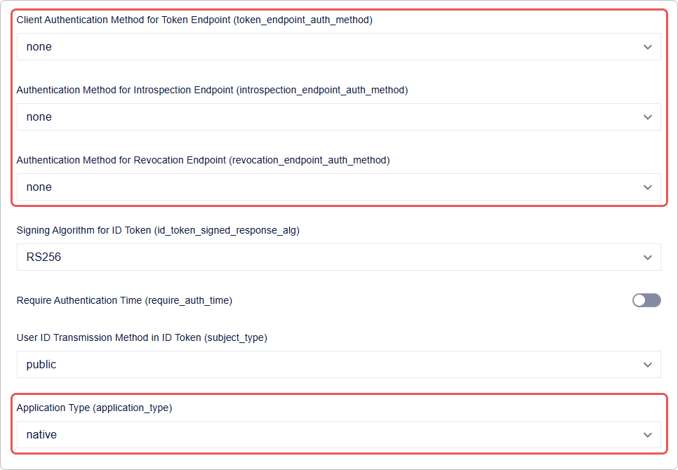
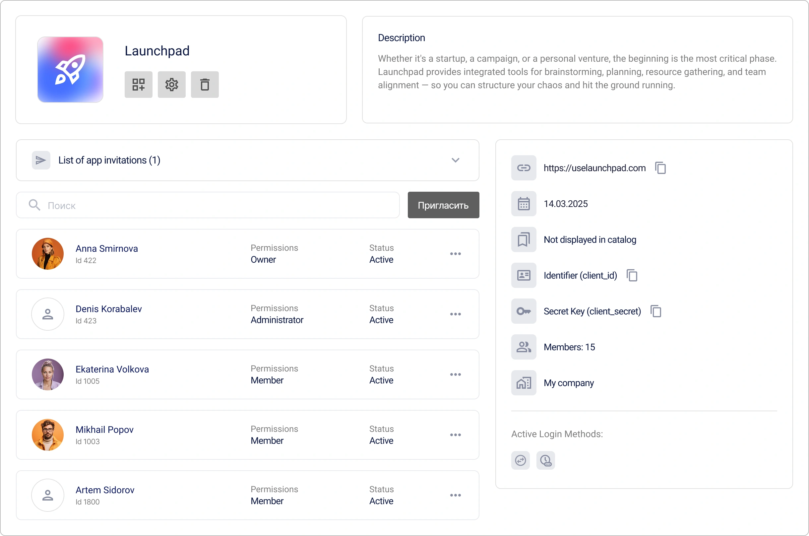

# Cómo crear y configurar una aplicación en Encvoy ID

En esta guía, aprenderá a crear y configurar aplicaciones OAuth 2.0 y OIDC en **Encvoy ID**. Cubriremos en detalle la creación de aplicaciones web y nativas, la configuración del widget de inicio de sesión y la gestión de usuarios y accesos.

**Tabla de contenidos:**

- [Creación de una aplicación](#creating-application)
- [Gestión de aplicaciones](#managing-applications)
- [Invitaciones de la aplicación](#application-invitations)
- [Configuración del widget de inicio de sesión de la aplicación](#app-login-widget-settings)
- [Usuarios de la aplicación](#application-users)
- [Referencia completa de parámetros](#full-parameters-reference)
- [Ver también](#see-also)

> ⚠️ **Restricción**: La gestión de aplicaciones está disponible en el panel de administrador, de organización o de aplicación (pequeño) dependiendo de su rol.

---

## Creación de una aplicación { #creating-application }

### Creación de una aplicación web OAuth

> **Aplicación Web** — una aplicación estándar que se ejecuta en el navegador del usuario e interactúa con **Encvoy ID** utilizando los protocolos OAuth 2.0 y OpenID Connect.

Para crear una aplicación web:

1. Vaya al panel de administrador, de organización o de aplicación (pequeño).
2. Abra la pestaña **Aplicaciones**.
3. Haga clic en el botón **Crear** .
4. Se abrirá el formulario de creación de aplicación.
5. Especifique los [parámetros de aplicación](#full-parameters-reference) requeridos:
   - **Nombre de la aplicación**,
   - **Dirección de la aplicación** en el formato `protocolo://nombre-de-dominio:puerto`,
   - **URL de redireccionamiento #** (`redirect_uris`) — la dirección a la que se redirige al usuario después de la autorización,
   - **URL de cierre de sesión #** (`post_logout_redirect_uris`) — la dirección a la que se redirige al usuario después de cerrar sesión.

6. Haga clic en **Crear**.

> 💡 Tras la creación, se generan campos adicionales de la aplicación que pueden verse y editarse en la configuración de la aplicación:
>
> - **Identificador (client_id)** — utilizado para identificar la aplicación;
> - **Clave secreta (client_secret)** — utilizado para autenticar la identidad de la aplicación cuando esta solicita acceso a la cuenta de un usuario. La clave secreta debe ser conocida solo por la aplicación.

### Creación de una aplicación nativa OAuth

> **Aplicación Nativa** — una aplicación desarrollada específicamente para un sistema operativo particular.

Para crear una aplicación nativa:

1. Vaya al panel de administrador, de organización o de aplicación (pequeño).
2. Abra la pestaña **Aplicaciones**.
3. Haga clic en el botón **Crear** .
4. Se abrirá el formulario de creación de aplicación.
5. Especifique los [parámetros de aplicación](#full-parameters-reference) requeridos:
   - **Nombre de la aplicación**,
   - **Dirección de la aplicación** — la dirección local de la aplicación en el formato `myapp://callback` (requerido para completar la creación, pero **no se utiliza** en aplicaciones nativas),
   - **URL de redireccionamiento #** (`redirect_uris`) — la dirección local a la que se devolverá al usuario después de la autorización, p. ej., `myapp://callback`,
   - **URL de cierre de sesión #** (`post_logout_redirect_uris`) — la dirección de redirección local después del cierre de sesión (p. ej., `myapp://logout`).

6. Haga clic en **Crear**.
7. Abra la aplicación creada y haga clic en **Editar** .
8. En el formulario de edición que se abre:
   - Seleccione `native` en el ajuste **Tipo de aplicación**;
   - Seleccione `none` en los ajustes del método de autenticación.

     

9. Guarde los cambios.

A continuación, configure la autorización en el lado de su aplicación:

- Utilice PKCE (Proof Key for Code Exchange) al solicitar un código de autorización;
- Utilice el `redirect_uri` especificado anteriormente para manejar el resultado de la autorización;
- Realice la renovación de tokens utilizando el protocolo OAuth 2.0.

---

## Gestión de aplicaciones { #managing-applications }

### Visualización de una aplicación { #viewing-application }

1. Vaya al panel de administrador, de organización o de aplicación (pequeño).
2. Abra la pestaña **Aplicaciones**.
3. Haga clic en el panel de la aplicación cuyo perfil desea ver.

4. Se abrirá el formulario del perfil de la aplicación.

### Edición de una aplicación { #editing-application }

1. Vaya al panel de administrador, de organización o de aplicación (pequeño).
2. Abra la pestaña **Aplicaciones**.
3. Haga clic en el panel de la aplicación que desea editar.
4. Se abrirá el formulario de visualización de la aplicación.
5. Haga clic en el botón **Editar** .
6. Se abrirá el formulario de edición de la aplicación.
7. Realice los cambios necesarios en los [parámetros de la aplicación](#full-parameters-reference).
8. Guarde los cambios.

### Eliminación de una aplicación

> ⚠️ **Advertencia:** La eliminación de una aplicación es una operación irreversible. Todos los datos asociados se eliminarán del sistema.

Para eliminar una aplicación:

1. Vaya al panel de administrador, de organización o de aplicación (pequeño).
2. Abra la pestaña **Aplicaciones**.
3. Haga clic en el panel de la aplicación que desea editar.
4. Se abrirá el formulario de visualización de la aplicación.
5. Haga clic en el botón **Eliminar** .
6. Confirme la acción en la ventana modal.

Tras la confirmación, la aplicación se eliminará de **Encvoy ID**.

---

## Invitaciones de la aplicación { #application-invitations }

El mecanismo de invitación le permite restringir el acceso a la aplicación y otorgarlo solo a usuarios preseleccionados. Esto es útil si la aplicación está destinada a un **círculo cerrado de usuarios**.

### Habilitar la restricción de acceso

Para que la aplicación esté disponible solo para usuarios invitados:

1. Abra el formulario de edición de la aplicación. [Cómo abrir el formulario de edición →](#editing-application)
2. Habilite el ajuste **Prohibir acceso a usuarios externos**.
3. Guarde los cambios.

**Qué sucede después de habilitarlo:**

- Miembros de la aplicación — pueden iniciar sesión normalmente.
- Usuarios no invitados — ven un mensaje de acceso denegado.
- Nuevos usuarios — solo pueden iniciar sesión después de recibir una invitación.

### Envío de invitaciones a usuarios

Para enviar una invitación a un usuario:

1. Abra el formulario de visualización de la aplicación. [Cómo abrir el formulario de visualización →](#viewing-application).
2. Haga clic en el botón **Invitar**.

3. En la ventana que se abre, especifique las direcciones de correo electrónico de los usuarios:
   - Ingrese la dirección y presione **Enter**, o haga clic en el botón ;
   - Para añadir varias direcciones, use separadores: espacio, coma `,` o punto y coma `;`.

   

4. Haga clic en **Enviar**.

Se envía un correo electrónico con un enlace para el acceso rápido a la aplicación a las direcciones especificadas.

> 💡 Las invitaciones permanecerán activas hasta que se cancelen o se acepten.

### Qué ven los usuarios

Un usuario que recibe una invitación obtiene un correo electrónico que contiene un enlace para iniciar sesión en la aplicación. La invitación también se muestra en la sección **Solicitudes** del perfil personal del usuario. La invitación se puede aceptar de dos maneras: haciendo clic en el enlace del correo electrónico o seleccionando la invitación en la sección "Solicitudes" del perfil.

> [Cómo aceptar una invitación de aplicación →](./docs-12-common-personal-profile.md#closed-app-invitations)

La invitación está protegida por un mecanismo de verificación: es válida solo para la dirección de correo electrónico a la que fue enviada. El usuario debe iniciar sesión en el sistema utilizando esa dirección específica para aceptar la invitación. Esto evita que el acceso sea transferido a terceros.

Si el usuario aún no está registrado en el sistema, debe registrarse utilizando el mismo correo electrónico al que se envió la invitación. Tras el registro exitoso, el acceso a la aplicación se otorga automáticamente.

### Gestión de invitaciones

#### Visualización de la lista de invitaciones enviadas

1. Abra el formulario de visualización de la aplicación. [Cómo abrir el formulario de visualización →](#viewing-application).
2. Despliegue la sección **Lista de invitaciones de aplicación enviadas**.

Para cada invitación en la lista, se muestra lo siguiente:

- Correo electrónico del destinatario
- Fecha de envío

#### Cancelación de una invitación

Si necesita revocar una invitación enviada:

1. Busque la invitación en la lista de enviadas.
2. Haga clic en el botón **Eliminar**  en el panel de la invitación.
3. Confirme la cancelación de la invitación.

**Consecuencias de la cancelación:**

- El enlace en el correo electrónico deja de ser válido.
- El usuario no podrá aceptar la invitación.

---

## Configuración del widget de inicio de sesión de la aplicación { #app-login-widget-settings }

El **Widget de inicio de sesión** es el formulario de autorización que los usuarios ven al intentar iniciar sesión en **esta aplicación específica**. Sus ajustes le permiten adaptar la apariencia y los métodos de inicio de sesión a la marca y necesidades de su servicio.

### Cómo encontrar los ajustes del widget

1. Abra el formulario de edición de la aplicación. [Cómo abrir el formulario de edición →](#editing-application)
2. Busque el bloque **Métodos de inicio de sesión** y haga clic en **Configurar**.

Qué se puede configurar:

- **Título y Portada** — adaptar a la marca de la aplicación,
- **Esquema de colores** — colores de botones que coincidan con su diseño,
- **Métodos de inicio de sesión** — elegir qué proveedores mostrar,
- **Bloques de información** — añadir reglas de uso o enlaces.

> **📚 Guía completa de todos los ajustes:**  
> Para una mirada detallada a todos los parámetros y opciones de personalización, vaya a la [guía completa de configuración del widget de inicio de sesión →](./docs-06-github-en-providers-settings.md#login-widget-settings).

---

## Usuarios de la aplicación { #application-users }

Los **Usuarios de la aplicación** (miembros) son usuarios del sistema **Encvoy ID** que han otorgado permiso a su aplicación para acceder a sus datos.

**Cómo un usuario se convierte en miembro:**

1. El usuario accede a su aplicación por primera vez.
2. El sistema lo redirige al widget de inicio de sesión de **Encvoy ID**.
3. El usuario se autentica y **otorga su consentimiento** para acceder a los datos solicitados.
4. La aplicación recibe un token de acceso y el usuario se añade a la lista de miembros.

**Dónde gestionar a los miembros:**

- **Panel de Administrador** — para gestionar todas las aplicaciones del servicio.
- **Panel de Organización** — para aplicaciones que pertenecen a la organización.
- **Panel Pequeño (Aplicaciones)** — para gestionar una aplicación específica.

> 💡 **Importante:** La gestión de miembros ocurre a nivel de **aplicación**. Las acciones no afectan la cuenta global de **Encvoy ID** del usuario, solo su conexión con la aplicación específica.

### Visualización de los miembros de la aplicación

1. Vaya al panel de administrador, de organización o de aplicación (pequeño).
2. Abra la pestaña **Aplicaciones**.
3. Haga clic en el panel de la aplicación deseada.
4. Se abrirá el perfil de la aplicación con información general.
5. En el perfil de la aplicación, busque la sección de miembros.
6. Haga clic en el panel del usuario cuyo perfil desea ver.
7. Se abrirá el perfil del usuario, que contiene una lista de los datos a los que el usuario ha otorgado acceso.

### Asignación de un administrador de aplicación { #assigning-app-administrator }

**Cuándo es necesario:** Para delegar derechos de gestión de la aplicación a usuarios de confianza. Los administradores de la aplicación pueden gestionar sus ajustes y usuarios.

Para asignar un administrador de aplicación:

1. Vaya al panel de administrador, de organización o de aplicación (pequeño).
2. Abra la pestaña **Aplicaciones**.
3. Haga clic en el panel de la aplicación.
4. Se abrirá el perfil de la aplicación.
5. Abra el menú de acciones para el usuario cuyos permisos desea cambiar.

6. Seleccione la acción **Cambiar permisos**.
7. En la ventana que aparece, seleccione el nivel de permiso **Administrador**.

8. Haga clic en **Guardar**.

Tras guardar los cambios, se actualizarán los permisos del usuario en la aplicación.

**✅ Qué cambiará:**

- El usuario obtendrá acceso al **Panel Pequeño** de esta aplicación.
- Podrá gestionar los ajustes de la aplicación y sus usuarios.
- No obtendrá acceso a otras aplicaciones ni a los ajustes de la organización/servicio.

> ⚠️ **Seguridad:** Asigne derechos de administrador solo a usuarios de confianza. Un administrador de aplicación puede eliminar a otros usuarios y cambiar los ajustes de integración.

### Finalización de sesiones de usuario en la aplicación

**Cuándo es necesario:** En caso de sospecha de compromiso de cuenta, pérdida de dispositivo o para forzar una renovación del token de acceso.

Para finalizar las sesiones de un usuario:

1. Vaya al panel de administrador, de organización o de aplicación (pequeño).
2. Abra la pestaña **Aplicaciones**.
3. Haga clic en el panel de la aplicación.
4. Se abrirá el perfil de la aplicación.
5. Abra el menú de acciones para el usuario cuyas sesiones desea finalizar.
6. Seleccione la acción **Finalizar sesiones**.
7. Confirme la acción en la ventana modal.

Tras la confirmación, se eliminarán todas las sesiones y tokens del usuario.

**✅ Qué sucede después de la confirmación:**

- **Todas las sesiones activas** del usuario en esta aplicación se finalizan.
- Los **tokens de acceso** (`access_token`) dejan de ser válidos.
- Los **tokens de actualización** (`refresh_token`) son revocados.
- Se requerirá que el usuario **inicie sesión de nuevo** la próxima vez que acceda a la aplicación.

> 📌 Esta operación no bloquea al usuario. Podrá autorizarse de nuevo.

### Eliminación de un usuario de la aplicación

**Cuándo es necesario:** Cuando un usuario ya no necesita acceso a la aplicación, tras la terminación de un empleado o a petición del usuario.

Para eliminar a un usuario de la aplicación:

1. Vaya al panel de administrador, de organización o de aplicación (pequeño).
2. Abra la pestaña **Aplicaciones**.
3. Haga clic en el panel de la aplicación.
4. Se abrirá el perfil de la aplicación.
5. Abra el menú de acciones para el usuario que desea eliminar de la aplicación.
6. Seleccione la acción **Eliminar usuario**.
7. Confirme la acción en la ventana modal.

Tras la confirmación, el usuario será eliminado de la aplicación.

**✅ Qué sucede después de la eliminación:**

- El usuario **desaparece** de la lista de miembros de la aplicación.
- Todos sus **tokens de acceso** para esta aplicación son revocados.
- La próxima vez que acceda a la aplicación, se le **mostrará de nuevo la solicitud de consentimiento**.
- La **cuenta global** del usuario en **Encvoy ID** permanece intacta.

### Bloqueo de un usuario en la aplicación

**Cuándo es necesario:** Para una prohibición completa y permanente del acceso de un usuario a la aplicación sin posibilidad de recuperación.

El **bloqueo** es una acción más seria que la eliminación. Un usuario bloqueado no podrá obtener acceso a la aplicación.

Para bloquear a un usuario:

1. Abra el menú de acciones para un usuario activo en el [perfil de la aplicación](./docs-10-common-app-settings.md#viewing-application).

2. Seleccione la acción **Bloquear en Encvoy ID**.
3. Confirme la acción en la ventana modal.

**Qué sucede después del bloqueo**:

- El estado del usuario cambiará a **Bloqueado**.
- El usuario bloqueado no podrá iniciar sesión en la aplicación.

### Desbloqueo de usuarios de Encvoy ID

Para desbloquear a un usuario:

1. Abra el menú de acciones para un usuario bloqueado en el [perfil de la aplicación](./docs-10-common-app-settings.md#viewing-application).
2. Seleccione la acción **Desbloquear en Encvoy ID**.
3. Confirme la acción en la ventana modal.

Tras la confirmación, el estado del usuario cambiará a **Activo**.

---

## Referencia completa de parámetros { #full-parameters-reference }

### Información básica

Detalles básicos para mostrar en la interfaz y en el widget de inicio de sesión.

| Parámetro                        | Descripción                                                                             | Tipo                                                       | Requerido |
| -------------------------------- | --------------------------------------------------------------------------------------- | ---------------------------------------------------------- | --------- |
| **Nombre de la aplicación**      | Se muestra en la interfaz del panel personal y en el widget de inicio de sesión         | Texto (hasta 64 caracteres)                                | ✓         |
| **Descripción de la aplicación** | Descripción corta mostrada en la interfaz del servicio **Encvoy ID**                    | Texto (hasta 255 caracteres)                               | ✗         |
| **Logotipo de la aplicación**    | Se muestra en la interfaz del servicio **Encvoy ID** y en el widget de inicio de sesión | Imagen en formato JPG, GIF, PNG, WEBP. Tamaño máx. - 1 MB. | ✗         |
| **Mostrar en el mini-widget**    | Añade la aplicación al mini-widget para acceso rápido.                                  | Interruptor (`On`/`Off`)                                   | -         |

### Catálogo

Ajustes para publicar la aplicación en el [Catálogo](./docs-12-common-personal-profile.md#application-catalog).

| Parámetro                  | Descripción                                                                                                                                      | Tipo                     | Por defecto |
| -------------------------- | ------------------------------------------------------------------------------------------------------------------------------------------------ | ------------------------ | ----------- |
| **Mostrar en el catálogo** | Añade la aplicación al Catálogo                                                                                                                  | Interruptor (`On`/`Off`) | `Off`       |
| **Tipo de aplicación**     | Categoría a la que pertenece la aplicación en el **Catálogo**.   La creación de tipos está disponible para el **Administrador** del servicio. | Lista desplegable        | `Other`     |

### Campos requeridos

Campos del perfil de usuario necesarios para que la aplicación funcione.

| Parámetro                         | Descripción                                                                                                                                                                                                                                                                                                                                                                                                                                                                       |
| --------------------------------- | --------------------------------------------------------------------------------------------------------------------------------------------------------------------------------------------------------------------------------------------------------------------------------------------------------------------------------------------------------------------------------------------------------------------------------------------------------------------------------- |
| **Campos principales del perfil** | Define la lista de campos principales y adicionales del perfil de usuario a los que la aplicación requiere acceso.   - Si faltan campos en el perfil del usuario, se solicitarán durante la autorización en la aplicación.   - Si los campos están presentes pero configurados con [nivel de privacidad](./docs-12-common-personal-profile.md#privacy-levels) **Disponible solo para usted**, se le pedirá al usuario que cambie este nivel a **Disponible bajo petición**. |

### Parámetros de la aplicación

Parámetros técnicos que afectan la interacción de la aplicación con **Encvoy ID**.

#### Identificadores principales

| Nombre                            | Parámetro       | Descripción                                                                          | Tipo                                                    | Requerido                |
| --------------------------------- | --------------- | ------------------------------------------------------------------------------------ | ------------------------------------------------------- | ------------------------ |
| **Identificador (client_id)**     | `client_id`     | Identificador único de la aplicación                                                 | Texto                                                   | Generado automáticamente |
| **Clave secreta (client_secret)** | `client_secret` | Clave privada del cliente. Debe mantenerse segura.                                   | Texto                                                   | Generado automáticamente |
| **Dirección de la aplicación**    | -               | URL del recurso web donde se utilizará el inicio de sesión a través de **Encvoy ID** | Texto en formato `protocolo://nombre-de-dominio:puerto` | ✓                        |

### Ajustes de acceso

| Nombre                                  | Parámetro | Descripción                                                                                                                     | Tipo                     | Por defecto |
| --------------------------------------- | --------- | ------------------------------------------------------------------------------------------------------------------------------- | ------------------------ | ----------- |
| **Acceso restringido**                  | -         | Si está habilitado, el inicio de sesión en la aplicación solo estará disponible para usuarios con derechos de **Administrador** | Interruptor (`On`/`Off`) | `Off`       |
| **Prohibir acceso a usuarios externos** | -         | Si está habilitado, solo los miembros o usuarios invitados tendrán acceso a la aplicación                                       | Interruptor (`On`/`Off`) | `Off`       |

#### URL de redirección

| Nombre                          | Parámetro      | Descripción                                                                                                                                                                                                                                                                                                                   | Requerido |
| ------------------------------- | -------------- | ----------------------------------------------------------------------------------------------------------------------------------------------------------------------------------------------------------------------------------------------------------------------------------------------------------------------------- | --------- |
| **URL de redireccionamiento #** | `Redirect_uri` | La URL a la que **Encvoy ID** redirigirá al usuario después de la autenticación. Después de que el usuario se autentica y otorga su consentimiento, el servidor redirige al usuario de vuelta al **Redirect_uri** con un código de autorización, token de ID u otra información dependiendo del **response_type** solicitado. | ✓         |

#### URL de cierre de sesión

| Nombre                        | Parámetro                  | Descripción                                                                                                                                                        | Requerido |
| ----------------------------- | -------------------------- | ------------------------------------------------------------------------------------------------------------------------------------------------------------------ | --------- |
| **URL de cierre de sesión #** | `post_logout_redirect_uri` | La URL a la que el servicio redirigirá al usuario después de cerrar sesión. Si no se especifica ningún valor, se utiliza la **URL de redirección (Redirect_uri)**. | ✗         |

#### URL de solicitud de autenticación

| Nombre                                                                    | Parámetro      | Descripción                                                                                                                                                                                                                                                                                                                                                      | Requerido |
| ------------------------------------------------------------------------- | -------------- | ---------------------------------------------------------------------------------------------------------------------------------------------------------------------------------------------------------------------------------------------------------------------------------------------------------------------------------------------------------------- | --------- |
| **URL de solicitud de autenticación o recuperación tras autenticación #** | `request_uris` | Una lista de URLs donde se alojan las solicitudes de autorización JWT. Cuando el sistema envía una solicitud de autorización al servidor, simplemente puede especificar el parámetro `request_uri`, que hace referencia a una de las URLs definidas en esta lista. El servidor luego recupera el objeto de solicitud JWT de esta URL para procesar la solicitud. | ✗         |

#### Tipos de respuesta (Response Types)

| Nombre                                  | Parámetro        | Descripción                                                                                                                                                                                                                                                                                                                                                                                                                                                                                                         |
| --------------------------------------- | ---------------- | ------------------------------------------------------------------------------------------------------------------------------------------------------------------------------------------------------------------------------------------------------------------------------------------------------------------------------------------------------------------------------------------------------------------------------------------------------------------------------------------------------------------- |
| **Tipos de respuesta (response_types)** | `response_types` | 
Define qué tokens se devuelven al cliente.
 
 - `code` — solo código de autorización;  - `id_token` — solo token de ID;   - `code id_token` — código y token de ID;   - `code token` — código de autorización y token de acceso;   - `code id_token token` — conjunto completo;   - `none` — se utiliza cuando no se requiere código de autorización, token de acceso o token de ID mediante redirección. Útil para confirmar la autenticación del usuario sin requerir acceso a datos. 
 |

#### Tipos de concesión (Grant Types)

| Nombre                               | Parámetro     | Descripción                                                                                                                                                                                                                                                                                    |
| ------------------------------------ | ------------- | ---------------------------------------------------------------------------------------------------------------------------------------------------------------------------------------------------------------------------------------------------------------------------------------------- |
| **Tipos de concesión (grant_types)** | `grant_types` | 
Método para obtener autorización para acceder a recursos protegidos.
 
 - `authorization code` — método estándar y seguro;   - `implicit` — opción heredada sin intercambio en el lado del servidor;   - `refresh_token` — renovación de token sin volver a iniciar sesión. 
 |

#### Métodos de autenticación

| Nombre                                                                                                             | Parámetro                            | Descripción                                                                                                                                                                                                                                                                                                                                                                                                                                                                                                                                                                                                                                                                                                                                                                                                                                                                                                                                                          |
| ------------------------------------------------------------------------------------------------------------------ | ------------------------------------ | -------------------------------------------------------------------------------------------------------------------------------------------------------------------------------------------------------------------------------------------------------------------------------------------------------------------------------------------------------------------------------------------------------------------------------------------------------------------------------------------------------------------------------------------------------------------------------------------------------------------------------------------------------------------------------------------------------------------------------------------------------------------------------------------------------------------------------------------------------------------------------------------------------------------------------------------------------------------- |
| **Método de autenticación del cliente para el endpoint de token (token_endpoint_auth_method)**                     | `token_endpoint_auth_method`         | 
Método que el cliente utiliza para autenticarse al acceder al `token endpoint` del servidor.
 
 - `none` - no proporciona credenciales. Se utiliza cuando el cliente no puede almacenar credenciales de forma confidencial o no se requiere autenticación;   - `client_secret_post` - envía credenciales en el cuerpo de la solicitud;   - `client_secret_basic` - utiliza autenticación básica HTTP, enviando credenciales en el encabezado de la solicitud;   - `client_secret_jwt` - firma un JWT usando su secreto y lo envía como credenciales;   - `private_key_jwt` - firma un JWT usando su clave privada y lo envía como credenciales. 
 La elección depende de los requisitos de seguridad y la capacidad del cliente para almacenar credenciales de forma segura. Por ejemplo, `client_secret_jwt` y `private_key_jwt` proporcionan mayor seguridad al usar cifrado asimétrico y evitar la transmisión del secreto por la red. 
 |
| **Método de autenticación utilizado al acceder al endpoint de introspección (introspection_endpoint_auth_method)** | `introspection_endpoint_auth_method` | 
Método que el cliente utiliza al acceder al `introspection endpoint`. Este endpoint se utiliza para comprobar el estado de un token de acceso y recuperar información sobre él.
 
 - `none` - no se proporcionan credenciales;   - `client_secret_post` - credenciales en el cuerpo de la solicitud;   - `client_secret_basic` - autenticación básica HTTP;   - `client_secret_jwt` - firma un JWT con su secreto;   - `private_key_jwt` - firma un JWT con su clave privada. 
 La elección depende de los requisitos de seguridad y las capacidades del cliente. Los métodos basados en JWT proporcionan seguridad adicional mediante tokens firmados. 
                                                                                                                                                                                                                                                                                   |
| **Método de autenticación utilizado al acceder al endpoint de revocación (revocation_endpoint_auth_method)**       | `introspection_endpoint_auth_method` | 
Define el método de autenticación utilizado al acceder al `revocation endpoint`. Este endpoint se utiliza para revocar tokens de acceso o de actualización. Este método suele coincidir con los utilizados para el `token endpoint` e `introspection endpoint`.
 
- `none` - no se proporcionan credenciales;  - `client_secret_post` - credenciales en el cuerpo de la solicitud;   `client_secret_basic` - autenticación básica HTTP;  - `client_secret_jwt` - firma un JWT con su secreto; - `private_key_jwt` - firma un JWT con su clave privada.
                                                                                                                                                                                                                                                                                                                                                                                       |

#### Algoritmo de firma del token de ID

| Nombre                                                                                       | Parámetro                      | Descripción                                                                                                                                                               |
| -------------------------------------------------------------------------------------------- | ------------------------------ | ------------------------------------------------------------------------------------------------------------------------------------------------------------------------- |
| **Algoritmo de firma utilizado al crear el ID Token firmado (id_token_signed_response_alg)** | `id_token_signed_response_alg` | Especifica el algoritmo utilizado para firmar el token de ID. Un **token de ID** es un JSON Web Token (JWT) que contiene afirmaciones sobre la autenticación del usuario. |

#### Requerir tiempo de autenticación

| Nombre                                                                           | Parámetro           | Descripción                                                                                                                                                                                                                                            |
| -------------------------------------------------------------------------------- | ------------------- | ------------------------------------------------------------------------------------------------------------------------------------------------------------------------------------------------------------------------------------------------------ |
| **Verificación de la presencia del tiempo de autenticación (require_auth_time)** | `require_auth_time` | Especifica si el servidor de autorización debe proporcionar el tiempo de autenticación del usuario en el token de ID. Si está habilitado, el servidor incluye la afirmación `auth_time`, que representa cuándo se autenticó el usuario por última vez. |

#### Tipo de sujeto (Subject Type)

| Nombre                                                                                   | Parámetro      | Descripción                                                                                                                                                                                                                                                                                                                                                                                                                                                            |
| ---------------------------------------------------------------------------------------- | -------------- | ---------------------------------------------------------------------------------------------------------------------------------------------------------------------------------------------------------------------------------------------------------------------------------------------------------------------------------------------------------------------------------------------------------------------------------------------------------------------- |
| **Método de transmisión del ID de usuario en el token de identificación (subject_type)** | `subject_type` | 
Define cómo se presenta el identificador de usuario (`sub claim`) al cliente. Esto afecta cómo se generan y gestionan los IDs de usuario.
 
 - `public` - el ID de usuario es el mismo para todos los clientes. Cada cliente ve la misma `sub claim` para el usuario;   - `pairwise` - el ID de usuario es único para cada cliente. Esto proporciona mayor privacidad ya que diferentes clientes no pueden vincular la actividad del usuario entre sí. 
 |

#### Tipo de aplicación

| Nombre                                    | Parámetro          | Descripción                                                                                                                                                                                              |
| ----------------------------------------- | ------------------ | -------------------------------------------------------------------------------------------------------------------------------------------------------------------------------------------------------- |
| **Tipo de aplicación (application_type)** | `application_type` | 
Define la plataforma para la que está destinada la aplicación:
 
 - `web` - aplicación web que se ejecuta en un navegador;   - `native` - aplicación nativa instalada en un dispositivo. 
 |

#### Token de acceso (Access Token)

| Nombre                                 | Parámetro          | Descripción                                   |
| -------------------------------------- | ------------------ | --------------------------------------------- |
| **Token de acceso (access_token_ttl)** | `access_token_ttl` | Tiempo de vida del `access_token` en segundos |

#### Token de actualización (Refresh Token)

| Nombre                                         | Parámetro           | Descripción                                    |
| ---------------------------------------------- | ------------------- | ---------------------------------------------- |
| **Token de actualización (refresh_token_ttl)** | `refresh_token_ttl` | Tiempo de vida del `refresh_token` en segundos |

---

## Ver también { #see-also }

- [Gestión de Organizaciones](./docs-09-common-mini-widget-settings.md) — guía para trabajar con las organizaciones del sistema **Encvoy ID**.
- [Perfil personal y gestión de permisos de aplicaciones](./docs-12-common-personal-profile.md) — guía para gestionar su perfil personal.
- [Métodos de inicio de sesión y configuración del widget de inicio de sesión](./docs-06-github-en-providers-settings.md) — guía sobre métodos de inicio de sesión y configuración del widget de inicio de sesión.
