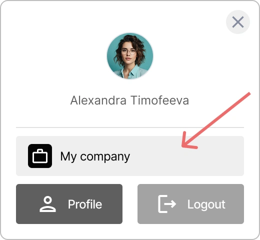
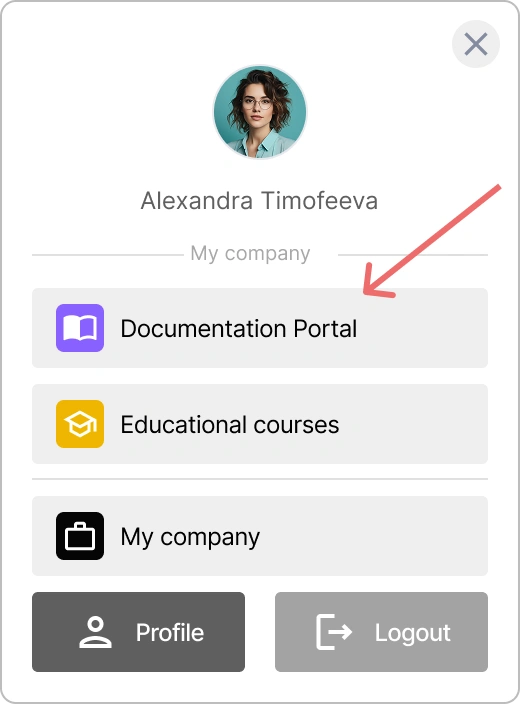

# Gestión de una Organización en {{projectName}}

En **{{projectName}}**, las organizaciones sirven como la unidad estructural principal para gestionar el acceso a las aplicaciones, dividir a los empleados por departamentos y mantener auditorías de la actividad de los usuarios. En esta guía, cubriremos cómo crear organizaciones y configurar los métodos de inicio de sesión.

**Tabla de Contenidos:**

- [Conceptos Básicos de la Organización](#organization-basics)
- [Acceso al Panel de Control de la Organización](#organization-panel-access)
- [Configuración del Nombre y Logo de la Organización](#organization-name-and-logo)
- [Métodos de Inicio de Sesión de la Organización](#organization-login-methods)
- [Ver También](#see-also)

---

## Conceptos Básicos de la Organización { #organization-basics }

Una organización en **{{projectName}}** es una unidad estructural que le permite:

- **Segregar el acceso** a las aplicaciones entre departamentos o proyectos,
- **Configurar métodos de inicio de sesión corporativos**,
- **Mantener una auditoría centralizada** de la actividad de los usuarios,
- **Gestionar aplicaciones** dentro de una sola empresa,
- **Configurar la imagen de marca** (logo, nombre) para los widgets de inicio de sesión.

> 💡 **Caso de Uso:** Las organizaciones son ideales para empresas que necesitan gestionar múltiples aplicaciones y grupos de usuarios desde un único punto de control.

---

## Acceso al Panel de Control de la Organización { #organization-panel-access }

El panel de control de la organización está diseñado para gestionar la configuración de la organización, las aplicaciones y los usuarios.

Las siguientes secciones están disponibles en el panel de control de la organización:

- **Configuración** — parámetros de la organización, métodos de inicio de sesión y personalización del widget de inicio de sesión.
- **Aplicaciones** — gestión de las aplicaciones de la organización.
- **Registro** — historial de actividad de los usuarios de la organización.

### Cómo acceder al panel de control de la organización de {{projectName}}

> ⚠️ Para acceder al panel de control de la organización, debe tener permisos de **Gestor**. Póngase en contacto con el administrador de su servicio para obtenerlos.

Para abrir el panel de control de la organización:

1. Inicie sesión en su cuenta personal de **{{projectName}}**.
2. Haga clic en su nombre en la esquina superior derecha de la ventana.
3. En la ventana del mini-widget que se abre, haga clic en el nombre de su organización.

    

Será redirigido al **Panel de Control de la Organización**.

> 💡 Añada las aplicaciones utilizadas con frecuencia al mini-widget utilizando el ajuste **Mostrar en el mini-widget** para un acceso rápido.  
> 

## Configuración del Nombre y Logo de la Organización { #organization-name-and-logo }

El nombre y el logo se muestran en la interfaz del sistema **{{projectName}}**, así como en el mini-widget.

Para configurar el nombre y el logo:

1. Vaya al panel de control de la organización → pestaña **Configuración**.
2. Despliegue el bloque **Información principal**.
3. Especifique el nuevo nombre en el campo **Nombre de la aplicación**.
4. En la sección **Logotipo de la aplicación**, haga clic en **Cargar** y seleccione el archivo del logo.

    > ⚡ Formatos compatibles: JPG, GIF, PNG, WEBP; tamaño máximo 1 MB.

5. Ajuste el área de visualización del logo.

    

6. Haga clic en **Guardar**.

---

## Métodos de Inicio de Sesión de la Organización { #organization-login-methods }

Un **método de inicio de sesión** es un método de autenticación de usuario que les permite acceder a las aplicaciones.

Una organización puede utilizar tanto métodos de inicio de sesión públicos como métodos de inicio de sesión creados específicamente para esa organización.

**Usted puede:**

- Utilizar **métodos de inicio de sesión públicos** configurados por el administrador de **{{projectName}}**
- Añadir **sus propios métodos de inicio de sesión** exclusivamente para su organización
- Configurar la **publicidad** — determinar dónde estarán disponibles sus métodos de inicio de sesión
- Hacer que los identificadores sean **obligatorios** para los usuarios

> ⚠️ **Restricciones:** Solo los administradores de **{{projectName}}** pueden editar los métodos de inicio de sesión públicos.

> 🔍 Las instrucciones detalladas para crear, editar y eliminar métodos de inicio de sesión se encuentran en la guía principal: [Configuración de Métodos de Inicio de Sesión](./docs-06-github-en-providers-settings.md#managing-login-methods).  

---

## Ver También { #see-also }

- [Configuración de Métodos de Inicio de Sesión y Widget de Inicio de Sesión](./docs-06-github-en-providers-settings.md) — una guía sobre los métodos de inicio de sesión y la configuración del widget de inicio de sesión.
- [Gestión de Aplicaciones](./docs-10-common-app-settings.md) — una guía para crear, configurar y gestionar aplicaciones OAuth 2.0 y OpenID Connect (OIDC).
- [Perfil Personal y Gestión de Permisos de Aplicaciones](./docs-12-common-personal-profile.md) — una guía para gestionar su perfil personal.