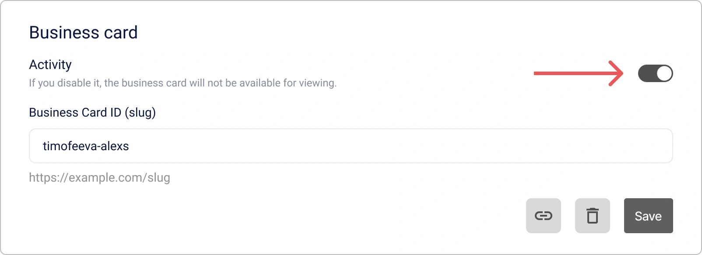

# Cómo gestionar su Perfil Personal de Encvoy ID

**El Perfil de Encvoy ID** es su centro de control para los datos y la seguridad de su cuenta.

En esta guía, aprenderá a gestionar su perfil personal en **Encvoy ID**: editar datos y ajustes de privacidad, actualizar su contraseña, controlar el acceso a aplicaciones, ver el registro de actividad y exportar los datos del perfil.

**Tabla de Contenidos:**

- [Gestión del Perfil Personal](#personal-profile-management)
- [Permisos de Aplicaciones y Acceso OAuth](#app-permissions-and-oauth)
- [Invitaciones a Aplicaciones Cerradas](#closed-app-invitations)
- [Catálogo de Aplicaciones](#application-catalog)
- [Registro de Actividad e Historial de Inicio de Sesión](#activity-log-and-login-history)
- [Ver También](#see-also)

---

## Gestión del Perfil Personal { #personal-profile-management }

Su perfil contiene información básica para su identificación dentro del sistema. Dependiendo del método de registro, algunos campos pueden no estar disponibles para edición. Si necesita editarlos, contacte al administrador del servicio.

### Cambio de Información Personal

1. Vaya a su **Perfil**.
2. Haga clic en **Editar** en el bloque **Información principal**.


3. Realice los cambios necesarios en el formulario que se abre.

   > 💡 Se han establecido reglas de validación para algunos campos. Por favor, sea cuidadoso al realizar cambios.
   >
   > 

4. Haga clic en **Guardar**.

> 📌 **Importante:** El perfil puede guardarse incluso con campos obligatorios vacíos. El sistema solicitará los datos faltantes durante su próximo inicio de sesión.

### Adición de una Foto de Perfil

Puede subir una foto desde su dispositivo o usar un avatar de servicios externos vinculados.

1. Vaya a su **Perfil**.
2. Haga clic en **Editar** en el bloque **Información principal**.
3. Se abrirá el formulario de edición.
4. Añada una foto utilizando uno de los siguientes métodos:
   - Haga clic en el botón **Cargar** y especifique la ruta al archivo de la foto,

       

   - Haga clic en el botón **Disponibles** y seleccione una foto de un sistema externo.

       

   > 📌 Si no hay identificadores de sistemas externos vinculados con una foto en el perfil, el botón **Disponibles** estará oculto.

   > 💡 **Consejo**: Para eliminar una foto, haga clic en el botón **Eliminar** en el bloque **Foto de perfil**.

5. Haga clic en **Guardar** en el formulario de edición.

### Adición de una Dirección de Correo Electrónico

> 💡 El correo electrónico requiere verificación — ingresando un código de un solo uso o haciendo clic en un enlace en el correo.

1. Vaya a su **Perfil**.
2. Busque el bloque **Contactos** y haga clic en **Editar** en el panel **Correo electrónico**.


3. Se abrirá el formulario de adición.


4. Ingrese el correo electrónico y haga clic en **Obtener código**.

   Se enviará un código de confirmación a la dirección especificada.

5. Ingrese el código y haga clic en **Confirmar**, o siga el enlace en el correo electrónico.

> 💡 **Consejo**: Para eliminar un correo electrónico, haga clic en el botón **Eliminar** en el panel **Correo electrónico**.

### Adición de un Número de Teléfono

> 💡 El número de teléfono requiere verificación — ingresando un código de un solo uso de un SMS o una llamada entrante.

1. Vaya a su **Perfil**.
2. Busque el bloque **Contactos** y haga clic en **Editar** en el panel **Número de teléfono**.


3. Se abrirá el formulario de edición.


4. Ingrese el número y haga clic en **Obtener código**.

   Se enviará un SMS o se realizará una llamada al número especificado.

5. Ingrese el código de confirmación y haga clic en **Confirmar**.

> 💡 **Consejo**: Para eliminar un número de teléfono, haga clic en el botón **Eliminar** en el panel **Número de teléfono**.

### Cambio de Contraseña

1. Vaya a su **Perfil**.
2. Haga clic en **Editar** en el bloque **Seguridad**.


3. En la ventana que se abre, especifique la contraseña actual y la nueva contraseña.


Después de cambiar la contraseña, se cerrará su sesión. Para continuar trabajando, debe iniciar sesión nuevamente con la nueva contraseña.

### Ajustes de Privacidad { #privacy-settings }

Puede controlar de forma independiente qué información estará disponible para otros usuarios o sistemas de terceros. Esto se hace a través de los ajustes de privacidad de los campos.

Este ajuste le permite definir la privacidad para cada campo en los bloques **Información principal**, **Información adicional** y **Identificadores**.

#### Niveles de Privacidad { #privacy-levels }

| Nivel                          | Icono                                                                                                        | Descripción                                                                                                                                |
| ------------------------------ | ------------------------------------------------------------------------------------------------------------ | ------------------------------------------------------------------------------------------------------------------------------------------ |
| **Disponible solo para usted** |                           | Los datos no se transmiten a sistemas de terceros y están disponibles solo para usted.                                                     |
| **Disponible bajo petición**   |  | Los datos están disponibles en sistemas de terceros integrados con Encvoy ID. <br> Se requiere su consentimiento para acceder a los datos. |
| **Disponible para todos**      |                         | Los datos son siempre públicos. No se requiere su consentimiento para acceder a ellos.                                                     |

#### Cómo Configurar la Privacidad de los Campos

1. Vaya a su **Perfil**.
2. Haga clic en el botón de ajuste de privacidad junto al campo.
3. Seleccione el nivel requerido.


Dependiendo del valor seleccionado, el valor del campo en el perfil se vuelve público o privado.

El ajuste se aplica sin confirmación adicional.

### Gestión de Identificadores de Servicios Externos { #external-service-identifiers }

**Los Identificadores** son servicios externos que ha añadido a su perfil o a través de los cuales ha iniciado sesión alguna vez en aplicaciones o en la cuenta personal.

La lista de identificadores disponibles para añadir en el perfil se forma a partir de los métodos de inicio de sesión públicos creados en el panel de control de **Encvoy ID**.

> 🔍 Los identificadores disponibles para vincular se configuran en el panel de administración.

> 💡 Puede iniciar sesión en aplicaciones utilizando identificadores, siempre que estén añadidos al widget de inicio de sesión.

#### Adición de un Nuevo Identificador

1. Vaya a su **Perfil**.
2. Haga clic en **Agregar** en el bloque **Identificadores**.


3. En la ventana que se abre, seleccione un servicio externo.


4. Complete la autenticación en el servicio.

   Después de un inicio de sesión exitoso en la cuenta del servicio externo, el identificador se vinculará al perfil.

> 💡 **Consejo**: Si un identificador de servicio externo ya está vinculado a otro usuario, debe eliminarlo del perfil de ese usuario y luego vincularlo a la nueva cuenta.

#### Eliminación de un Identificador

1. Vaya a su **Perfil**.
2. Haga clic en el identificador que desea eliminar.
3. Seleccione la acción **Eliminar**.


El identificador será **eliminado inmediatamente** del perfil.

### Configuración del Perfil Público

**El Perfil Público** consiste en datos públicos disponibles para ser vistos por otros miembros del sistema **Encvoy ID** y aplicaciones conectadas. Le permite controlar qué información del usuario es visible para otros sin otorgar acceso total a la cuenta.

#### Visualización del Perfil Público

1. Vaya a su **Perfil**.
2. Haga clic en el botón **Datos públicos** en el bloque **Privacidad del perfil**.
3. Se abrirá una ventana con el perfil público que contiene los datos con el nivel **Disponible para todos**.

#### Descarga de Datos del Perfil Público

> 📌 Los datos del perfil público se exportan en formato **vCard**.

1. Vaya a su **Perfil**.
2. Haga clic en el botón **Datos públicos** en el bloque **Privacidad del perfil**.
3. Se abrirá la ventana **Perfil Público** con los datos configurados en el nivel **Disponible para todos**.
4. Haga clic en el botón **Exportar vCard** .
5. Comenzará la descarga del archivo.

Ejemplo de un archivo **vCard** con datos del perfil público:

```VCARD
BEGIN:VCARD
VERSION:3.0
FN:Timofeeva Alex
N:Timofeeva;Alex;;;
PHOTO:https://service-adress/public/images/profile/90211313d753e1d1b83ab19ecfd4af5e
EMAIL:timofeeva-alexs@gmail.com
UID:null
REV:2025-05-26T12:52:24.630Z
END:VCARD
```

#### Desactivación del Perfil Público

> 💡 **Consejo**: Puede prohibir la transmisión de datos del perfil público que tengan el nivel de privacidad "Disponible para todos".

1. Vaya a su **Perfil**.
2. Active el interruptor **Perfil privado** en el bloque **Privacidad del perfil**.

   

   El ajuste se aplica sin confirmación adicional.

Después de activar el ajuste, los datos con el nivel de privacidad "Disponible para todos" estarán disponibles solo bajo petición.

### Tarjeta de Presentación Digital del Perfil Personal { #digital-business-card }

> 🔬 **Función experimental**: La disponibilidad está regulada por el administrador del sistema.

**La Tarjeta de Encvoy ID** es un reemplazo digital moderno para una tarjeta de presentación de papel, accesible a través de un enlace único.

**Contenido de la Tarjeta:**

- Foto de perfil,
- Nombre y apellido,
- Datos de contacto (correo electrónico, teléfono),
- Fecha de nacimiento.

**Características:**

- Los datos se muestran independientemente de los [ajustes de privacidad](#privacy-settings).
- La tarjeta está disponible a través de un enlace único: `https://<su-servicio>/api/cards/<identificador>`.
- Soporta la exportación de la tarjeta en formato **vCard** para su integración en diversas aplicaciones.

#### Actividad de la Tarjeta

Un ajuste de actividad está disponible para la tarjeta.

1. Vaya a su **Perfil**.
2. En el bloque **Tarjeta de visita**, active el interruptor **Actividad**.

   

   Asegúrese de que su tarjeta sea ahora accesible. Para ello, siga el enlace: `https://<su-dominio>/api/cards/<identificador>`:

#### Configuración de una Dirección de Enlace Personalizada

Para que el enlace de la tarjeta sea más corto y fácil de recordar, puede establecer su propio identificador único.

1. Vaya a su **Perfil**.
2. En el bloque **Tarjeta de visita**, especifique un nuevo identificador.
3. Haga clic en **Guardar**.

> 💡 El identificador debe ser único en el sistema y contener solo letras latinas, números y guiones.

#### Cómo Compartir una Tarjeta de Presentación

1. Vaya a su **Perfil**.
2. En el bloque **Tarjeta de visita**:
   - Haga clic en **Abrir código QR**  y escanee el código con la cámara de su dispositivo.
   - Haga clic en el botón **Copiar enlace**  para copiar la dirección del enlace de la tarjeta.

### Acciones Adicionales del Perfil Personal

#### Finalización de Todas las Sesiones

La función para forzar la finalización de todas las sesiones activas es una herramienta de seguridad importante. Úsela en caso de pérdida del dispositivo, sospecha de compromiso de la cuenta o para actualizar inmediatamente los tokens de acceso.

> 📌 Esta operación invalida inmediatamente todos los tokens de acceso y de actualización, finalizando TODAS las sesiones actuales en todas las aplicaciones.

Para finalizar todas las sesiones activas:

1. Vaya a su **Perfil**.
2. Despliegue el bloque **Otras acciones** y seleccione **Cerrar sesión en todos los dispositivos**.

Después de esto, deberá **iniciar sesión nuevamente** en todos los dispositivos.

#### Descarga de Datos del Perfil Personal

**Encvoy ID** le permite exportar todos los datos del perfil en formato JSON.

Este archivo contiene toda la información relacionada con su perfil en **Encvoy ID**, así como detalles de las cuentas externas que ha añadido como métodos de inicio de sesión, independientemente de si el parámetro de privacidad está configurado para ellas.

Para descargar los datos del perfil:

1. Vaya a su **Perfil**.
2. Despliegue el bloque **Otras acciones** y seleccione **Descargar datos**.
3. La descarga del archivo JSON comenzará automáticamente.

#### Política de Tratamiento de Datos Personales

Lea el documento sobre cómo **Encvoy ID** trata sus datos.

Para leer la política:

1. Vaya a su **Perfil**.
2. Despliegue el bloque **Otras acciones** y seleccione **Política de Tratamiento de Datos Personales**.
3. Comenzará la descarga del archivo de la política.

### Eliminación y Recuperación de Cuenta

La eliminación de la cuenta en **Encvoy ID** es una operación irreversible, tras la cual será imposible recuperar los datos. El sistema utiliza un mecanismo de eliminación retardada: su cuenta se marca para eliminación pero permanece disponible para recuperación durante un período determinado. Esto se hace para proteger contra eliminaciones accidentales y darle tiempo para cambiar de opinión.

Para eliminar una cuenta:

1. Vaya a su **Perfil**.
2. Despliegue el bloque **Otras acciones** y seleccione la acción **Eliminar cuenta**.
3. En la ventana que se abre, ingrese la contraseña de su cuenta para confirmar la acción y haga clic en **Eliminar**.


**Qué sucede:**

- La cuenta se marca para eliminación
- Se cierra su sesión automáticamente
- La recuperación de la cuenta está disponible durante un período determinado

Durante un período determinado después de la eliminación de la cuenta, tiene la oportunidad de restaurar el acceso a ella. Para ello, debe iniciar sesión nuevamente en la cuenta personal de **Encvoy ID**, luego hacer clic en **Restaurar Cuenta**.

> 💡 La recuperación de la cuenta solo está disponible al iniciar sesión en la cuenta personal de **Encvoy ID**. Al iniciar sesión en una aplicación a través del servicio **Encvoy ID**, la recuperación de la cuenta no está disponible.

---

## Permisos de Aplicaciones y Acceso OAuth { #app-permissions-and-oauth }

**Los Permisos** son los derechos que usted otorga a aplicaciones externas para acceder a datos específicos en su perfil de **Encvoy ID**. Puede restringir el acceso, finalizar sesiones activas o revocar permisos completamente en cualquier momento.

Todas las aplicaciones que tienen acceso a sus datos se muestran en el **Perfil**, en la pestaña **Permisos**.

### Navegación a una Aplicación desde la Lista de Permisos

Para abrir rápidamente una aplicación a la que otorgó acceso previamente:

1. Vaya a su pestaña **Perfil** → **Permisos**.


2. Haga clic en el **nombre de la aplicación** en la lista.
3. Será redirigido automáticamente a la aplicación seleccionada.

### Finalización de Sesiones Activas de Aplicaciones

Si desea finalizar inmediatamente todas las sesiones en una aplicación específica:

1. Vaya a su pestaña **Perfil** → **Permisos**.
2. Abra el menú de acciones de la aplicación donde necesita finalizar las sesiones.
3. Seleccione la acción **Finalizar sesiones**.


4. Confirme la acción en la ventana modal.

**Qué sucederá:** Todas las sesiones activas en esta aplicación finalizarán. La próxima vez que acceda a la aplicación, se requerirá una **re-autorización**.

Finalizar sesiones es útil si sospecha de un acceso no autorizado o si usó la aplicación en un dispositivo compartido.

### Revocación de Permisos de Aplicaciones

Para prohibir completamente que una aplicación acceda a sus datos:

1. Vaya a su pestaña **Perfil** → **Permisos**.
2. Abra el menú de acciones de la aplicación cuyos permisos desea revocar.
3. Seleccione la acción **Revocar Permiso**.
4. Confirme la acción en la ventana modal.

**Consecuencias:** La aplicación **perderá el acceso** a todos los datos de su perfil. La próxima vez que inicie sesión, el sistema solicitará un **nuevo consentimiento** para el acceso.

---

## Invitaciones a Aplicaciones Cerradas { #closed-app-invitations }

Una **invitación** es una forma de obtener acceso a una aplicación cerrada. El administrador de la aplicación envía una invitación a su correo electrónico, tras lo cual puede iniciar sesión en la aplicación que no está disponible para otros usuarios.

### ¿Cómo Recibir una Invitación?

Una invitación llega de dos maneras:

1. **Por correo electrónico**: Recibirá un correo con una invitación y un enlace para el acceso rápido a la aplicación.
2. **En su perfil de Encvoy ID**: aparece una nueva invitación en la sección **Solicitudes**.

### ¿Cómo Aceptar una Invitación?

Puede aceptar una invitación de cualquier forma conveniente.

#### Método 1: Aceptar Invitación desde el Correo Electrónico

1. Abra el correo de invitación.
2. Haga clic en el enlace del correo.
3. Entonces son posibles dos opciones:
   - si ya ha iniciado sesión en el sistema — entrará inmediatamente en la aplicación;
   - si no ha iniciado sesión — inicie sesión en el sistema.

> 🔐 Debe iniciar sesión **con la cuenta** vinculada al correo electrónico especificado en la invitación.

#### Método 2: Aceptar Invitación desde el Perfil

1. Vaya a su pestaña **Perfil** → **Solicitudes**.
2. Busque la invitación requerida en la lista.
3. Haga clic en el botón **Aceptar**.


Después de esto, el acceso a la aplicación se activará y podrá navegar hacia ella.

#### Si Aún No Tiene una Cuenta

Si recibió una invitación pero aún no está registrado en el sistema **Encvoy ID**:

1. Siga el enlace del correo de invitación.
2. Regístrese en el sistema **Encvoy ID**.
3. Durante el registro, especifique la misma dirección de correo electrónico a la que se envió la invitación.
4. Tras completar el registro, recibirá automáticamente acceso a la aplicación.

---

## Catálogo de Aplicaciones { #application-catalog }

> 🔬 **Función experimental**: La disponibilidad está regulada por el administrador del sistema.

### ¿Qué es el Catálogo?

**El Catálogo** es un mercado centralizado para todas las aplicaciones disponibles en el ecosistema de **Encvoy ID**.

El catálogo reúne todas las aplicaciones públicas en un solo lugar, permitiéndole encontrar rápidamente las aplicaciones que necesita, ver nombres y descripciones, y acceder a las aplicaciones sin tener que recordar enlaces o rutas complejas.

Para mayor comodidad, todas las aplicaciones en el catálogo están divididas por tipo.

Las aplicaciones del catálogo pueden añadirse a favoritos. Para un acceso rápido, todas las aplicaciones favoritas se muestran en la barra lateral izquierda.

### ¿Cómo Usar Aplicaciones del Catálogo?

1. Haga clic en el botón .
2. Se abrirá una ventana con una lista de aplicaciones añadidas al catálogo.


3. Seleccione la aplicación deseada en el catálogo.
4. Será redirigido automáticamente a la página de la aplicación.
5. Autentíquese en la aplicación usando **Encvoy ID** y otorgue a la aplicación acceso a sus datos.

Ahora puede iniciar sesión en la aplicación con su perfil de **Encvoy ID**.

### Acciones en el Catálogo

#### Adición de una Aplicación a Favoritos

1. Haga clic en el botón **Catálogo de aplicaciones** .
2. Se abrirá una ventana con una lista de aplicaciones añadidas al catálogo.
3. Haga clic en el botón  situado junto a la aplicación que desea añadir a favoritos.

   La aplicación se añadirá a favoritos y se mostrará en el grupo correspondiente.

   

#### Eliminación de una Aplicación de Favoritos

1. Haga clic en el botón **Catálogo de aplicaciones** .
2. Se abrirá una ventana con una lista de aplicaciones añadidas al catálogo.
3. Haga clic en el botón  situado junto a la aplicación que desea eliminar de favoritos.

La aplicación se eliminará de favoritos y desaparecerá del menú lateral.

---

## Registro de Actividad e Historial de Inicio de Sesión { #activity-log-and-login-history }

**El Registro de Actividad** es una herramienta de seguridad que le permite rastrear dónde y desde qué dispositivos inició sesión en **Encvoy ID** o en las aplicaciones.

### Detalles del Evento

Hay información detallada disponible para cada evento.

| Parámetro                 | Contiene                                   |
| ------------------------- | ------------------------------------------ |
| **Encabezado del Evento** | Categoría de la acción                     |
| **Fecha y Hora**          | Marcas de tiempo exactas                   |
| **Aplicación**            | Identificador de la aplicación (client_id) |
| **Usuario**               | Identificador del usuario (id)             |
| **Dispositivo**           | Tipo de dispositivo y navegador            |
| **Ubicación**             | Dirección IP                               |

### ¿Cómo Ver el Registro de Actividad?

1. Vaya a su **Perfil**.
2. Abra la pestaña **Registro**.

---

## Ver También { #see-also }

- [Registro e Inicio de Sesión de Usuario](./docs-13-common-user-authentication.md) — instrucciones para crear una cuenta, iniciar sesión con nombre de usuario/contraseña y servicios de autenticación externos.
