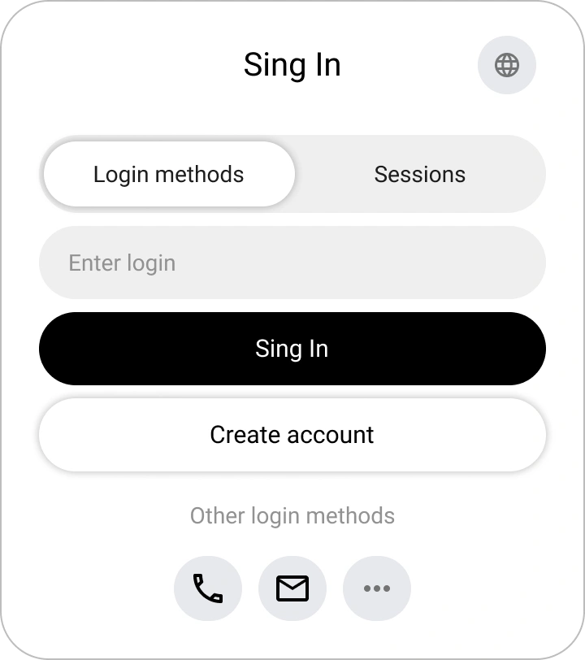
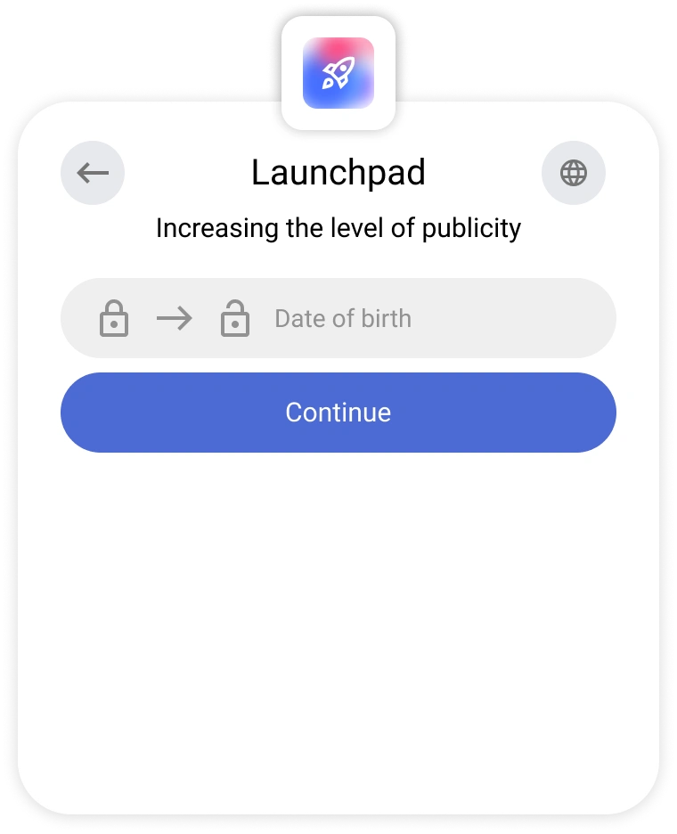
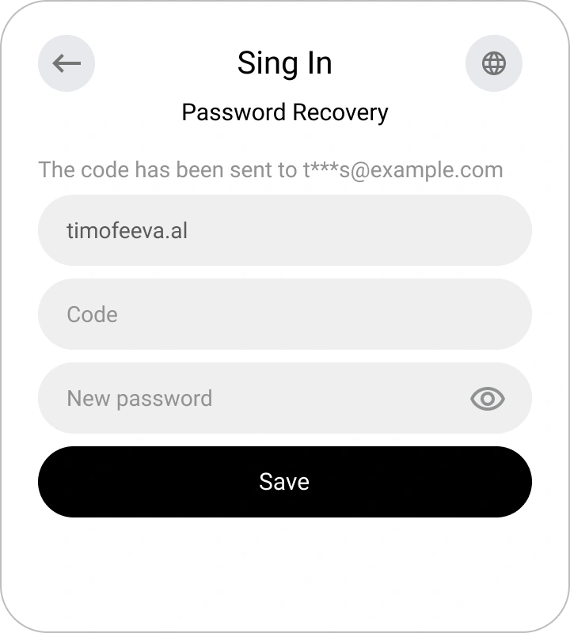

# Registro, Inicio de Sesión y Recuperación de Contraseña en Encvoy ID

En esta guía, aprenderá cómo crear una cuenta en **Encvoy ID**, iniciar sesión utilizando un nombre de usuario y contraseña o a través de servicios externos, y recuperar el acceso a su perfil de forma segura si es necesario.

**Tabla de Contenidos:**

- [Registro, Inicio de Sesión y Recuperación de Contraseña en Encvoy ID](#registro-inicio-de-sesión-y-recuperación-de-contraseña-en-encvoy-id)
  - [Registro de Nueva Cuenta { #new-account-registration }](#registro-de-nueva-cuenta--new-account-registration-)
    - [Dónde está disponible el registro](#dónde-está-disponible-el-registro)
    - [Cómo crear una cuenta en Encvoy ID](#cómo-crear-una-cuenta-en-encvoy-id)
  - [Inicio de Sesión con Nombre de Usuario y Contraseña { #login-with-password }](#inicio-de-sesión-con-nombre-de-usuario-y-contraseña--login-with-password-)
  - [Inicio de Sesión a través de Servicios Externos { #login-via-external-services }](#inicio-de-sesión-a-través-de-servicios-externos--login-via-external-services-)
  - [Inicio de Sesión Rápido para Usuarios Autenticados { #quick-login-for-authenticated-users }](#inicio-de-sesión-rápido-para-usuarios-autenticados--quick-login-for-authenticated-users-)
  - [Recuperación de Contraseña { #password-recovery }](#recuperación-de-contraseña--password-recovery-)
    - [Cómo recuperar una contraseña en Encvoy ID](#cómo-recuperar-una-contraseña-en-encvoy-id)
  - [Ver También { #see-also }](#ver-también--see-also-)

---

## Registro de Nueva Cuenta { #new-account-registration }

### Dónde está disponible el registro

La función de creación de cuenta puede estar disponible en dos casos:

1. **En el formulario de inicio de sesión**;

2. **En el formulario de selección de acción al iniciar sesión mediante un método de acceso**, si el identificador especificado no está vinculado a ningún perfil en **Encvoy ID**

> 💡 **El diseño del formulario** puede variar dependiendo de la configuración de la aplicación específica

### Cómo crear una cuenta en Encvoy ID

1. Haga clic en **Crear cuenta** en el formulario de inicio de sesión o de selección de acción.
2. Ingrese los datos requeridos en el formulario de registro.

   Ejemplo de la ventana de ingreso de nombre:

   

3. Si el sistema solicita un correo electrónico, proporcione una dirección que no esté vinculada a otros usuarios.
4. Ingrese el código o siga el enlace del correo enviado a la dirección especificada.

   

   > 💡 Si la confirmación se realiza mediante un enlace, la ventana de ingreso de código puede cerrarse.

5. Al iniciar sesión por primera vez en la aplicación, otorgue acceso a los datos necesarios.

Después de completar estos pasos, la cuenta será creada y habrá iniciado sesión en el sistema.

> 🔗 Si el registro se inicia a través de un servicio externo, el identificador del sistema externo se vinculará automáticamente al nuevo perfil. Podrá utilizarse para inicios de sesión posteriores.

---

## Inicio de Sesión con Nombre de Usuario y Contraseña { #login-with-password }

Puede autorizarse en la aplicación utilizando su cuenta de **Encvoy ID**.

> 📌 **Nota**: En algunas aplicaciones, el inicio de sesión con contraseña puede estar desactivado. En ese caso, utilice los [métodos de inicio de sesión externos](#login-via-external-services).

Para iniciar sesión:

1. En el primer paso del widget de inicio de sesión, ingrese sus datos de identificación (por ejemplo, nombre de usuario, correo electrónico o número de teléfono) y haga clic en **Iniciar sesión**.

2. Ingrese su contraseña en el segundo paso y haga clic en **Iniciar sesión**.

   > 💡 Si cometió un error al ingresar los datos, siga las instrucciones en pantalla.

   

**Tras una autenticación exitosa:**

- al iniciar sesión por primera vez, se abrirá un formulario de confirmación de acceso a datos;

  Ejemplo de un formulario solicitando acceso a los datos del perfil:

    

- si la aplicación requiere campos de perfil obligatorios, el sistema solicitará que se completen;

  Ejemplo de solicitud de número de teléfono:

    

- si los datos están ocultos por [ajustes de privacidad](./docs-12-common-personal-profile.md#privacy-levels), se le pedirá que cambie el nivel de acceso.

  Ejemplo de cambio de privacidad de la fecha de nacimiento:

    

---

## Inicio de Sesión a través de Servicios Externos { #login-via-external-services }

Los servicios de identificación externa (o métodos de inicio de sesión) incluyen redes sociales y servicios externos.

Para iniciar sesión a través de un servicio externo:

1. Seleccione el método de inicio de sesión deseado en el widget.

2. Complete la autorización en el servicio seleccionado utilizando los métodos disponibles para redes sociales.
3. Al iniciar sesión por primera vez, se abrirá un formulario de solicitud de acceso a datos. Proporcione su consentimiento para acceder a sus datos.

---

## Inicio de Sesión Rápido para Usuarios Autenticados { #quick-login-for-authenticated-users }

Si ya ha iniciado sesión en **Encvoy ID** en su navegador, no será necesario volver a autorizarse.

1. Al entrar, se abrirá una ventana para seleccionar una cuenta guardada.
2. Haga clic en el nombre de usuario.

3. Tras seleccionar al usuario, se producirá el inicio de sesión.

Adicionalmente:

- Para iniciar sesión como un usuario diferente, seleccione **Métodos de inicio de sesión** y autorícese como otro usuario.
- Para finalizar la sesión actual, haga clic en el botón **Cerrar sesión**.

---

## Recuperación de Contraseña { #password-recovery }

Si ha olvidado la contraseña de su cuenta de **Encvoy ID**, puede recuperarla fácilmente.

### Cómo recuperar una contraseña en Encvoy ID

1. En el primer paso del widget de inicio de sesión, ingrese sus datos de identificación (por ejemplo, nombre de usuario, correo electrónico o número de teléfono) y haga clic en **Iniciar sesión**.
2. En el siguiente paso, seleccione **Recuperar contraseña**.

3. Se enviará un código de confirmación a su correo electrónico.
4. Ingrese el código del correo electrónico.

   > ⚠️ El código es válido por un tiempo limitado. Si ha caducado, solicite un nuevo código.

   

5. Establezca una nueva contraseña y haga clic en **Guardar**.

Después de actualizar la contraseña, el inicio de sesión se realizará automáticamente.

> ✅ Contraseña recuperada con éxito; ahora puede usar la nueva combinación al iniciar sesión en el sistema.

---

## Ver También { #see-also }

- [Perfil Personal y Gestión de Permisos de Aplicaciones](./docs-12-common-personal-profile.md) — una guía para gestionar su perfil personal.
