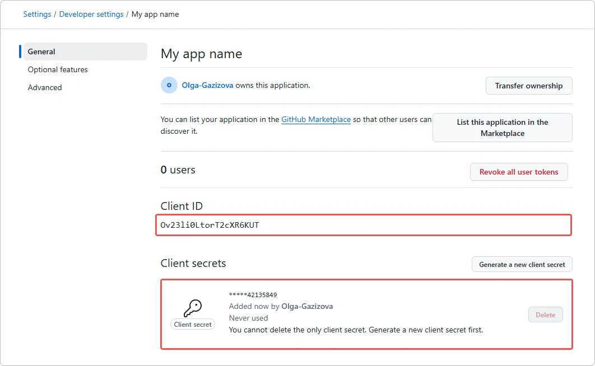

# Cómo conectar el inicio de sesión con GitHub en Encvoy ID

> 📋 Esta instrucción es parte de una serie de artículos sobre la configuración de métodos de inicio de sesión. Para más detalles, lea la guía de [Métodos de inicio de sesión y configuración del widget](./docs-06-github-en-providers-settings.md).

En esta guía, aprenderá cómo conectar la autenticación utilizando una cuenta de **GitHub** al sistema **Encvoy ID**. Este método de inicio de sesión permite a los usuarios acceder a las aplicaciones utilizando su cuenta del servicio **GitHub**.

La configuración del inicio de sesión con **GitHub** consta de tres pasos clave realizados en dos sistemas diferentes.

- [Paso 1. Configurar la aplicación de GitHub](#step-1-configure-github-app)
- [Paso 2. Crear el método de inicio de sesión](#step-2-create-login-method)
- [Paso 3. Añadir al widget](#step-3-add-to-widget)

---

## Paso 1. Configurar la aplicación de GitHub { #step-1-configure-github-app }

Antes de configurar el método de inicio de sesión en **Encvoy ID**, debe registrar su aplicación en la consola de desarrolladores de **GitHub** y obtener las claves de acceso:

1. Vaya a la configuración de **GitHub** a través del enlace:
   [https://github.com/settings/developers](https://github.com/settings/developers)

2. En la sección **OAuth Apps**, haga clic en **New OAuth App**.
3. Complete los ajustes de aplicación requeridos:
   - **Application name** - el nombre de la aplicación,
   - **Homepage URL** - la dirección de la instalación del servicio,
   - **Authorization callback URL** - la dirección en el formato `https://<installation_address>/api/interaction/code`.

   

4. Haga clic en **Register application**.
5. Después de crear la aplicación, abra su configuración y copie:
   - **Client ID**
   - **Client Secret** (creado a través del botón **Generate a new client secret**)

   

Estos valores serán necesarios en el siguiente paso.

---

## Paso 2. Crear el método de inicio de sesión { #step-2-create-login-method }

1. Vaya a la Consola de Administración → pestaña **Configuración**.

   > 💡 Para crear un método de inicio de sesión para una organización, abra la **Consola de Organización**. Si el método de inicio de sesión es necesario para una aplicación específica, abra la **configuración de esa aplicación**.

2. Busque el bloque **Métodos de inicio de sesión** y haga clic en **Configurar**.
3. En la ventana que se abre, haga clic en el botón **Crear** .
4. Se abrirá una ventana con una lista de plantillas.
5. Seleccione la plantilla de **GitHub**.
6. Complete el formulario de creación:

   **Información Básica**
   - **Nombre** — El nombre que verán los usuarios.
   - **Descripción** (opcional) — Una breve descripción.
   - **Logotipo** (opcional) — Puede subir su propio icono, o se utilizará el estándar.

   **Parámetros de Autenticación**
   - **Identificador del recurso (client_id)** — Pegue el **Client ID** copiado.
   - **Clave secreta (client_secret)** — Pegue el **Client Secret** copiado.
   - **URL de redireccionamiento (Redirect URI)** — Este campo se completará automáticamente basándose en su dominio.

   **Ajustes Adicionales**
   - **Método de inicio de sesión público** — Active esto si desea que este método de inicio de sesión esté disponible para añadirse a otras aplicaciones en el sistema (u organización), así como al perfil de usuario como un [identificador de servicio externo](./docs-12-common-personal-profile.md#external-service-identifiers).
   - **Público** — Configure el nivel de publicidad predeterminado para el identificador de servicio externo en el perfil de usuario.

7. Haga clic en **Crear**.

Tras la creación exitosa, el nuevo método de inicio de sesión aparecerá en la lista general de proveedores.

---

## Paso 3. Añadir al widget { #step-3-add-to-widget }

Para que el botón **Iniciar sesión con GitHub** sea visible en el formulario de autorización, debe activar esta función en la configuración del widget:

1. En la lista general de proveedores, busque el método de inicio de sesión creado.
2. Active el interruptor en el panel del proveedor.

> **Verificación**: Después de guardar, abra el formulario de inicio de sesión en una aplicación de prueba. Debería aparecer un nuevo botón con el logotipo de **GitHub** en el widget.

---

## Descripciones de Parámetros

### Información Básica

| Nombre          | Descripción                                                                                            | Tipo                  | Restricciones       |
| --------------- | ------------------------------------------------------------------------------------------------------ | --------------------- | ------------------- |
| **Nombre**      | El nombre que se mostrará en la interfaz del servicio **Encvoy ID**                                    | Texto                 | Máx. 50 caracteres  |
| **Descripción** | Una breve descripción que se mostrará en la interfaz del servicio **Encvoy ID**                        | Texto                 | Máx. 255 caracteres |
| **Logotipo**    | La imagen que se mostrará en la interfaz del servicio **Encvoy ID** y en el widget de inicio de sesión | JPG, GIF, PNG, o WEBP | Tamaño máx.: 1 MB   |

### Parámetros de Autenticación

| Nombre                                                     | Parámetro       | Descripción                                                                                                          |
| ---------------------------------------------------------- | --------------- | -------------------------------------------------------------------------------------------------------------------- |
| **Identificador del recurso (client_id)**                  | `Client_id`     | El ID de la aplicación creada en **GitHub**                                                                          |
| **Clave secreta (client_secret)**                          | `Client_secret` | La clave de acceso al servicio de la aplicación creada en **GitHub**                                                 |
| **URL de redireccionamiento (Redirect URI)** (no editable) | `Redirect URI`  | La dirección de **Encvoy ID** a la que se redirige al usuario después de la autenticación en el servicio de terceros |

### Ajustes Adicionales

| Nombre                                 | Descripción                                                                                                                                                                                                                                                                                                                        |
| -------------------------------------- | ---------------------------------------------------------------------------------------------------------------------------------------------------------------------------------------------------------------------------------------------------------------------------------------------------------------------------------- |
| **Método de inicio de sesión público** | Cuando se activa:   - El método de inicio de sesión está disponible para añadirse a otras aplicaciones del servicio.   - El método de inicio de sesión está disponible para añadirse como un [identificador de servicio externo](./docs-12-common-personal-profile.md#external-service-identifiers) en el perfil de usuario. |
| **Público**                            | Establece el nivel de publicidad predeterminado para el identificador de servicio externo en el perfil de usuario                                                                                                                                                                                                                  |

---

## Ver también

- [Métodos de inicio de sesión y configuración del widget de inicio de sesión](./docs-06-github-en-providers-settings.md) — una guía sobre los métodos de inicio de sesión y la configuración del widget de inicio de sesión.
- [Gestión de Organizaciones](./docs-09-common-mini-widget-settings.md) — una guía para trabajar con organizaciones en el sistema **Encvoy ID**.
- [Perfil Personal y Gestión de Permisos de Aplicación](./docs-12-common-personal-profile.md) — una guía para gestionar el perfil personal.
