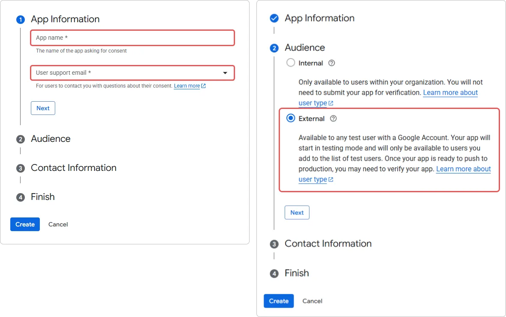
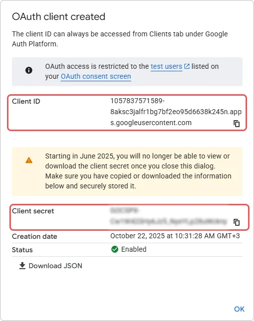

# Cómo conectar el inicio de sesión con Google en {{projectName}}

> 📋 Esta instrucción es parte de una serie de artículos sobre la configuración de métodos de inicio de sesión. Para más detalles, lea la guía [Métodos de inicio de sesión y configuración del widget](./docs-06-github-en-providers-settings.md).

En esta guía, aprenderá a conectar la autenticación mediante una cuenta de **Google** al sistema **{{projectName}}**. Este método de inicio de sesión permite a los usuarios acceder a las aplicaciones utilizando su cuenta de los servicios de **Google**.

La configuración del inicio de sesión con **Google** consta de tres pasos clave realizados en dos sistemas diferentes:

- [Paso 1. Configurar la aplicación en Google](#step-1-configure-google-app)
- [Paso 2. Crear el método de inicio de sesión](#step-2-create-login-method)
- [Paso 3. Añadir al widget](#step-3-add-to-widget)
- [Descripción de parámetros](#parameters-description)
- [Ver también](#see-also)

---

## Paso 1. Configurar la aplicación en Google { #step-1-configure-google-app }

Antes de configurar el método de inicio de sesión en **{{projectName}}**, debe registrar su aplicación en la consola de desarrolladores de **Google** y obtener las claves de acceso:

1. Inicie sesión con su cuenta de **Google**.  
2. Abra la [Google Cloud Console](https://code.google.com/apis/console#access).  
3. Cree un nuevo proyecto:  

    - En el panel superior, haga clic en **Select a project** → **New Project**.
    - Especifique el nombre del proyecto (por ejemplo, `Trusted.ID Login` o el nombre de su sitio web).
    - Haga clic en **Create**.

    > 🔗 Para más detalles, lea las instrucciones en [developers.google.com](https://developers.google.com/workspace/guides/create-project?hl=en).

4. Configure la **OAuth consent screen** (Pantalla de consentimiento de OAuth). Si ya ha realizado estos ajustes anteriormente, salte este paso.

    - Vaya a **APIs and Services** → **OAuth consent screen**.

      

    - Abra la sección **Branding**.
    - Haga clic en el botón **Get started** en el centro de la ventana.
    - Proporcione la **App Information**: el nombre de la aplicación y la dirección de correo electrónico que se mostrará a los usuarios en la pantalla de consentimiento.
    - Seleccione el tipo de **Audience** → **External**.

      

    - Proporcione una dirección de correo electrónico para recibir notificaciones del proyecto.
    - Acepte la política de usuario.

      

5. Cree un **OAuth Client ID**:

    - Vaya a **APIs and Services** → **Credentials**.
    - Haga clic en **Create credentials** → **OAuth client ID**.

      

    - Seleccione **Type** → **Web application**.
    - Complete el nombre y la URL de retorno \#1 (`Redirect_uri`).
    - Haga clic en **Create**.

      

      > ⚠️ Después de la creación, aparecerá una ventana con los datos: `Client ID` y `Client Secret`. Guarde estos valores; los necesitará al configurar en **{{projectName}}**.

      

6. Verifique la configuración de la **OAuth consent screen**:

    Antes de usarlo, asegúrese de que:

      - El estado de la pantalla de consentimiento sea **Published** (Publicado), no **In development** (En desarrollo),
      - Se hayan añadido los **scopes** (alcances) requeridos: `email` y `profile`.

---

## Paso 2. Crear el método de inicio de sesión { #step-2-create-login-method }

Ahora, con las claves de **Google**, vamos a crear el proveedor correspondiente en el sistema **{{projectName}}**.

1. Vaya al panel de administrador → pestaña **Configuración**.

    > 💡 Para crear un método de inicio de sesión para una organización, abra el **panel de la organización**. Si el método de inicio de sesión es para una aplicación específica, abra la **configuración de esa aplicación**.

2. Busque el bloque **Métodos de inicio de sesión** y haga clic en **Configurar**.
3. En la ventana que se abre, haga clic en el botón **Crear** .
4. Se abrirá una ventana con una lista de plantillas.
5. Seleccione la plantilla **Google**.
6. Complete el formulario de creación:

    **Información Básica**

    - **Nombre** — El nombre que verán los usuarios.
    - **Descripción** (opcional) — Una breve descripción.
    - **Logotipo** (opcional) — Puede subir su propio icono, o se utilizará el estándar.

    **Parámetros de Autenticación**

    - **Identificador del recurso (client_id)** — Pegue el **ID de aplicación** (`Client ID`) copiado.
    - **Clave secreta (client_secret)** — Pegue el **Secreto** (`Client Secret`) copiado.
    - **URL de redireccionamiento (Redirect URI)** — Este campo se completará automáticamente según su dominio.

    **Configuración Adicional**

    - **Método de inicio de sesión público** — Active esto si desea que este método de inicio de sesión esté disponible para añadirse a otras aplicaciones del sistema (o de la organización), así como al perfil de usuario como un [identificador de servicio externo](./docs-12-common-personal-profile.md#external-service-identifiers).
    - **Público** — Establezca el nivel de publicidad predeterminado para el identificador de servicio externo en el perfil de usuario.

7. Haga clic en **Crear**.

Tras la creación exitosa, el nuevo método de inicio de sesión aparecerá en la lista general de proveedores.

---

## Paso 3. Añadir al widget { #step-3-add-to-widget }

Para que el botón **Iniciar sesión con Google** sea visible en el formulario de autorización, debe activar esta función en la configuración del widget:

1. En la lista general de proveedores, busque el método de inicio de sesión creado.
2. Active el interruptor en el panel del proveedor.

> **Verificación**: Después de guardar, abra el formulario de inicio de sesión en una aplicación de prueba. Debería aparecer un nuevo botón con el logotipo de **Google** en el widget.

---

## Descripción de parámetros { #parameters-description }

### Información Básica

| Nombre | Descripción | Tipo | Restricciones |
|---|---|---|---|
| **Nombre** | El nombre que se mostrará en la interfaz del servicio **{{projectName}}** | Texto | Máx. 50 caracteres |
| **Descripción** | Una breve descripción que se mostrará en la interfaz del servicio **{{projectName}}** | Texto | Máx. 255 caracteres |
| **Logotipo** | La imagen que se mostrará en la interfaz del servicio **{{projectName}}** y en el widget de inicio de sesión | JPG, GIF, PNG o WEBP | Tamaño máx.: 1 MB |

### Parámetros de Autenticación

| Nombre | Parámetro | Descripción |
|---|---|---|
| **Identificador del recurso (client_id)** | `Client_id` | El ID de la aplicación creada en **Google** |
| **Clave secreta (client_secret)** | `Client_secret` | La clave de acceso al servicio de la aplicación creada en **Google** |
| **URL de redireccionamiento (Redirect URI)** (no editable) | `Redirect URI` | La dirección de **{{projectName}}** a la que se redirige al usuario tras la autenticación en el servicio de terceros |

### Configuración Adicional

| Nombre | Descripción |
|---|---|
| **Método de inicio de sesión público** | Cuando se activa:   - El método de inicio de sesión está disponible para añadirse a otras aplicaciones del servicio.   - El método de inicio de sesión está disponible para añadirse como un [identificador de servicio externo](./docs-12-common-personal-profile.md#external-service-identifiers) en el perfil de usuario. |
| **Público** | Establece el nivel de publicidad predeterminado para el identificador de servicio externo en el perfil de usuario |

---

## Ver también { #see-also }

- [Métodos de inicio de sesión y configuración del widget de inicio de sesión](./docs-06-github-en-providers-settings.md) — una guía sobre los métodos de inicio de sesión y la configuración del widget.
- [Gestión de organizaciones](./docs-09-common-mini-widget-settings.md) — una guía para trabajar con organizaciones en el sistema **{{projectName}}**.
- [Perfil personal y gestión de permisos de aplicaciones](./docs-12-common-personal-profile.md) — una guía para gestionar el perfil personal.