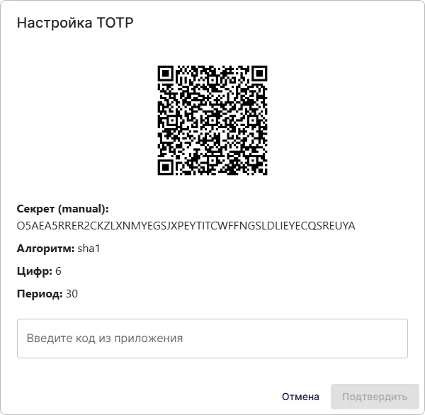

# Cómo conectar el inicio de sesión TOTP en Encvoy ID

> 📋 Esta instrucción es parte de una serie de artículos sobre la configuración de métodos de inicio de sesión. Para más detalles, lea la guía de [Métodos de inicio de sesión y configuración del Widget](./docs-06-github-en-providers-settings.md).

En esta guía, aprenderá cómo conectar la autenticación por contraseña de un solo uso **TOTP** al sistema **Encvoy ID**.

A quién va dirigida esta instrucción:

- **Administradores** — para configurar el método de inicio de sesión en el sistema.
- **Usuarios** — para vincular **TOTP** a su perfil.

La configuración del inicio de sesión **TOTP** consta de varias etapas clave:

- [Configuración de autenticación para administradores](#admin-authentication-setup)
- [Vinculación de TOTP para usuarios](#totp-user-binding)

---

## Información General

**TOTP** (Time-based One-Time Password) es un algoritmo para generar contraseñas de un solo uso válidas por un corto período de tiempo.

> 💡 Para crear un método de inicio de sesión basado en **HOTP**, utilice la instrucción [Cómo conectar el inicio de sesión HOTP](./instructions-common-provider-hotp.md).

La principal diferencia entre **TOTP** y **HOTP** es que la generación de la contraseña se basa en la hora actual. Por lo general, no utiliza una marca de tiempo exacta, sino el intervalo actual con límites predefinidos (normalmente 30 segundos).

**Componentes principales:**

- **Servidor de autenticación** — el servidor que genera la clave secreta y verifica los códigos introducidos.
- **Autenticador** — una aplicación que almacena la clave secreta y genera el OTP actual.
- **Clave secreta** — una base compartida entre el servidor y la aplicación utilizada para la generación de códigos.

### Flujo de trabajo de TOTP

1. **Configuración preliminar**
   - El administrador crea un método de inicio de sesión **TOTP** y lo activa para los widgets de las aplicaciones requeridas.
   - El usuario añade un nuevo identificador **TOTP** en su perfil escaneando un código QR que contiene la clave secreta a través de una aplicación de autenticación.

2. **Generación y verificación de códigos**
   - La aplicación de autenticación calcula una contraseña de un solo uso basada en la clave secreta y el intervalo de tiempo actual (normalmente 30 segundos) utilizando el algoritmo `SHA1`, `SHA256` o `SHA512`.
   - Cuando el usuario introduce el código en el formulario de inicio de sesión, el servidor recalcula el código esperado utilizando el mismo secreto y la hora actual.
   - Si el código introducido coincide con el esperado, se concede el acceso al usuario.

> 🚨 **Importante**: La hora en el dispositivo del usuario y en el servidor debe estar sincronizada. El desfase horario es la razón más común para el rechazo de códigos. Para compensar pequeñas diferencias de tiempo, el servidor puede aceptar códigos de intervalos de tiempo adyacentes (normalmente ±1 intervalo).

---

## Configuración de autenticación para administradores { #admin-authentication-setup }

### Paso 1. Creación de un método de inicio de sesión

1. Vaya al Panel de Administración → pestaña **Configuración**.

   > 💡 Para crear un método de inicio de sesión para una organización, abra el **Panel de la Organización**. Si el método de inicio de sesión es necesario para una aplicación específica, abra **la configuración de esa aplicación**.

2. Busque el bloque **Métodos de inicio de sesión** y haga clic en **Configurar**.
3. En la ventana que se abre, haga clic en el botón **Crear** .
4. Se abrirá una ventana con una lista de plantillas.
5. Seleccione la plantilla **TOTP**.
6. Complete el formulario de creación:

   **Información básica**
   - **Nombre** — El nombre que verán los usuarios.
   - **Descripción** (opcional) — Una breve descripción.
   - **Logotipo** (opcional) — Puede subir su propio icono, o se utilizará el predeterminado.

   **Parámetros**
   - **Número de dígitos** — Número de dígitos en la contraseña de un solo uso (normalmente 6).
   - **Periodo de validez** — Período de validez de la contraseña de un solo uso en segundos (se recomiendan 30).
   - **Algoritmo** — Algoritmo de hashing (`SHA1`, `SHA256` o `SHA512`) (normalmente `SHA-1`).

   **Configuraciones adicionales**
   - **Método de inicio de sesión público** — Active esto si desea que este método de inicio de sesión esté disponible para ser añadido a otras aplicaciones del sistema (u organización), así como al perfil de usuario como un [identificador de servicio externo](./docs-12-common-personal-profile.md#external-service-identifiers).
   - **Público** — Configure el nivel de publicidad predeterminado para el identificador de servicio externo en el perfil de usuario.

7. Haga clic en **Crear**.

Tras la creación exitosa, el nuevo método de inicio de sesión aparecerá en la lista general de proveedores.

### Paso 2. Adición del proveedor TOTP al Widget

Para que los usuarios vean el botón **TOTP** en el formulario de autorización, debe activar esta función en la configuración del widget:

1. Busque el método de inicio de sesión creado en la lista general de proveedores.
2. Cambie el interruptor en el panel del proveedor a la posición "On".

> **Verificación**: Después de guardar, abra el formulario de inicio de sesión en una aplicación de prueba. Debería aparecer un nuevo botón con el logotipo de **TOTP** en el widget.

---

## Vinculación de TOTP para usuarios { #totp-user-binding }

> 📌 Esta instrucción está destinada a usuarios que necesitan iniciar sesión en el sistema a través de **TOTP**.

### Paso 1. Instalación de una aplicación de autenticación

Debe instalar una aplicación en su dispositivo móvil que genere códigos TOTP.

Las opciones más populares son:

- **Google Authenticator** (Google)

> 💡 Asegúrese de que la hora en su dispositivo móvil esté configurada para actualizarse automáticamente (a través de la red). Una hora incorrecta es la razón más común por la que no se aceptan los códigos.

### Paso 2. Adición de un identificador TOTP al perfil

1. Vaya a su **Perfil**.
2. Haga clic en **Agregar** en el bloque **Identificadores**.

3. En la ventana que se abre, seleccione el método de inicio de sesión **TOTP**.
4. Escanee el código QR utilizando su aplicación de autenticación.

5. Introduzca el código de la aplicación y confirme.

> 💡 **Consejo**: Si el identificador ya está vinculado a otro usuario, debe eliminarlo del perfil de ese usuario antes de vincularlo a la nueva cuenta.

### Paso 3. Verificación

1. Vaya a la página de inicio de sesión donde el método de inicio de sesión **TOTP** está habilitado.
2. Seleccione el icono del método de inicio de sesión **TOTP**.
3. Se abrirá un formulario para introducir el código.
4. Introduzca su nombre de usuario.

5. Sin cerrar la página, abra la aplicación de autenticación en su teléfono. Copie el código de 6 dígitos y péguelo en el formulario.

6. Haga clic en el botón **Confirmar**.

> 🔄 **Si el código no es aceptado**: Asegúrese de que la hora en su teléfono y en el servidor esté sincronizada. Intente esperar a que se genere el siguiente código (aparece uno nuevo cada 30 segundos). Si el problema persiste, contacte con su administrador.

---

## Ver también

- [Métodos de inicio de sesión y configuración del Widget de inicio de sesión](./docs-06-github-en-providers-settings.md) — una guía sobre métodos de inicio de sesión y configuración del widget.
- [Gestión de la Organización](./docs-09-common-mini-widget-settings.md) — una guía para trabajar con organizaciones en el sistema **Encvoy ID**.
- [Perfil personal y gestión de permisos de aplicaciones](./docs-12-common-personal-profile.md) — una guía para gestionar su perfil personal.
