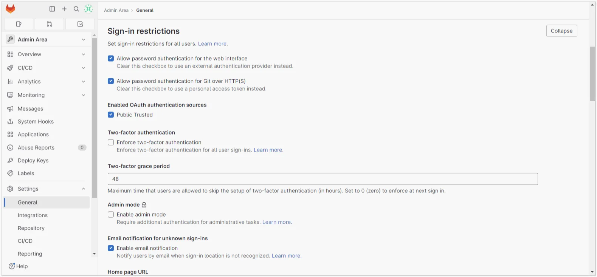

# Cómo configurar la integración de GitLab con Encvoy ID

En esta guía, aprenderá cómo configurar el inicio de sesión único (SSO) en **GitLab** a través del sistema **Encvoy ID**.

> 📌 [GitLab](https://about.gitlab.com/) es una plataforma basada en web para gestionar proyectos y repositorios de código de software, basada en el popular sistema de control de versiones **Git**.

La configuración del inicio de sesión a través de **Encvoy ID** consta de varias etapas clave realizadas en dos sistemas diferentes.

- [Paso 1. Crear la aplicación](#step-1-create-application)
- [Paso 2. Configurar el sistema GitLab](#step-2-configure-gitlab)
- [Paso 3. Verificar la integración](#step-3-verify-integration)

---

## Paso 1. Crear la aplicación { #step-1-create-application }

1. Inicie sesión en el sistema **Encvoy ID**.
2. Cree una aplicación con los siguientes ajustes:
   - **Dirección de la aplicación** - la dirección de su instalación de **GitLab**;
   - **URL de redireccionamiento \#1 (`Redirect_uri`)** - `<dirección de instalación de GitLab>/users/auth/oauth2_generic/callback`.

   > 🔍 Para más detalles sobre la creación de aplicaciones, lea las [instrucciones](./docs-10-common-app-settings.md#creating-application).

3. Abra la [configuración de la aplicación](./docs-10-common-app-settings.md#editing-application) y copie los valores de los siguientes campos:
   - **Identificador** (`Client_id`),
   - **Clave secreta** (`client_secret`).

---

## Paso 2. Configurar el sistema GitLab { #step-2-configure-gitlab }

La configuración de la autorización de usuarios para el servicio **GitLab** a través de **Encvoy ID** se realiza en el archivo de configuración **gitlab.rb** de GitLab, ubicado en la carpeta de configuración del servicio (/config).

1. Abra el archivo de configuración **gitlab.rb** en modo de edición y navegue hasta el bloque **OmniAuth Settings**.
2. Establezca los siguientes valores para los parámetros:

   ```bash
       gitlab_rails['omniauth_enabled'] = true
       gitlab_rails['omniauth_allow_single_sign_on'] = ['oauth2_generic', '<Encvoy IDSystemName>']
       gitlab_rails['omniauth_block_auto_created_users'] = false

       El valor para gitlab_rails['omniauth_providers'] debe verse de la siguiente manera:

       gitlab_rails['omniauth_providers'] = [
       {
       'name' => 'oauth2_generic',
       'app_id' => '<Client_id de la aplicación creada en Encvoy ID>',
       'app_secret' => '<Client_secret de la aplicación creada en Encvoy ID>',
       'args' => {
       client_options: {
       'site' => 'https://<dirección del sistema Encvoy ID>/',
       'authorize_url' => '/api/oidc/auth',
       'user_info_url' => '/api/oidc/me',
       'token_url' => '/api/oidc/token'
       },
       user_response_structure: {
       root_path: [],
       id_path: ['sub'],
       attributes: { email:'email',  name:'nickname' },
       },
       scope: 'openid profile email',
       'name' => '<Encvoy IDSystemName>’
       }
       }
       ]
   ```

   

3. Reinicie el servicio **GitLab** para aplicar los nuevos ajustes.
4. Si es necesario, inicie sesión como administrador en la interfaz del servicio **GitLab**. Navegue a la ruta de configuración **Admin (Admin Area) — Settings-General**.

   En la página que se abre, en el bloque **Sign-in restrictions**, marque la casilla junto a <Encvoy IDSystemName> en el subbloque **Enabled OAuth authentication sources**.

   

---

## Paso 3. Verificar la integración { #step-3-verify-integration }

1. Abra la página de inicio de sesión de **GitLab**.
2. Asegúrese de que haya aparecido el botón **Login via Encvoy ID**.
3. Haga clic en el botón e inicie sesión con su cuenta corporativa:
   - El sistema le redirigirá a la página de autenticación de **Encvoy ID**.
   - Ingrese sus credenciales corporativas.

    

4. Después de una autenticación exitosa, debería ser redirigido de vuelta a **GitLab** e iniciar sesión automáticamente en su cuenta.
