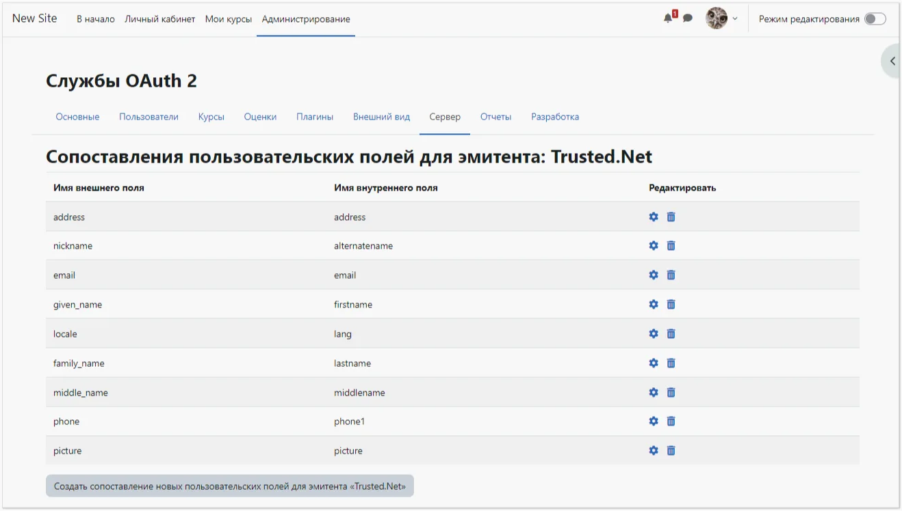
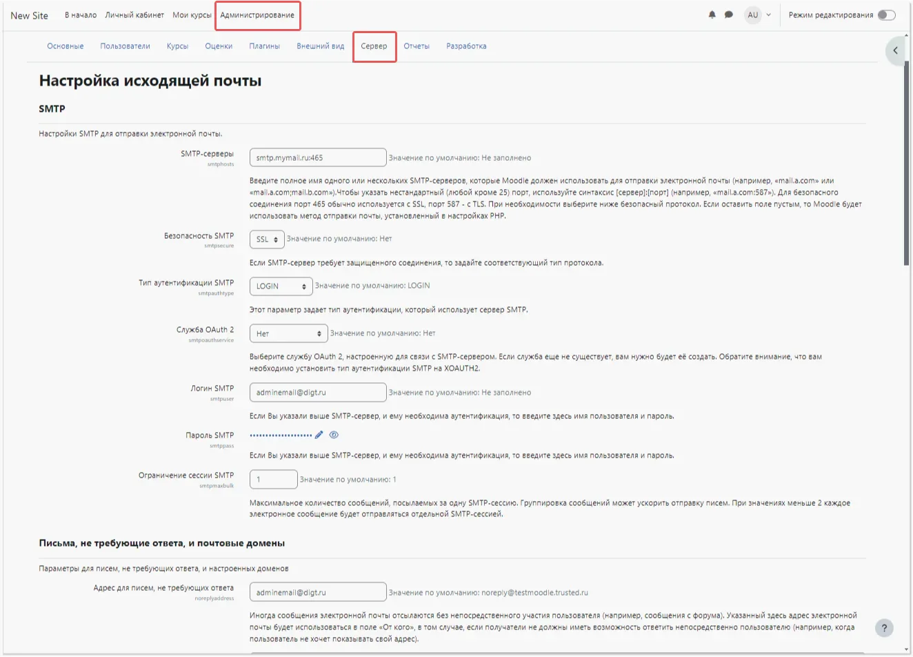

# Cómo configurar la integración de Moodle con Encvoy ID

En esta guía, aprenderá a configurar el Inicio de Sesión Único (SSO) en **Moodle** utilizando el sistema **Encvoy ID**.

> 📌 [Moodle](https://moodle.org/) es un sistema de gestión de aprendizaje para cursos educativos electrónicos (e-learning).

La configuración del inicio de sesión a través de **Encvoy ID** consta de varias etapas clave realizadas en dos sistemas diferentes:

- [Paso 1. Crear Aplicación](#step-1-create-application)
- [Paso 2. Configurar el Sistema Moodle](#step-2-configure-moodle)
- [Paso 3. Verificar la Conexión](#step-3-verify-connection)

---

## Paso 1. Crear Aplicación { #step-1-create-application }

1. Inicie sesión en el sistema **Encvoy ID**.
2. Cree una aplicación con los siguientes ajustes:
   - **Dirección de la Aplicación** - la dirección de su instalación de **Moodle**;
   - **URL de Redirección \#1 (Redirect_uri)** - `<Dirección de instalación de Moodle>/admin/oauth2callback.php`.

   Para más detalles sobre la creación de aplicaciones, lea las [instrucciones](./docs-10-common-app-settings.md#creating-application).

3. Abra la [configuración de la aplicación](./docs-10-common-app-settings.md#editing-application) y copie los valores de los siguientes campos:
   - **Identificador** (`Client_id`),
   - **Clave Secreta** (`client_secret`).

---

## Paso 2. Configurar el Sistema Moodle { #step-2-configure-moodle }

> Se requieren derechos de administrador en **Moodle** para configurar la autenticación de usuarios.

### Activar el Plugin OAuth2

1. Inicie sesión en **Moodle** con derechos administrativos.
2. Vaya a **Administración del sitio - Extensiones - Autenticación** y active el plugin **OAuth 2** habilitándolo en la columna **Habilitar**.

### Crear un Proveedor Personalizado

1. Vaya a **Administración del sitio** → **Servidor** → **Servicios OAuth 2**.
2. Haga clic en el botón **Personalizado**.

3. Se abrirá el formulario de creación del proveedor.
4. Complete los campos:
   - **Nombre** — cualquier nombre visible para el servicio;
   - **ID de cliente** — el `Client_id` de la aplicación **Encvoy ID**;
   - **Secreto del cliente** — el `Client_secret` de la aplicación **Encvoy ID**;
   - **URL base del servicio** — `<Dirección de Encvoy ID>/api/oidc`;
   - **Mostrar en la página de login** — **Página de login y servicios internos**;
   - **Ámbitos incluidos en una solicitud de login** — `openid profile email offline_access`;
   - **Ámbitos incluidos en una solicitud de login para acceso offline** — `offline_access`.

   

5. Guarde los cambios.

### Configurar Endpoints

1. Haga clic en **Configurar endpoints** en la columna **Editar**.

2. Si todos los datos se ingresaron correctamente, los ajustes se completarán automáticamente.

   

   > Si es necesario, puede completar las URLs de los endpoints manualmente. Consulte la lista de URLs disponibles en: `https://<dirección del servicio Encvoy ID>/api/oidc/.well-known/openid-configuration`

### Configurar el Mapeo de Campos de Usuario

1. Haga clic en **Configurar mapeo de campos de usuario** en la columna **Editar**.

2. Si todos los datos se ingresaron correctamente, los ajustes se completarán automáticamente.

   

   > Si es necesario, los mapeos se pueden configurar manualmente.

### Configurar el Envío de Correos en Moodle

Si el LMS requiere enviar correos electrónicos a los usuarios, debe configurar los ajustes de correo (si no se han configurado previamente):

1. Vaya a **Administración del sitio → Servidor → Correo electrónico → Configuración de correo saliente**.
2. Complete los campos:
   - **Hosts SMTP** — el nombre completo del servidor SMTP, incluyendo el puerto separado por dos puntos;
   - **Seguridad SMTP** — seleccione un valor de la lista;
   - **Tipo de autenticación SMTP** — seleccione el valor requerido. Si se selecciona el tipo de autenticación **LOGIN**, complete los campos **Usuario SMTP** y **Contraseña SMTP**. Se recomienda completar el campo **Dirección de no-reply** para evitar posibles problemas al enviar correos.

   

> 💡 La vinculación de un usuario de Moodle LMS con un usuario de Encvoy ID se basa en la dirección de correo electrónico. La ausencia de un correo electrónico en el perfil de Encvoy ID imposibilitará la autenticación en Moodle. Eliminar una dirección de correo previamente vinculada a Moodle en Encvoy ID y añadir una nueva dirección resultará en la creación de un nuevo usuario en Moodle.

---

## Paso 3. Verificar la Conexión { #step-3-verify-connection }

1. Regrese a la lista de **Servicios OAuth 2** y asegúrese de que el proveedor creado esté activo.

2. Abra la página de inicio de sesión de **Moodle**.
3. Asegúrese de que haya aparecido el botón **Iniciar sesión usando Encvoy ID**.
4. Haga clic en el botón e inicie sesión con sus credenciales corporativas:
   - Será redirigido a la página de autenticación de **Encvoy ID**;
   - Tras un inicio de sesión exitoso, será redirigido de vuelta a **Moodle** como usuario autorizado.

   
