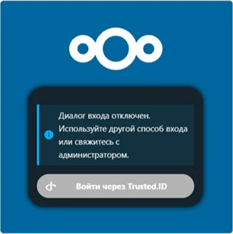

# Cómo configurar la integración de Nextcloud con Encvoy ID

En esta guía, aprenderá a configurar el inicio de sesión único (SSO) en **Nextcloud** utilizando el sistema **Encvoy ID**.

> 📌 [Nextcloud](https://nextcloud.com/) es un ecosistema de servicios para comunicaciones empresariales y colaboración, que combina llamadas, videoconferencias, chats y gestión de tareas.

La configuración del inicio de sesión con **Encvoy ID** consta de dos etapas clave realizadas en dos sistemas diferentes.

- [Paso 1. Crear la aplicación](#step-1-create-application)
- [Paso 2. Configurar Nextcloud](#step-2-configure-nextcloud)
- [Paso 3. Verificar la conexión](#step-3-verify-connection)

---

## Paso 1. Crear la aplicación { #step-1-create-application }

1. Inicie sesión en **Encvoy ID**.
2. Cree una nueva aplicación y especifique:
   - **Dirección de la aplicación** - la dirección de su instalación de **Nextcloud**. Por ejemplo: `https://<nextcloud-installation-address>`.
   - **URL de redireccionamiento \#1** (`Redirect_uri`) - la dirección en el formato `https://<nextcloud-installation-address>/api/oauth/return`.

     > 🔍 Para más detalles sobre la creación de aplicaciones, lea las [instrucciones](./docs-10-common-app-settings.md#creating-application).

3. Abra la [configuración de la aplicación](./docs-10-common-app-settings.md#editing-application) y copie los valores de los siguientes campos:
   - **Identificador** (`Client_id`),
   - **Clave secreta** (`client_secret`).

---

## Paso 2. Configurar Nextcloud { #step-2-configure-nextcloud }

1. Inicie sesión en **Nextcloud** con privilegios de administrador.
2. Instale la aplicación **Social Login**. Esta aplicación permite a los usuarios iniciar sesión en el sistema **Nextcloud** utilizando cuentas de servicios de terceros. Lea más sobre la aplicación en [apps.nextcloud.com](https://apps.nextcloud.com/apps/sociallogin).
   - Vaya a la sección **Apps** → **Social & communication**.

     

   - Haga clic en **Download and enable** para la aplicación **Social Login**.

     

     Después de instalar la aplicación, aparecerá una subsección **Social login** en la sección **Administration settings**.

3. Vaya a **Administration settings** → subsección **Social login**.
4. Haga clic en el botón  junto al campo **Custom OpenID Connect**.
5. Complete los parámetros de conexión:
   - **Internal name** - especifique el nombre interno del servicio de autenticación tal como aparecerá en la configuración de **Nextcloud**.
   - **Title** - especifique un nombre descriptivo para el servicio de autenticación. Este nombre se mostrará en el botón de la página de inicio de sesión y en la configuración de **Nextcloud**.
   - **Authorize url** - especifique la URL de autorización. Por ejemplo, `https://<Encvoy ID-installation-address>/api/oidc/auth`.
   - **URL token** - especifique la URL para obtener el token de acceso. Por ejemplo, `https://<Encvoy ID-installation-address>/api/oidc/token`.
   - **Client id** - especifique el valor creado en el **Paso 1**.
   - **Client Secret** - especifique el valor creado en el **Paso 1**.
   - **Scope** - especifique los permisos requeridos para la recuperación de datos. El scope obligatorio es `openid` y el scope estándar es `profile`. Al especificar múltiples permisos, sepárelos con un espacio. Por ejemplo: `profile email openid`.

   

6. Si es necesario, configure ajustes adicionales:

Después de completar todos los pasos, el botón de inicio de sesión para **Encvoy ID** se mostrará en el widget de autorización de **Nextcloud**.

---

## Paso 3. Verificar la conexión { #step-3-verify-connection }

1. Abra la página de inicio de sesión de **Nextcloud**.
2. Asegúrese de que haya aparecido el botón **Login with Encvoy ID**.
3. Haga clic en el botón e inicie sesión con sus credenciales corporativas:
   - Será redirigido a la página de autenticación de **Encvoy ID**;
   - Después de un inicio de sesión exitoso, regresará a **Nextcloud** como usuario autorizado.

   
