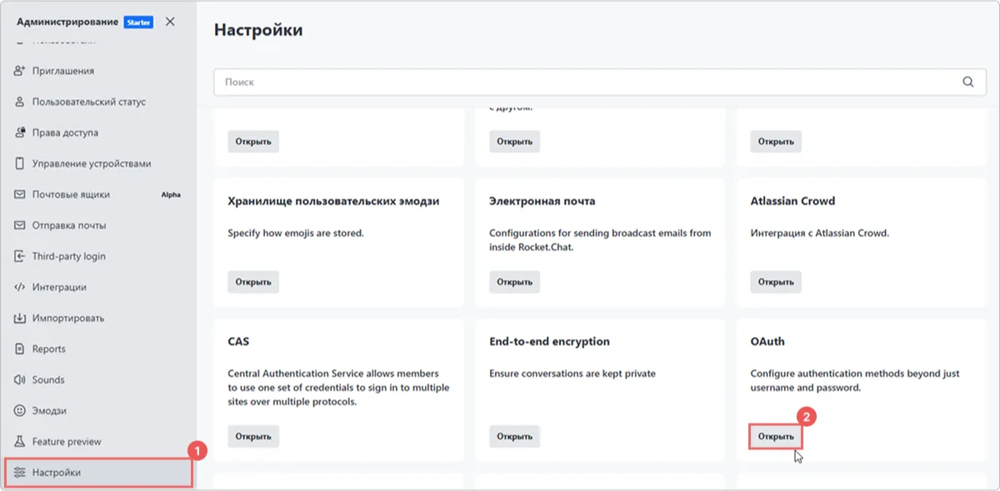
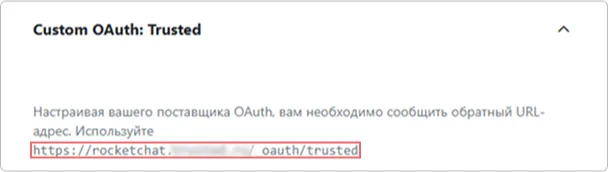

# Cómo configurar la integración de Rocket.Chat con Encvoy ID

En esta guía, aprenderá a configurar el Inicio de Sesión Único (SSO) en **Rocket.Chat** a través del sistema **Encvoy ID**.

> 📌 [Rocket.Chat](https://www.rocket.chat/) es una plataforma de mensajería de código abierto diseñada para el trabajo en equipo y la comunicación. Ofrece una funcionalidad similar a servicios como **Slack** o **Microsoft Teams**, pero con la opción de despliegue propio en su propio servidor.

La configuración del inicio de sesión a través de **Encvoy ID** consta de varias etapas clave realizadas en dos sistemas diferentes:

- [Paso 1. Crear una conexión en Rocket.Chat](#step-1-create-rocketchat-connection)
- [Paso 2. Crear una aplicación](#step-2-create-application)
- [Paso 3. Configurar la conexión en Rocket.Chat](#step-3-configure-rocketchat)
- [Paso 4. Verificar la conexión](#step-4-verify-connection)

---

## Paso 1. Crear una conexión en Rocket.Chat { #step-1-create-rocketchat-connection }

1. Inicie sesión en **Rocket.Chat** con derechos de administrador.
2. Abra el menú y seleccione **Workspace**.

3. Se abrirá la sección de **Administration**.
4. Vaya a la subsección **Settings** y haga clic en **Open** en el bloque **OAuth**.

5. Haga clic en el botón **Add custom OAuth**.

6. En la ventana que aparece, especifique un nombre único para el **OAuth service** que se está conectando y haga clic en **Add**.

7. La conexión creada aparecerá en la lista general de conexiones. Si no aparece, actualice la página del navegador.
8. Despliegue la configuración de la conexión y copie la **Callback URL**.

---

## Paso 2. Crear una aplicación { #step-2-create-application }

1. Inicie sesión en **Encvoy ID**.
2. Cree una nueva aplicación y especifique:
   - **Dirección de la aplicación** - la dirección de su instalación de **Rocket.Chat**;
   - **Callback URL \#1 (Redirect_uri)** - pegue el valor copiado de la conexión creada en **Rocket.Chat**.

     > 🔍 Para más detalles sobre la creación de aplicaciones, lea las [instrucciones](./docs-10-common-app-settings.md#creating-application).

3. Abra la [configuración de la aplicación](./docs-10-common-app-settings.md#editing-application) y copie los valores de los siguientes campos:
   - **Identificador** (`Client_id`),
   - **Clave secreta** (`client_secret`).

---

## Paso 3. Configurar la conexión en Rocket.Chat { #step-3-configure-rocketchat }

1. Regrese a **Rocket.Chat**.
2. Abra la configuración de la conexión creada en el Paso 1.
3. Active el interruptor **Enable** para habilitar la conexión, o actívelo más tarde después de configurar todos los parámetros.

4. Especifique los parámetros de conexión:
   - **URL** — La URL del servicio Encvoy ID. Por ejemplo: `https://<dirección de instalación de Encvoy ID>`
   - **Token Path** — Esta es la parte de la URL del Token Endpoint que especifica la ruta para obtener tokens. Por ejemplo: **/api/oidc/token**.
   - **Identity Path** — El endpoint con la información del usuario. Por ejemplo: **/api/oidc/me**.
   - **Authorize Path** — La ruta del endpoint de autorización. Por ejemplo: **/api/oidc/auth**.
   - **Scope** — Los permisos necesarios para recuperar datos. El scope requerido es **openid** y el scope estándar es **profile**. Al especificar múltiples permisos, sepárelos con un espacio. Por ejemplo: **profile email openid**.
   - **Id** — El Identificador (`Client_id`). Copie el valor creado en el Paso 2.
   - **Secret** — La Clave Secreta (`Client_secret`). Copie el valor creado en el Paso 2.

5. Especifique el resto de los ajustes. Puede encontrar descripciones detalladas de los ajustes en el portal de documentación [docs.rocket.chat](https://docs.rocket.chat/docs/oauth).
6. Guarde la configuración de la conexión.

Después de completar todos los pasos, aparecerá un botón de inicio de sesión para **Encvoy ID** en el widget de autorización de **Rocket.Chat**.

---

## Paso 4. Verificar la conexión { #step-4-verify-connection }

1. Abra la página de inicio de sesión de **Rocket.Chat**.
2. Asegúrese de que haya aparecido el botón **Login with Encvoy ID**.
3. Haga clic en el botón e inicie sesión con sus credenciales corporativas:
   - Será redirigido a la página de autenticación de **Encvoy ID**;
   - Después de un inicio de sesión exitoso, regresará a **Rocket.Chat** como usuario autorizado.

   
