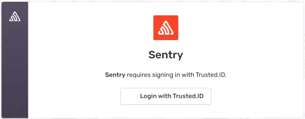

# Cómo configurar la integración de Sentry con Encvoy ID

En esta guía, aprenderá cómo configurar el Inicio de Sesión Único (SSO) para **Sentry** utilizando el sistema **Encvoy ID**.

**Sentry** es una plataforma para el monitoreo y seguimiento de errores de aplicaciones. Ayuda a los desarrolladores a identificar, analizar y corregir errores en tiempo real, mejorando la calidad del software.

La versión base del producto no admite la autenticación **OpenID Connect**. Para implementar esta función, puede utilizar una solución adicional: [sentry-auth-oidc](https://github.com/siemens/sentry-auth-oidc). Este es un proveedor especializado que habilita la integración de **OpenID Connect** con **Sentry** y le permite configurar el Inicio de Sesión Único (SSO) en el sistema.

La configuración del inicio de sesión a través de **Encvoy ID** consta de varios pasos clave realizados en dos sistemas diferentes:

- [Paso 1. Crear una aplicación](#step-1-create-application)
- [Paso 2. Instalar sentry-auth-oidc](#step-2-install-sentry-auth-oidc)
- [Paso 3. Verificar la conexión](#step-3-verify-connection)

---

## Paso 1. Crear una aplicación { #step-1-create-application }

1. Inicie sesión o regístrese en **Encvoy ID**.
2. Cree una aplicación con los siguientes ajustes:

   | Campo                                        | Valor                                     |
   | -------------------------------------------- | ----------------------------------------- |
   | URL de la aplicación                         | Dirección de su instalación de **Sentry** |
   | URL de redireccionamiento \#1 (Redirect_uri) | `<dirección de instalación>/auth/sso`     |

   > 🔍 Para más detalles sobre la creación de aplicaciones, lea las [instrucciones](./docs-10-common-app-settings.md#creating-application).

3. Abra la [configuración de la aplicación](./docs-10-common-app-settings.md#editing-application) y copie los valores de los siguientes campos:
   - **Client ID** (`Client_id`),
   - **Client Secret** (`client_secret`).

---

## Paso 2. Instalar sentry-auth-oidc { #step-2-install-sentry-auth-oidc }

1. Para instalar el proveedor, ejecute el comando de consola:

   ```python
   $ pip install sentry-auth-oidc
   ```

   o cree un script de Shell con el siguiente contenido:

   ```sh
   #!/bin/bash
   set -euo pipefail
   apt-get update
   pip install sentry-auth-oidc
   ```

   y ejecútelo desde el directorio `<ruta a Sentry>/sentry/`.

2. Después de instalar el proveedor, edite el archivo de configuración de **Sentry** `sentry.conf.py`. En el archivo de configuración, añada un bloque de variables con los parámetros **OIDC_CLIENT_ID** y **OIDC_CLIENT_SECRET** copiados de la aplicación **Encvoy ID**.

   ```sh
   #################
   # OIDC #
   #################

   #SENTRY_MANAGED_USER_FIELDS = ('email', 'first_name', 'last_name', 'password', )

   OIDC_CLIENT_ID = "client id de la aplicación Encvoy ID"
   OIDC_CLIENT_SECRET = "client secret de la aplicación Encvoy ID"
   OIDC_SCOPE = "openid email profile"
   OIDC_DOMAIN = "https://<dirección de Encvoy ID>/api/oidc"
   OIDC_ISSUER = "nombre del módulo para la emisión de permisos"
   ```

   Después de esto, ejecute el script `install.sh` ubicado en la raíz del proyecto **Sentry**, espere a que el script se complete e inicie el proyecto.

3. Vaya al panel de administración de **Sentry** en `https://<ruta a Sentry>/settings/sentry/` y seleccione la sección **Auth**. Luego seleccione la aplicación **Encvoy ID**.


Configure todos los ajustes necesarios y guarde los cambios. Después de esto, se habilitará la autorización a través de **Encvoy ID** y se desactivará el inicio de sesión mediante usuario/contraseña.

---

## Paso 3. Verificar la conexión { #step-3-verify-connection }

1. Abra la página de inicio de sesión de **Sentry**.
2. Asegúrese de que haya aparecido el botón **Login via Encvoy ID**.
3. Haga clic en el botón e inicie sesión con sus credenciales corporativas:
   - Será redirigido a la página de autenticación de **Encvoy ID**;
   - Después de un inicio de sesión exitoso, será redirigido de vuelta a **Sentry** como usuario autorizado.


