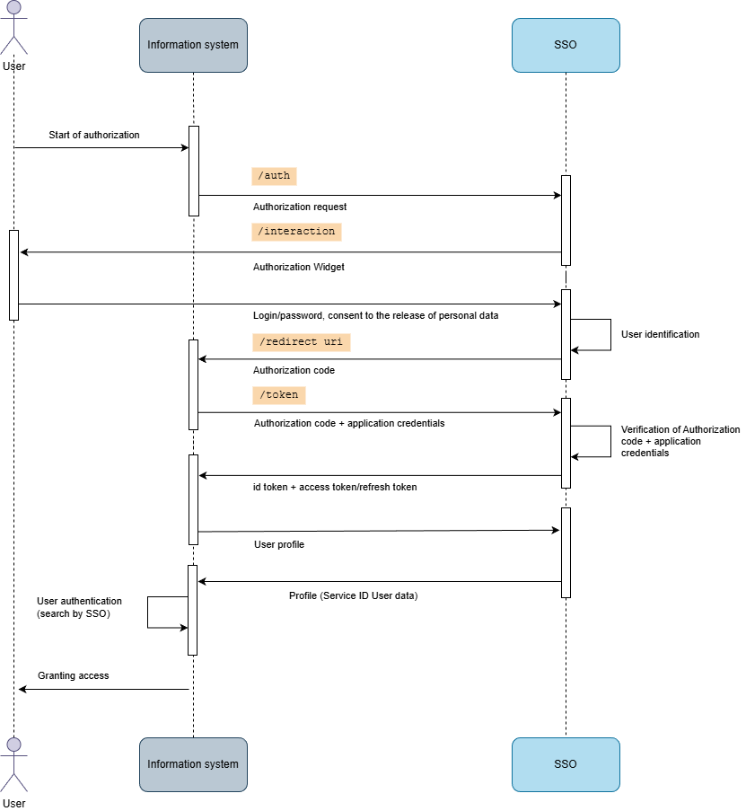

# Présentation de Encvoy ID — Système d'authentification unique (SSO)

**Encvoy ID** est un système de Single Sign-On (SSO) pour l'authentification centralisée des utilisateurs et la gestion des accès aux applications d'entreprise.

Le système fournit une authentification centralisée sécurisée avec prise en charge du SSO, d'OAuth 2.0, d'OpenID Connect et de l'authentification à deux facteurs.

---

## Cas d'utilisation de Encvoy ID

**Encvoy ID** est un système conçu pour organiser la connexion centralisée des utilisateurs aux ressources d'information de l'entreprise à l'aide d'un compte unique.

**Encvoy ID** s'adresse aux entreprises qui nécessitent :

- Une **fenêtre de connexion unique** pour les services internes et externes
- Une **gestion centralisée des accès** pour différentes catégories d'utilisateurs (employés, prestataires, clients)
- Une **sécurité renforcée** avec la prise en charge de l'authentification multi-facteurs
- Un **contrôle et un audit stricts** des actions des utilisateurs
- Une **intégration sécurisée** de multiples applications avec différents systèmes d'authentification

---

## Fonctionnalités clés de Encvoy ID

### 1. Authentification et connexion

Le système fournit une authentification centralisée et prend en charge plusieurs protocoles et méthodes d'authentification.

#### Protocoles pris en charge

- **OpenID Connect (OIDC)** — authentification de l'utilisateur et transmission des données d'identité
- **OAuth 2.0** — autorisation et gestion de l'accès aux ressources

#### Méthodes d'authentification

- **Méthodes de base** : identifiant et mot de passe, e-mail
- **Fournisseurs d'Identité externes** : réseaux sociaux, systèmes d'entreprise de confiance et autres services
- **Méthodes améliorées et sans mot de passe :** authentification cryptographique via **mTLS** (certificats clients) et **WebAuthn** (biométrie, clés matérielles), ainsi que les mots de passe à usage unique **TOTP/HOTP**.

#### Authentification à deux facteurs (2FA / MFA)

**Encvoy ID** prend en charge l'authentification multi-facteurs (MFA), où l'accès n'est accordé qu'après une vérification réussie de l'identité de l'utilisateur par plusieurs facteurs indépendants (connaissance, possession, biométrie).

### 2. Gestion des applications et des utilisateurs

- **Création et configuration d'applications :** applications web, applications mobiles natives
- **Personnalisation du widget :** branding du widget d'authentification externe pour correspondre au style de l'entreprise
- **Gestion des utilisateurs :** inscription, édition, blocage, changement de mot de passe

### 3. Sécurité et audit

- **Différenciation des droits d'accès**
- **Journalisation détaillée** de tous les événements et actions

### 4. Mini-widget

Un composant JavaScript léger qui offre un accès rapide aux fonctions d'authentification et aux informations utilisateur. Il s'intègre facilement dans n'importe quel site web ou interface, permettant des transitions vers le profil, le tableau de bord de l'organisation et les applications.

### Niveaux d'accès

Le système propose un modèle d'accès flexible basé sur les rôles :

| Rôle                           | Permissions                                                                        | Destiné à                                    |
| :----------------------------- | :--------------------------------------------------------------------------------- | :------------------------------------------- |
| **Service Administrateur**     | Accès complet à toutes les applications, utilisateurs et paramètres globaux        | Administrateurs système, super-utilisateurs  |
| **Gestionnaire**               | Gestion des applications et des méthodes de connexion pour leur organisation/unité | Chefs de département, chefs de projet        |
| **Application Administrateur** | Gestion d'applications spécifiques et de leurs utilisateurs                        | Développeurs, administrateurs d'applications |
| **Membre**                     | Gestion de leur propre profil et des permissions d'accès aux données personnelles  | Utilisateurs réguliers, employés             |

### Modules du système Encvoy ID

#### 1. Profil

Le module "Profil" permet la gestion des données personnelles de l'utilisateur et des paramètres d'accès. Il comprend des fonctions pour modifier les informations personnelles, les paramètres de confidentialité, gérer les autorisations des applications et consulter le journal d'activité. Le module donne également accès au catalogue public des applications.

#### 2. Tableau de bord d'administration (Admin Dashboard)

Le module "Tableau de bord d'administration" est conçu pour la gestion centralisée du système **Encvoy ID**. Il comprend des fonctions pour configurer les paramètres globaux du système, les méthodes d'authentification et l'apparence de la page de connexion. Dans ce module, vous pouvez gérer les applications et les comptes utilisateurs, ainsi que surveiller leur activité via un journal d'événements unifié.

#### 3. Tableau de bord de l'organisation (Organization Dashboard)

Le module "Tableau de bord de l'organisation" permet de gérer les applications, les méthodes d'authentification et les politiques d'accès au sein d'une organisation. Il comprend le paramétrage de l'organisation, la configuration des méthodes de connexion, la gestion des applications de l'organisation et le suivi de l'activité des utilisateurs.

#### 4. Tableau de bord de l'application (ADM)

Le module "Tableau de bord de l'application" est destiné à l'administration d'applications individuelles. Il contient des fonctions pour gérer les applications assignées et surveiller l'activité des utilisateurs ayant accès à ces applications.

---

## Concept et principes de fonctionnement de Encvoy ID

### Schéma général d'interaction

**Séquence d'interaction :**

1. **Demande d'accès** — l'utilisateur accède au système d'information (SI).
2. **Vérification dans la DB du SI** — le système vérifie l'existence de l'utilisateur.
3. **Redirection vers le Widget** — l'utilisateur est dirigé vers **Encvoy ID**.
4. **Authentification** — l'utilisateur suit la procédure de connexion.
5. **Vérification dans la DB Encvoy ID** — validation des identifiants.
6. **Fourniture du profil** — retour des données utilisateur.
7. **Mappage dans le SI** — recherche de l'utilisateur basée sur les données de **Encvoy ID**.
8. **Vérification des droits** — autorisation dans le système cible.
9. **Accès accordé** — connexion réussie au système.

> 📌 **Conditions d'intégration :** Pour connecter un système d'information à **Encvoy ID**, une base de données utilisateurs et un module d'autorisation prenant en charge OpenID Connect ou OAuth 2.0 sont requis.

### Schéma d'autorisation OpenID Connect

**Étapes clés d'OIDC :**

1. L'utilisateur accède au SI.
2. Le SI (client) génère `code_verifier` et `code_challenge`.
3. Le SI redirige l'utilisateur vers `/authorize` dans **Encvoy ID**.
4. L'utilisateur est redirigé vers le widget d'autorisation **Encvoy ID**.
5. L'utilisateur saisit son identifiant/mot de passe et donne son consentement pour le transfert de données.
6. La vérification de l'utilisateur est effectuée dans la DB **Encvoy ID**.
7. L'utilisateur est redirigé vers le SI (client) avec un `Authorization code`.
8. Le SI envoie une requête à `/token` dans **Encvoy ID**.
9. Vérification du `code_challenge` et du `code_verifier` dans **Encvoy ID**.
10. Fourniture de l'`id token` contenant le profil utilisateur **Encvoy ID** et de l'`access token` (éventuellement un `refresh token`) au SI.
11. Authentification de l'utilisateur dans le SI.
12. L'utilisateur accède au SI.

### Schéma d'autorisation OAuth 2.0

**Caractéristiques du flux OAuth 2.0 :**

1. L'utilisateur accède au SI.
2. Le SI redirige l'utilisateur vers `/authorize` dans **Encvoy ID**.
3. L'utilisateur est redirigé vers le widget d'autorisation **Encvoy ID**.
4. L'utilisateur saisit son identifiant/mot de passe et donne son consentement pour le transfert de données.
5. La vérification de l'utilisateur est effectuée dans la DB **Encvoy ID**.
6. **Encvoy ID** redirige l'utilisateur vers le SI avec un `Authorization code` vers l'`Redirect_URI`.
7. Le SI envoie une demande de `token` en utilisant l'`Authorization code`.
8. **Encvoy ID** valide la requête.
9. **Encvoy ID** renvoie l'`id token` et l'`access token` (éventuellement un `refresh token`).
10. Le SI demande le profil utilisateur.
11. **Encvoy ID** fournit le profil utilisateur.
12. Le SI valide les réponses et établit une session utilisateur locale.
13. L'utilisateur accède au SI.

### Schéma d'authentification unique (SSO)

**Scénario typique :**

1. Demande d'accès au SI1.
2. Authentification de l'utilisateur dans **Encvoy ID**.
3. Fourniture du profil utilisateur **Encvoy ID** au SI1.
4. Demande d'accès au SI2.
5. Fourniture du profil utilisateur **Encvoy ID** au SI2 sans répéter la procédure d'authentification.

> 🚀 **Prêt à commencer ?** Consultez le [guide d'installation du système](./docs-02-box-system-install.md).

---

## Voir aussi

- [Installation du système Encvoy ID](./docs-02-box-system-install.md) — un guide pour installer le système.
- [Variables d'environnement Encvoy ID](./docs-03-box-system-configuration.md) — un guide pour préparer la configuration avant le lancement.
- [Configuration du système](./docs-04-box-system-settings.md) — un guide pour configurer l'interface et l'accès des utilisateurs au système.
