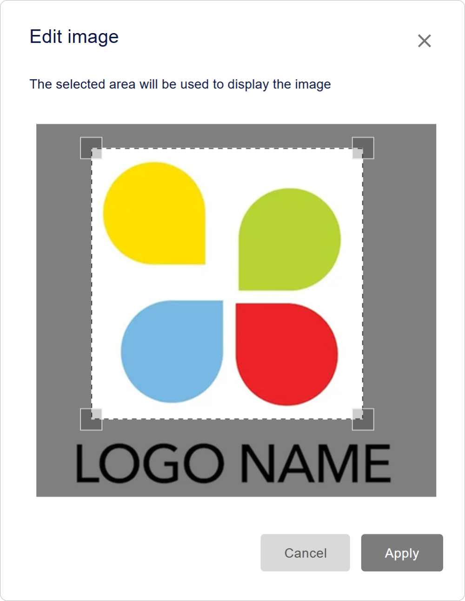
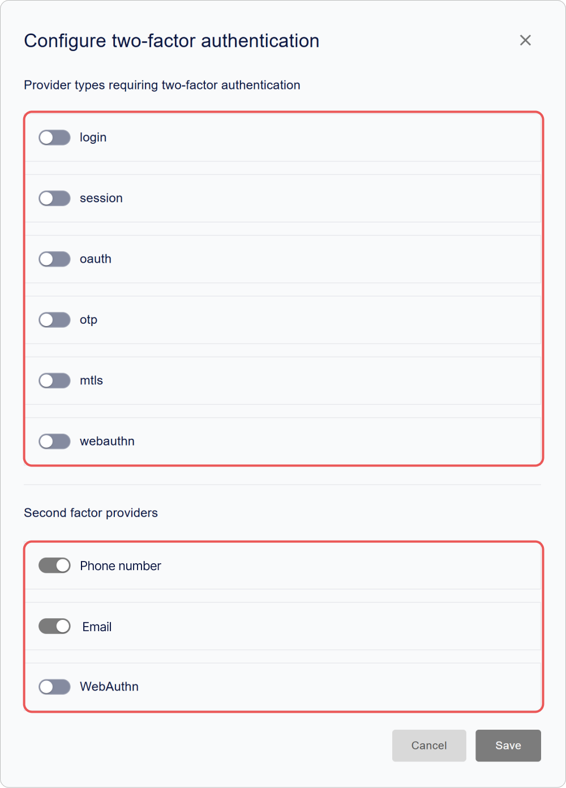

# Comment configurer {{projectName}} : Sécurité, Interface et Accès

Dans ce guide, vous apprendrez à configurer l'interface et la localisation de **{{projectName}}**, à créer des types d'applications, à gérer l'accès des utilisateurs, à activer l'authentification à deux facteurs et à intégrer le service avec Sentry pour la surveillance des événements.

Cette section est destinée aux administrateurs et aux spécialistes de la sécurité qui souhaitent gérer efficacement les paramètres de **{{projectName}}**, y compris OAuth 2.0 et OpenID Connect.

**Table des matières :**

- [Configuration de l'interface et de la localisation](#interface-and-localization)
- [Sécurité et accès](#security-and-access)
- [Types d'applications](#application-types)
- [Fonctionnalités expérimentales](#experimental-features)
- [Voir aussi](#see-also)

> 💡 Les paramètres du système se trouvent dans le panneau d'administration. Pour accéder au panneau, le rôle de service **Administrateur** est requis. [Comment ouvrir le panneau d'administration →](./docs-02-box-system-install.md#admin-panel-access)

---

## Configuration de l'interface et de la localisation { #interface-and-localization }

> 💡 La personnalisation des couleurs, des polices et de l'apparence des éléments de l'interface est disponible via la variable `CUSTOM_STYLES` dans le fichier `.env`. Plus de détails dans la section [Variables d'environnement](./docs-03-box-system-configuration.md#interface-customization).

### Configuration du nom du système et du logo { #system-name-and-logo }

Le nom et le logo sont affichés dans l'interface de **{{projectName}}**, ainsi que dans le [mini-widget](./docs-09-common-mini-widget-settings.md) et le [widget de connexion](./docs-06-github-en-providers-settings.md#login-widget-settings).

Pour configurer le nom et le logo :

1. Allez dans le panneau d'administration → onglet **Paramètres**.
2. Développez le bloc **Informations principales**.

    

3. Saisissez le nouveau nom dans le champ **Nom de l'application**.
4. Dans le bloc **Logo de l'application**, cliquez sur **Charger** et sélectionnez le fichier du logo.

    

    > ⚡ Formats supportés : JPG, GIF, PNG, WEBP ; taille maximale 1 Mo.

5. Configurez l'affichage et cliquez sur **Appliquer**.

    

6. Cliquez sur **Enregistrer**.

> 💡 **Conseil :** Utilisez le format SVG pour un logo vectoriel afin de garantir un affichage net sur tous les appareils et résolutions d'écran.

### Configuration de la localisation

**{{projectName}}** prend en charge l'interface dans **six langues** :

- Russe (ru)
- Anglais (en)
- Français (fr)
- Espagnol (es)
- Allemand (de)
- Italien (it)

La langue sélectionnée affecte l'affichage du texte dans toutes les interfaces de **{{projectName}}**, y compris le [widget de connexion](./docs-06-github-en-providers-settings.md#login-widget-settings) et le [mini-widget](./docs-09-common-mini-widget-settings.md).

Si vous utilisez des [champs de profil utilisateur supplémentaires](./docs-05-box-userfields-settings.md#additional-profile-fields) et des [modèles d'e-mail](./docs-04-box-system-settings.md#email-notification-templates), assurez-vous qu'ils s'affichent correctement.

#### Comment changer la langue de l'interface

1. Allez dans le panneau d'administration → onglet **Paramètres**.
2. Développez le bloc **Localisation** et sélectionnez la langue requise dans la liste.

    

3. Cliquez sur **Enregistrer**.

Le changement de langue s'effectuera automatiquement, sans redémarrer le service ni rafraîchir la page.

> 🚨 **Attention :** Après avoir changé la langue, tous les textes de l'interface, y compris les messages système et les notifications, seront affichés dans la langue sélectionnée. Assurez-vous que vos utilisateurs comprennent la langue choisie.

### Configuration des modèles de notification par e-mail { #email-notification-templates }

Les **modèles d'e-mail** sont des préréglages d'e-mails contenant un formatage et des éléments de conception prédéfinis. Ils sont utilisés pour créer des notifications automatiques, telles que les e-mails d'inscription, la récupération de mot de passe et d'autres événements.

#### Qu'est-ce que Mustache ?

**Mustache** est un moteur de template simple pour insérer des données dans des modèles de texte. Dans **{{projectName}}**, il est utilisé pour :

- L'insertion de données utilisateur (`{{user.name}}`),
- La génération de liens dynamiques (`{{confirmation_link}}`),
- L'affichage de blocs conditionnels.

> 🔗 [Documentation officielle de Mustache](https://mustache.github.io/)

#### Types d'e-mails disponibles

| Type d'e-mail | Événement | Objectif |
|------------|------------|------------|
| Inscription | `account_create` | E-mail de bienvenue pour un nouvel utilisateur |
| Code de confirmation | `confirmation_code` | E-mail avec un code de vérification |
| Lien de confirmation | `confirmation_link` | E-mail avec un lien de vérification |
| Changement de mot de passe | `password_change` | Notification de changement de mot de passe |
| Demande de récupération de mot de passe | `password_recover` | E-mail avec un code de vérification |
| Invitation | `invite` | E-mail d'invitation à une application |

#### Comment configurer un modèle

1. Allez dans le panneau d'administration → onglet **Paramètres**.
2. Trouvez le bloc **Modèles d'e-mails** et cliquez sur **Configurer**.
3. Sélectionnez le modèle requis et cliquez sur **Configurer**.

    

4. Dans le formulaire d'édition qui s'ouvre, spécifiez :

    - **Nom du modèle**,
    - **Objet de l'e-mail**,
    - **Contenu de l'e-mail**.

    > 💡 Utilisez le balisage HTML et les variables au format `{{variable_name}}`. Assurez-vous que les variables utilisées correspondent aux [champs de profil utilisateur](./docs-05-box-userfields-settings.md#basic-profile-fields) disponibles pour éviter les erreurs lors de l'envoi de l'e-mail.

    

5. Cliquez sur **Enregistrer**.

---

## Sécurité et accès { #security-and-access }

### Paramètres d'accès { #access-settings }

#### Authentification à deux facteurs { #two-factor-authentication }

L'authentification à deux facteurs (2FA) ajoute une couche de protection supplémentaire lors de la connexion. Après avoir saisi le premier facteur (identifiant/mot de passe ou autre méthode d'authentification), l'utilisateur doit confirmer son identité avec un second facteur (téléphone, e-mail, WebAuthn).

##### Comment configurer l'authentification à deux facteurs

1. Allez dans le panneau d'administration → onglet **Paramètres**.
2. Développez le bloc **Paramètres d'accès** et cliquez sur **Configurer**.

    

3. Spécifiez les fournisseurs de premier et second facteur :

    - Fournisseur du **premier facteur** — la méthode d'authentification principale (identifiant/mot de passe ou autre méthode d'authentification).
    - Fournisseur du **second facteur** — la méthode de confirmation d'identité (téléphone, e-mail, WebAuthn).

    

4. Cliquez sur **Enregistrer**.

#### Ignorer les champs de profil obligatoires lors de la connexion à l'application

Certains champs de profil utilisateur (ex: téléphone, e-mail, etc.) peuvent être marqués comme obligatoires dans le profil personnel.

Par défaut, lors de l'autorisation dans les applications, **{{projectName}}** vérifie la présence de tous les champs obligatoires et peut suspendre la connexion jusqu'à ce que l'utilisateur remplisse les données manquantes. Le paramètre **Ignorer les champs obligatoires du profil de l'espace personnel pour les applications** vous permet de désactiver cette vérification.

Cela peut être utile si l'organisation utilise des sources de données utilisateur externes et ne nécessite pas de complétion manuelle du profil.

##### Ce qui se passe lorsque activé

- Les utilisateurs pourront s'autoriser dans les applications même si leur profil personnel n'est pas entièrement complété.
- La vérification des champs obligatoires ne sera pas effectuée.
- Les notifications concernant les champs incomplets seront toujours affichées dans l'interface du profil personnel.

##### Comment activer le paramètre

1. Allez dans le panneau d'administration → onglet **Paramètres**.
2. Développez le bloc **Paramètres d'accès**.
3. Activez le commutateur **Ignorer les champs obligatoires du profil de l'espace personnel pour les applications**.
4. Cliquez sur **Enregistrer**.

Après avoir appliqué le paramètre, les utilisateurs pourront passer l'autorisation sans vérification des champs de profil obligatoires.

> 💡 **Recommandation** : Activez cette option uniquement si l'exhaustivité du profil est contrôlée par d'autres moyens.

#### Interdiction de liaison d'identifiant

Ce paramètre empêche les utilisateurs de lier indépendamment de nouveaux identifiants externes à leur profil via le widget de connexion.

Pour interdire la liaison :

1. Allez dans le panneau d'administration → onglet **Paramètres**.
2. Développez le bloc **Paramètres d'accès**.
3. Activez le bouton **Interdire la liaison d'identifiants sur le formulaire du widget**.
4. Cliquez sur **Enregistrer**.

#### Restrictions d'accès

Ce paramètre permet de restreindre la connexion aux applications pour tous les utilisateurs sauf le service **Administrateur**. Tous les autres utilisateurs ne pourront pas s'autoriser.

> 🚨 **Important :** Lorsque la restriction d'accès est activée, tous les utilisateurs sauf les administrateurs système perdront la possibilité de se connecter. Utilisez ce paramètre pour la maintenance ou les situations d'urgence.

Pour restreindre l'accès :

1. Allez dans le panneau d'administration → onglet **Paramètres**.
2. Développez le bloc **Paramètres d'accès**.
3. Activez le bouton **Accès restreint pour toutes les applications**.
4. Cliquez sur **Enregistrer**.

#### Interdiction d'inscription

Ce paramètre permet d'interdire la création de nouveaux comptes dans le widget de connexion.

Pour configurer l'interdiction d'inscription :

1. Allez dans le panneau d'administration → onglet **Paramètres**.
2. Développez le bloc **Paramètres d'accès**.
3. Sélectionnez le paramètre requis :

    - **Inscription interdite** — bloque complètement la création de nouveaux comptes.
    - **Inscription autorisée** (par défaut) — mode de fonctionnement standard, les utilisateurs peuvent créer des comptes indépendamment.

4. Cliquez sur **Enregistrer**.

### Paramètres techniques

Les paramètres techniques tels que les identifiants clients, les paramètres de sécurité, les URL d'autorisation, les méthodes d'authentification client, les paramètres de jeton et autres se trouvent dans la section **Paramètres de l'application**.

Vous trouverez ci-dessous les paramètres modifiables dans le panneau d'administration. Les autres paramètres sont modifiés via le [fichier de configuration](./docs-03-box-system-configuration.md).

Pour modifier les paramètres dans le panneau d'administration :

1. Allez dans le panneau d'administration → onglet **Paramètres**.
2. Développez le bloc **Paramètres de l'application**.
3. Configurez les paramètres :

    - [Restriction d'accès](#access-settings)
    - [Temps d'authentification](#authentication-time)
    - [Jeton d'accès](#access-token)
    - [Jeton de rafraîchissement](#refresh-token)

4. Cliquez sur **Enregistrer**.

### Descriptions des paramètres

#### Identifiants principaux

| Nom | Paramètre | Description |
|----------|----------|----------|
| **Identifiant (client_id)** | `client_id` | Identifiant unique de l'application |
| **Clé secrète (client_secret)** | `client_secret` | Clé confidentielle de l'application |
| **Adresse de l'application** | - | URL de base du service **{{projectName}}** au format `protocole://nom_domaine:port` |

#### Restriction d'accès

Restreint la connexion au profil personnel uniquement aux utilisateurs ayant des rôles administratifs.

| Nom | Description |
|-------|----------|
| **Accès restreint** | Si activé, l'accès au profil personnel sera autorisé uniquement aux utilisateurs disposant des droits de service **Administrateur** |

#### URL de redirection

| Nom | Paramètre | Description |
|-------|----------|----------|
| **URL de redirection #** | `Redirect_uri` | URL vers laquelle l'utilisateur sera redirigé après une authentification réussie |

#### URL de déconnexion

| Nom | Paramètre | Description |
|-------|----------|----------|
| **URL de déconnexion #** | `post_logout_redirect_uri` | URL vers laquelle le service redirigera l'utilisateur après sa déconnexion. Si aucune valeur n'est spécifiée, `Redirect_uri` est utilisé. |

#### URL de demande d'authentification

| Nom | Paramètre | Description |
|-------|----------|----------|
| **URL de requête d'authentification ou de récupération après authentification #** | `request_uris` | Liste d'URL pour l'hébergement des demandes d'autorisation JWT (`Request Object`). Le serveur récupère le JWT à partir de l'URL spécifiée lors de l'autorisation. |

#### Types de réponse

| Nom | Paramètre | Description |
|-------|----------|----------|
| **Type de réponses (response_types)** | `response_types` | 
 Détermine quels jetons et codes sont renvoyés par le serveur d'autorisation :
 
 - `code` — code d'autorisation uniquement  - `id_token` — jeton ID uniquement   - `code id_token` — code + jeton ID   - `code token` — code + jeton d'accès   - `code id_token token` — code + jeton ID + jeton d'accès   - `none` — confirmation d'authentification uniquement 
 |

#### Types d'octroi (Grant Types)

| Nom | Paramètre | Description |
|-------|----------|----------|
| **Types d'octroi d'accès (grant_types)** | `grant_types` | 
 Méthodes d'obtention de l'autorisation : 
 - `authorization code` — code sécurisé via le serveur client (recommandé) ;   - `implicit` — acquisition directe de jeton (pour les clients publics)   - `refresh_token` — renouvellement de jeton sans reconnexion |

#### Méthode d'authentification client

> 💡 Le choix de la méthode dépend des exigences de sécurité et des capacités du client. Les méthodes JWT offrent une sécurité accrue car elles ne transmettent pas le secret directement.

| Nom | Paramètre | Description |
| ---- | ---- | ---- |
| **Authentification client** | `token_endpoint_auth_method`, `introspection_endpoint_auth_method`, `revocation_endpoint_auth_method` | 
 Détermine la méthode d'authentification du client lors de l'accès à divers points de terminaison (`token`, `introspection`, `revocation`). 
 Méthodes disponibles :   - `none` — pas d'identifiants ;  - `client_secret_post` — identifiants dans le corps de la requête ;  - `client_secret_basic` — Authentification HTTP Basic ;  - `client_secret_jwt` — JWT signé avec le secret client ;  - `private_key_jwt` — JWT signé avec la clé privée du client.
 |

#### Algorithme de signature du jeton ID

| Nom | Paramètre | Description |
|-------|----------|----------|
| **Algorithme de signature utilisé lors de la création d'un ID-token signé (id_token_signed_response_alg)** | `id_token_signed_response_alg` | 
 Spécifie l'algorithme utilisé pour signer le jeton ID. 
 Le `ID token` est un JSON Web Token (JWT) qui contient des revendications sur l'authentification de l'utilisateur |

#### Temps d'authentification { #authentication-time }

| Nom | Paramètre | Description |
|-------|----------|----------|
| **Vérification de la présence de l'heure d'authentification (require_auth_time)** | `require_auth_time` | Si activé, `auth_time` (l'heure de la dernière authentification de l'utilisateur) est ajouté au jeton ID |

#### Paramètres de sécurité supplémentaires

| Nom | Paramètre | Description |
|-------|----------|----------|
| Paramètre pour assurer la sécurité de la transmission des données entre le client et le serveur d'autorisation | `require_signed_request_object` | 
Spécifie si un `Request Object` signé est requis lors de l'envoi d'une demande d'autorisation.
 Le `Request Object` est un moyen de transmettre en toute sécurité des paramètres d'autorisation du client au serveur d'autorisation, généralement sous la forme d'un JWT (JSON Web Token).
 
Lorsque `require_signed_request_object` est activé, le client doit signer le `Request Object` en utilisant un algorithme de signature convenu à l'avance et spécifié dans la configuration du client.
 |

#### Type de transmission de l'identifiant utilisateur

| Nom | Paramètre | Description |
|-------|----------|----------|
| **Méthode de transmission de l'ID utilisateur dans le jeton d'identification (subject_type)** | `subject_type` | Détermine comment la revendication `sub` est formée dans le jeton ID : 
 - `public` — le même identifiant pour tous les clients   - `pairwise` — un identifiant unique pour chaque client, améliorant la confidentialité 
 |

#### Jeton d'accès { #access-token }

| Nom | Paramètre | Description |
|-------|----------|----------|
| **Jeton d'accès (access_token_ttl)** | `access_token_ttl` | Durée de vie de l'`access_token` en secondes |

#### Jeton de rafraîchissement { #refresh-token }

| Nom | Paramètre | Description |
|-------|----------|----------|
| **Jeton de renouvellement (refresh_token_ttl)** | `refresh_token_ttl` | Durée de vie du `refresh_token` en secondes |

### Connexion à Sentry

**Sentry** est une plateforme de surveillance des erreurs et des performances des applications.

> 📚 [Ressource officielle Sentry](https://sentry.io/welcome/)

La connexion à **Sentry** vous permet de :

- suivre les erreurs et les exceptions en temps réel ;
- obtenir des traces d'événements par utilisateur ;
- analyser les performances du système.

#### Comment connecter Sentry

##### Étape 1. Création d'un projet dans Sentry

1. Allez sur le site [Sentry.io](https://sentry.io/welcome/).
2. Inscrivez-vous ou connectez-vous à votre compte.
3. Créez un nouveau projet.

Après avoir créé le projet, **Sentry** fournira un **DSN (Data Source Name)** — un identifiant unique pour connecter **{{projectName}}** à **Sentry**.

> 💡 **Conseil** : Copiez le **DSN (Data Source Name)** pour ne pas le perdre lors du passage à l'étape suivante.

##### Étape 2. Connexion de Sentry

Pour connecter **Sentry** :

1. Allez dans le panneau d'administration → onglet **Paramètres**.
2. Trouvez le bloc **Sentry** et cliquez sur **Configurer**.
3. Dans le formulaire de connexion qui s'ouvre, spécifiez :

    - **DSN** — l'identifiant unique créé à l'**Étape 1**.
    - **Activité** — activez pour commencer à envoyer les erreurs et les traces à **Sentry**.
    - **ID utilisateur** (si nécessaire) — spécifiez si vous devez suivre les erreurs et les événements par utilisateurs spécifiques.

      

4. Cliquez sur **Enregistrer**.

### Journal d'événements

Dans le **Journal**, vous pouvez voir où et depuis quels appareils les utilisateurs ont accédé au profil personnel ou aux applications.

Des informations détaillées sont disponibles pour chaque événement.

| Paramètre | Contenu |
|----------|--------------|
| **En-tête de l'événement** | Catégorie d'action |
| **Date et heure** | Horodatages exacts |
| **Application** | Identifiant de l'application (`client_id`) |
| **Utilisateur** | Identifiant de l'utilisateur (`id`) |
| **Appareil** | Type d'appareil et navigateur |
| **Localisation** | Adresse IP |

#### Comment accéder au journal

1. Allez dans le panneau d'administration.
2. Ouvrez l'onglet **Journal**.

---

## Types d'applications { #application-types }

Les **types d'applications** sont des catégories permettant de systématiser les applications dans le **[catalogue](./docs-12-common-personal-profile.md#application-catalog)**. Ils aident à organiser la structure et simplifient la navigation des utilisateurs.

**Pourquoi les types sont nécessaires** :

- Aident à regrouper les applications par catégorie
- Simplifient la recherche des applications requises
- Aident à organiser la structure du catalogue

### Création d'un type d'application { #creating-app-type }

1. Allez dans le panneau d'administration → onglet **Paramètres**.
2. Trouvez le bloc **Types d'applications** et cliquez sur **Configurer**.
3. Dans la fenêtre qui apparaît, cliquez sur le bouton **Créer** .
4. Le formulaire de création s'ouvrira.

    

5. Spécifiez le nom du type.

    > 💡 Le nom du type doit être unique dans le système.

6. Cliquez sur **Enregistrer**.

    Le type créé apparaîtra dans la liste.

> 💡 L'attribution du type est effectuée lors de la [création d'une application](./docs-10-common-app-settings.md#creating-application).

### Édition d'un type d'application

1. Allez dans le panneau d'administration → onglet **Paramètres**.
2. Trouvez le bloc **Types d'applications** et cliquez sur **Configurer**.
3. Une fenêtre avec la liste des types s'ouvrira.

    

4. Cliquez sur le bouton **Configurer** sur le panneau du type que vous souhaitez modifier.
5. Le formulaire d'édition s'ouvrira.
6. Apportez les modifications nécessaires.
7. Cliquez sur **Enregistrer**.

> 💡 Après avoir modifié un type, toutes les applications associées reçoivent automatiquement le nom de catégorie mis à jour.

### Suppression d'un type d'application

1. Allez dans le panneau d'administration → onglet **Paramètres**.
2. Trouvez le bloc **Types d'applications** et cliquez sur **Configurer**.
3. Une fenêtre avec la liste des types s'ouvrira.
4. Cliquez sur le bouton **Supprimer**  sur le panneau du type que vous souhaitez supprimer.

La suppression s'effectue sans confirmation supplémentaire.

> 💡 Après la suppression, le type sera retiré du catalogue et les applications qui lui étaient attribuées recevront automatiquement le type **Autre**.

---

## Fonctionnalités expérimentales { #experimental-features }

Les **fonctionnalités expérimentales** sont de nouvelles capacités du service **{{projectName}}** qui sont en phase de test et d'amélioration.

**Caractéristiques principales :**

- Régulées par l'administrateur du service
- La fonctionnalité peut changer sans préavis
- Peuvent contenir des caractéristiques de fonctionnement non documentées
- Les performances et la stabilité peuvent différer des fonctionnalités de base

La section des fonctionnalités expérimentales est disponible à l'adresse : `https://ID_HOST/experimental`.

> 🚧 **Statut** : Les fonctionnalités expérimentales peuvent être supprimées, modifiées ou déplacées vers les fonctionnalités de base sans préavis.

#### Fonctionnalités disponibles

1. **Carte de visite utilisateur**

    - Analogue numérique d'une carte de visite avec les coordonnées
    - Prise en charge du format vCard pour l'exportation
    - Possibilité de partager via un lien ou un code QR

    [En savoir plus sur la carte de visite →](./docs-12-common-personal-profile.md#digital-business-card)

2. **Catalogue d'applications**

    - Plateforme centralisée pour les applications du système **{{projectName}}**
    - Dispose d'un système de catégories pratique
    - Possibilité d'ajouter des applications aux favoris

    [En savoir plus sur le catalogue →](./docs-12-common-personal-profile.md#application-catalog)

    

---

## Voir aussi { #see-also }

- [Configuration de la politique de mot de passe et du profil utilisateur](./docs-05-box-userfields-settings.md) — guide pour la configuration des profils utilisateurs.
- [Méthodes de connexion et configuration du widget de connexion](./docs-06-github-en-providers-settings.md) — guide pour connecter et configurer les services d'authentification externes.
- [Gestion des applications](./docs-10-common-app-settings.md) — guide pour créer, configurer et gérer les applications OAuth 2.0 et OpenID Connect (OIDC).