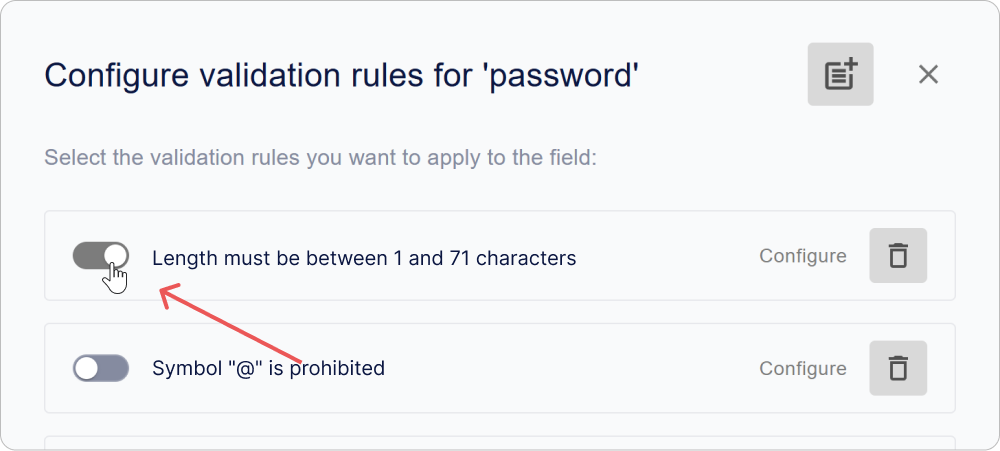
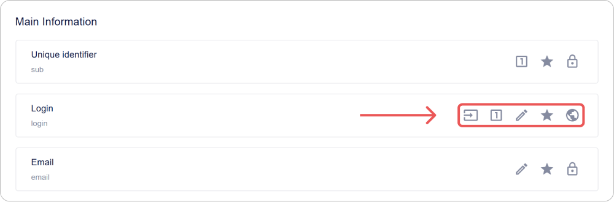
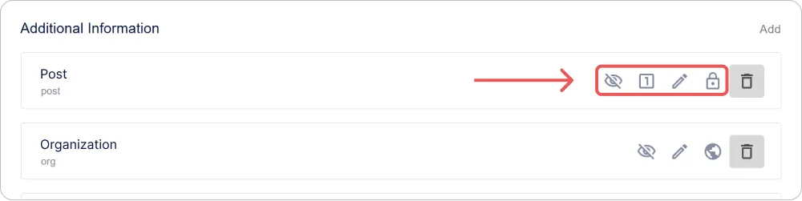
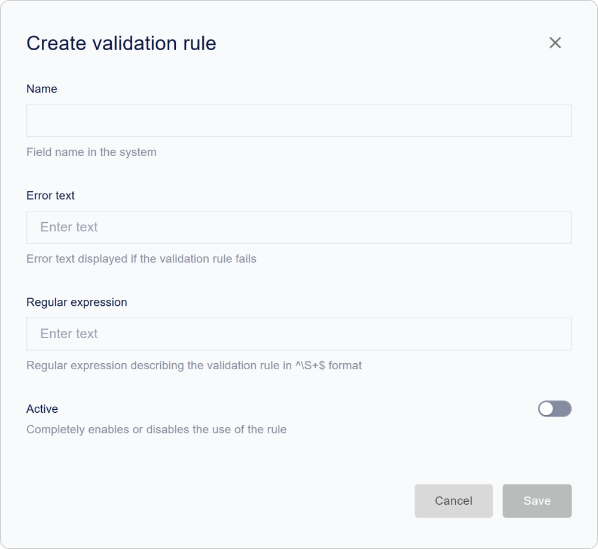
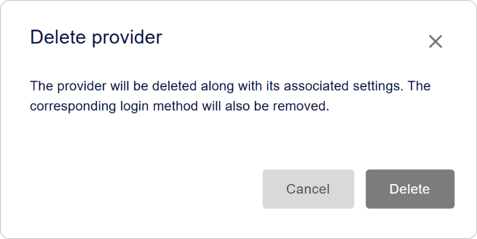

# Comment configurer le profil utilisateur Encvoy ID

Dans ce guide, nous expliquerons comment configurer le profil utilisateur et la politique de mot de passe dans **Encvoy ID**. Vous apprendrez à gérer les champs de profil, la validation des champs et à configurer la confirmation de l'adresse e-mail et du numéro de téléphone.

**Table des matières :**

- [Politique de mot de passe](#password-policy)
- [Champs de profil de base](#basic-profile-fields)
- [Champs de profil supplémentaires](#additional-profile-fields)
- [Règles de validation des champs de profil et du mot de passe](#validation-rules)
- [Paramètres de confirmation d'e-mail](#email-confirmation-settings)
- [Paramètres de confirmation de numéro de téléphone](#phone-confirmation-settings)
- [Voir aussi](#see-also)

> 📌 Les paramètres du profil utilisateur se trouvent dans le panneau d'administration. Pour accéder au panneau, le rôle de service **Administrateur** est requis. [Comment ouvrir le panneau d'administration →](./docs-02-box-system-install.md#admin-panel-access)

---

## Politique de mot de passe { #password-policy }

La **politique de mot de passe dans Encvoy ID** est un ensemble de règles définissant les exigences de complexité et de sécurité des mots de passe des utilisateurs. Elle aide à protéger les comptes contre le piratage et les accès non autorisés.

Les règles établies sont appliquées :

- lors de la création d'un mot de passe dans le widget d'inscription,
- lors de la réinitialisation d'un mot de passe dans le widget de connexion,
- lors du changement de mot de passe dans le profil utilisateur.

### Comment configurer les règles de la politique de mot de passe

1. Allez dans le panneau d'administration → onglet **Paramètres**.
2. Développez le bloc **Configuration du profil utilisateur** et cliquez sur le panneau **Mot de passe**.

3. Dans la fenêtre qui apparaît, cliquez sur **Configurer**.

4. Une fenêtre avec une liste des règles de validation disponibles s'ouvrira.

   > 🔗 Pour plus d'informations sur la création et la configuration des règles de validation des champs de profil, lisez les instructions [Règles de validation des champs de profil utilisateur](#validation-rules).

5. Cochez les cases des règles que vous souhaitez appliquer au mot de passe.

6. Fermez la fenêtre de la liste des règles.
7. Cliquez sur **Enregistrer** dans le formulaire d'édition du champ.

Les modifications sont appliquées automatiquement.

Désormais, les règles que vous avez sélectionnées seront utilisées pour vérifier la complexité du mot de passe de l'utilisateur.

> ⚠️ **Note** : Les nouvelles règles s'appliquent uniquement aux mots de passe en cours de création ou de modification. Les mots de passe existants restent inchangés.

### Recommandations de sécurité

Pour assurer une protection robuste des comptes, il est recommandé d'activer les paramètres suivants :

| Recommandation                                            | Exemple de règle                              |
| --------------------------------------------------------- | --------------------------------------------- |
| Longueur minimale du mot de passe — au moins 8 caractères | `Minimum length = 8`                          |
| Utilisation de différentes casses                         | `Contains lowercase and uppercase characters` |
| Présence obligatoire de chiffres                          | `Contains at least one digit`                 |
| Présence obligatoire de caractères spéciaux               | `Contains special characters (!@#$% etc.)`    |

---

## Champs de profil utilisateur de base { #basic-profile-fields }

Les **champs de profil de base** sont des attributs système obligatoires créés automatiquement pour chaque utilisateur lors de l'inscription. Ils forment la structure de base du profil et assurent le bon fonctionnement des mécanismes d'authentification, d'identification et de communication inter-systèmes.

### Liste des champs de base

> 📌 La liste des champs de base est fixe. L'ajout, le renommage ou la suppression de ces champs n'est pas disponible.

| Champ                            | Identifiant                 |
| -------------------------------- | --------------------------- |
| Identifiant                      | `sub`                       |
| Identifiant de connexion         | `login`                     |
| E-mail                           | `email`                     |
| Prénom                           | `given_name`                |
| Nom de famille                   | `family_name`               |
| Téléphone                        | `phone_number`              |
| Date de naissance                | `birthdate`                 |
| Pseudonyme                       | `nickname`                  |
| Photo                            | `picture`                   |
| Accord de traitement des données | `data_processing_agreement` |

### Indicateurs de paramètres

Dans l'interface, une vue rapide des paramètres de champ est disponible pour chaque champ sous forme d'identifiants :

| Icône                                                                                | Paramètre                                                         |
| ------------------------------------------------------------------------------------ | ----------------------------------------------------------------- |
|                     | Le champ est disponible pour modification par l'utilisateur       |
|                     | Le champ est obligatoire à remplir                                |
|                             | La valeur du champ doit être unique                               |
|                             | Niveau de publicité du champ                                      |
|  | Le champ peut être utilisé comme identifiant lors de la connexion |

### Comment configurer un champ de base

1. Allez dans le panneau d'administration → onglet **Paramètres**.
2. Développez le bloc **Configuration du profil utilisateur**.
3. Cliquez sur le panneau du champ que vous devez configurer.

" style="max-width:600px; width:100%">

4. Dans le formulaire qui s'ouvre, spécifiez :
   - les [paramètres](#basic-field-parameters),
   - les [règles de validation](#validation-rules).

5. Enregistrez les modifications dans le formulaire d'édition.

### Paramètres des champs de base { #basic-field-parameters }

| Nom                                                   | Description                                                                                                                                                                                                                                                                                                                                                                                                                                                                                                                                                                          |
| ----------------------------------------------------- | ------------------------------------------------------------------------------------------------------------------------------------------------------------------------------------------------------------------------------------------------------------------------------------------------------------------------------------------------------------------------------------------------------------------------------------------------------------------------------------------------------------------------------------------------------------------------------------ |
| **Nom**                                               | Nom du champ. Non modifiable.                                                                                                                                                                                                                                                                                                                                                                                                                                                                                                                                                        |
| **Description du champ**                              | Nom du champ dans l'interface. Non modifiable.                                                                                                                                                                                                                                                                                                                                                                                                                                                                                                                                       |
| **Utiliser comme identifiant**                        | Permet l'autorisation en utilisant ce champ. Disponible pour la configuration dans les champs **Identifiant**, **E-mail**, et **Numéro de téléphone**.                                                                                                                                                                                                                                                                                                                                                                                                                               |
| **Activité**                                          | Détermine la présence obligatoire du champ dans le profil utilisateur. Paramètre immuable.                                                                                                                                                                                                                                                                                                                                                                                                                                                                                           |
| **Modifiable**                                        | Permet à l'utilisateur de modifier la valeur du champ dans son profil.                                                                                                                                                                                                                                                                                                                                                                                                                                                                                                               |
| **Obligatoire**                                       | Nécessite que le champ soit rempli lors de l'inscription ou de la connexion. L'authentification est impossible sans cela.                                                                                                                                                                                                                                                                                                                                                                                                                                                            |
| **Unicité**                                           | Vérifie que la valeur du champ n'est pas répétée sur l'ensemble des profils.                                                                                                                                                                                                                                                                                                                                                                                                                                                                                                         |
| **Publicité**                                         | 
 Détermine qui peut accéder aux données utilisateur : 
 - **Disponible uniquement pour vous** — les données sont privées et accessibles uniquement à l'utilisateur.   - **Disponible sur demande** — les données utilisateur sont disponibles pour les systèmes tiers après leur consentement ;   - **Disponible pour tous** — les données sont toujours publiques pour les systèmes tiers, ne nécessite pas de consentement pour l'accès. Les données seront transmises au système tiers via un hash d'e-mail (similaire au service [Gravatar](https://gravatar.com/)). |
| **Paramètres de confirmation de l'e-mail**            | 
Destiné à configurer les paramètres de confirmation de l'adresse e-mail dans le profil utilisateur.
 🔗 Description détaillée des paramètres dans les instructions [Paramètres de confirmation d'e-mail](./docs-05-box-userfields-settings.md#email-confirmation-settings).                                                                                                                                                                                                                                                                                                    |
| **Paramètres de confirmation du numéro de téléphone** | 
Destiné à configurer les paramètres de confirmation du numéro de téléphone dans le profil utilisateur.
 🔗 Description détaillée des paramètres dans les instructions [Paramètres de confirmation de numéro de téléphone](./docs-05-box-userfields-settings.md#phone-confirmation-settings).                                                                                                                                                                                                                                                                                   |
| **Règles de validation**                              | 
Un ensemble de règles pour vérifier l'exactitude des données saisies.
 🔗 Description détaillée dans les instructions [Configuration des règles de validation](./docs-05-box-userfields-settings.md#validation-rules).                                                                                                                                                                                                                                                                                                                                                         |

---

## Champs de profil utilisateur supplémentaires { #additional-profile-fields }

Les **champs de profil supplémentaires** sont des attributs personnalisés qui peuvent être créés pour stocker des données spécifiques non incluses dans l'ensemble standard.

Ils aident à adapter le profil à des tâches spécifiques :

- stocker des identifiants internes, des titres de poste, des rôles, des départements, etc.
- statuts de vérification des données et autres attributs métier.

### Indicateurs de paramètres

Dans l'interface, une vue rapide des paramètres de champ est disponible pour chaque champ sous forme d'identifiants :

| Icône                                                             | Paramètre                                                   |
| ----------------------------------------------------------------- | ----------------------------------------------------------- |
|  | Le champ est disponible pour modification par l'utilisateur |
|  | Le champ est obligatoire à remplir                          |
|          | La valeur du champ doit être unique                         |
|          | Niveau de publicité du champ                                |
|       | Activité du champ                                           |

### Ajouter un champ supplémentaire

1. Allez dans le panneau d'administration → onglet **Paramètres**.
2. Développez le bloc **Configuration du profil utilisateur**.
3. Cliquez sur le bouton **Ajouter** dans la section **Informations complémentaires**.
4. Dans le formulaire qui s'ouvre, spécifiez :
   - les [paramètres](#additional-field-parameters),
   - les [règles de validation](#validation-rules).

5. Cliquez sur **Enregistrer**.

### Modifier un champ supplémentaire

1. Allez dans le panneau d'administration → onglet **Paramètres**.
2. Développez le bloc **Configuration du profil utilisateur**.
3. Cliquez sur le panneau avec le champ supplémentaire dont les paramètres doivent être modifiés.
4. Dans le formulaire qui s'ouvre, modifiez les paramètres et les règles de validation.
5. Cliquez sur **Enregistrer**.

> 💡 Les modifications prennent effet immédiatement et s'appliquent à tous les profils où ce champ est utilisé.

### Supprimer un champ supplémentaire

1. Allez dans le panneau d'administration → onglet **Paramètres**.
2. Développez le bloc **Configuration du profil utilisateur**.
3. Cliquez sur le bouton **Supprimer**  à côté du champ que vous souhaitez supprimer.

> ⚠️ **Note** : Lorsqu'un champ est supprimé, toutes les données utilisateur qui y sont stockées seront définitivement perdues.

### Paramètres des champs supplémentaires { #additional-field-parameters }

| Nom                      | Description                                                                                                                                                                                                                                                                                                                                                                                                                                                                                                                                                                |
| ------------------------ | -------------------------------------------------------------------------------------------------------------------------------------------------------------------------------------------------------------------------------------------------------------------------------------------------------------------------------------------------------------------------------------------------------------------------------------------------------------------------------------------------------------------------------------------------------------------------- |
| **Description du champ** | Nom du champ dans le système                                                                                                                                                                                                                                                                                                                                                                                                                                                                                                                                               |
| **Activité**             | Détermine si le champ est affiché dans le profil utilisateur                                                                                                                                                                                                                                                                                                                                                                                                                                                                                                               |
| **Modifiable**           | Permet à l'utilisateur de modifier la valeur du champ indépendamment                                                                                                                                                                                                                                                                                                                                                                                                                                                                                                       |
| **Obligatoire**          | Nécessite que le champ soit rempli lors de l'inscription ou de la connexion. Sans champ rempli, l'utilisateur ne pourra pas se connecter.                                                                                                                                                                                                                                                                                                                                                                                                                                  |
| **Unicité**              | Vérifie que la valeur n'est pas répétée sur l'ensemble des profils                                                                                                                                                                                                                                                                                                                                                                                                                                                                                                         |
| **Publicité**            | 
 Configure à qui le champ sera disponible : 
 - **Disponible uniquement pour vous** — les données sont privées et accessibles uniquement à l'utilisateur.   - **Disponible sur demande** — les données utilisateur sont disponibles pour les systèmes tiers après leur consentement ;   - **Disponible pour tous** — les données sont toujours publiques pour les systèmes tiers, ne nécessite pas de consentement pour l'accès. Les données seront transmises au système tiers via un hash d'e-mail (similaire au service [Gravatar](https://gravatar.com/)). |
| **Attribut vCard**       | Permet de mapper le champ à un attribut lors de l'exportation du profil au format vCard                                                                                                                                                                                                                                                                                                                                                                                                                                                                                    |
| **Valeur par défaut**    | Définit une valeur pré-remplie lors de la création d'un profil                                                                                                                                                                                                                                                                                                                                                                                                                                                                                                             |
| **Règles de validation** | 
Définit la logique de vérification de la valeur saisie.
 🔗 Plus de détails dans les instructions [Configuration des règles de validation](./docs-05-box-userfields-settings.md#validation-rules).                                                                                                                                                                                                                                                                                                                                                                   |

---

## Règles de validation des champs de profil et du mot de passe { #validation-rules }

Les **règles de validation de champ** sont un ensemble de vérifications par lesquelles le système évalue l'exactitude des données saisies par l'utilisateur.

Vous pouvez définir vos propres règles pour :

- le mot de passe du compte,
- les [champs de profil de base](#basic-profile-fields),
- les [champs de profil supplémentaires](#additional-profile-fields).

De telles vérifications permettent d'améliorer la qualité des données, par exemple, en empêchant des adresses e-mail incorrectes, des numéros de téléphone erronés ou des mots de passe sans caractères spéciaux.

Les règles de validation définies sont affichées dans l'interface. Par exemple, dans le formulaire d'édition du profil, une icône spéciale apparaît près d'un champ de base ou supplémentaire ; le survol de celle-ci ouvre la liste des règles définies.

### Créer une règle

1. Allez dans le panneau d'administration → onglet **Paramètres**.
2. Développez le bloc **Configuration du profil utilisateur**.
3. Cliquez sur le panneau avec le mot de passe, le champ de base ou supplémentaire.

4. Le formulaire d'édition s'ouvrira.
5. Cliquez sur **Configurer** dans la section **Règles de validation**.

6. Dans la fenêtre de la liste des règles de validation qui s'ouvre, cliquez sur le bouton **Ajouter** .
7. Le formulaire de création de règle s'ouvrira.

8. Remplissez les champs de la règle :
   - **Nom** ;
   - **Texte d'erreur** — le message qui sera affiché lorsque la règle est déclenchée ;
   - **Expression régulière** — l'expression à laquelle la valeur du champ doit correspondre ;
   - **Activité** — lorsqu'elle est activée, cette règle peut être sélectionnée pour la validation du champ. Les règles inactives sont indisponibles pour la sélection et sont ignorées lors des vérifications de valeur de champ.

9. Cliquez sur **Enregistrer**.

La règle créée sera ajoutée à la liste des règles et deviendra disponible pour la configuration de la validation des champs.

### Modifier une règle

1. Allez dans le panneau d'administration → onglet **Paramètres**.
2. Développez le bloc **Configuration du profil utilisateur**.
3. Cliquez sur le panneau avec le champ de base ou supplémentaire.
4. Le formulaire d'édition s'ouvrira.
5. Cliquez sur **Configurer** dans la section **Règles de validation**.
6. La fenêtre de la liste des règles de validation s'ouvrira.
7. Sur le panneau de la règle, cliquez sur le bouton **Configurer**.

8. Dans le formulaire d'édition qui s'ouvre, modifiez les champs nécessaires.
9. Cliquez sur **Enregistrer**.

### Supprimer une règle

1. Allez dans le panneau d'administration → onglet **Paramètres**.
2. Développez le bloc **Configuration du profil utilisateur**.
3. Cliquez sur le panneau avec le champ de base ou supplémentaire.
4. Le formulaire d'édition s'ouvrira.
5. Cliquez sur **Configurer** dans la section **Règles de validation**.
6. La fenêtre de la liste des règles de validation s'ouvrira.
7. Sur le panneau de la règle, cliquez sur le bouton **Supprimer** .

Les modifications sont appliquées automatiquement.

### Comment ajouter une règle à un champ de profil utilisateur

Pour configurer les règles de validation dans un champ de base ou supplémentaire :

1. Allez dans le panneau d'administration → onglet **Paramètres**.
2. Développez le bloc **Configuration du profil utilisateur**.
3. Cliquez sur le panneau avec le champ de base ou supplémentaire.
4. Le formulaire d'édition s'ouvrira.
5. Cliquez sur **Configurer** dans la section **Règles de validation**.

6. La fenêtre de la liste des règles de validation s'ouvrira.

7. Cochez la case à côté des règles que vous souhaitez appliquer au champ sélectionné.
8. Fermez la fenêtre de la liste des règles.

Les modifications sont appliquées automatiquement.

---

## Paramètres de confirmation d'e-mail { #email-confirmation-settings }

La **confirmation d'e-mail dans Encvoy ID** est un mécanisme permettant de vérifier la validité de l'adresse fournie par l'utilisateur lors de l'inscription, de l'autorisation ou de la modification des données du profil.

Une fois l'adresse fournie, le système envoie un e-mail avec un code de confirmation ou un lien unique.
L'utilisateur doit suivre le lien ou saisir le code — après cela, l'adresse est considérée comme confirmée.

Cette vérification assure :

- la protection contre l'inscription avec des adresses incorrectes ou appartenant à autrui ;
- la sécurité d'accès au compte ;
- la possibilité d'utiliser l'e-mail pour la récupération d'accès et les notifications ;
- le contrôle de la pertinence des données de contact de l'utilisateur.

Les paramètres de confirmation d'e-mail sont définis par l'administrateur et incluent les paramètres du serveur de messagerie (SMTP), l'adresse de l'expéditeur, la durée de vie du code de confirmation et d'autres paramètres techniques.

> 💡 **Conseil** : Avant d'enregistrer les paramètres, assurez-vous que les paramètres SMTP spécifiés sont corrects — en cas d'erreur, le système ne pourra pas envoyer d'e-mails.

### Ajouter un paramètre

1. Allez dans le panneau d'administration → onglet **Paramètres**.
2. Développez le bloc **Configuration du profil utilisateur**.
3. Cliquez sur le panneau **E-mail**.
4. Le formulaire d'édition s'ouvrira.
5. Dans la section **Paramètres de confirmation de l'e-mail**, cliquez sur **Ajouter**.

6. Dans la fenêtre qui s'ouvre, spécifiez les paramètres :

   | Paramètre                                  | Description                                                                                                     |
   | ------------------------------------------ | --------------------------------------------------------------------------------------------------------------- |
   | **Adresse e-mail principale**              | L'adresse e-mail à partir de laquelle les e-mails automatiques seront envoyés                                   |
   | **Adresse du serveur de courrier sortant** | Adresse du serveur SMTP                                                                                         |
   | **Port du serveur de courrier sortant**    | Port pour le serveur SMTP                                                                                       |
   | **Mot de passe de messagerie**             | Mot de passe standard ou mot de passe d'application créé dans les paramètres du compte du service de messagerie |
   | **Utiliser pour la connexion par code**    | L'e-mail sera utilisé pour se connecter aux applications à l'aide de mots de passe à usage unique               |
   | **Image de l'e-mail**                      | Icône qui sera affichée dans l'interface du service **Encvoy ID**                                               |
   | **Durée de vie du code de confirmation**   | Durée de vie des codes de confirmation d'adresse e-mail en secondes                                             |

7. Cliquez sur **Enregistrer**.

### Modifier un paramètre

1. Allez dans le panneau d'administration → onglet **Paramètres**.
2. Développez le bloc **Configuration du profil utilisateur**.
3. Cliquez sur le panneau **E-mail**.
4. Le formulaire d'édition s'ouvrira.
5. Dans la section **Paramètres de confirmation de l'e-mail**, cliquez sur le bouton **Configurer**.

6. Le formulaire d'édition s'ouvrira.
7. Apportez les modifications nécessaires.
8. Cliquez sur **Enregistrer**.

### Supprimer un paramètre

1. Allez dans le panneau d'administration → onglet **Paramètres**.
2. Développez le bloc **Configuration du profil utilisateur**.
3. Cliquez sur le panneau **E-mail**.
4. Le formulaire d'édition s'ouvrira.
5. Cliquez sur le bouton **Supprimer**  dans la section **Paramètres de confirmation de l'e-mail**.

6. Confirmez l'action dans la fenêtre modale.

---

## Paramètres de confirmation de numéro de téléphone { #phone-confirmation-settings }

La **confirmation du numéro de téléphone dans Encvoy ID** est un mécanisme permettant de vérifier la validité du numéro de contact fourni par l'utilisateur lors de l'inscription, de la connexion ou de la modification du profil.

Après avoir saisi le numéro, le système envoie à l'utilisateur un code de vérification ou initie un appel automatique. L'utilisateur saisit le code reçu, confirmant que le numéro spécifié lui appartient bien.

Cette vérification remplit plusieurs fonctions clés :

- empêche l'utilisation de numéros invalides ou appartenant à autrui ;
- fournit une couche supplémentaire de protection du compte ;
- permet d'utiliser le numéro pour la connexion via un code à usage unique ;
- assure le bon fonctionnement des notifications liées à la sécurité.

Dans la version actuelle de **Encvoy ID**, la confirmation du numéro est implémentée via l'intégration avec le service [Call Authorization](https://kloud.one/id/) de la plateforme **Kloud.One**. Pour que ce mécanisme fonctionne, vous devez configurer la connexion à **Kloud.One** en spécifiant l'ID client et le secret.

> 💡 **Conseil :** Avant d'enregistrer le paramètre, assurez-vous que l'application est correctement enregistrée dans **Kloud.One** et que les données fournies (`client_id` et `client_secret`) sont valides. Sans cela, la confirmation du numéro ne fonctionnera pas.  

> 📚 [Documentation Kloud.One](https://docs.kloud.one)

### Ajouter un paramètre

1. Allez dans le panneau d'administration → onglet **Paramètres**.
2. Développez le bloc **Configuration du profil utilisateur**.
3. Cliquez sur le panneau **Numéro de téléphone**.
4. Le formulaire d'édition s'ouvrira.
5. Dans la section **Paramètres de confirmation du numéro de téléphone**, cliquez sur **Ajouter**.

6. Dans la fenêtre qui apparaît, définissez les paramètres nécessaires :

   | Paramètre                                   | Nom             | Description                                                                                                                      |
   | ------------------------------------------- | --------------- | -------------------------------------------------------------------------------------------------------------------------------- |
   | **Adresse de base d'autorisation (issuer)** | `issuer`        | Adresse de l'application [Call Authorization](https://kloud.one/id/). Dans la version actuelle — `<https://flashcall.kloud.one>` |
   | **Identifiant client (client_id)**          | `client_id`     | Identifiant de l'application créée dans le service [Call Authorization](https://kloud.one/id/)                                   |
   | **Secret client (client_secret)**           | `client_secret` | Clé secrète de l'application créée dans le service [Call Authorization](https://kloud.one/id/)                                   |
   | **Utiliser pour la connexion par code**     | -               | Le numéro de téléphone sera utilisé pour se connecter aux applications à l'aide de mots de passe à usage unique                  |
   | **Image du téléphone**                      | -               | Icône qui sera affichée dans l'interface du service **Encvoy ID**                                                                |

7. Cliquez sur **Enregistrer**.

### Modifier un paramètre

1. Allez dans le panneau d'administration → onglet **Paramètres**.
2. Développez le bloc **Configuration du profil utilisateur**.
3. Cliquez sur le panneau **Numéro de téléphone**.
4. Le formulaire d'édition s'ouvrira.
5. Dans la section **Paramètres de confirmation du numéro de téléphone**, cliquez sur **Configurer**.
6. Le formulaire d'édition s'ouvrira.
7. Apportez les modifications nécessaires.
8. Cliquez sur **Enregistrer**.

### Supprimer un paramètre

1. Allez dans le panneau d'administration → onglet **Paramètres**.
2. Développez le bloc **Configuration du profil utilisateur**.
3. Cliquez sur le panneau **Numéro de téléphone**.
4. Le formulaire d'édition s'ouvrira.
5. Cliquez sur le bouton **Supprimer**  dans la section **Paramètres de confirmation du numéro de téléphone**.

6. Confirmez l'action dans la fenêtre modale.

---

## Voir aussi { #see-also }

- [Méthodes de connexion et configuration du widget de connexion](./docs-06-github-en-providers-settings.md) — guide sur la connexion et la configuration des services d'authentification externes.
- [Gestion des applications](./docs-10-common-app-settings.md) — guide sur la création, la configuration et la gestion des applications OAuth 2.0 et OpenID Connect (OIDC).
- [Gestion des utilisateurs](./docs-08-box-manage-users.md) — guide sur la gestion des comptes utilisateurs.
