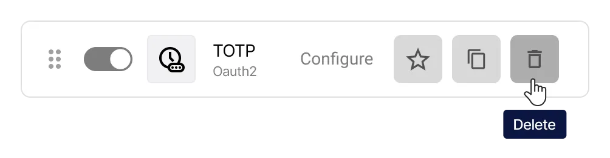
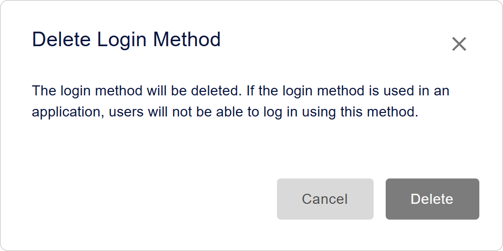
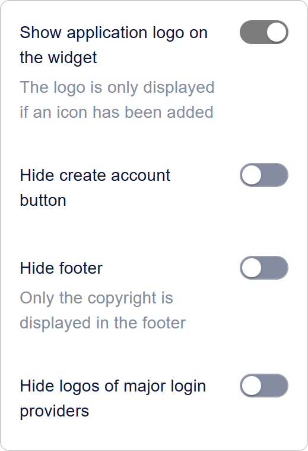

# Comment configurer les méthodes de connexion dans Encvoy ID

Dans ce guide, vous apprendrez à configurer les méthodes de connexion dans **Encvoy ID**, y compris les fournisseurs OAuth standard et les méthodes d'authentification avancées (WebAuthn, mTLS, TOTP). Nous expliquerons également comment configurer et styliser correctement le widget d'autorisation pour rendre le processus de connexion sécurisé et convivial.

**Table des matières :**

- [Aperçu des méthodes de connexion](#login-methods-overview)
- [Gestion des méthodes de connexion](#managing-login-methods)
- [Paramètres du widget de connexion](#login-widget-settings)
- [Voir aussi](#see-also)

---

## Aperçu des méthodes de connexion { #login-methods-overview }

Une **méthode de connexion** est une méthode d'authentification pour les utilisateurs qui leur permet de s'autoriser dans le compte personnel ou les applications connectées. C'est un élément clé du système Single Sign-On (authentification unique), offrant une identification flexible et sécurisée.

### Types de fournisseurs d'authentification dans Encvoy ID

**Encvoy ID** prend en charge les types de méthodes de connexion suivants :

- **Méthodes de base** : identifiant et mot de passe, e-mail,
- **Fournisseurs d'identité externes** : réseaux sociaux, systèmes d'entreprise de confiance et autres services,
- **Méthodes avancées et sans mot de passe :** authentification cryptographique via **mTLS** (certificats clients) et **WebAuthn** (biométrie, clés matérielles), ainsi que les mots de passe à usage unique **TOTP/HOTP**.

Combinez les méthodes de connexion pour accroître la sécurité. Implémentez l'**authentification à deux facteurs**, où après avoir saisi le premier facteur (identifiant, mot de passe ou autre méthode), l'utilisateur doit confirmer son identité à l'aide d'un second facteur (téléphone, e-mail ou WebAuthn). [Comment configurer l'authentification à deux facteurs →](./docs-04-box-system-settings.md#two-factor-authentication)

### Niveaux de gestion et publicité des méthodes de connexion { #management-levels-and-publicity }

Les méthodes de connexion peuvent être créées dans différents types de tableaux de bord **Encvoy ID** :

- **Tableau de bord Admin** — niveau service global ;
- **Tableau de bord Organisation** — niveau entreprise ;
- **Tableau de bord Application (ADM)** — niveau application individuelle.

Pour les méthodes de connexion créées au niveau du **service** ou de l'**organisation**, vous pouvez configurer la **publicité** — en déterminant exactement où elles seront disponibles.

| Type de méthode de connexion                         | Paramètre de publicité | Disponibilité                                               | Gestion                                                     |
| ---------------------------------------------------- | ---------------------- | ----------------------------------------------------------- | ----------------------------------------------------------- |
| **Créée dans le Tableau de bord Admin**              | ✔ Oui                  | Tableau de bord admin et toutes les applications du service | Gérée uniquement depuis le **Tableau de bord Admin**        |
| **Créée dans le Tableau de bord Organisation**       | ✔ Oui                  | Toutes les applications de cette organisation               | Gérée uniquement depuis le **Tableau de bord Organisation** |
| **Créée dans l'Application (Petit Tableau de bord)** | ✘ Non                  | Uniquement dans cette application                           | Gérée dans les **Paramètres de l'application**              |

---

## Gestion des méthodes de connexion { #managing-login-methods }

### Création d'une nouvelle méthode de connexion

Pour les services les plus populaires, **Encvoy ID** fournit des modèles prêts à l'emploi avec des paramètres. Ils simplifient le processus de connexion car ils contiennent des paramètres pré-remplis spécifiques à chaque fournisseur.

**Le processus de configuration comprend trois étapes :**

1. **Préparation :** obtenez un `Client ID` et un `Client Secret` auprès du service fournisseur.
2. **Configuration dans Encvoy ID :** créez un fournisseur du type correspondant.

   Consultez l'instruction spécifique pour la configuration du fournisseur sélectionné :
   - **E-mail** : [E-mail](./instructions-common-provider-email.md)
   - **Réseaux sociaux :** [Google](./instructions-common-provider-google.md), [GitHub](./instructions-common-provider-github.md)
   - **Universel :** [OpenID Connect](./instructions-common-provider-oidc.md) (pour tout système compatible OIDC)
   - **Méthodes avancées :** [mTLS](./instructions-common-provider-mtls.md), [WebAuthn](./instructions-common-provider-webauthn.md), [TOTP](./instructions-common-provider-totp.md), [HOTP](./instructions-common-provider-hotp.md)

3. **Placement sur le widget :** ajoutez la méthode de connexion au formulaire de connexion disponible pour les utilisateurs du système.

### Modification d'une méthode de connexion existante

Si vous devez mettre à jour les paramètres d'une méthode de connexion existante (par exemple, en raison d'un changement de clé secrète ou de domaine) :

1. Allez dans le Tableau de bord Admin (Paramètres de l'Organisation ou de l'Application correspondante) → section **Paramètres**.
2. Cliquez sur **Configurer** dans le bloc **Méthodes de connexion**.
3. Une fenêtre avec la liste des méthodes de connexion créées s'ouvrira.
4. Cliquez sur le bouton **Configurer** sur le panneau de la méthode de connexion que vous souhaitez modifier.

5. Le formulaire de modification s'ouvrira.
6. Apportez les modifications nécessaires.
7. Cliquez sur **Enregistrer**.

### Suppression d'une méthode de connexion

1. Allez dans le Tableau de bord Admin (Paramètres de l'Organisation ou de l'Application correspondante) → section **Paramètres**.
2. Développez le bloc **Méthodes de connexion**.
3. Cliquez sur **Configurer**.
4. Une fenêtre avec la liste des méthodes de connexion créées s'ouvrira.
5. Cliquez sur le bouton **Supprimer**  situé sur le panneau de la méthode de connexion que vous souhaitez supprimer.

6. Confirmez l'action dans la fenêtre modale.

Après une suppression réussie, la méthode de connexion disparaîtra des widgets de toutes les applications liées.

### Copie des paramètres d'une méthode de connexion

La copie des paramètres vous permet de créer une nouvelle méthode basée sur une méthode précédemment créée.

1. Copiez les paramètres de la méthode de connexion à l'aide du bouton **Copier**  situé sur le panneau de la méthode de connexion.

2. Ensuite, ouvrez le formulaire de création d'une nouvelle méthode de connexion à l'aide d'un modèle du même type et cliquez sur **Coller** .

> ⚠️ **Note** : Si les types ne correspondent pas, le nouveau fournisseur peut ne pas fonctionner correctement.

### Configuration d'un identifiant requis dans le profil utilisateur

Les **Identifiants** sont des services externes que l'utilisateur a ajoutés à son profil ou par lesquels il s'est précédemment connecté au système.

La liste des identifiants disponibles pour l'ajout est formée à partir des méthodes de connexion dans le tableau de bord **Encvoy ID** avec un paramètre de publicité actif.

- Si une méthode de connexion est configurée comme **publique**, elle apparaîtra dans la liste des identifiants disponibles pour l'ajout dans le profil utilisateur.
- Le placement de cette méthode de connexion sur le widget de l'application est facultatif — elle peut être disponible dans le profil même sans bouton sur l'écran de connexion principal.
- L'utilisateur peut également ajouter un identifiant lors de la connexion via le widget si une telle méthode de connexion est disponible.

Dans **Encvoy ID**, vous pouvez configurer une exigence de liaison obligatoire d'un identifiant de compte externe au profil utilisateur. Dans ce cas, lors de la connexion à l'application, un utilisateur qui n'a pas d'identifiant lié verra une demande pour en ajouter un à son profil.

#### Comment rendre un identifiant obligatoire

1. Allez dans le Tableau de bord Admin (Paramètres de l'Organisation ou de l'Application correspondante) → section **Paramètres**.
2. Développez le bloc **Méthodes de connexion** et cliquez sur **Configurer**.
3. Une fenêtre avec la liste des méthodes de connexion créées s'ouvrira.
4. Cliquez sur le bouton **Rendre obligatoire**  sur le panneau de la méthode de connexion que vous souhaitez rendre obligatoire.

Le paramètre est appliqué sans confirmation supplémentaire.

> 💡 **Conseil** : Cliquer à nouveau sur le bouton **Rendre obligatoire** rendra l'identifiant facultatif dans le profil.

---

## Paramètres du widget de connexion { #login-widget-settings }

### Qu'est-ce que le widget de connexion ?

Le **Widget de connexion** est le formulaire d'autorisation affiché à l'utilisateur lorsqu'il tente de se connecter à une application ou au système **Encvoy ID** s'il n'est pas encore authentifié.

Le widget prend en charge :

- la connexion classique via identifiant et mot de passe,
- la connexion via divers fournisseurs,
- la configuration flexible de l'apparence et de la structure,
- le regroupement des méthodes de connexion.

Dans le widget, les méthodes de connexion sont divisées en :

- **Méthodes principales** — affichées sous forme de boutons séparés sous le bouton **Se connecter** et sont utilisées le plus fréquemment.
- **Méthodes supplémentaires** — placées dans le bloc **Autres méthodes** sous forme de boutons compacts pour éviter d'encombrer l'interface.

Exemple de widget :

> 💡 Le **Widget de connexion** est la première chose qu'un utilisateur voit lors de l'autorisation, il est donc important qu'il corresponde au style visuel de l'entreprise et soit aussi clair que possible.

### Configuration du widget de connexion : Apparence et Boutons

Pour configurer l'apparence du widget :

1. Allez dans le Tableau de bord Admin (Paramètres de l'Organisation ou de l'Application correspondante) → section **Paramètres**.
2. Trouvez le bloc **Méthodes de connexion** et cliquez sur **Configurer**.
3. La fenêtre **Configurer l'apparence du widget** s'ouvrira.
4. Dans le premier bloc, les éléments visuels clés sont définis :
   - **Titre du widget** — Affiché en haut du formulaire. Pour afficher le nom de l'application dans le titre du widget, utilisez la valeur `APP_NAME`.
   - **Couverture du widget** — Image de fond du formulaire d'autorisation.
   - **Mode d'auto-substitution de la couverture sur les widgets d'application** :
     - **Désactivé** — La couverture de l'application est utilisée,
     - **Par défaut** — Uniquement pour les applications sans couverture,
     - **Forcé** — Appliqué à toutes les applications.

5. Dans le deuxième bloc, configurez la visibilité des éléments du formulaire de connexion :
   - **Afficher le logo de l'application sur le widget** — Lorsqu'activé, affiche le logo à côté du nom de l'application. L'image de la section [Informations de base](./docs-04-box-system-settings.md#system-name-and-logo) est utilisée.
   - **Masquer le bouton de création de compte** — Lorsqu'activé, masque le bouton de création de compte du widget.
   - **Masquer le pied de page** — Lorsqu'activé, masque le pied de page du widget avec le texte "© 2015-2025".
   - **Masquer les logos des principaux fournisseurs** — Lorsqu'activé, masque les logos des méthodes de connexion du groupe **Principal**.

     

6. Dans le troisième bloc, configurez le design des boutons :
   - **Couleur de fond des boutons** — Schéma de couleur pour le fond du bouton (code hex).
   - **Couleur de la police sur les boutons** — Schéma de couleur pour le texte du bouton (code hex).

     

7. Si nécessaire, spécifiez le texte :
   - **Champ d'information supplémentaire à l'intérieur du formulaire** — Texte supplémentaire qui sera affiché en bas du widget,
   - **Champ supplémentaire à l'extérieur du widget** — Texte supplémentaire qui sera affiché sous le widget.

     

   > Les champs prennent en charge l'insertion de code HTML5 avec un balisage sémantique complet, y compris les styles CSS intégrés et en ligne. L'utilisation de la balise `script` est interdite. Lors de l'enregistrement des données, toute balise `script` (y compris son contenu et ses attributs) sera automatiquement supprimée du champ au niveau de la base de données.

8. Cliquez sur **Enregistrer** pour appliquer les modifications.

   > 💡 Vous pouvez visualiser les résultats des modifications dans la section **Aperçu**.

### Ajout et désactivation des méthodes de connexion sur le widget

Pour configurer l'affichage d'une méthode de connexion dans le widget :

1. Allez dans le Tableau de bord Admin (Paramètres de l'Organisation ou de l'Application correspondante) → section **Paramètres**.
2. Trouvez le bloc **Méthodes de connexion** et cliquez sur **Configurer**.
3. Activez ou désactivez les commutateurs pour les méthodes de connexion souhaitées.
4. Si nécessaire, configurez les groupes de méthodes de connexion.

> ⚠️ **Note** :
>
> 1. Il est impossible de désactiver la méthode **Identifiant/Mot de passe**. Si toutes les méthodes de connexion sont désactivées, la méthode **Identifiant/Mot de passe** est automatiquement activée, car le widget doit avoir au moins une méthode de connexion.
> 2. La désactivation d'une méthode de connexion du widget ne supprime pas la méthode de connexion du système.

---

## Voir aussi { #see-also }

- [Gestion des applications](./docs-10-common-app-settings.md) — guide pour la création, la configuration et la gestion des applications OAuth 2.0 et OpenID Connect (OIDC).
- [Gestion de l'organisation](./docs-02-box-system-install.md) — guide pour travailler avec une organisation dans **Encvoy ID**.
- [Enregistrement et connexion de l'utilisateur](./docs-13-common-user-authentication.md) — instructions pour créer un compte, se connecter avec un identifiant/mot de passe et des services d'authentification externes.
