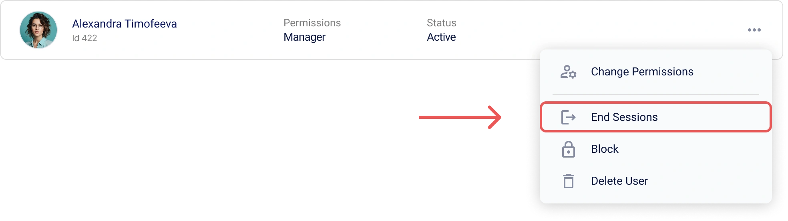
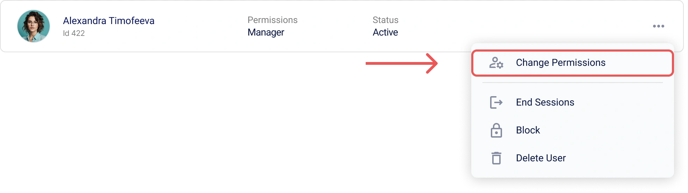
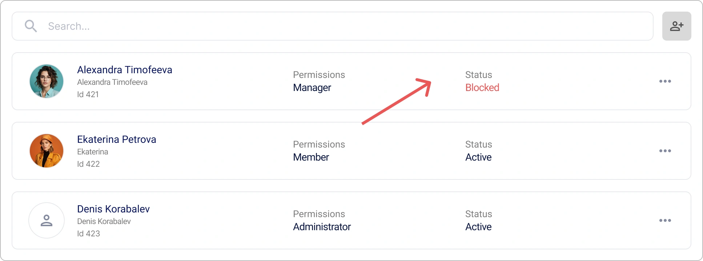

# Gestion des utilisateurs dans Encvoy ID

Dans ce guide, vous apprendrez à créer et modifier des profils d'utilisateurs dans **Encvoy ID**, à attribuer des rôles et des droits d'accès, à bloquer et supprimer des comptes, à mettre fin aux sessions actives, à gérer la confidentialité et à exporter les données de profil.

**Table des matières :**

- [Aperçu et actions de base](#overview-and-basics)
- [Gestion des données du profil](#profile-data-management)
- [Accès et sécurité](#access-and-security)
- [Statut du compte](#account-status)
- [Suppression d'un utilisateur](#deleting-user)
- [Voir aussi](#see-also)

---

<a name="overview-and-basics"></a>

## Aperçu et actions de base

### À propos de la section "Utilisateurs"

La liste de tous les utilisateurs enregistrés dans **Encvoy ID** se trouve dans la section **Utilisateurs**. Ici, les administrateurs peuvent gérer les comptes, consulter les profils et contrôler l'accès au système.

> ⚠️ **Conditions d'accès** : Cette section est disponible dans le panneau d'administration pour les utilisateurs disposant des permissions système **Administrateur**.

### Création d'un utilisateur dans Encvoy ID

> 📌 Dans **Encvoy ID**, il existe plusieurs façons d'enregistrer des utilisateurs : l'auto-enregistrement via un widget et la création manuelle par un utilisateur disposant des droits **Administrateur**.

Dans cette instruction, nous verrons comment créer manuellement un utilisateur :

1. Allez dans le panneau d'administration → onglet **Utilisateurs**.
2. Cliquez sur le bouton **Créer un utilisateur** .
3. Le formulaire de création d'utilisateur s'ouvre.
4. Remplissez les champs du profil sur le formulaire :
   - **Nom public** — le nom d'affichage de l'utilisateur dans le système ;
   - **Prénom** — le prénom et le deuxième prénom de l'utilisateur ;
   - **Nom** — le nom de famille de l'utilisateur ;
   - **Identifiant** — doit être unique pour le service ; peut être utilisé pour une authentification future ;
   - **E-mail** — l'adresse doit être unique pour le service ; peut être utilisée pour une authentification future ;
   - **Numéro de téléphone** — doit être unique pour le service ; peut être utilisé pour une authentification future ;
   - **Mot de passe** — doit être conforme à la politique de mot de passe spécifiée dans les paramètres du service.

     > 🔗 Pour plus de détails, consultez le guide [Configuration de la politique de mot de passe](./docs-05-box-userfields-settings.md#password-policy).

   - **Date de naissance** ;
   - **Photo de profil**.

5. Cliquez sur **Enregistrer**.

   > 💡 Un profil utilisateur peut contenir des [champs supplémentaires](./docs-05-box-userfields-settings.md#additional-profile-fields).

   > 📌 La validation des champs est effectuée selon des règles de validation. Pour plus de détails, consultez le guide [Règles de validation des champs](./docs-05-box-userfields-settings.md#validation-rules).

### Consultation et modification d'un profil utilisateur

#### Consultation d'un profil utilisateur

Pour obtenir des informations détaillées sur un compte, ouvrez son profil.

1. Allez dans le panneau d'administration → onglet **Utilisateurs**.
2. Cliquez sur le panneau de l'utilisateur dont vous souhaitez consulter le profil.
3. Le profil de l'utilisateur s'ouvrira avec des informations détaillées : coordonnées, identifiants et paramètres de confidentialité.


#### Modification des données du profil

Pour apporter des modifications à un profil utilisateur :

1. Allez dans le panneau d'administration → onglet **Utilisateurs**.
2. Ouvrez le profil de l'utilisateur.
3. Cliquez sur **Modifier** dans le bloc **Informations principales**.
4. Dans le formulaire **Modifier l'utilisateur** qui s'ouvre, apportez les modifications nécessaires.

   > 📌 La validation des champs est effectuée selon des règles de validation. Pour plus de détails, consultez le guide [Règles de validation des champs](./docs-05-box-userfields-settings.md#validation-rules).

5. Cliquez sur **Enregistrer**.

---

<a name="profile-data-management"></a>

## Gestion des données du profil

### Gestion des identifiants de profil

La section **Identifiants** du profil utilisateur affiche les méthodes de connexion que l'utilisateur a ajoutées lui-même ou utilisées pour se connecter à l'application ou au compte personnel **Encvoy ID**. L'administrateur peut configurer la confidentialité d'un identifiant et le supprimer du profil utilisateur.

> 💡 **Important :** Seul le propriétaire du compte peut ajouter de nouveaux identifiants. Pour plus de détails, consultez le guide [Identifiants de services externes](./docs-12-common-personal-profile.md#external-service-identifiers).

Pour supprimer un identifiant :

1. Allez dans le panneau d'administration → onglet **Utilisateurs**.
2. Ouvrez le profil de l'utilisateur.
3. Cliquez sur **Supprimer** sur le panneau de la méthode de connexion que vous souhaitez supprimer du profil.


L'identifiant sera immédiatement supprimé du profil.

### Configuration de la confidentialité des champs de profil

Pour chaque champ de profil, vous pouvez définir un niveau de confidentialité qui détermine qui peut voir cette information. Les paramètres sont disponibles pour les données utilisateur de base et supplémentaires, ainsi que pour les méthodes de connexion.

#### Niveaux de confidentialité

| Niveau                              | Icône                                                  | Description                                                                                                                                               |
| ----------------------------------- | ------------------------------------------------------ | --------------------------------------------------------------------------------------------------------------------------------------------------------- |
| **Disponible uniquement pour vous** |               | Les données ne sont pas transférées vers des systèmes tiers et ne sont accessibles qu'à l'utilisateur.                                                    |
| **Disponible sur demande**          |  | Les données sont disponibles dans les systèmes tiers intégrés à **Encvoy ID**. <br> Le consentement de l'utilisateur est requis pour accéder aux données. |
| **Disponible pour tous**            |            | Les données sont toujours publiques. Le consentement de l'utilisateur n'est pas requis pour y accéder.                                                    |

#### Comment modifier la confidentialité d'un champ de profil

1. Allez dans le panneau d'administration → onglet **Utilisateurs**.
2. Ouvrez le profil de l'utilisateur.
3. Cliquez sur l'icône de confidentialité actuelle à côté du champ.
4. Sélectionnez un nouveau niveau dans le menu déroulant.


Le changement est appliqué instantanément.

### Exportation des données du profil

**Encvoy ID** vous permet d'exporter toutes les données du profil au format JSON.

Pour télécharger les données du profil :

1. Allez dans le panneau d'administration → onglet **Utilisateurs**.
2. Ouvrez le profil de l'utilisateur.
3. Développez le bloc **Autres actions**.


4. Sélectionnez l'action **Télécharger les données**.
5. Le téléchargement du fichier JSON commencera automatiquement.

#### Structure du fichier exporté

Le fichier exporté contient une liste complète des données utilisateur :

```json
{
  "user": {
    "id": 1573,
    "email": "ivanov.petr89@mail.com",
    "birthdate": "1992-11-14T15:22:11.123Z",
    "family_name": "Ivanov",
    "given_name": "Petr",
    "nickname": "Petya",
    "login": "petr_ivanov92",
    "phone_number": "+79991234567",
    "picture": "public/images/profile/3f7b21d8e4c2a6f1b2c9d3a0e5f7b1c4",
    "public_profile_claims_oauth": "id email family_name given_name picture",
    "public_profile_claims_gravatar": "family_name given_name email picture",
    "blocked": false,
    "deleted": null,
    "custom_fields": {
      "country": "Russia"
    },
    "password_updated_at": "2025-10-12T08:45:33.222Z"
  },
  "role": "ADMIN"
}
```

---

<a name="access-and-security"></a>

## Accès et sécurité

### Fin des sessions utilisateur

La fonction permettant de mettre fin de force à toutes les sessions actives est un outil de sécurité important. Utilisez-la en cas de perte d'appareil, de suspicion de compromission de compte ou pour actualiser immédiatement les jetons d'accès.

> 📌 Cette opération invalide immédiatement tous les jetons d'accès et de rafraîchissement de l'utilisateur, mettant fin à toutes ses sessions en cours sur toutes les applications. L'utilisateur devra se reconnecter.

#### Comment mettre fin aux sessions utilisateur

**Méthode 1 : Depuis la liste générale des utilisateurs**

1. Allez dans le panneau d'administration → onglet **Utilisateurs**.
2. Cliquez sur **Terminer les sessions** dans le menu d'action de l'utilisateur.



**Méthode 2 : Depuis le profil utilisateur**

1. Allez dans le panneau d'administration → onglet **Utilisateurs**.
2. Cliquez sur **Terminer les sessions** dans le profil utilisateur au sein du bloc **Autres actions**.


**Ce qui se passe après confirmation :**

- **Toutes les sessions actives** de l'utilisateur sont terminées.
- Les **jetons d'accès** (`access_token`) deviennent invalides.
- Les **jetons de rafraîchissement** (`refresh_token`) sont révoqués.
- L'utilisateur devra **se reconnecter** lors de son prochain accès à l'application.

> 📌 Cette opération ne bloque pas l'utilisateur. Il pourra s'authentifier à nouveau.

### Attribution et modification des permissions utilisateur

Encvoy ID utilise un système d'accès à trois niveaux qui définit clairement les droits des utilisateurs :

- **Membre** — le rôle de base. Permet de gérer son propre profil, de configurer les permissions d'accès aux données personnelles et d'utiliser le compte pour se connecter aux applications intégrées.
- **Gestionnaire** — le rôle d'administrateur pour une organisation ou un département spécifique. Gère les utilisateurs et l'accès aux applications au sein de son unité organisationnelle.
- **Administrateur** — le rôle avec les privilèges maximums. Fournit un accès complet à toutes les fonctions de la plateforme, y compris les paramètres de sécurité globaux et la gestion de toutes les organisations.

Vous trouverez ci-dessous les instructions pour attribuer les rôles système **Gestionnaire** et **Administrateur**.

#### Attribution des permissions "Gestionnaire"

1. Allez dans le panneau d'administration → onglet **Utilisateurs**.
2. Ouvrez le menu d'action en cliquant sur le bouton **Plus** pour l'utilisateur dont vous souhaitez modifier les droits.
3. Sélectionnez l'action **Modifier les droits**.



4. Dans la fenêtre qui s'ouvre, sélectionnez le rôle **Gestionnaire** et cliquez sur **Enregistrer**.


L'utilisateur recevra le rôle sélectionné et les droits correspondants.

#### Attribution des permissions système "Administrateur"

1. Allez dans le panneau d'administration → onglet **Utilisateurs**.
2. Ouvrez le menu d'action en cliquant sur le bouton **Plus** pour l'utilisateur dont vous souhaitez modifier les droits.
3. Sélectionnez l'action **Modifier les droits**.
4. Dans la fenêtre qui s'ouvre, sélectionnez le rôle **Administrateur** et cliquez sur **Enregistrer**.

L'utilisateur recevra le rôle sélectionné et les droits correspondants.

> 🔍 Pour attribuer des permissions **Administrateur** pour une application, utilisez l'[instruction](./docs-10-common-app-settings.md#assigning-app-administrator).

---

<a name="account-status"></a>

## Statut du compte

### Blocage des utilisateurs dans Encvoy ID

Le blocage empêche l'accès à tous les services qui utilisent **Encvoy ID** pour la connexion.

Pour bloquer un utilisateur :

1. Ouvrez le menu d'action pour un utilisateur actif dans l'une des interfaces :
   - Dans le menu d'action de l'utilisateur au sein du [profil de l'application](./docs-10-common-app-settings.md#viewing-application).
   - Dans le menu d'action de l'utilisateur sur l'onglet **Utilisateurs**.

   

2. Sélectionnez l'action **Bloquer dans Encvoy ID**.
3. Confirmez l'action dans la fenêtre modale.


**Ce qui se passe après le blocage** :

- Le statut de l'utilisateur passera à **Bloqué**.

    

- L'utilisateur bloqué ne pourra plus se connecter au service ou aux applications.

  Lors d'une tentative de connexion, le widget suivant s'affichera :

    

### Déblocage des utilisateurs dans Encvoy ID

Pour débloquer un utilisateur :

1. Ouvrez le menu d'action pour un utilisateur bloqué dans l'une des interfaces :
   - Dans le menu d'action de l'utilisateur au sein du [profil de l'application](./docs-10-common-app-settings.md#viewing-application).
   - Dans le menu d'action de l'utilisateur sur l'onglet **Utilisateurs**.

2. Sélectionnez l'action **Débloquer dans Encvoy ID**.
3. Confirmez l'action dans la fenêtre modale.

Après confirmation de l'action, le statut de l'utilisateur passera à **Actif**.

---

<a name="deleting-user"></a>

## Suppression d'un utilisateur

Un administrateur peut supprimer définitivement un utilisateur. Une fois la suppression confirmée, le compte et toutes les données disparaissent irrévocablement. L'utilisateur perdra l'accès à toutes les applications où son compte **Encvoy ID** était utilisé.

> 💡 Un utilisateur peut supprimer lui-même son compte via son profil personnel. La suppression est mise en œuvre avec un **mécanisme de délai**. Pendant une certaine période, l'utilisateur peut restaurer l'accès à son compte. Vous pouvez en savoir plus à ce sujet dans le guide [Profil utilisateur](./docs-12-common-personal-profile.md).

### Comment supprimer un utilisateur dans Encvoy ID

> 💡 **Alternative** : Envisagez de **bloquer le compte** au lieu de le supprimer s'il existe une possibilité de restaurer l'accès.

Pour supprimer un utilisateur :

1. Cliquez sur **Supprimer le compte** dans l'une des interfaces :
   - Dans le menu d'action de l'utilisateur sur l'onglet **Utilisateurs**.

      

   - Dans le profil utilisateur au sein du bloc **Autres actions**.

      

2. Confirmez l'action dans la fenêtre modale.

Après confirmation, l'utilisateur sera supprimé.

**Ce qui se passe après la suppression** :

- Les applications dont l'utilisateur supprimé est le seul propriétaire seront irrévocablement supprimées.
- Toutes les données du compte sont effacées sans possibilité de récupération après la suppression finale.
- L'utilisateur perd l'accès à tous les services intégrés.

---

<a name="see-also"></a>

## Voir aussi

- [Profil personnel et gestion des permissions d'application](./docs-12-common-personal-profile.md) — un guide pour gérer votre profil personnel.
- [Gestion des applications](./docs-10-common-app-settings.md) — un guide pour créer, configurer et gérer les applications OAuth 2.0 et OpenID Connect (OIDC).
- [Gestion de l'organisation](./docs-11-common-org-settings.md) — un guide pour travailler avec les organisations dans **Encvoy ID**.
