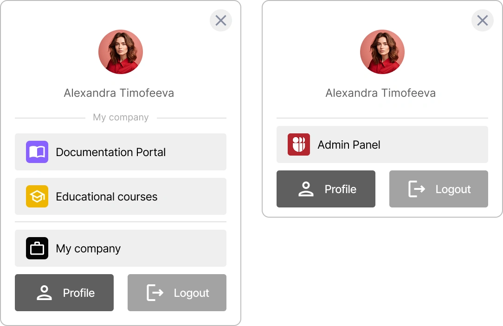

# Comment configurer et connecter le Mini-widget {{projectName}}

Dans ce guide, vous apprendrez à connecter et configurer le mini-widget **{{projectName}}** sur votre ressource web. Vous découvrirez comment paramétrer l'authentification, l'affichage du profil utilisateur, les boutons de connexion et les menus, ainsi que la personnalisation de l'apparence du widget pour l'harmoniser avec le design de votre projet.

**Table des matières :**

- [Qu'est-ce qu'un mini-widget ?](#what-is-mini-widget)
- [Configuration du Widget](#widget-configuration)
- [Paramètres d'affichage du profil](#profile-display-settings)
- [Paramètres du bouton de connexion](#login-button-settings)
- [Paramètres des boutons de menu](#menu-button-parameters)
- [Style du Mini-widget](#mini-widget-styling)
- [Style individuel des boutons de menu](#individual-menu-button-styling)
- [Voir aussi](#see-also)

---

## Qu'est-ce qu'un mini-widget ? { #what-is-mini-widget }

Un **mini-widget** est un menu contenant les données de l'utilisateur et des fonctions essentielles. Il permet d'accéder au profil, au panneau d'administration, aux organisations ou au petit bureau, ainsi qu'à la déconnexion du système. Vous pouvez également y placer une application pour un accès rapide. Le widget s'ouvre en cliquant sur l'avatar de l'utilisateur dans le coin supérieur droit de l'écran.

Le mini-widget est un composant JavaScript léger pour l'authentification des utilisateurs dans le service **{{projectName}}**. Il fonctionne sur la base des standards OIDC/OAuth2 et PKCE et peut être intégré à n'importe quel site web ou interface — du simple HTML aux SPA sous React ou Vue.

> 💡 Pour ajouter une application au mini-widget, activez le commutateur **Afficher dans le mini-widget** dans les [paramètres de l'application](./docs-10-common-app-settings.md).

Exemples de widgets :  



---

## Configuration du Widget { #widget-configuration }

### Paramètres requis

Pour le fonctionnement de base du widget, trois paramètres clés doivent être spécifiés :

| Paramètre     | Type     | Description                                      | Exemple                         |
| ------------- | -------- | ------------------------------------------------ | ------------------------------- |
| `appId`       | `string` | Identifiant unique de l'application dans Trusted | `"MTnOOTdx85FgNbOFy2nUsH"`      |
| `backendUrl`  | `string` | URL de votre API backend                         | `"http://localhost:3001"`       |
| `redirectUrl` | `string` | URL de redirection après autorisation            | `"http://localhost:3000/login"` |

### Paramètres optionnels

Des paramètres optionnels sont disponibles pour une configuration avancée :

| Paramètre             | Type                  | Description                                | Valeur par défaut             |
| --------------------- | --------------------- | ------------------------------------------ | ----------------------------- |
| `issuer`              | `string`              | URL du serveur SSO Trusted                 | `"https://id.kloud.one"`      |
| `withOutHomePage`     | `boolean`             | Redirection automatique vers l'autorisation| `false`                       |
| `getTokenEndPoint`    | `string`              | Point de terminaison pour obtenir un jeton | `"/api/oidc/token"`           |
| `getUserInfoEndPoint` | `string`              | Point de terminaison pour les données util.| `"/api/oidc/me"`              |
| `scopes`              | `string[]`            | Autorisations OAuth2                       | `["openid", "lk", "profile"]` |
| `profile`             | `IProfileConfig`      | Paramètres du profil utilisateur           | Voir section ci-dessous       |
| `loginButton`         | `ICustomMenuButton`   | Paramètres du bouton de connexion          | Voir section ci-dessous       |
| `menuButtons`         | `ICustomMenuButton[]` | Tableau de boutons supplémentaires         | Voir section ci-dessous       |
| `customStyles`        | `ICustomStyles`       | Styles globaux du widget                   | Voir section ci-dessous       |

### Exemple de connexion de base

```typescript
import { TrustedWidget, TrustedWidgetConfig } from "trusted-widget";

const newConfig: TrustedWidgetConfig = {
  appId: "MTnOOTdx85FgNbOFy2nUsH",
  backendUrl: "http://localhost:3001",
  redirectUrl: "http://localhost:3000/login",
  issuer: "https://id.kloud.one",
  withOutHomePage: false,
  getTokenEndPoint: "/api/oidc/token",
  getUserInfoEndPoint: "/api/oidc/me",
};

// Utilisation du composant
<TrustedWidget config={newConfig} />;
```

---

## Paramètres d'affichage du profil { #profile-display-settings }

### Paramètres de configuration du profil

Le **Profil Utilisateur** est un composant qui contient l'avatar et le nom d'utilisateur.

| Paramètre    | Type               | Description                                      | Valeur par défaut |
| ------------ | ------------------ | ------------------------------------------------ | ----------------- |
| `isHideText` | `boolean`          | Masquer l'affichage du nom d'utilisateur         | `false`           |
| `wrapper`    | `IComponentStyles` | Styles du conteneur de profil (couleurs uniq.)   | Voir section style|
| `button`     | `IComponentStyles` | Styles du bouton d'avatar (couleurs uniq.)       | Voir section style|

> ⚠️ **Important :** Pour les paramètres de profil (`profile.wrapper` et `profile.button`), seules les couleurs (`color.text`, `color.background`, `color.hover`) peuvent être modifiées et le nom d'utilisateur peut être masqué (`isHideText`). Les autres paramètres de style (tels que `borderRadius`, `padding`, `position`) ne sont pas appliqués au profil.

### Exemple de configuration du profil

```typescript
// Exemple : Avatar uniquement sans texte
const config: TrustedWidgetConfig = {
  appId: "MTnOOTdx85FgNbOFy2nUsH",
  backendUrl: "http://localhost:3001",
  redirectUrl: "http://localhost:3000/login",
  profile: {
    isHideText: true, // Masquer le nom, afficher uniquement l'avatar
  },
};
```

---

## Paramètres du bouton de connexion { #login-button-settings }

Le bouton de connexion est affiché pour les utilisateurs non autorisés. Vous pouvez personnaliser son texte, son icône et ses styles.

### Paramètres du bouton de connexion

| Paramètre      | Type                           | Description                             | Valeur par défaut |
| -------------- | ------------------------------ | --------------------------------------- | ----------------- |
| `text`         | `string`                       | Texte du bouton de connexion            | `"Login"`         |
| `type`         | `string`                       | Type de bouton                          | `"login"`         |
| `icon`         | `string \| React.ReactElement` | Lien image ou élément React             | `null`            |
| `customStyles` | `IComponentStyles`             | Styles individuels pour le bouton       | Voir section style|

### Exemple de configuration

```typescript
// Exemple : Bouton avec icône personnalisée
const config: TrustedWidgetConfig = {
  appId: "MTnOOTdx85FgNbOFy2nUsH",
  backendUrl: "http://localhost:3001",
  redirectUrl: "http://localhost:3000/login",
  loginButton: {
    text: "Connexion via Trusted",
    type: "login",
    icon: "https://id.kloud.one/favicon.ico", // Icône personnalisée
  },
};
```

```typescript
// Exemple : Bouton texte simple sans icône
const config: TrustedWidgetConfig = {
  appId: "MTnOOTdx85FgNbOFy2nUsH",
  backendUrl: "http://localhost:3001",
  redirectUrl: "http://localhost:3000/login",
  loginButton: {
    text: "Connexion",
    type: "login",
    customStyles: {
      isHideIcon: true, // Masquer l'icône
    },
  },
};
```

---

## Paramètres des boutons de menu { #menu-button-parameters }

### Paramètres requis

| Paramètre | Type     | Description                     | Exemple              |
| --------- | -------- | ------------------------------- | -------------------- |
| `text`    | `string` | Nom du bouton affiché           | `"TestService"`      |
| `link`    | `string` | URL de la page de destination   | `"https://test.com"` |

### Paramètres optionnels

| Paramètre      | Type                           | Description                             | Valeur par défaut |
| -------------- | ------------------------------ | --------------------------------------- | ----------------- |
| `icon`         | `string \| React.ReactElement` | Lien image ou élément React             | `null`            |
| `customStyles` | `IComponentStyles`             | Styles individuels pour le bouton       | Voir section style|

### Exemple de configuration

```typescript
import { TrustedWidget, TrustedWidgetConfig } from "trusted-widget";

const newConfig: TrustedWidgetConfig = {
  appId: "MTnOOTdx85FgNbOFy2nUsH",
  backendUrl: "http://localhost:3001",
  redirectUrl: "http://localhost:3000/login",
  menuButtons: [
    {
      text: "TestService",
      link: "https://test.com",
      icon: "https://image.png", // | <Icon />
    },
  ],
};
```

---

## Style du Mini-widget { #mini-widget-styling }

Le widget prend en charge une personnalisation détaillée de l'apparence via l'objet `customStyles`. Vous pouvez contrôler les couleurs, les rayons de bordure, les marges internes et l'alignement pour tous les éléments.

### Structure de l'objet de style

```typescript
customStyles: {
  global: {
    borderRadius: "8px",        // Rayon de bordure global
    color: { /* couleurs */ }      // Couleurs globales
  },
  components: {
    primaryButton: { /* styles */ },   // Boutons primaires
    secondaryButton: { /* styles */ }, // Boutons secondaires
    accountButton: { /* styles */ }    // Boutons du menu compte
  }
}
```

### Paramètres de style personnalisés

#### Styles globaux

| Paramètre             | Type               | Description                         | Exemple  |
| --------------------- | ------------------ | ----------------------------------- | -------- |
| `global.borderRadius` | `string`           | Rayon des coins pour tous les élém. | `"12px"` |
| `global.color`        | `IComponentStyles` | Couleurs globales                   | Voir ci-dessous|

#### Styles des composants

| Paramètre                    | Type               | Description                 | Usage                     |
| ---------------------------- | ------------------ | --------------------------- | ------------------------- |
| `components.primaryButton`   | `IComponentStyles` | Style du bouton primaire    | Bouton "Connexion", "Profil" |
| `components.secondaryButton` | `IComponentStyles` | Style du bouton secondaire  | Bouton "Déconnexion"      |
| `components.accountButton`   | `IComponentStyles` | Style bouton menu compte    | Boutons du menu déroulant |

#### Paramètres de style de composant IComponentStyles

| Paramètre          | Type                 | Description                    | Exemple      |
| ------------------ | -------------------- | ------------------------------ | ------------ |
| `color.text`       | `string`             | Couleur texte et icône (HEX)   | `"#ffffff"`  |
| `color.background` | `string`             | Couleur d'arrière-plan (HEX)   | `"#1976d2"`  |
| `color.hover`      | `string`             | Couleur de survol (HEX)        | `"#1565c0"`  |
| `borderRadius`     | `string`             | Rayon des coins de l'élément   | `"8px"`      |
| `padding`          | `string`             | Marges internes                | `"8px 16px"` |
| `position`         | `"left" \| "center"` | Alignement du contenu          | `"center"`   |
| `isHideIcon`       | `boolean`            | Masquer l'icône dans le bouton | `false`      |

#### Héritage des styles

Le widget dispose d'un système d'héritage intelligent pour le `secondaryButton` :

- **Si les styles sont définis uniquement pour `primaryButton`**, ils sont automatiquement appliqués au `secondaryButton`, mais avec une transparence accrue (via une opacité réduite).
- **Si des styles distincts sont définis pour `secondaryButton`**, la transparence n'est pas appliquée — seuls les paramètres explicitement spécifiés sont utilisés.

### Exemple de configuration de style

#### Exemple de configuration de style global

```typescript
const config: TrustedWidgetConfig = {
  appId: "MTnOOTdx85FgNbOFy2nUsH",
  backendUrl: "http://localhost:3001",
  redirectUrl: "http://localhost:3000/login",
  // Valeurs par défaut pour les styles globaux
  customStyles: {
    global: {
      color: {
        text: "#666666",
        background: "#ffffff",
      },
      borderRadius: "8px",
    },
    components: {
      accountButton: {
        color: {
          text: "#fff",
          background: "#efefef",
          hover: undefined, // si non défini, filter: brightness(90%) est appliqué
        },
        position: "left",
        isHideIcon: false,
      },
      primaryButton: {
        color: {
          text: "#ffffff",
          background: "#b5262f",
          hover: undefined, // si non défini, filter: brightness(90%) est appliqué
        },
        position: "left",
        isHideIcon: false,
      },
      // secondaryButton non défini — le style primaryButton avec transparence (opacity:0.5) sera utilisé
    },
  },
};
```

#### Exemple de configuration de style complète

```typescript
const config: TrustedWidgetConfig = {
  appId: "MTnOOTdx85FgNbOFy2nUsH",
  backendUrl: "http://localhost:3001",
  redirectUrl: "http://localhost:3000/login",
  // Paramètres de profil
  profile: {
    isHideText: false,
    wrapper: {
      color: {
        text: "#333333",
        background: "#f8f9fa",
      },
    },
    button: {
      color: {
        text: "#333333",
        background: "transparent",
        hover: "rgba(0, 0, 0, 0.08)",
      },
    },
  },
};
```

#### Exemple de configuration complète avec bouton de connexion

```typescript
const config: TrustedWidgetConfig = {
  appId: "MTnOOTdx85FgNbOFy2nUsH",
  backendUrl: "http://localhost:3001",
  redirectUrl: "http://localhost:3000/login",
  // Bouton de connexion avec icône
  loginButton: {
    text: "Connexion",
    type: "login",
    icon: "https://id.kloud.one/favicon.ico",
    customStyles: {
      color: {
        text: "#ffffff",
        background: "#4CAF50",
        hover: "#45a049",
      },
      borderRadius: "8px",
      padding: "10px 20px",
    },
  },
};
```


#### Exemple de configuration complète avec styles globaux et menu

```typescript
const config: TrustedWidgetConfig = {
  appId: "MTnOOTdx85FgNbOFy2nUsH",
  backendUrl: "http://localhost:3001",
  redirectUrl: "http://localhost:3000/login",
  // Styles globaux
  customStyles: {
    global: {
      borderRadius: "8px",
    },
    components: {
      primaryButton: {
        color: {
          text: "#ffffff",
          background: "#4CAF50",
          hover: "#45a049",
        },
        position: "center",
        isHideIcon: false,
      },
      secondaryButton: {
        color: {
          text: "#4CAF50",
          background: "transparent",
          hover: "#f1f8e9",
        },
        position: "center",
        isHideIcon: false,
      },
      accountButton: {
        color: {
          text: "#333333",
          background: "#ffffff",
          hover: "#f5f5f5",
        },
        position: "left",
        isHideIcon: false,
      },
    },
  },
};
```

---

## Style individuel des boutons de menu { #individual-menu-button-styling }

Pour chaque bouton dans `menuButtons`, vous pouvez définir des styles individuels via la propriété `customStyles` de type `IComponentStyles`.

### Exemple avec styles de boutons individuels

```typescript
const config: TrustedWidgetConfig = {
  appId: "MTnOOTdx85FgNbOFy2nUsH",
  backendUrl: "http://localhost:3001",
  redirectUrl: "http://localhost:3000/login",
  menuButtons: [
    {
      text: "Espace Personnel",
      link: "https://my-account.com",
      icon: "https://icons.com/profile.png",
      customStyles: {
        color: {
          text: "#ffffff",
          background: "#4CAF50", // Fond vert
          hover: "#45a049", // Vert foncé au survol
        },
        borderRadius: "8px",
        padding: "8px 16px",
        position: "center",
      },
    },
    {
      text: "Paramètres",
      link: "https://settings.com",
      icon: "https://icons.com/settings.png",
      customStyles: {
        color: {
          text: "#333333",
          background: "#f5f5f5", // Fond gris clair
          hover: "#e0e0e0", // Gris au survol
        },
        borderRadius: "6px",
        padding: "6px 12px",
        position: "left",
      },
    },
    {
      text: "Support",
      link: "https://support.com",
      customStyles: {
        color: {
          text: "#ffffff",
          background: "#FF5722", // Fond orange
          hover: "#E64A19", // Orange foncé au survol
        },
        borderRadius: "4px",
        padding: "10px 20px",
        position: "center",
        isHideIcon: true, // Masquer l'icône pour ce bouton
      },
    },
  ],
};
```

### Priorité d'application des styles

1. **Styles de bouton individuels** (`customStyles` dans l'objet bouton) — priorité la plus haute
2. **Styles accountButton** (`customStyles.components.accountButton`) — si les styles individuels ne sont pas définis
3. **Styles par défaut** — si les précédents ne sont pas définis

```typescript
const config: TrustedWidgetConfig = {
  appId: "MTnOOTdx85FgNbOFy2nUsH",
  backendUrl: "http://localhost:3001",
  redirectUrl: "http://localhost:3000/login",
  // Si un bouton n'a PAS de customStyles, les styles accountButton sont appliqués aux menuButtons
  customStyles: {
    components: {
      // styles accountButton par défaut
      accountButton: {
        color: {
          text: "#666666",
          background: "#efefef",
          hover: undefined, // si non défini, filter: brightness(90%) est appliqué
        },
        position: "left",
      },
    },
  },
};
```

### Principes de style du Mini-widget

| Principe | Signification | Comment l'appliquer |
| :--- | :--- | :--- |
| **Gestion Centralisée** | Tous les paramètres d'apparence sont définis via trois objets de configuration clés. | Configurez l'aspect général dans `customStyles`, le profil dans `profile` et le bouton de connexion dans `loginButton`. |
| **Configuration Flexible du Profil** | L'apparence du bloc avec le nom et l'avatar de l'utilisateur autorisé est configurée séparément. | Utilisez `profile.wrapper` pour l'arrière-plan et `profile.button` pour le bouton d'avatar. Notez que seuls les paramètres de couleur fonctionnent ici. |
| **Configuration du Bouton de Connexion** | Les styles du bouton vu par les utilisateurs non autorisés sont configurés indépendamment. | Définissez le texte, l'icône et les styles dans l'objet `loginButton` et sa propriété `customStyles`. |
| **Structure des Couleurs** | Le schéma de couleurs pour tout élément est décrit de manière uniforme. | Utilisez toujours un objet `color` imbriqué avec les champs `text`, `background` et `hover` (ex: `color: {text: "#fff", background: "#1976d2"}`). |
| **Gestion de l'Affichage** | Les étiquettes de texte ou les icônes peuvent être facilement masquées. | Utilisez les drapeaux `isHideText` (masquer texte) et `isHideIcon` (masquer icône) dans les styles de composants. |
| **Alignement Flexible** | Le contenu à l'intérieur des boutons peut être aligné à gauche ou au centre. | Définissez la propriété `position: "left"` ou `position: "center"` dans les styles du bouton souhaité. |
| **Héritage Intelligent** | Le système comble les lacunes de configuration en utilisant des valeurs par défaut logiques. | - Pour `secondaryButton` : si non défini, il hérite de `primaryButton` avec une transparence ajoutée.<br>- Pour `hover` : si la couleur n'est pas spécifiée, `filter: brightness(90%)` est appliqué au fond au survol. |
| **Système de Repli** | Les boutons du menu déroulant utilisent les styles généraux si les styles individuels ne sont pas définis. | Si un bouton dans `menuButtons` n'a pas ses propres `customStyles`, les styles de `accountButton` sont automatiquement appliqués. |
| **Rayon de Bordure Global** | Une valeur unique de rayon de coin peut être définie pour tous les éléments du widget. | Spécifiez `customStyles.global.borderRadius` (ex: `"8px"`), et cela affectera les boutons et les fenêtres modales. |
| **Personnalisation Individuelle** | N'importe quel bouton du menu peut être stylisé de manière totalement unique. | Ajoutez un objet `customStyles` pour un élément spécifique dans le tableau `menuButtons`. |

---

## Voir aussi { #see-also }

- [Gestion des Applications](./docs-10-common-app-settings.md) — guide pour créer, configurer et gérer les applications OAuth 2.0 et OpenID Connect (OIDC).
- [Gestion des Organisations](./docs-11-common-org-settings.md) — guide pour travailler avec les organisations dans **{{projectName}}**.
- [Gestion du Profil Personnel et des Permissions d'App](./docs-12-common-personal-profile.md) — guide pour gérer votre profil personnel.