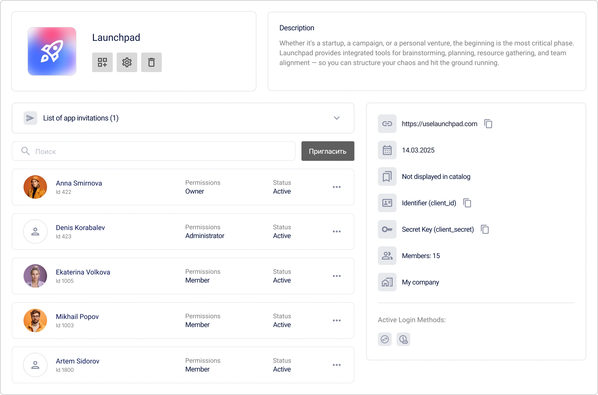
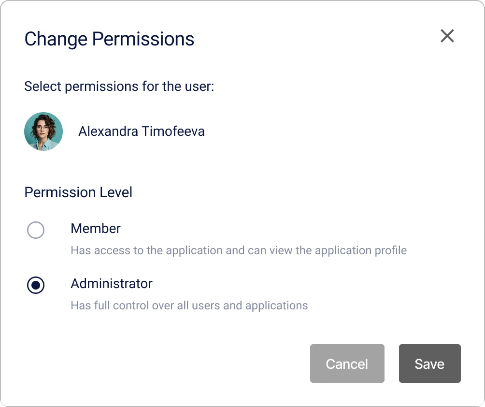
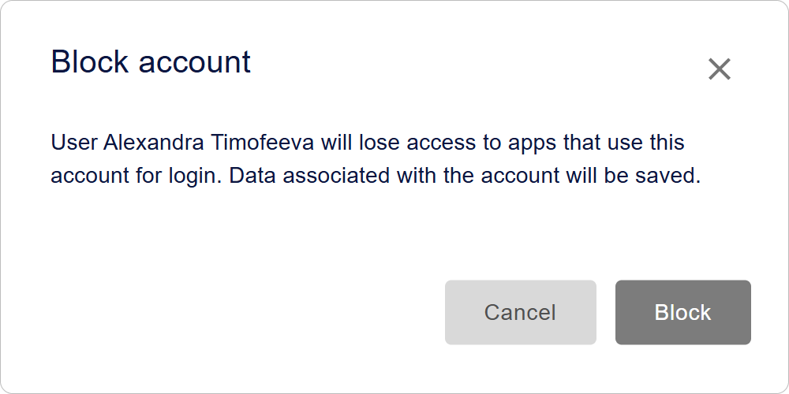

# Comment créer et configurer une application dans Encvoy ID

Dans ce guide, vous apprendrez à créer et configurer des applications OAuth 2.0 et OIDC dans **Encvoy ID**. Nous couvrirons en détail la création d'applications web et natives, la configuration du widget de connexion, ainsi que la gestion des utilisateurs et des accès.

**Table des matières :**

- [Création d'une application](#creating-application)
- [Gestion des applications](#managing-applications)
- [Invitations d'application](#application-invitations)
- [Paramètres du widget de connexion de l'application](#app-login-widget-settings)
- [Utilisateurs de l'application](#application-users)
- [Référence complète des paramètres](#full-parameters-reference)
- [Voir aussi](#see-also)

> ⚠️ **Restriction** : La gestion des applications est disponible dans le tableau de bord administrateur, d'organisation ou d'application (restreint) selon votre rôle.

---

## Création d'une application

### Création d'une application Web OAuth

> **Application Web** — une application standard qui s'exécute dans le navigateur de l'utilisateur et interagit avec **Encvoy ID** via les protocoles OAuth 2.0 et OpenID Connect.

Pour créer une application web :

1. Allez dans le tableau de bord administrateur, d'organisation ou d'application.
2. Ouvrez l'onglet **Applications**.
3. Cliquez sur le bouton **Créer** .
4. Le formulaire de création d'application s'ouvre.
5. Spécifiez les [paramètres d'application](#full-parameters-reference) requis :
   - **Nom de l'application**,
   - **Adresse de l'application** au format `protocole://nom-de-domaine:port`,
   - **URL de redirection #** (`redirect_uris`) — l'adresse vers laquelle l'utilisateur est redirigé après l'autorisation,
   - **URL de déconnexion #** (`post_logout_redirect_uris`) — l'adresse vers laquelle l'utilisateur est redirigé après la déconnexion.

6. Cliquez sur **Créer**.

> 💡 Lors de la création, des champs d'application supplémentaires sont générés, consultables et modifiables dans les paramètres de l'application :
>
> - **Identifiant (client_id)** — utilisé pour identifier l'application ;
> - **Clé secrète (client_secret)** — utilisé pour authentifier l'identité de l'application lorsque celle-ci demande l'accès au compte d'un utilisateur. La clé secrète ne doit être connue que de l'application.

### Création d'une application OAuth native

> **Application Native** — une application développée spécifiquement pour un système d'exploitation particulier.

Pour créer une application native :

1. Allez dans le tableau de bord administrateur, d'organisation ou d'application.
2. Ouvrez l'onglet **Applications**.
3. Cliquez sur le bouton **Créer** .
4. Le formulaire de création d'application s'ouvre.
5. Spécifiez les [paramètres d'application](#full-parameters-reference) requis :
   - **Nom de l'application**,
   - **Adresse de l'application** — l'adresse locale de l'application au format `myapp://callback` (requis pour finaliser la création, mais **non utilisé** dans les applications natives),
   - **URL de redirection #** (`redirect_uris`) — l'adresse locale vers laquelle l'utilisateur sera renvoyé après l'autorisation, ex: `myapp://callback`,
   - **URL de déconnexion #** (`post_logout_redirect_uris`) — l'adresse de redirection locale après déconnexion (ex: `myapp://logout`).

6. Cliquez sur **Créer**.
7. Ouvrez l'application créée et cliquez sur **Modifier** .
8. Dans le formulaire d'édition qui s'ouvre :
   - Sélectionnez `native` dans le paramètre **Type d'application** ;
   - Sélectionnez `none` dans les paramètres de méthode d'authentification.

     

9. Enregistrez les modifications.

Ensuite, configurez l'autorisation du côté de votre application :

- Utilisez PKCE (Proof Key for Code Exchange) lors de la demande d'un code d'autorisation ;
- Utilisez l'URI `redirect_uri` spécifiée précédemment pour gérer le résultat de l'autorisation ;
- Effectuez le rafraîchissement du jeton via le protocole OAuth 2.0.

---

## Gestion des applications

### Consulter une application

1. Allez dans le tableau de bord administrateur, d'organisation ou d'application.
2. Ouvrez l'onglet **Applications**.
3. Cliquez sur le panneau de l'application dont vous souhaitez voir le profil.

4. Le formulaire de profil de l'application s'ouvre.

### Modifier une application

1. Allez dans le tableau de bord administrateur, d'organisation ou d'application.
2. Ouvrez l'onglet **Applications**.
3. Cliquez sur le panneau de l'application que vous souhaitez modifier.
4. Le formulaire de consultation de l'application s'ouvre.
5. Cliquez sur le bouton **Modifier** .
6. Le formulaire d'édition de l'application s'ouvre.
7. Apportez les modifications nécessaires aux [paramètres de l'application](#full-parameters-reference).
8. Enregistrez les modifications.

### Supprimer une application

> ⚠️ **Avertissement :** La suppression d'une application est une opération irréversible. Toutes les données associées seront supprimées du système.

Pour supprimer une application :

1. Allez dans le tableau de bord administrateur, d'organisation ou d'application.
2. Ouvrez l'onglet **Applications**.
3. Cliquez sur le panneau de l'application que vous souhaitez modifier.
4. Le formulaire de consultation de l'application s'ouvre.
5. Cliquez sur le bouton **Supprimer** .
6. Confirmez l'action dans la fenêtre modale.

Après confirmation, l'application sera supprimée de **Encvoy ID**.

---

## Invitations d'application

Le mécanisme d'invitation vous permet de restreindre l'accès à l'application et de ne l'accorder qu'à des utilisateurs présélectionnés. Ceci est utile si l'application est destinée à un **cercle restreint d'utilisateurs**.

### Activer la restriction d'accès

Pour rendre l'application disponible uniquement aux utilisateurs invités :

1. Ouvrez le formulaire d'édition de l'application. [Comment ouvrir le formulaire d'édition →](#editing-application)
2. Activez le paramètre **Interdiction d'accès pour les utilisateurs externes**.
3. Enregistrez les modifications.

**Ce qui se passe après l'activation :**

- Membres de l'application — peuvent se connecter normalement.
- Utilisateurs non invités — voient un message d'accès refusé.
- Nouveaux utilisateurs — ne peuvent se connecter qu'après avoir reçu une invitation.

### Envoyer des invitations aux utilisateurs

Pour envoyer une invitation à un utilisateur :

1. Ouvrez le formulaire de consultation de l'application. [Comment ouvrir le formulaire de consultation →](#viewing-application).
2. Cliquez sur le bouton **Inviter**.

3. Dans la fenêtre qui s'ouvre, spécifiez les adresses e-mail des utilisateurs :
   - Saisissez l'adresse et appuyez sur **Entrée**, ou cliquez sur le bouton  ;
   - Pour ajouter plusieurs adresses, utilisez des séparateurs : espace, virgule `,` ou point-virgule `;`.

   

4. Cliquez sur **Envoyer**.

Un e-mail contenant un lien pour un accès rapide à l'application est envoyé aux adresses spécifiées.

> 💡 Les invitations resteront actives jusqu'à leur annulation ou leur acceptation.

### Ce que voient les utilisateurs

Un utilisateur qui reçoit une invitation reçoit un e-mail contenant un lien pour se connecter à l'application. L'invitation est également affichée dans la section **Requêtes** du profil personnel de l'utilisateur. L'invitation peut être acceptée de deux manières : en cliquant sur le lien dans l'e-mail ou en sélectionnant l'invitation dans la section "Requêtes" du profil.

> [Comment accepter une invitation d'application →](./docs-12-common-personal-profile.md#closed-app-invitations)

L'invitation est protégée par un mécanisme de vérification : elle n'est valable que pour l'adresse e-mail à laquelle elle a été envoyée. L'utilisateur doit se connecter au système en utilisant cette adresse spécifique pour accepter l'invitation. Cela empêche le transfert d'accès à des tiers.

Si l'utilisateur n'est pas encore inscrit dans le système, il doit s'inscrire avec l'adresse e-mail ayant reçu l'invitation. Après une inscription réussie, l'accès à l'application est accordé automatiquement.

### Gérer les invitations

#### Consulter la liste des invitations envoyées

1. Ouvrez le formulaire de consultation de l'application. [Comment ouvrir le formulaire de consultation →](#viewing-application).
2. Développez la section **Liste des invitations d'application envoyées**.

Pour chaque invitation de la liste, les éléments suivants sont affichés :

- E-mail du destinataire
- Date d'envoi

#### Annuler une invitation

Si vous devez révoquer une invitation envoyée :

1. Trouvez l'invitation dans la liste des envois.
2. Cliquez sur le bouton **Supprimer**  sur le panneau de l'invitation.
3. Confirmez l'annulation de l'invitation.

**Conséquences de l'annulation :**

- Le lien dans l'e-mail devient invalide.
- L'utilisateur ne pourra pas accepter l'invitation.

---

## Paramètres du widget de connexion de l'application

Le **Widget de connexion** est le formulaire d'autorisation que les utilisateurs voient lorsqu'ils tentent de se connecter à **cette application spécifique**. Ses paramètres vous permettent d'adapter l'apparence et les méthodes de connexion à l'image de marque et aux besoins de votre service.

### Où trouver les paramètres du widget

1. Ouvrez le formulaire d'édition de l'application. [Comment ouvrir le formulaire d'édition →](#editing-application)
2. Trouvez le bloc **Méthodes de connexion** et cliquez sur **Configurer**.

Ce qui peut être configuré :

- **Titre et Couverture** — adapter à l'image de l'application,
- **Schéma de couleurs** — couleurs des boutons correspondant à votre design,
- **Méthodes de connexion** — choisir quels fournisseurs afficher,
- **Blocs d'information** — ajouter des règles d'utilisation ou des liens.

> **📚 Guide complet de tous les paramètres :**  
> Pour un aperçu détaillé de tous les paramètres et options de personnalisation, consultez le [guide complet de configuration du widget de connexion →](./docs-06-github-en-providers-settings.md#login-widget-settings).

---

## Utilisateurs de l'application

Les **Utilisateurs de l'application** (membres) sont des utilisateurs du système **Encvoy ID** qui ont accordé à votre application la permission d'accéder à leurs données.

**Comment un utilisateur devient membre :**

1. L'utilisateur accède à votre application pour la première fois.
2. Le système le redirige vers le widget de connexion **Encvoy ID**.
3. L'utilisateur s'authentifie et **donne son consentement** pour accéder aux données demandées.
4. L'application reçoit un jeton d'accès et l'utilisateur est ajouté à la liste des membres.

**Où gérer les membres :**

- **Tableau de bord administrateur** — pour gérer toutes les applications du service.
- **Tableau de bord d'organisation** — pour les applications appartenant à l'organisation.
- **Tableau de bord restreint (Applications)** — pour gérer une application spécifique.

> 💡 **Important :** La gestion des membres s'effectue au niveau de l'**application**. Les actions n'affectent pas le compte global **Encvoy ID** de l'utilisateur, seulement sa connexion à l'application spécifique.

### Consulter les membres de l'application

1. Allez dans le tableau de bord administrateur, d'organisation ou d'application.
2. Ouvrez l'onglet **Applications**.
3. Cliquez sur le panneau de l'application souhaitée.
4. Le profil de l'application avec les informations générales s'ouvre.
5. Dans le profil de l'application, trouvez la section des membres.
6. Cliquez sur le panneau de l'utilisateur dont vous souhaitez voir le profil.
7. Le profil de l'utilisateur s'ouvre, contenant la liste des données auxquelles l'utilisateur a accordé l'accès.

### Assigner un administrateur d'application

**Quand est-ce nécessaire :** Pour déléguer les droits de gestion de l'application à des utilisateurs de confiance. Les administrateurs d'application peuvent gérer ses paramètres et ses utilisateurs.

Pour assigner un administrateur d'application :

1. Allez dans le tableau de bord administrateur, d'organisation ou d'application.
2. Ouvrez l'onglet **Applications**.
3. Cliquez sur le panneau de l'application.
4. Le profil de l'application s'ouvre.
5. Ouvrez le menu d'action pour l'utilisateur dont vous souhaitez modifier les permissions.

6. Sélectionnez l'action **Modifier les droits**.
7. Dans la fenêtre qui apparaît, sélectionnez le niveau de permission **Administrateur**.

8. Cliquez sur **Enregistrer**.

Après avoir enregistré les modifications, les permissions de l'utilisateur dans l'application seront mises à jour.

**✅ Ce qui va changer :**

- L'utilisateur aura accès au **Tableau de bord restreint** de cette application.
- Il pourra gérer les paramètres de l'application et ses utilisateurs.
- Il n'aura pas accès aux autres applications ni aux paramètres de l'organisation ou du service.

> ⚠️ **Sécurité :** N'attribuez des droits d'administrateur qu'à des utilisateurs de confiance. Un administrateur d'application peut supprimer d'autres utilisateurs et modifier les paramètres d'intégration.

### Terminer les sessions utilisateur dans l'application

**Quand est-ce nécessaire :** En cas de suspicion de compromission de compte, de perte d'appareil ou pour forcer le rafraîchissement d'un jeton d'accès.

Pour terminer les sessions d'un utilisateur :

1. Allez dans le tableau de bord administrateur, d'organisation ou d'application.
2. Ouvrez l'onglet **Applications**.
3. Cliquez sur le panneau de l'application.
4. Le profil de l'application s'ouvre.
5. Ouvrez le menu d'action pour l'utilisateur dont vous souhaitez terminer les sessions.
6. Sélectionnez l'action **Terminer les sessions**.
7. Confirmez l'action dans la fenêtre modale.

Après confirmation, toutes les sessions et jetons de l'utilisateur seront supprimés.

**✅ Ce qui se passe après confirmation :**

- **Toutes les sessions actives** de l'utilisateur dans cette application sont terminées.
- Les **jetons d'accès** (`access_token`) deviennent invalides.
- Les **jetons de rafraîchissement** (`refresh_token`) sont révoqués.
- L'utilisateur devra **se reconnecter** lors de son prochain accès à l'application.

> 📌 Cette opération ne bloque pas l'utilisateur. Il pourra s'autoriser à nouveau.

### Supprimer un utilisateur de l'application

**Quand est-ce nécessaire :** Lorsqu'un utilisateur n'a plus besoin d'accéder à l'application, lors du départ d'un employé ou à la demande de l'utilisateur.

Pour supprimer un utilisateur de l'application :

1. Allez dans le tableau de bord administrateur, d'organisation ou d'application.
2. Ouvrez l'onglet **Applications**.
3. Cliquez sur le panneau de l'application.
4. Le profil de l'application s'ouvre.
5. Ouvrez le menu d'action pour l'utilisateur que vous souhaitez supprimer de l'application.
6. Sélectionnez l'action **Supprimer l'utilisateur**.
7. Confirmez l'action dans la fenêtre modale.

Après confirmation, l'utilisateur sera supprimé de l'application.

**✅ Ce qui se passe après la suppression :**

- L'utilisateur **disparaît** de la liste des membres de l'application.
- Tous ses **jetons d'accès** pour cette application sont révoqués.
- Lors de son prochain accès à l'application, la **demande de consentement lui sera de nouveau présentée**.
- Le **compte global** de l'utilisateur dans **Encvoy ID** reste intact.

### Bloquer un utilisateur dans l'application

**Quand est-ce nécessaire :** Pour une interdiction complète et permanente de l'accès d'un utilisateur à l'application sans possibilité de récupération.

Le **blocage** est une action plus sérieuse que la suppression. Un utilisateur bloqué ne pourra plus obtenir l'accès à l'application.

Pour bloquer un utilisateur :

1. Ouvrez le menu d'action pour un utilisateur actif dans le [profil de l'application](./docs-10-common-app-settings.md#viewing-application).

2. Sélectionnez l'action **Bloquer dans Encvoy ID**.
3. Confirmez l'action dans la fenêtre modale.

**Ce qui se passe après le blocage** :

- Le statut de l'utilisateur passera à **Bloqué**.
- L'utilisateur bloqué ne pourra pas se connecter à l'application.

### Débloquer des utilisateurs Encvoy ID

Pour débloquer un utilisateur :

1. Ouvrez le menu d'action pour un utilisateur bloqué dans le [profil de l'application](./docs-10-common-app-settings.md#viewing-application).
2. Sélectionnez l'action **Débloquer dans Encvoy ID**.
3. Confirmez l'action dans la fenêtre modale.

Après confirmation, le statut de l'utilisateur passera à **Actif**.

---

## Référence complète des paramètres

### Informations de base

Détails de base pour l'affichage dans l'interface et sur le widget de connexion.

| Paramètre                        | Description                                                                     | Type                                                    | Requis |
| -------------------------------- | ------------------------------------------------------------------------------- | ------------------------------------------------------- | ------ |
| **Nom de l'application**         | Affiché dans l'interface du tableau de bord personnel et le widget de connexion | Texte (jusqu'à 64 caractères)                           | ✓      |
| **Description de l'application** | Courte description affichée dans l'interface du service **Encvoy ID**           | Texte (jusqu'à 255 caractères)                          | ✗      |
| **Logo de l'application**        | Affiché dans l'interface du service **Encvoy ID** et le widget de connexion     | Image au format JPG, GIF, PNG, WEBP. Taille max - 1 Mo. | ✗      |
| **Afficher dans le mini-widget** | Ajoute l'application au mini-widget pour un accès rapide.                       | Interrupteur (`On`/`Off`)                               | -      |

### Catalogue

Paramètres pour la publication de l'application dans le [Catalogue](./docs-12-common-personal-profile.md#application-catalog).

| Paramètre                      | Description                                                                                                                                        | Type                      | Par défaut |
| ------------------------------ | -------------------------------------------------------------------------------------------------------------------------------------------------- | ------------------------- | ---------- |
| **Afficher dans le catalogue** | Ajoute l'application au Catalogue                                                                                                                  | Interrupteur (`On`/`Off`) | `Off`      |
| **Type d'application**         | Catégorie à laquelle l'application appartient dans le **Catalogue**.   La création de type est disponible pour l'**Administrateur** du service. | Liste déroulante          | `Other`    |

### Champs requis

Champs du profil utilisateur nécessaires au fonctionnement de l'application.

| Paramètre                       | Description                                                                                                                                                                                                                                                                                                                                                                                                                                                                                            |
| ------------------------------- | ------------------------------------------------------------------------------------------------------------------------------------------------------------------------------------------------------------------------------------------------------------------------------------------------------------------------------------------------------------------------------------------------------------------------------------------------------------------------------------------------------ |
| **Champs principaux du profil** | Définit la liste des champs principaux et additionnels du profil utilisateur auxquels l'application demande l'accès.   - Si des champs manquent dans le profil utilisateur, ils seront demandés lors de l'autorisation dans l'application.   - Si les champs sont présents mais réglés sur le [niveau de confidentialité](./docs-12-common-personal-profile.md#privacy-levels) **Disponible uniquement pour vous**, l'utilisateur sera invité à changer ce niveau en **Disponible sur demande**. |

### Paramètres de l'application

Paramètres techniques affectant l'interaction de l'application avec **Encvoy ID**.

#### Identifiants principaux

| Nom                             | Paramètre       | Description                                                             | Type                                              | Requis                 |
| ------------------------------- | --------------- | ----------------------------------------------------------------------- | ------------------------------------------------- | ---------------------- |
| **Identifiant (client_id)**     | `client_id`     | Identifiant unique de l'application                                     | Texte                                             | Généré automatiquement |
| **Clé secrète (client_secret)** | `client_secret` | Clé privée du client. Doit rester sécurisée.                            | Texte                                             | Généré automatiquement |
| **Adresse de l'application**    | -               | URL de la ressource web où la connexion via **Encvoy ID** sera utilisée | Texte au format `protocole://nom-de-domaine:port` | ✓                      |

### Paramètres d'accès

| Nom                                                     | Paramètre | Description                                                                                                        | Type                      | Par défaut |
| ------------------------------------------------------- | --------- | ------------------------------------------------------------------------------------------------------------------ | ------------------------- | ---------- |
| **Accès restreint**                                     | -         | Si activé, la connexion à l'application ne sera disponible qu'aux utilisateurs ayant les droits **Administrateur** | Interrupteur (`On`/`Off`) | `Off`      |
| **Interdiction d'accès pour les utilisateurs externes** | -         | Si activé, seuls les membres ou utilisateurs invités auront accès à l'application                                  | Interrupteur (`On`/`Off`) | `Off`      |

#### URL de redirection

| Nom                      | Paramètre      | Description                                                                                                                                                                                                                                                                                                                     | Requis |
| ------------------------ | -------------- | ------------------------------------------------------------------------------------------------------------------------------------------------------------------------------------------------------------------------------------------------------------------------------------------------------------------------------- | ------ |
| **URL de redirection #** | `Redirect_uri` | L'URL vers laquelle **Encvoy ID** redirigera l'utilisateur après l'authentification. Une fois que l'utilisateur s'est authentifié et a donné son consentement, le serveur redirige l'utilisateur vers le **Redirect_uri** avec un code d'autorisation, un jeton ID ou d'autres informations selon le **response_type** demandé. | ✓      |

#### URL de déconnexion

| Nom                      | Paramètre                  | Description                                                                                                                                                           | Requis |
| ------------------------ | -------------------------- | --------------------------------------------------------------------------------------------------------------------------------------------------------------------- | ------ |
| **URL de déconnexion #** | `post_logout_redirect_uri` | L'URL vers laquelle le service redirigera l'utilisateur après la déconnexion. Si aucune valeur n'est spécifiée, l'**URL de redirection (Redirect_uri)** est utilisée. | ✗      |

#### URL de demande d'authentification

| Nom                                                                               | Paramètre      | Description                                                                                                                                                                                                                                                                                                                                                    | Requis |
| --------------------------------------------------------------------------------- | -------------- | -------------------------------------------------------------------------------------------------------------------------------------------------------------------------------------------------------------------------------------------------------------------------------------------------------------------------------------------------------------- | ------ |
| **URL de requête d'authentification ou de récupération après authentification #** | `request_uris` | Une liste d'URLs où sont hébergées les demandes d'autorisation JWT. Lorsque le système envoie une demande d'autorisation au serveur, il peut simplement spécifier le paramètre `request_uri`, qui fait référence à l'une des URLs définies dans cette liste. Le serveur récupère ensuite l'objet de demande JWT à partir de cette URL pour traiter la demande. | ✗      |

#### Types de réponse (Response Types)

| Nom                                   | Paramètre        | Description                                                                                                                                                                                                                                                                                                                                                                                                                                                                                                                 |
| ------------------------------------- | ---------------- | --------------------------------------------------------------------------------------------------------------------------------------------------------------------------------------------------------------------------------------------------------------------------------------------------------------------------------------------------------------------------------------------------------------------------------------------------------------------------------------------------------------------------- |
| **Type de réponses (response_types)** | `response_types` | 
Définit quels jetons sont renvoyés au client.
 
 - `code` — code d'autorisation uniquement ;  - `id_token` — jeton ID uniquement ;   - `code id_token` — code et jeton ID ;   - `code token` — code d'autorisation et jeton d'accès ;   - `code id_token token` — ensemble complet ;   - `none` — utilisé lorsqu'aucun code d'autorisation, jeton d'accès ou jeton ID n'est requis via redirection. Utile pour confirmer l'authentification de l'utilisateur sans demander l'accès aux données. 
 |

#### Types d'octroi (Grant Types)

| Nom                                      | Paramètre     | Description                                                                                                                                                                                                                                                                               |
| ---------------------------------------- | ------------- | ----------------------------------------------------------------------------------------------------------------------------------------------------------------------------------------------------------------------------------------------------------------------------------------- |
| **Types d'octroi d'accès (grant_types)** | `grant_types` | 
Méthode d'obtention de l'autorisation pour accéder aux ressources protégées.
 
 - `authorization code` — méthode standard et sécurisée ;   - `implicit` — option héritée sans échange côté serveur ;   - `refresh_token` — rafraîchissement du jeton sans reconnexion. 
 |

#### Méthodes d'authentification

| Nom                                                                                                                                           | Paramètre                            | Description                                                                                                                                                                                                                                                                                                                                                                                                                                                                                                                                                                                                                                                                                                                                                                                                                                                                                                                                                                                                                         |
| --------------------------------------------------------------------------------------------------------------------------------------------- | ------------------------------------ | ----------------------------------------------------------------------------------------------------------------------------------------------------------------------------------------------------------------------------------------------------------------------------------------------------------------------------------------------------------------------------------------------------------------------------------------------------------------------------------------------------------------------------------------------------------------------------------------------------------------------------------------------------------------------------------------------------------------------------------------------------------------------------------------------------------------------------------------------------------------------------------------------------------------------------------------------------------------------------------------------------------------------------------- |
| **Méthode d'authentification du client pour le point de terminaison du jeton (token_endpoint_auth_method)**                                   | `token_endpoint_auth_method`         | 
Méthode que le client utilise pour s'authentifier lors de l'accès au `token endpoint` du serveur.
 
 - `none` - ne fournit pas d'identifiants. Utilisé lorsque le client ne peut pas stocker d'identifiants de manière confidentielle ou que l'authentification n'est pas requise ;   - `client_secret_post` - envoie les identifiants dans le corps de la requête ;   - `client_secret_basic` - utilise l'authentification HTTP Basic, en envoyant les identifiants dans l'en-tête de la requête ;   - `client_secret_jwt` - signe un JWT en utilisant son secret et l'envoie comme identifiant ;   - `private_key_jwt` - signe un JWT en utilisant sa clé privée et l'envoie comme identifiant. 
 Le choix dépend des exigences de sécurité et de la capacité du client à stocker les identifiants en toute sécurité. Par exemple, `client_secret_jwt` et `private_key_jwt` offrent une sécurité accrue en utilisant un chiffrement asymétrique et en évitant la transmission du secret sur le réseau. 
 |
| **Méthode d'authentification utilisée lors de l'accès au point de terminaison d'introspection du jeton (introspection_endpoint_auth_method)** | `introspection_endpoint_auth_method` | 
Méthode utilisée par le client lors de l'accès à l' `introspection endpoint`. Ce point de terminaison est utilisé pour vérifier l'état d'un jeton d'accès et obtenir des informations à son sujet.
 
 - `none` - aucun identifiant fourni ;   - `client_secret_post` - identifiants dans le corps de la requête ;   - `client_secret_basic` - authentification HTTP Basic ;   - `client_secret_jwt` - signe un JWT avec son secret ;   - `private_key_jwt` - signe un JWT avec sa clé privée. 
 Le choix dépend des exigences de sécurité et des capacités du client. Les méthodes basées sur JWT offrent une sécurité supplémentaire via des jetons signés. 
                                                                                                                                                                                                                                                                                                                                             |
| **Méthode d'authentification utilisée lors de l'accès au point de terminaison de révocation de jetons (revocation_endpoint_auth_method)**     | `introspection_endpoint_auth_method` | 
Définit la méthode d'authentification utilisée lors de l'accès au `revocation endpoint`. Ce point de terminaison est utilisé pour révoquer l'accès ou les jetons de rafraîchissement. Cette méthode correspond généralement à celles utilisées pour le `token endpoint` et l' `introspection endpoint`.
 
- `none` - aucun identifiant fourni ;  - `client_secret_post` - identifiants dans le corps de la requête ;   `client_secret_basic` - authentification HTTP Basic ;  - `client_secret_jwt` - signe un JWT avec son secret ; - `private_key_jwt` - signe un JWT avec sa clé privée.
                                                                                                                                                                                                                                                                                                                                                                                                                 |

#### Algorithme de signature du jeton ID

| Nom                                                                                                        | Paramètre                      | Description                                                                                                                                                              |
| ---------------------------------------------------------------------------------------------------------- | ------------------------------ | ------------------------------------------------------------------------------------------------------------------------------------------------------------------------ |
| **Algorithme de signature utilisé lors de la création d'un ID-token signé (id_token_signed_response_alg)** | `id_token_signed_response_alg` | Spécifie l'algorithme utilisé pour signer le jeton ID. Un **jeton ID** est un JSON Web Token (JWT) contenant des revendications sur l'authentification de l'utilisateur. |

#### Exiger le temps d'authentification

| Nom                                                                               | Paramètre           | Description                                                                                                                                                                                                                                                  |
| --------------------------------------------------------------------------------- | ------------------- | ------------------------------------------------------------------------------------------------------------------------------------------------------------------------------------------------------------------------------------------------------------ |
| **Vérification de la présence de l'heure d'authentification (require_auth_time)** | `require_auth_time` | Spécifie si le serveur d'autorisation doit fournir l'heure d'authentification de l'utilisateur dans le jeton ID. Si activé, le serveur inclut la revendication `auth_time`, représentant le moment où l'utilisateur s'est authentifié pour la dernière fois. |

#### Type de sujet (Subject Type)

| Nom                                                                                           | Paramètre      | Description                                                                                                                                                                                                                                                                                                                                                                                                                                                                                                |
| --------------------------------------------------------------------------------------------- | -------------- | ---------------------------------------------------------------------------------------------------------------------------------------------------------------------------------------------------------------------------------------------------------------------------------------------------------------------------------------------------------------------------------------------------------------------------------------------------------------------------------------------------------- |
| **Méthode de transmission de l'ID utilisateur dans le jeton d'identification (subject_type)** | `subject_type` | 
Définit comment l'identifiant de l'utilisateur (`sub claim`) est présenté au client. Cela affecte la manière dont les IDs utilisateur sont générés et gérés.
 
 - `public` - l'ID utilisateur est le même pour tous les clients. Chaque client voit la même `sub claim` pour l'utilisateur ;   - `pairwise` - l'ID utilisateur est unique pour chaque client. Cela offre une plus grande confidentialité car différents clients ne peuvent pas lier l'activité de l'utilisateur entre eux. 
 |

#### Type d'application

| Nom                                       | Paramètre          | Description                                                                                                                                                                                              |
| ----------------------------------------- | ------------------ | -------------------------------------------------------------------------------------------------------------------------------------------------------------------------------------------------------- |
| **Type d'application (application_type)** | `application_type` | 
Définit la plateforme à laquelle l'application est destinée :
 
 - `web` - application web s'exécutant dans un navigateur ;   - `native` - application native installée sur un appareil. 
 |

#### Jeton d'accès (Access Token)

| Nom                                  | Paramètre          | Description                                   |
| ------------------------------------ | ------------------ | --------------------------------------------- |
| **Jeton d'accès (access_token_ttl)** | `access_token_ttl` | Durée de vie de l' `access_token` en secondes |

#### Jeton de rafraîchissement (Refresh Token)

| Nom                                             | Paramètre           | Description                                 |
| ----------------------------------------------- | ------------------- | ------------------------------------------- |
| **Jeton de renouvellement (refresh_token_ttl)** | `refresh_token_ttl` | Durée de vie du `refresh_token` en secondes |

---

## Voir aussi

- [Gérer les organisations](./docs-11-common-org-settings.md) — guide pour travailler avec les organisations du système **Encvoy ID**.
- [Profil personnel et gestion des permissions d'application](./docs-12-common-personal-profile.md) — guide pour gérer votre profil personnel.
- [Méthodes de connexion et configuration du widget de connexion](./docs-06-github-en-providers-settings.md) — guide sur les méthodes de connexion et la configuration du widget de connexion.
